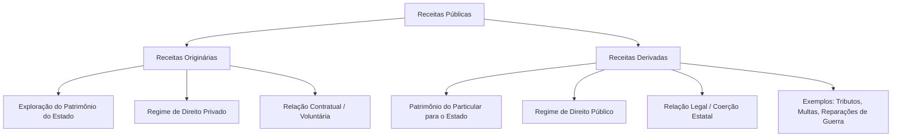
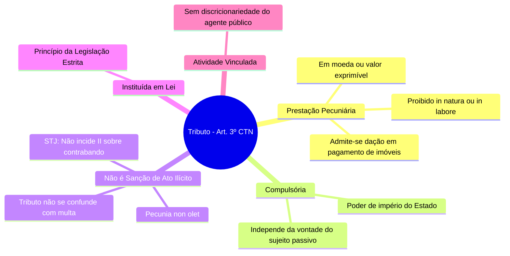
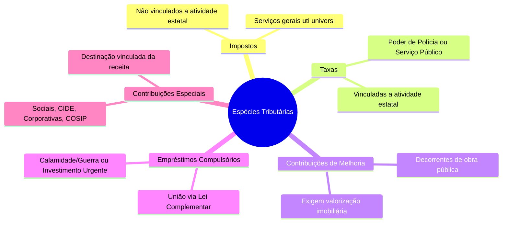
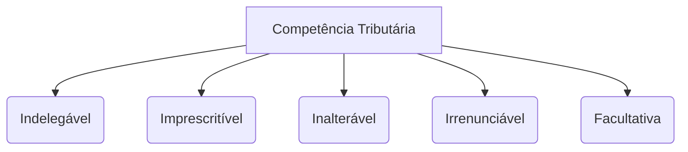
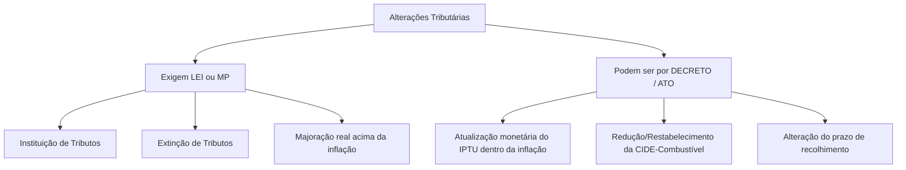
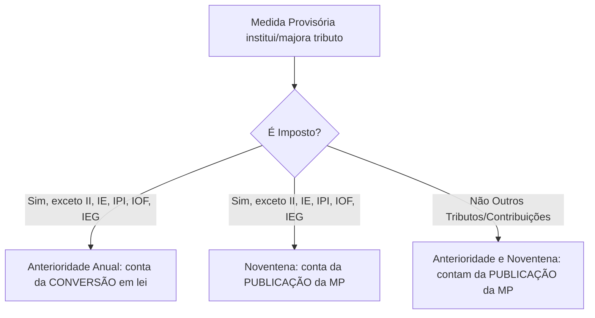

## Conceitos Fundamentais

### Tipos de Receitas Públicas

As receitas que ingressam nos cofres públicos são classificadas de acordo com a sua origem e o regime jurídico aplicável. Elas dividem-se essencialmente em duas categorias:



#### 1. Receita Originária
*   **Origem:** Decorre da exploração direta do próprio patrimônio do Estado (bens, empresas públicas, prestação de serviços comerciais).
*   **Regime Jurídico:** Predominantemente de **Direito Privado**.
*   **Instrumento:** Viabilizada por meio de **contrato** (vontade consensual entre as partes).

#### 2. Receita Derivada
*   **Origem:** Provém do patrimônio do **particular**, que é transferido para o Estado.
*   **Regime Jurídico:** Sob a égide do **Direito Público**.
*   **Instrumento:** Viabilizada por meio de **lei**, exercendo-se o poder de império e a coerção estatal.
*   **Exemplos:** Tributos, multas e reparações de guerra.

---

### Finalidades do Tributo

A instituição e a cobrança de tributos podem perseguir objetivos puramente financeiros ou de intervenção social e econômica:

*   **Fiscal (Arrecadação):** O objetivo principal é obter recursos financeiros para o custeio das atividades e serviços do Estado.
*   **Extrafiscal (Intervenção):** O foco principal é intervir no domínio social ou econômico. Manifesta-se por meio de normas de tributação (como a elevação de alíquotas para desestimular certas condutas) ou de não tributação (concessão de benefícios e incentivos fiscais).

---

### Bitributação vs Bis in Idem

É fundamental distinguir esses dois fenômenos de múltipla tributação sobre uma mesma base econômica:

| Critério | Bitributação | Bis in Idem |
| :--- | :--- | :--- |
| **Sujeitos Ativos** | **Dois ou mais** entes federados distintos. | **Apenas um** ente federado. |
| **Fato Gerador** | Cobrança sobre o mesmo fato gerador e mesmo contribuinte. | Cobrança múltipla sobre o mesmo fato jurídico. |
| **Exemplo Prático** | Dois Municípios cobrando ISS sobre o mesmo serviço prestado. | A União cobrando IRPJ e CSLL sobre o lucro da mesma empresa. |
| **Regra Geral** | **Vedada** pela Constituição Federal. | **Permitida** pela Constituição Federal. |
| **Exceção** | Permitida no caso de Imposto Extraordinário de Guerra (IEG). | Não possui vedação geral expressa se respeitada a competência. |

---

### Definição de Tributo

De acordo com o **Artigo 3º do Código Tributário Nacional (CTN)**:

> *"Tributo é toda prestação pecuniária compulsória, em moeda ou cujo valor nela se possa exprimir, que não constitua sanção de ato ilícito, instituída em lei e cobrada mediante atividade administrativa plenamente vinculada."*

#### Análise Detalhada dos Elementos do Conceito



##### 1. Prestação Pecuniária em Moeda ou Cujo Valor Nela se Possa Exprimir
*   Este é um **requisito de existência** do tributo.
*   **Proibições:** O tributo **jamais** poderá ser pago *in natura* (bens como soja, gado, etc.) ou *in labore* (prestação de serviços ou trabalho), pois isso violaria os princípios constitucionais, inclusive o da licitação.
*   **Exceção Legal:** É admitida a **dação em pagamento de bens imóveis** para a extinção do crédito tributário, desde que haja previsão expressa em lei específica (conforme o Artigo 156, XI, do CTN).

##### 2. Não Constitua Sanção de Ato Ilícito
*   **Princípio do *Pecunia Non Olet* (o dinheiro não tem cheiro):** O fato gerador do tributo deve ser uma situação lícita. Contudo, os efeitos econômicos e os frutos financeiros decorrentes de atividades criminosas ou ilícitas são passíveis de tributação. O Estado tributa a riqueza obtida, independentemente da sua origem.
*   **Diferenciação:** A multa tributária é uma sanção por ato ilícito (descumprimento da lei), enquanto o tributo não possui caráter punitivo. O confisco só é legítimo quando aplicado como pena, sendo vedado ao tributo ter efeito confiscatório.

> ⚠️ **Atenção - Jurisprudência do STJ (REsp 984.607):**
> Na importação de mercadorias ilícitas (como drogas ou contrabando), **não é possível** cobrar o Imposto de Importação (II). Isso ocorre porque a "importação de mercadoria [lícita]" é elemento essencial e intrínseco à hipótese de incidência desse tributo.

> ⚠️ **Atenção - Jurisprudência do STF (RE 647.885/2020):**
> É inconstitucional a suspensão do exercício profissional realizada por conselhos de fiscalização (como OAB, CRM, CREA) em razão do inadimplemento de anuidades. Essa prática configura **sanção política** indireta em matéria tributária, o que é vedado.

##### 3. Instituída em Lei
*   O tributo decorre do princípio da legalidade estrita. Ninguém é obrigado a pagar tributo que não tenha sido previamente instituído por meio de lei.

##### 4. Cobrada Mediante Atividade Administrativa Plenamente Vinculada
*   A cobrança e a exigência do tributo pelo agente público não envolvem juízo de conveniência ou oportunidade (discricionariedade). A autoridade administrativa é obrigada por lei a efetuar a cobrança assim que configurado o fato gerador.

---

### Natureza Jurídica do Tributo

Conforme determina o **Artigo 4º do CTN**, a natureza jurídica específica de cada tributo é definida exclusivamente pelo seu **Fato Gerador**.

Para fins de definição da natureza jurídica, são formalmente **irrelevantes**:
1.  A denominação atribuída ao tributo e demais características formais adotadas pela lei instituidora.
2.  A destinação legal dada ao produto da arrecadação do tributo.

---

### Flashcards de Fixação (Estilo CEBRASPE)

**Julgue os itens a seguir em Certo (C) ou Errado (E):**

1.  **Questão:** As receitas originárias são aquelas obtidas pelo Estado mediante o constrangimento do patrimônio dos particulares, sob o manto do direito público e com base em imposição legal.
    *   **Resposta:** **Errado**
    *   **Explicação:** A descrição refere-se às receitas **derivadas**. As receitas originárias decorrem da exploração do próprio patrimônio do Estado, sob regime de direito privado e base contratual.

2.  **Questão:** É vedada a instituição de tributo cuja prestação seja realizada *in natura* ou *in labore*, contudo, o CTN autoriza que a lei preveja a dação em pagamento de bens imóveis como forma de extinção do crédito tributário.
    *   **Resposta:** **Certo**
    *   **Explicação:** O tributo deve ser pago em moeda ou valor exprimível (vedado *in natura* ou *in labore*). A dação em pagamento de bens imóveis é uma exceção expressamente prevista no Art. 156, XI, do CTN.

3.  **Questão:** O princípio do *pecunia non olet* autoriza a cobrança do Imposto de Importação sobre produtos contrabandeados, visto que a ilicitude da atividade não obsta a tributação dos seus resultados econômicos.
    *   **Resposta:** **Errado**
    *   **Explicação:** Embora o princípio do *pecunia non olet* seja a regra geral, o STJ (REsp 984.607) definiu que não incide Imposto de Importação sobre mercadoria ilícita, pois a licitude da mercadoria importada é elemento essencial do tipo tributário do II.

4.  **Questão:** Ocorre o fenômeno do *bis in idem* quando dois entes federativos distintos cobram tributos sobre o mesmo fato gerador e do mesmo contribuinte, o que é vedado pela Constituição Federal, salvo no caso de Imposto Extraordinário de Guerra.
    *   **Resposta:** **Errado**
    *   **Explicação:** O fenômeno descrito é a **bitributação**. O *bis in idem* ocorre quando o **mesmo** ente federativo realiza a cobrança múltipla sobre a mesma base econômica (como a União cobrando IRPJ e CSLL).

5.  **Questão:** A destinação do produto da arrecadação de uma exação e a denominação dada a ela pela lei instituidora são elementos irrelevantes para a definição da natureza jurídica específica do tributo.
    *   **Resposta:** **Certo**
    *   **Explicação:** Conforme o Art. 4º do CTN, a natureza jurídica específica do tributo é determinada unicamente pelo seu fato gerador, sendo irrelevantes a denominação e a destinação legal dos recursos.

> ⚠️ **Atenção Importante:** Com a promulgação da Constituição Federal de 1988 (CF/88), os **Empréstimos Compulsórios** e as **Contribuições Especiais** passaram a ter como principal característica definidora a **destinação de sua arrecadação**. Esse entendimento invalidou o artigo do Código Tributário Nacional (CTN) que vinculava a natureza jurídica do tributo exclusivamente ao seu fato gerador. Como exemplos práticos dessa mudança, destacam-se a **CSLL** (que possui o mesmo fato gerador do IRPJ) e a **COFINS**, ambas com receitas obrigatoriamente destinadas ao financiamento da seguridade social.

---

@@@
## Espécies Tributárias

O sistema tributário nacional adota a teoria pentapartida, dividindo os tributos em cinco espécies distintas. Abaixo, detalhamos cada uma delas:



### Impostos
Os impostos são tributos de competência comum (União, Estados, Distrito Federal e Municípios) regulados pelo artigo 16 do CTN.

*   **Fato Gerador:** É caracterizado por uma situação jurídica **independente** de qualquer atividade estatal específica direcionada ao contribuinte.
*   **Destinação:** Destinam-se ao financiamento das atividades gerais do Estado, prestadas de forma genérica e indivisível (*uti universi*).
*   **Regra de Não-Vinculação:** Em regra, a receita dos impostos não pode ser vinculada a órgão, fundo ou despesa (Art. 167, IV, CF).
    *   *Exceções Constitucionais:* É permitida a vinculação de receita para ações e serviços públicos de **saúde**, desenvolvimento do **ensino** e para o financiamento de **atividades da administração tributária**.

---

### Empréstimos Compulsórios
Tributo de competência exclusiva da **União**, instituído obrigatoriamente por **Lei Complementar** (Art. 148, CF).

*   **Hipóteses de Instituição:**
    1.  **Despesas Extraordinárias:** Decorrentes de calamidade pública, guerra externa ou sua iminência.
        *   *Regra de Anterioridade:* **Não observa** nenhuma anterioridade (nem a anual, nem a noventena). A cobrança pode ser imediata.
    2.  **Investimento Público:** De caráter urgente e relevante interesse nacional.
        *   *Regra de Anterioridade:* **Observa estritamente** a anterioridade anual e a noventena.
*   **Vinculação de Recursos:** A aplicação dos recursos arrecadados é obrigatoriamente vinculada à despesa que fundamentou a sua instituição (Art. 148, parágrafo único, CF).
*   **Resgate:** A Lei Complementar instituidora deve fixar, de forma obrigatória, o prazo e as condições financeiras para o seu efetivo resgate (Art. 15, parágrafo único, CTN).

---

### Contribuições de Melhoria
Tributo de competência comum (União, Estados, Distrito Federal e Municípios) instituído para fazer face ao custo de obras públicas (Art. 81, CTN).

*   **Fato Gerador:** A **valorização imobiliária** real decorrente de uma obra pública. A simples realização da obra sem valorização do imóvel não autoriza a cobrança.
*   **Limites de Cobrança:**
    *   *Limite Total:* O custo real total realizado na obra pública (o Estado não pode arrecadar mais do que gastou).
    *   *Limite Individual:* O acréscimo de valor (valorização) que a obra efetivamente gerou para cada imóvel individualmente.
*   **Requisito Legal:** Exige-se a edição de uma lei específica para cada obra realizada (cada obra demanda uma nova lei instituidora).
*   **Arrecadação:** Os recursos arrecadados não são necessariamente vinculados à manutenção da obra.
*   **Exemplos Práticos:**
    *   *Pavimentação asfáltica nova:* Enseja a cobrança de contribuição de melhoria, pois gera valorização imobiliária inédita.
    *   *Recapeamento de via já existente:* Não enseja a cobrança, pois constitui mera manutenção de serviço público.
*   **Limite Anual de Pagamento:** A parcela anual cobrada do contribuinte não pode exceder a **3% do maior valor fiscal** atribuído ao seu imóvel.

---

### Contribuições Especiais
Tributos de competência exclusiva da **União** (com exceções para Estados, DF e Municípios), previstos no artigo 149 da CF. Sua principal característica é a **vinculação da receita** a uma finalidade específica.

```
Contribuições Especiais [Arrecadação Vinculada]
 ├── Sociais
 │    ├── Seguridade Social (PIS, COFINS, CSLL) -> Lei Ordinária
 │    ├── Outras da Seguridade (Residuais) -> Lei Complementar
 │    └── Gerais (Ex: Salário-Educação)
 ├── CIDE (Intervenção no Domínio Econômico)
 ├── Corporativas (Interesse de categorias profissionais/econômicas)
 └── COSIP (Iluminação Pública - Competência de Municípios e DF)
```

*   **Exceção de Competência:** Os Estados, o Distrito Federal e os Municípios podem instituir contribuições para o custeio do regime próprio de previdência de seus servidores. Os Municípios e o DF também possuem competência para instituir a COSIP.

---

### Taxas
Tributo de competência comum (União, Estados, Distrito Federal e Municípios) de natureza contraprestacional, sinalagmática e vinculada a uma atuação estatal (Art. 145, II, CF).

*   **Fatos Geradores:**
    1.  **Taxa de Polícia:** Decorrente do exercício regular do poder de polícia.
    2.  **Taxa de Serviço:** Decorrente da utilização, efetiva ou potencial, de serviços públicos específicos e divisíveis, prestados ao contribuinte ou postos à sua disposição.
*   **Arrecadação:** Em regra, a receita não é vinculada.
    *   *Exceção:* A taxa de fiscalização da atividade notarial possui destinação vinculada (STF, RE 602.089).
*   **Competência Comum:** Quando dois entes federativos possuem competência comum sobre determinada matéria, ambos podem instituir a respectiva taxa (STF, RE 602.089).
*   **Taxa vs. Tarifa (Preço Público):** Não se confundem (Súmula 545 do STF). Serviços de energia elétrica, água e esgoto são remunerados por **tarifa/preço público**, e não por taxa.

#### Fato Gerador e Base de Cálculo das Taxas
*   **Vedação de Identidade:** A taxa não pode ter base de cálculo ou fato gerador idênticos aos de um imposto, nem ser calculada em função do capital social das empresas (Art. 77, parágrafo único, CTN).
*   **Identidade Parcial:** É constitucional a adoção de um ou mais elementos da base de cálculo de um imposto, desde que não haja identidade integral (Súmula Vinculante 29 do STF).
*   **Taxa Judiciária sobre o Valor da Causa:**
    *   *Inconstitucionalidade:* Viola a garantia de acesso à jurisdição a taxa judiciária calculada sem um limite máximo (teto) sobre o valor da causa (Súmula 667 do STF).
    *   *Constitucionalidade:* É permitida a utilização do valor da causa ou da condenação como base de cálculo, desde que haja um teto limitador fixado em lei (STF, AI 564.642).
*   **Caso do Monte-Mor:** É inconstitucional a escolha do valor do monte-mor como base de cálculo de taxa judiciária, pois bens imóveis do monte-mor já servem de base de cálculo para o ITCMD e o ITBI, violando o art. 145, § 2º, da CF (STF, ADI 2.040).
*   **Capacidade Contributiva nas Taxas:** O STF entende que nada impede a aplicação do princípio da capacidade contributiva às taxas, graduando-as segundo a capacidade econômica do contribuinte (STF, RE 232.393).
    *   *Atenção para Provas:* A banca **FCC** costuma rejeitar esse entendimento em suas questões, considerando que a capacidade contributiva se aplica apenas aos impostos.

#### Taxa de Serviço
Regulada pelo artigo 79 do CTN, exige que o serviço público atenda aos seguintes requisitos:

1.  **Utilização:**
    *   *Efetiva:* Quando usufruída concretamente pelo contribuinte a qualquer título.
    *   *Potencial:* Quando, sendo de utilização compulsória, o serviço é colocado à disposição do contribuinte mediante atividade administrativa em efetivo funcionamento.
2.  **Especificidade:** O serviço deve ser destacado em unidades autônomas de intervenção, utilidade ou necessidade pública.
3.  **Divisibilidade:** O serviço deve ser suscetível de utilização individualizada, permitindo identificar o benefício de cada usuário.

> 🚨 **Regra de Ouro:** O serviço que enseja a cobrança de taxa deve ser **sempre estatal e compulsório**. Serviços delegados a concessionárias ou permissionárias são remunerados por tarifa ou preço público, nunca por taxa.

#### Taxa de Polícia
Fundamentada no artigo 78 do CTN, refere-se à atividade da administração pública que limita ou disciplina direitos, interesses ou liberdades em prol do interesse público.

*   **Exercício Regular:** Deve ser exercido por órgão competente, com observância do devido processo legal e sem desvio ou abuso de poder.
*   **Efetividade Presumida:** Presume-se o efetivo exercício do poder de polícia quando existente o órgão fiscalizador estruturado e em funcionamento, sendo desnecessária a comprovação de fiscalizações individualizadas sobre cada contribuinte (STF, RE 416.601).

#### Jurisprudência Correlata: Constitucionalidade de Taxas

| Taxas Constitucionais | Taxas Inconstitucionais |
| :--- | :--- |
| **Coleta de Lixo:** Cobrada exclusivamente em razão dos serviços de coleta, remoção e tratamento ou destinação de lixo ou resíduos domiciliares (Súmula Vinculante 19 do STF). | **Limpeza Pública:** Cobrança de taxa para serviços de conservação e limpeza de logradouros e bens públicos, por serem serviços indivisíveis (STF, RE 576.321). |
| **Revalidação de Diploma:** Taxa cobrada para a revalidação de diploma obtido no exterior (STF, AI 857.795). | **Matrícula Universitária:** Cobrança de taxa de matrícula em universidades públicas (Súmula Vinculante 12 do STF). |
| **Funcionamento e Localização:** Taxa de renovação de funcionamento e localização municipal, desde que haja órgão de fiscalização efetivo (STF, RE 588.322). | **Combate a Incêndios:** Criação de taxa municipal para prevenção e combate a incêndios, pois a segurança pública é atividade precípua do Estado (STF, RE 643.247). |
| **Fiscalização de Anúncios:** Taxa destinada à fiscalização de anúncios publicitários (STF, RE 216.207). | **Iluminação Pública:** O serviço de iluminação pública não pode ser remunerado mediante taxa (Súmula Vinculante 21 do STF). |
| **Mercado de Capitais:** Taxa de fiscalização dos mercados de títulos e valores mobiliários cobrada pela CVM (Súmula 665 do STF). | **Emissão de Carnês:** Cobrança de taxas pela emissão ou remessa de carnês e guias de recolhimento de tributos (STF, RE 789.218). |
| **FUNDAF:** A contribuição para o FUNDAF tem natureza de taxa, mas não pode ser cobrada ou reajustada por atos meramente regulamentares da RFB (Entendimento do STJ). | **Selos de Controle do IPI:** Cobrança de taxa para a confecção e fornecimento de selos de controle do IPI (STJ, REsp 1.405.244). |
| — | **Segurança em Eventos:** Taxa de segurança para eventos privados, pois a segurança pública é serviço geral, indivisível e deve ser custeada por impostos (STF, ADI 2692/22). |

---

### 💡 Flashcards de Fixação (Espécies Tributárias)

```fc-card
card-id: fc-especies-1
Q: A taxa de coleta de lixo domiciliar é constitucional, enquanto a taxa de conservação e limpeza de logradouros públicos é inconstitucional. (C/E)
A: **Certo.** A Súmula Vinculante 19 do STF valida a taxa de coleta de lixo domiciliar (específico e divisível). Já a limpeza de logradouros públicos beneficia a coletividade de forma indivisível (*uti universi*), devendo ser custeada por impostos.
```

```fc-card
card-id: fc-especies-2
Q: Os empréstimos compulsórios instituídos para atender a despesas extraordinárias decorrentes de calamidade pública devem observar a anterioridade anual e a noventena. (C/E)
A: **Errado.** Os empréstimos compulsórios motivados por calamidade pública ou guerra externa (e sua iminência) constituem exceção absoluta às regras de anterioridade, podendo ser cobrados imediatamente após a publicação da Lei Complementar.
```

```fc-card
card-id: fc-especies-3
Q: A contribuição de melhoria tem como limite individual o custo total da obra pública realizada. (C/E)
A: **Errado.** O limite *individual* é a valorização real obtida por cada imóvel beneficiado. O custo total da obra pública representa o limite *geral* (global) da arrecadação do tributo.
```

---

@@@
## Competência Tributária

A competência tributária é a aptidão jurídica outorgada pela Constituição Federal para que os entes políticos (União, Estados, Distrito Federal e Municípios) possam **instituir** tributos. Cabe ressaltar que a CF/88 apenas atribui competências; ela não institui nenhum tributo diretamente.



### Características da Competência Tributária
*   **Indelegável:** A atribuição para legislar e instituir o tributo não pode ser transferida a outro ente (a capacidade tributária ativa de arrecadar e fiscalizar, contudo, é delegável).
*   **Imprescritível:** O não exercício da competência tributária pelo ente político não decai e não prescreve; ela pode ser exercida a qualquer tempo.
*   **Inalterável:** Os limites e atribuições fixados pela Constituição Federal só podem ser modificados por meio de Emenda Constitucional (EC).
*   **Irrenunciável:** O ente político não pode abrir mão ou renunciar à competência tributária que lhe foi outorgada.
*   **Facultativa:** O ente político tem a faculdade de instituir ou não o tributo. Todavia, uma vez instituído em lei, a sua cobrança e arrecadação tornam-se atos vinculados e obrigatórios para a administração.

### Regras Especiais de Competência
*   **Territórios Federais:** Nos Territórios Federais não divididos em Municípios, compete à União instituir os tributos estaduais e municipais. Se o Território for dividido em Municípios, caberá à União instituir apenas os tributos estaduais daquela região.
*   **Competência Residual de Taxas dos Estados:** Os Estados possuem competência residual para a instituição e cobrança de taxas no âmbito de suas atribuições administrativas (Art. 25, §1º, CF).

---

### Capacidade Tributária Ativa (CTA)
Diferente da competência tributária, a Capacidade Tributária Ativa consiste nas funções executivas de:

$$\text{CTA} = \text{Cobrar} + \text{Arrecadar} + \text{Fiscalizar}$$

*   **Garantias:** A delegação da CTA compreende também as garantias e os privilégios processuais que a lei assegura ao ente tributante original.
*   **Delegação:** Pode ser delegada **exclusivamente** para pessoas jurídicas de direito público (Ex: conselhos profissionais como CRM e CREA; ou Municípios que optam por fiscalizar e cobrar o ITR pertencente à União).
*   **Regra de Repasse de Receita:** Conforme o artigo 6º, parágrafo único, do CTN, se a receita de um tributo for distribuída, no todo ou em parte, a outra pessoa jurídica de direito público, a competência legislativa para regulamentar e alterar o tributo permanece intocada com o ente político que o instituiu originalmente.

---

### Capacidade Contributiva
Prevista no artigo 145, §1º da CF, estabelece diretrizes para a justiça fiscal:

> "Sempre que possível, os **impostos** terão caráter pessoal e serão graduados segundo a capacidade econômica do contribuinte, facultado à administração tributária, especialmente para conferir efetividade a esses objetivos, identificar, respeitados os direitos individuais e nos termos da lei, o patrimônio, os rendimentos e as atividades econômicas dos contribuintes."

*   **Não Aplicabilidade:** O princípio da capacidade contributiva **não se aplica** às penalidades tributárias (multas).
*   **Aplicação às Taxas:** O STF firmou entendimento de que, embora o dispositivo constitucional cite expressamente os impostos, nada impede que o princípio da capacidade contributiva seja aplicado, na medida do possível, também às taxas (STF, RE 232.393).
*   **Acesso a Dados Bancários:** Conforme o artigo 6º da Lei Complementar 105, as autoridades fiscais da União, Estados, DF e Municípios podem examinar documentos, livros e registros de instituições financeiras, desde que haja processo administrativo instaurado ou procedimento fiscal em curso, e que tais exames sejam considerados indispensáveis pela autoridade. Este mecanismo foi declarado constitucional pelo STF.

---

### 💡 Flashcards de Fixação (Competência e Capacidade)

```fc-card
card-id: fc-competencia-1
Q: A competência tributária é delegável para pessoas jurídicas de direito privado que prestem serviços públicos essenciais. (C/E)
A: **Errado.** A competência tributária (função legislativa de instituir o tributo) é absolutamente indelegável. Apenas a Capacidade Tributária Ativa (função administrativa de arrecadar e fiscalizar) pode ser delegada, e exclusivamente para pessoas jurídicas de direito público.
```

```fc-card
card-id: fc-competencia-2
Q: O princípio da capacidade contributiva, embora previsto expressamente para os impostos, pode ser estendido à cobrança de taxas, segundo entendimento do STF. (C/E)
A: **Certo.** O STF (RE 232.393) entende que, na medida do possível, as taxas também podem ser graduadas de acordo com a capacidade econômica do contribuinte, embora bancas como a FCC tendam a restringir o princípio apenas aos impostos em suas provas literais.
```

---

@@@
## Limitações Constitucionais ao Poder de Tributar

As limitações constitucionais ao poder de tributar funcionam como verdadeiras garantias fundamentais do contribuinte contra os abusos do Fisco.

### Princípios
O artigo 150 da Constituição Federal traz um rol de vedações impostas aos entes federativos. Cabe destacar que este rol é **exemplificativo**, existindo outras garantias espalhadas pelo texto constitucional.

---

### Legalidade
Previsto no artigo 150, I, da CF, determina que é expressamente vedado à União, aos Estados, ao Distrito Federal e aos Municípios exigir (instituir) ou aumentar tributo sem que haja uma **lei** que o estabeleça previamente.

#### Exceções ao Princípio da Legalidade (Mitigações)
A própria Constituição Federal flexibiliza o princípio da legalidade, permitindo que o Poder Executivo altere as alíquotas de determinados tributos por meio de ato infralegal (como Decretos ou Portarias), respeitados os limites e condições fixados em lei:

*   **II** (Imposto de Importação) - Alíquotas alteradas por ato do Executivo (Ex: Resolução CAMEX).
*   **IE** (Imposto de Exportação) - Alíquotas alteradas por ato do Executivo (Ex: Resolução CAMEX).
*   **IPI** (Imposto sobre Produtos Industrializados) - Alíquotas alteradas por ato do Executivo.
*   **IOF** (Imposto sobre Operações Financeiras) - Alíquotas alteradas por ato do Executivo.
*   **IPTU** - A alteração da base de cálculo (planta genérica de valores) do IPTU pode ser realizada por meio de decreto do Poder Executivo, desde que se limite à atualização monetária do período. A majoração real da base de cálculo ou das alíquotas, contudo, continua exigindo lei em sentido estrito.

---

### 💡 Flashcards de Fixação (Princípios e Legalidade)

```fc-card
card-id: fc-legalidade-1
Q: O Poder Executivo pode majorar as alíquotas do Imposto sobre Produtos Industrializados (IPI) por meio de decreto, sem necessidade de lei em sentido estrito. (C/E)
A: **Certo.** O IPI é uma das exceções atenuadas ao princípio da legalidade estrita, permitindo que suas alíquotas sejam alteradas por ato do Poder Executivo, dentro dos limites estabelecidos na lei reguladora do imposto.
```

```fc-card
card-id: fc-legalidade-2
Q: O rol de limitações ao poder de tributar previsto no artigo 150 da Constituição Federal é taxativo, não se admitindo outras garantias ao contribuinte fora dele. (C/E)
A: **Errado.** O rol de garantias e limitações ao poder de tributar é meramente exemplificativo, existindo outras proteções ao contribuinte distribuídas ao longo da Constituição Federal e da legislação infraconstitucional.
```

@@@
## ATUALIZAÇÃO DO IPTU E REGRAS DE DECRETO

A atualização da base de cálculo de tributos e a fixação de suas alíquotas possuem regras rígidas no ordenamento jurídico brasileiro. No entanto, o poder regulamentar do Poder Executivo, exercido por meio de decretos, possui algumas prerrogativas específicas que merecem atenção detalhada.

### Atualização da Base de Cálculo do IPTU
A base de cálculo do Imposto sobre a Propriedade Predial e Territorial Urbana (IPTU) pode ser atualizada mediante **decreto** do Poder Executivo municipal, desde que essa atualização se limite estritamente à recomposição da perda inflacionária.

> ⚠️ **CUIDADO PARA NÃO CAIR EM PEGADINHA DE PROVA!**
> A mera atualização monetária do valor dos imóveis (correção da inflação) pode ser feita por **decreto**. Contudo, a modificação real da **Planta de Valores Genéricos (PVG)**, que altera o valor venal dos imóveis acima dos índices oficiais de inflação, exige obrigatoriamente a edição de **LEI**.

*   **Súmula 160 do Superior Tribunal de Justiça (STJ):** É defeso (proibido) ao Município atualizar o IPTU, mediante decreto, em percentual superior ao índice oficial de correção monetária.

---

### Outras Atribuições Permitidas ao Decreto e Atos do Executivo

Além da atualização monetária do IPTU, o ordenamento jurídico autoriza o uso de decretos ou atos administrativos específicos para as seguintes situações:

1.  **CIDE-Combustível:**
    *   O Presidente da República pode, por meio de **decreto**, **reduzir** ou **restabelecer** as alíquotas da CIDE-Combustível. Trata-se de uma exceção clássica ao princípio da legalidade estrita (função extrafiscal do tributo).
2.  **ICMS-Combustível:**
    *   As alíquotas do ICMS incidente sobre combustíveis são fixadas e alteradas mediante **convênio** no âmbito do Conselho Nacional de Política Fazendária (Confaz). Isso significa que a alteração ocorre de forma livre por meio desse instrumento de cooperação entre os estados e o Distrito Federal.
3.  **Prazo de Recolhimento de Tributos:**
    *   A alteração do prazo para o pagamento (recolhimento) de tributos **pode ser realizada mediante decreto**. O estabelecimento ou modificação de data de vencimento não se confunde com a instituição ou majoração de tributo, dispensando, portanto, a exigência de lei em sentido estrito.

---

### Regras Gerais de Instituição e Extinção de Tributos

*   **Regra Absoluta:** Não existe qualquer tipo de exceção para a **instituição** (criação) ou **extinção** de tributos. Ambas as situações exigem, de forma indeclinável, a edição de **LEI** (ordinária ou complementar, conforme o caso) ou de **Medida Provisória (MP)**.
*   **Iniciativa de Lei:** A iniciativa de lei para instituir tributos **NÃO é privativa** do Chefe do Poder Executivo. Parlamentares também possuem competência para propor projetos de lei de natureza tributária, salvo as exceções expressas na Constituição Federal (como os tributos dos Territórios Federais).
*   **Medida Provisória como Instrumento Idôneo:**
    *   **STF (AI 236.976):** A Medida Provisória, possuindo força de lei, é instrumento idôneo e perfeitamente válido para instituir e modificar tributos, bem como contribuições sociais.



---

@@@
## ISONOMIA TRIBUTÁRIA

O princípio da isonomia tributária busca garantir que contribuintes em situações equivalentes recebam o mesmo tratamento jurídico, vedando privilégios injustificados ou discriminações arbitrárias.

> **Art. 150, II, da Constituição Federal:**
> É vedado à União, aos Estados, ao Distrito Federal e aos Municípios instituir tratamento desigual entre contribuintes que se encontrem em situação equivalente, proibida qualquer distinção em razão de ocupação profissional ou função por eles exercida, independentemente da denominação jurídica dos rendimentos, títulos ou direitos.

### Características e Aplicação
*   **Abrangência:** Aplica-se a **todos os tributos** e a todas as pessoas, sejam elas **físicas (PF)** ou **jurídicas (PJ)**, devendo ser observada de maneira distinta a depender da situação concreta de cada contribuinte.
*   **Progressividade em Impostos Reais:** Em regra, os impostos de caráter real (que incidem sobre coisas/bens) **não possuem alíquotas progressivas**. No entanto, a própria Constituição Federal estabeleceu exceções expressas a essa regra:

| Imposto | Critério de Progressividade / Diferenciação Autorizado |
| :--- | :--- |
| **IPTU** | Pode ser progressivo em razão do **tempo** (cumprimento da função social da propriedade), do **valor** do imóvel, da sua **localização** e do seu **uso**. |
| **IPVA** | Apresenta alíquotas diferenciadas em função do **tipo** e da **utilização** do veículo (o que engloba também a sua procedência, nacional ou importada). |
| **ITR** | É progressivo de forma a desestimular a manutenção de propriedades improdutivas, variando em função da **área** do imóvel e do seu grau de **utilização**. |
| **ITCMD** | A alíquota pode ser progressiva em função do valor do **quinhão**, legado ou herança que cada herdeiro individualmente receber. |

---

### Jurisprudência e Casos Práticos: O que Ofende e o que Não Ofende a Isonomia

#### ❌ Entendido como INCONSTITUCIONAL pelo STF
*   **ITBI Progressivo:** É inconstitucional a fixação de alíquota progressiva para o Imposto sobre Transmissão de Bens Imóveis (ITBI) com base exclusivamente no valor venal do imóvel.

####  Entendido como constitucional (NÃO OFENDE a Isonomia)
*   **Incentivos Fiscais Direcionados:** Concessão de benefícios ou incentivos fiscais para empresas que contratam funcionários idosos, pessoas com deficiência, entre outros grupos vulneráveis.
*   **Restrições de Importação de Usados:** A vedação da importação de veículos e pneus **usados** (enquanto a importação de novos é permitida) não viola a isonomia, pois visa à proteção ambiental e à segurança.
*   **Exclusão do Arrendamento Mercantil:** A exclusão das operações de arrendamento mercantil (*leasing*) do campo de aplicação do regime aduaneiro de admissão temporária.

---

### 📝 FLASHCARDS (Estilo CEBRASPE)

**Q1. Julgue o item a seguir:**
A instituição de alíquotas progressivas para o ITBI com base no valor venal do imóvel é considerada constitucional pelo Supremo Tribunal Federal, uma vez que atende ao princípio da capacidade contributiva.
<details>
<summary><b>Ver resposta</b></summary>
<b>ERRADO.</b> O STF entende que é inconstitucional a progressividade das alíquotas do ITBI com base no valor venal do imóvel, pois se trata de um imposto real que não possui autorização constitucional expressa para tal progressividade.
</details>

**Q2. Julgue o item a seguir:**
Não ofende o princípio da isonomia tributária a concessão de incentivo fiscal a empresas que contratem trabalhadores com deficiência ou idosos.
<details>
<summary><b>Ver resposta</b></summary>
<b>CERTO.</b> Tais medidas utilizam a tributação como instrumento de indução social (extrafiscalidade) para promover a integração de grupos vulneráveis, o que configura discriminação positiva legítima.
</details>

---

@@@
## RESERVA LEGAL

O princípio da reserva legal em matéria de benefícios fiscais atua como uma garantia de que o patrimônio público e a receita tributária não serão reduzidos sem o crivo do Poder Legislativo.

> **Art. 150, §6º, da Constituição Federal:**
> Qualquer subsídio ou isenção, redução de base de cálculo, concessão de crédito presumido, anistia ou remissão, relativos a impostos, taxas ou contribuições, só poderá ser concedido mediante **LEI ESPECÍFICA**, federal, estadual ou municipal, que regule exclusivamente as matérias acima enumeradas ou o correspondente tributo ou contribuição, sem prejuízo do disposto no art. 155, § 2.º, XII, g (Confaz).

### A Flexibilização do Requisito de "Exclusividade" pelo STF
Embora o texto constitucional mencione que a lei específica deve regular "exclusivamente" as matérias de desoneração ou o tributo correspondente, o Supremo Tribunal Federal (STF) atenuou o rigor dessa interpretação. 

Atualmente, o entendimento jurisprudencial exige apenas que haja **pertinência temática** entre o benefício fiscal concedido e a regulação geral que está sendo veiculada no corpo da lei.

---

@@@
## IRRETROATIVIDADE

O princípio da irretroatividade tributária garante a segurança jurídica, impedindo que o Estado surpreenda o contribuinte cobrando tributos sobre fatos ocorridos antes de a lei existir.

> **Art. 150, III, "a", da Constituição Federal:**
> É vedado à União, aos Estados, ao Distrito Federal e aos Municípios cobrar tributos em relação a fatos geradores ocorridos antes do início da vigência da lei que os houver instituído ou aumentado.

*   **Ausência de Exceções Constitucionais:** A Constituição Federal de 1988 **não previu nenhuma exceção** ao princípio da irretroatividade tributária no que tange à instituição ou majoração de tributos.

> 🚨 **MUITO CUIDADO COM PEGADINHAS!**
> O Código Tributário Nacional (CTN), em seu artigo 106, prevê duas hipóteses de aplicação retroativa da lei tributária (leis expressamente interpretativas e leis que cominam penalidades mais brandas ao contribuinte). 
> **Essas hipóteses NÃO constituem exceções à irretroatividade tributária constitucional**, pois nenhuma delas autoriza a **cobrança** ou o **aumento** de tributos de forma retroativa. Elas tratam apenas de infrações, penalidades ou esclarecimento de textos legais.

---

### Casos Especiais de Aplicação do Princípio

#### 1. Irretroatividade e a CSLL (Contribuição Social sobre o Lucro Líquido)
*   **Fato Gerador:** Ocorre em **31 de dezembro** de cada ano.
*   **Regra de Anterioridade:** A CSLL **não obedece** à anterioridade anual, mas **obedece** à anterioridade nonagesimal (noventena).
*   **Entendimento do STF:** Como o fato gerador da CSLL se consolida apenas em 31 de dezembro, o STF entende que a lei que estiver em vigor nessa data exata é aplicável imediatamente a todo o período. 
*   *Exemplo prático:* Se uma lei alterar a alíquota da CSLL e for publicada até o dia **2 de outubro** do mesmo ano (respeitando o prazo de 90 dias até 31 de dezembro), todos os lucros auferidos ao longo daquele ano inteiro serão tributados pela nova alíquota majorada.

#### 2. Irretroatividade e o Imposto de Renda (IR)
*   **Fato Gerador:** Consolida-se em **31 de dezembro** de cada ano.
*   **Regra de Anterioridade:** O IR **obedece** à anterioridade anual, mas **não obedece** à noventena.
*   **Revogação da Súmula 584 do STF:** A antiga Súmula 584 determinava que se aplicava ao IR a lei vigente no exercício financeiro em que deveria ser apresentada a declaração de ajuste. O STF **revogou** essa súmula por entender que ela violava frontalmente os princípios da irretroatividade e da anterioridade tributária.

---

@@@
## ANTERIORIDADE

O princípio da anterioridade anual (ou de exercício) impede a cobrança imediata de um tributo recém-criado ou majorado, exigindo a virada do ano civil para que a nova lei produza efeitos.

> **Art. 150, III, "b", da Constituição Federal:**
> É vedado à União, aos Estados, ao Distrito Federal e aos Municípios cobrar tributos no mesmo exercício financeiro em que haja sido publicada a lei que os instituiu ou aumentou.

### Hipóteses que NÃO se sujeitam à Anterioridade Anual

Não configuram instituição ou majoração de tributos e, portanto, podem produzir efeitos imediatos:

*   **Redução ou Extinção de Desconto:** A retirada de um desconto anteriormente concedido para o pagamento de um tributo não se submete à anterioridade.
*   **Revogação de Isenção:** Em regra, a revogação de uma isenção tributária não se submete à anterioridade, **salvo** no caso de revogação de isenção do Imposto de Renda (IR) quando esta possuir caráter extrafiscal.
*   **Atualização Monetária:** A mera recomposição do valor da moeda frente à inflação não constitui majoração real do tributo.
*   **Alteração do Prazo de Recolhimento:** A mudança da data de vencimento para pagamento do tributo (Súmula Vinculante 50 do STF).

> 💡 **Destaque sobre a Taxa SELIC (STF - RE 648.245):**
> O STF fixou o entendimento de que a taxa SELIC cumpre, de forma cumulativa, a função de **correção monetária** e de **juros de mora**. Por essa razão, ela não pode ser considerada um mero índice de correção monetária pura.

---

@@@
## NOVENTENA

Também conhecida como anterioridade nonagesimal, essa garantia impede que o contribuinte seja cobrado antes de decorridos 90 dias da publicação da lei que criou ou aumentou o tributo.

> **Art. 150, III, "c", da Constituição Federal:**
> É vedado à União, aos Estados, ao Distrito Federal e aos Municípios cobrar tributos antes de decorridos noventa dias da data em que haja sido publicada a lei que os instituiu ou aumentou, observado o disposto na alínea "b" (anterioridade anual).

*   **STF (RE 584.100):** O prazo nonagesimal deve ser aplicado estritamente nos casos de **criação** ou **majoração** de tributos. Ele **não se aplica** na hipótese de simples prorrogação de alíquota que já vinha sendo cobrada anteriormente.

---

@@@
## ANTERIORIDADE X NOVENTENA

A aplicação conjunta ou isolada dos princípios da anterioridade anual e da noventena varia conforme a natureza do tributo ou a operação realizada. A tabela abaixo resume as regras de incidência para cada caso:

| Tributo / Situação | Aplica-se Anterioridade Anual? | Aplica-se Noventena (90 dias)? |
| :--- | :---: | :---: |
| **II, IE, IOF, IEG e Empréstimo Compulsório** (Guerra ou Calamidade) | **NÃO** | **NÃO** |
| **IPI** | **NÃO** | **SIM** |
| **Contribuições de Seguridade Social** (PIS, COFINS, CSLL, INSS, CPP) | **NÃO** | **SIM** |
| **Redução e Restabelecimento de Alíquotas** (ICMS e CIDE-Combustíveis) | **NÃO** | **SIM** |
| **Imposto de Renda** (IRPF / IRPJ) | **SIM** | **NÃO** |
| **Alteração da Base de Cálculo do IPTU e do IPVA** | **SIM** | **NÃO** |

---

### 📝 FLASHCARDS (Estilo CEBRASPE)

**Q1. Julgue o item a seguir:**
A alteração do prazo de recolhimento de obrigação tributária não se sujeita ao princípio da anterioridade.
<details>
<summary><b>Ver resposta</b></summary>
<b>CERTO.</b> Conforme a Súmula Vinculante 50 do STF, a modificação da data de vencimento do tributo não configura instituição ou majoração, estando dispensada de observar a anterioridade anual ou nonagesimal.
</details>

**Q2. Julgue o item a seguir:**
O Imposto sobre a Propriedade de Veículos Automotores (IPVA), quando tem sua base de cálculo modificada, deve observar tanto a anterioridade anual quanto a anterioridade nonagesimal.
<details>
<summary><b>Ver resposta</b></summary>
<b>ERRADO.</b> A alteração da base de cálculo do IPVA (assim como a do IPTU) é uma exceção à noventena. Portanto, deve observar apenas a anterioridade anual, podendo ser cobrada no primeiro dia do exercício financeiro seguinte.
</details>

---

@@@
## MEDIDA PROVISÓRIA X ANTERIORIDADE E NOVENTENA

A edição de Medidas Provisórias (MP) que instituam ou majorem tributos possui regramento específico no texto constitucional para evitar abusos do Poder Executivo.

> **Art. 62, §2º, da Constituição Federal:**
> Medida provisória que implique instituição ou majoração de **impostos**, com exceção do II, IE, IPI, IOF e IEG, só produzirá efeitos no exercício financeiro seguinte **se houver sido convertida em lei até o último dia daquele em que foi editada**.

### Contagem dos Prazos de Anterioridade e Noventena para MPs

O marco inicial (termo *a quo*) para a contagem dos prazos de garantia do contribuinte varia conforme a espécie tributária:

1.  **Impostos Gerais** (exceto II, IE, IPI, IOF e IEG):
    *   **Anterioridade Anual:** A contagem e a produção de efeitos só ocorrem no exercício financeiro seguinte ao da **CONVERSÃO** da MP em lei.
    *   **Noventena:** A contagem dos 90 dias inicia-se na data de **PUBLICAÇÃO** da Medida Provisória (STF - RE 181.664).
2.  **Demais Tributos** (Taxas, Contribuições, etc.):
    *   Tanto a anterioridade anual quanto a noventena têm seus prazos contados a partir da data de **PUBLICAÇÃO** da própria Medida Provisória.



---

@@@
## PRINCÍPIO DO NÃO-CONFISCO

O princípio do não-confisco limita a sanha arrecadatória do Estado, impedindo que a carga tributária inviabilize a atividade econômica ou confisque a propriedade privada.

> **Art. 150, IV, da Constituição Federal:**
> É vedado à União, aos Estados, ao Distrito Federal e aos Municípios utilizar tributo com efeito de confisco.

### Parâmetros de Avaliação do Caráter Confiscatório
*   **Análise Global da Carga Tributária (STF - ADI-MC 2.010):** A verificação do efeito confiscatório deve considerar a **totalidade da carga tributária** imposta por um **mesmo ente tributante**. Devem ser incluídas nessa análise não apenas os tributos em si, mas também as **multas moratórias e punitivas**.
*   **Taxas:** O caráter confiscatório de uma taxa é aferido por meio da desproporção entre o **custo da atividade estatal** (serviço público ou poder de polícia) e o **valor cobrado** do contribuinte.
*   **Pena de Perdimento:** A perda de bens decretada em favor do Estado em razão de ilícitos (pena de perdimento) possui natureza de sanção penal/administrativa, não se confundindo com tributo confiscatório.
*   **Controle Abstrato de Constitucionalidade (STF - ADI 1.075):** É perfeitamente cabível que o STF examine, em sede de controle abstrato de constitucionalidade, se determinado tributo ou multa ofende o princípio da vedação ao confisco.

---

@@@
## LIBERDADE DE TRÁFEGO

A liberdade de tráfego assegura o direito de ir e vir de pessoas e bens em todo o território nacional, impedindo barreiras tributárias internas.

> **Art. 150, V, da Constituição Federal:**
> É vedado à União, aos Estados, ao Distrito Federal e aos Municípios estabelecer limitações ao tráfego de pessoas ou bens, por meio de tributos interestaduais ou intermunicipais, ressalvada a cobrança de pedágio pela utilização de vias conservadas pelo Poder Público.

### Natureza Jurídica do Pedágio
*   **Pedágio = Preço Público (Tarifa):** O pedágio não possui natureza tributária.
*   **Independência de Prestação:** A cobrança de pedágio é legítima independentemente de a via ser explorada diretamente pelo Estado ou por concessionária privada, bem como da existência ou não de vias alternativas gratuitas para o contribuinte.
*   **STF (ADI 800):** O pedágio cobrado pela efetiva utilização de rodovias não tem natureza tributária, mas sim de preço público, não se sujeitando aos princípios e limitações constitucionais tributárias.

### Apreensão de Mercadorias
*   **STF (ADI 395):** Não configura limitação ao tráfego de bens a apreensão e retenção de mercadorias que estejam desacompanhadas de documentação fiscal idônea, até que seja comprovada a legitimidade de sua posse e regularidade fiscal.

---

@@@
## UNIFORMIDADE GEOGRÁFICA

Este princípio impede que a União conceda privilégios tributários a determinadas regiões em detrimento de outras, garantindo a coesão federativa.

> **Art. 151, I, da Constituição Federal:**
> É vedado à União instituir tributo que não seja uniforme em todo o território nacional ou que implique distinção ou preferência em relação a Estado, ao Distrito Federal ou a Município, admitida a concessão de incentivos fiscais destinados a promover o equilíbrio do desenvolvimento socioeconômico entre as diferentes regiões do País.

*   **Exceção Autorizada:** A concessão de **incentivos fiscais regionais** (como a Zona Franca de Manaus ou incentivos para o Nordeste) é constitucional, pois visa reduzir as desigualdades regionais.

---

@@@
## UNIFORMIDADE DA TRIBUTAÇÃO DA RENDA

A União não pode utilizar o Imposto de Renda como instrumento de retaliação política ou econômica contra os demais entes federados.

> **Art. 151, II, da Constituição Federal:**
> É vedado à União tributar a renda das obrigações da dívida pública dos Estados, do Distrito Federal e dos Municípios, bem como a remuneração e os proventos dos respectivos agentes públicos, em níveis superiores aos que fixar para suas obrigações e para seus agentes.

> 🚨 **ATENÇÃO À PEGADINHA DE PROVA!**
> A União **PODE** tributar a renda dos agentes públicos estaduais e municipais, bem como os títulos das dívidas desses entes. O que ela **NÃO PODE** é tributá-los em patamares **superiores** aos aplicados aos seus próprios agentes e títulos federais.

---

@@@
## VEDAÇÃO ÀS ISENÇÕES HETERÔNOMAS / HETEROTÓPICAS

O princípio da autonomia dos entes federados impede que um ente conceda isenção sobre tributo de competência de outro.

> **Art. 151, III, da Constituição Federal:**
> É vedado à União instituir isenções de tributos da competência dos Estados, do Distrito Federal ou do Municípios.

### Exceções ao Princípio (Casos em que a União pode conceder isenção de tributo estadual/municipal)

1.  **Tratados Internacionais:** A União, ao assinar tratados internacionais (como acordos do GATT ou ALALC), atua representando a **República Federativa do Brasil** (personalidade jurídica de direito internacional público), e não como ente federado parcial. Nessa condição, pode conceder isenções de tributos estaduais e municipais.
2.  **ICMS-Exportação:** Isenção concedida por meio de Lei Complementar federal. Trata-se, na verdade, de uma imunidade prevista diretamente pela própria Constituição Federal.
3.  **ISS-Exportação:** A Lei Complementar federal pode excluir da incidência do ISS a exportação de serviços para o exterior.

*   **Súmula 69 do STF:** A Constituição Estadual não pode estabelecer limite para o aumento de tributos municipais.

---

@@@
## NÃO DIFERENCIAÇÃO TRIBUTÁRIA

Este princípio impede a criação de barreiras fiscais internas baseadas na origem geográfica dos produtos ou serviços.

> **Art. 152, da Constituição Federal:**
> É vedado aos Estados, ao Distrito Federal e aos Municípios estabelecer diferença tributária entre bens e serviços, de qualquer natureza, em razão de sua procedência ou destino.

> ⚠️ **CUIDADO!**
> Esta vedação de diferenciação **não se aplica à União**. A União pode estabelecer alíquotas diferenciadas com base na procedência do produto (como ocorre na importação de produtos estrangeiros através do Imposto de Importação).

---

@@@
## NÃO-CUMULATIVIDADE

A não-cumulatividade compensa o tributo devido em cada operação com o montante cobrado nas etapas anteriores, evitando o efeito "cascata".

*   **Entendimento do STF:** A não-cumulatividade **não é considerada cláusula pétrea** da Constituição Federal, pois não constitui uma garantia individual ou direito fundamental do contribuinte. Trata-se de uma limitação direcionada ao legislador ordinário, não vinculando o legislador constituinte derivado.

---