[ERRO: Não foi possível reescrever o bloco 1]

lo   
  
RESUMO
  
DIREITO TRIBUTÁRIO   por  
Direito Tributário   
C o n c u r s e i r o F o r a d a C a i x a 
Sumário 
Glossário de Siglas ........................................................................................................................................................................3 Conceitos Fundamentais ..............................................................................................................................................................5 Tipos de Receitas Públicas.......................................................................................................................................................................... 5 Finalidades do Tributo................................................................................................................................................................................ 5 Bitributação vs Bis-in-idem........................................................................................................................................................................ 5 Definição de Tributo ................................................................................................................................................................................... 5 Natureza Jurídica do Tributo..................................................................................................................................................................... 5 Espécies Tributárias.................................................................................................................................................................................... 6 Competência Tributária ............................................................................................................................................................................. 8 Capacidade Tributária Ativa (CTA)........................................................................................................................................................... 8 Capacidade Contributiva............................................................................................................................................................................ 8 Limitações Constitucionais ao Poder de Tributar.......................................................................................................................9 Princípios ...................................................................................................................................................................................................... 9 Imunidades.................................................................................................................................................................................................13 Repartição de Receitas Tributárias ........................................................................................................................................... 16 Esquema de Repartição.............................................................................................................................................................................17 Legislação Tributária................................................................................................................................................................. 18 Leis, Tratados e Convenções Internacionais .........................................................................................................................................18 Decretos.......................................................................................................................................................................................................19 Normas Complementares ........................................................................................................................................................................19 Vigência e Extraterritorialidade Da Legislação Tributária .................................................................................................................19 Aplicação Da Legislação Tributária ........................................................................................................................................................20 Interpretação e Integração da Legislação Tributária ...........................................................................................................................20 Obrigação Tributária ................................................................................................................................................................. 21 Fato Gerador ...............................................................................................................................................................................................22 Sujeitos da Relação Tributária .................................................................................................................................................................22 Solidariedade..............................................................................................................................................................................................23 Domicílio Tributário .................................................................................................................................................................................23 Responsabilidade Tributária..................................................................................................................................................... 24 Tipos de Responsabilidade .......................................................................................................................................................................24 Responsabilidade por Substituição.........................................................................................................................................................24 Responsabilidade Por Transferência ......................................................................................................................................................24 Denúncia Espontânea ...............................................................................................................................................................................27 Crédito Tributário...................................................................................................................................................................... 27 Lançamento................................................................................................................................................................................................28 Suspensão, Extinção e Exclusão do Crédito Tributário .......................................................................................................................30 Garantias e Privilégios Do Crédito Tributário.......................................................................................................................... 39 Respondem Pelo Crédito Tributário .......................................................................................................................................................39 Presunção de Fraude à Execução Fiscal..................................................................................................................................................39
Direito Tributário   
C o n c u r s e i r o F o r a d a C a i x a 
Penhora Online ..........................................................................................................................................................................................40 Prova da Quitação de Tributos ................................................................................................................................................................40 Preferências do Crédito Tributário .........................................................................................................................................................40 Concurso de Credores e Habilitação .......................................................................................................................................................41 
Administração Tributária ......................................................................................................................................................... 41 Fiscalização.................................................................................................................................................................................................41 Dívida Ativa................................................................................................................................................................................................43 Certidões .....................................................................................................................................................................................................44

@@@
## Impostos de Competência da União
*(Nota: Este tópico consta no sumário original. Seu conteúdo detalhado será abordado nas seções próprias deste material).*

@@@
## II - Imposto de Importação e IE - Imposto de Exportação
*(Nota: Este tópico consta no sumário original. Seu conteúdo detalhado será abordado nas seções próprias deste material).*

@@@
## IOF – Imposto sobre Operações de Crédito, Câmbio e Seguro ou Relativas a Títulos e Valores Mobiliários
*(Nota: Este tópico consta no sumário original. Seu conteúdo detalhado será abordado nas seções próprias deste material).*

@@@
## IPI - Imposto Sobre Produtos Industrializados
*(Nota: Este tópico consta no sumário original. Seu conteúdo detalhado será abordado nas seções próprias deste material).*

@@@
## ITR – Imposto Sobre a Propriedade Territorial Rural
*(Nota: Este tópico consta no sumário original. Seu conteúdo detalhado será abordado nas seções próprias deste material).*

@@@
## IR – Imposto Sobre a Renda e Proventos de Qualquer Natureza
*(Nota: Este tópico consta no sumário original. Seu conteúdo detalhado será abordado nas seções próprias deste material).*

@@@
## Demais Impostos
*(Nota: Este tópico consta no sumário original. Seu conteúdo detalhado será abordado nas seções próprias deste material).*

@@@
## Impostos de Competência dos Estados
*(Nota: Este tópico consta no sumário original. Seu conteúdo detalhado será abordado nas seções próprias deste material).*

@@@
## IPVA – Imposto Sobre a Propriedade de Veículos Automotores
*(Nota: Este tópico consta no sumário original. Seu conteúdo detalhado será abordado nas seções próprias deste material).*

@@@
## ITCMD – Imposto Transmissão de Bens Doação e Causa Mortis
*(Nota: Este tópico consta no sumário original. Seu conteúdo detalhado será abordado nas seções próprias deste material).*

@@@
## ICMS – Imposto sobre a Circulação de Mercadorias e Serviços
*(Nota: Este tópico consta no sumário original. Seu conteúdo detalhado será abordado nas seções próprias deste material).*

@@@
## Impostos de Competência dos Municipípios
*(Nota: Este tópico consta no sumário original. Seu conteúdo detalhado será abordado nas seções próprias deste material).*

@@@
## ITBI – Imposto sobre a Transmissão de Bens Imóveis
*(Nota: Este tópico consta no sumário original. Seu conteúdo detalhado será abordado nas seções próprias deste material).*

@@@
## IPTU – Imposto sobre a Propriedade Predial e Territorial Urbana
*(Nota: Este tópico consta no sumário original. Seu conteúdo detalhado será abordado nas seções próprias deste material).*

@@@
## ISSQN – Imposto sobre a Prestação de Serviços de Qualquer Natureza
*(Nota: Este tópico consta no sumário original. Seu conteúdo detalhado será abordado nas seções próprias deste material).*

@@@
## Contribuições
*(Nota: Este tópico consta no sumário original. Seu conteúdo detalhado será abordado nas seções próprias deste material).*

@@@
## Contribuições Sociais para a Seguridade Social
*(Nota: Este tópico consta no sumário original. Seu conteúdo detalhado será abordado nas seções próprias deste material).*

@@@
## Cide-Combustíveis
*(Nota: Este tópico consta no sumário original. Seu conteúdo detalhado será abordado nas seções próprias deste material).*

@@@
## COSIP – Contribuição para o Custeio do serviço de iluminação pública
*(Nota: Este tópico consta no sumário original. Seu conteúdo detalhado será abordado nas seções próprias deste material).*

@@@
## Extra – Questões (TEC)
*(Nota: Este tópico consta no sumário original. Seu conteúdo detalhado será abordado nas seções próprias deste material).*

---

## Conceitos Fundamentais

### Tipos de Receitas Públicas

As receitas que ingressam nos cofres públicos são classificadas de acordo com a sua origem e o regime jurídico aplicável. Elas dividem-se essencialmente em duas categorias:

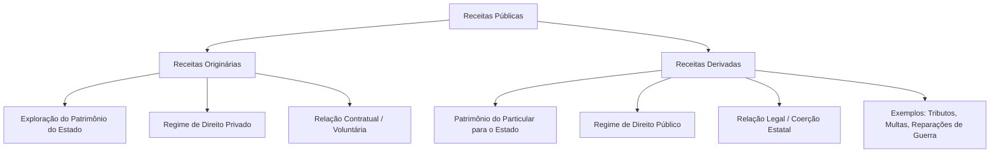

#### 1. Receita Originária
*   **Origem:** Decorre da exploração direta do próprio patrimônio do Estado (bens, empresas públicas, prestação de serviços comerciais).
*   **Regime Jurídico:** Predominantemente de **Direito Privado**.
*   **Instrumento:** Viabilizada por meio de **contrato** (vontade consensual entre as partes).

#### 2. Receita Derivada
*   **Origem:** Provém do patrimônio do **particular**, que é transferido para o Estado.
*   **Regime Jurídico:** Sob a égide do **Direito Público**.
*   **Instrumento:** Viabilizada por meio de **lei**, exercendo-se o poder de império e a coerção estatal.
*   **Exemplos:** Tributos, multas e reparações de guerra.

---

### Finalidades do Tributo

A instituição e a cobrança de tributos podem perseguir objetivos puramente financeiros ou de intervenção social e econômica:

*   **Fiscal (Arrecadação):** O objetivo principal é obter recursos financeiros para o custeio das atividades e serviços do Estado.
*   **Extrafiscal (Intervenção):** O foco principal é intervir no domínio social ou econômico. Manifesta-se por meio de normas de tributação (como a elevação de alíquotas para desestimular certas condutas) ou de não tributação (concessão de benefícios e incentivos fiscais).

---

### Bitributação vs Bis in Idem

É fundamental distinguir esses dois fenômenos de múltipla tributação sobre uma mesma base econômica:

| Critério | Bitributação | Bis in Idem |
| :--- | :--- | :--- |
| **Sujeitos Ativos** | **Dois ou mais** entes federados distintos. | **Apenas um** ente federado. |
| **Fato Gerador** | Cobrança sobre o mesmo fato gerador e mesmo contribuinte. | Cobrança múltipla sobre o mesmo fato jurídico. |
| **Exemplo Prático** | Dois Municípios cobrando ISS sobre o mesmo serviço prestado. | A União cobrando IRPJ e CSLL sobre o lucro da mesma empresa. |
| **Regra Geral** | **Vedada** pela Constituição Federal. | **Permitida** pela Constituição Federal. |
| **Exceção** | Permitida no caso de Imposto Extraordinário de Guerra (IEG). | Não possui vedação geral expressa se respeitada a competência. |

---

### Definição de Tributo

De acordo com o **Artigo 3º do Código Tributário Nacional (CTN)**:

> *"Tributo é toda prestação pecuniária compulsória, em moeda ou cujo valor nela se possa exprimir, que não constitua sanção de ato ilícito, instituída em lei e cobrada mediante atividade administrativa plenamente vinculada."*

#### Análise Detalhada dos Elementos do Conceito

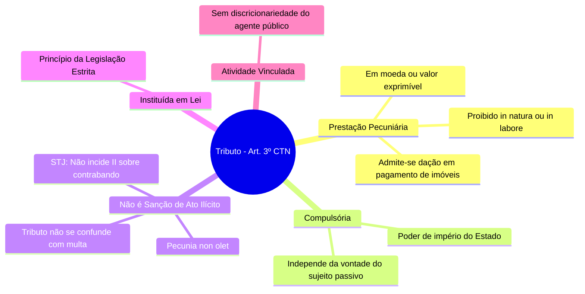

##### 1. Prestação Pecuniária em Moeda ou Cujo Valor Nela se Possa Exprimir
*   Este é um **requisito de existência** do tributo.
*   **Proibições:** O tributo **jamais** poderá ser pago *in natura* (bens como soja, gado, etc.) ou *in labore* (prestação de serviços ou trabalho), pois isso violaria os princípios constitucionais, inclusive o da licitação.
*   **Exceção Legal:** É admitida a **dação em pagamento de bens imóveis** para a extinção do crédito tributário, desde que haja previsão expressa em lei específica (conforme o Artigo 156, XI, do CTN).

##### 2. Não Constitua Sanção de Ato Ilícito
*   **Princípio do *Pecunia Non Olet* (o dinheiro não tem cheiro):** O fato gerador do tributo deve ser uma situação lícita. Contudo, os efeitos econômicos e os frutos financeiros decorrentes de atividades criminosas ou ilícitas são passíveis de tributação. O Estado tributa a riqueza obtida, independentemente da sua origem.
*   **Diferenciação:** A multa tributária é uma sanção por ato ilícito (descumprimento da lei), enquanto o tributo não possui caráter punitivo. O confisco só é legítimo quando aplicado como pena, sendo vedado ao tributo ter efeito confiscatório.

> ⚠️ **Atenção - Jurisprudência do STJ (REsp 984.607):**
> Na importação de mercadorias ilícitas (como drogas ou contrabando), **não é possível** cobrar o Imposto de Importação (II). Isso ocorre porque a "importação de mercadoria [lícita]" é elemento essencial e intrínseco à hipótese de incidência desse tributo.

> ⚠️ **Atenção - Jurisprudência do STF (RE 647.885/2020):**
> É inconstitucional a suspensão do exercício profissional realizada por conselhos de fiscalização (como OAB, CRM, CREA) em razão do inadimplemento de anuidades. Essa prática configura **sanção política** indireta em matéria tributária, o que é vedado.

##### 3. Instituída em Lei
*   O tributo decorre do princípio da legalidade estrita. Ninguém é obrigado a pagar tributo que não tenha sido previamente instituído por meio de lei.

##### 4. Cobrada Mediante Atividade Administrativa Plenamente Vinculada
*   A cobrança e a exigência do tributo pelo agente público não envolvem juízo de conveniência ou oportunidade (discricionariedade). A autoridade administrativa é obrigada por lei a efetuar a cobrança assim que configurado o fato gerador.

---

### Natureza Jurídica do Tributo

Conforme determina o **Artigo 4º do CTN**, a natureza jurídica específica de cada tributo é definida exclusivamente pelo seu **Fato Gerador**.

Para fins de definição da natureza jurídica, são formalmente **irrelevantes**:
1.  A denominação atribuída ao tributo e demais características formais adotadas pela lei instituidora.
2.  A destinação legal dada ao produto da arrecadação do tributo.

---

### Flashcards de Fixação (Estilo CEBRASPE)

**Julgue os itens a seguir em Certo (C) ou Errado (E):**

1.  **Questão:** As receitas originárias são aquelas obtidas pelo Estado mediante o constrangimento do patrimônio dos particulares, sob o manto do direito público e com base em imposição legal.
    *   **Resposta:** **Errado**
    *   **Explicação:** A descrição refere-se às receitas **derivadas**. As receitas originárias decorrem da exploração do próprio patrimônio do Estado, sob regime de direito privado e base contratual.

2.  **Questão:** É vedada a instituição de tributo cuja prestação seja realizada *in natura* ou *in labore*, contudo, o CTN autoriza que a lei preveja a dação em pagamento de bens imóveis como forma de extinção do crédito tributário.
    *   **Resposta:** **Certo**
    *   **Explicação:** O tributo deve ser pago em moeda ou valor exprimível (vedado *in natura* ou *in labore*). A dação em pagamento de bens imóveis é uma exceção expressamente prevista no Art. 156, XI, do CTN.

3.  **Questão:** O princípio do *pecunia non olet* autoriza a cobrança do Imposto de Importação sobre produtos contrabandeados, visto que a ilicitude da atividade não obsta a tributação dos seus resultados econômicos.
    *   **Resposta:** **Errado**
    *   **Explicação:** Embora o princípio do *pecunia non olet* seja a regra geral, o STJ (REsp 984.607) definiu que não incide Imposto de Importação sobre mercadoria ilícita, pois a licitude da mercadoria importada é elemento essencial do tipo tributário do II.

4.  **Questão:** Ocorre o fenômeno do *bis in idem* quando dois entes federativos distintos cobram tributos sobre o mesmo fato gerador e do mesmo contribuinte, o que é vedado pela Constituição Federal, salvo no caso de Imposto Extraordinário de Guerra.
    *   **Resposta:** **Errado**
    *   **Explicação:** O fenômeno descrito é a **bitributação**. O *bis in idem* ocorre quando o **mesmo** ente federativo realiza a cobrança múltipla sobre a mesma base econômica (como a União cobrando IRPJ e CSLL).

5.  **Questão:** A destinação do produto da arrecadação de uma exação e a denominação dada a ela pela lei instituidora são elementos irrelevantes para a definição da natureza jurídica específica do tributo.
    *   **Resposta:** **Certo**
    *   **Explicação:** Conforme o Art. 4º do CTN, a natureza jurídica específica do tributo é determinada unicamente pelo seu fato gerador, sendo irrelevantes a denominação e a destinação legal dos recursos.

> ⚠️ **Atenção Importante:** Com a promulgação da Constituição Federal de 1988 (CF/88), os **Empréstimos Compulsórios** e as **Contribuições Especiais** passaram a ter como principal característica definidora a **destinação de sua arrecadação**. Esse entendimento invalidou o artigo do Código Tributário Nacional (CTN) que vinculava a natureza jurídica do tributo exclusivamente ao seu fato gerador. Como exemplos práticos dessa mudança, destacam-se a **CSLL** (que possui o mesmo fato gerador do IRPJ) e a **COFINS**, ambas com receitas obrigatoriamente destinadas ao financiamento da seguridade social.

---

@@@
## Espécies Tributárias

O sistema tributário nacional adota a teoria pentapartida, dividindo os tributos em cinco espécies distintas. Abaixo, detalhamos cada uma delas:

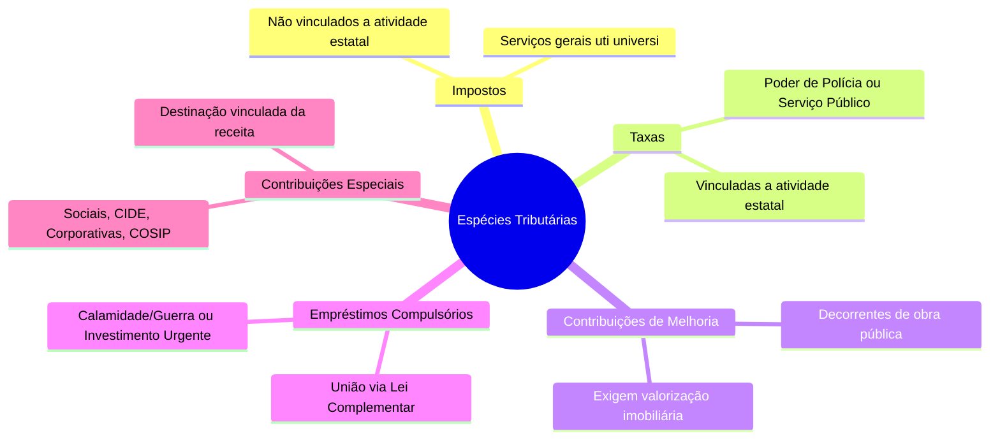

### Impostos
Os impostos são tributos de competência comum (União, Estados, Distrito Federal e Municípios) regulados pelo artigo 16 do CTN.

*   **Fato Gerador:** É caracterizado por uma situação jurídica **independente** de qualquer atividade estatal específica direcionada ao contribuinte.
*   **Destinação:** Destinam-se ao financiamento das atividades gerais do Estado, prestadas de forma genérica e indivisível (*uti universi*).
*   **Regra de Não-Vinculação:** Em regra, a receita dos impostos não pode ser vinculada a órgão, fundo ou despesa (Art. 167, IV, CF).
    *   *Exceções Constitucionais:* É permitida a vinculação de receita para ações e serviços públicos de **saúde**, desenvolvimento do **ensino** e para o financiamento de **atividades da administração tributária**.

---

### Empréstimos Compulsórios
Tributo de competência exclusiva da **União**, instituído obrigatoriamente por **Lei Complementar** (Art. 148, CF).

*   **Hipóteses de Instituição:**
    1.  **Despesas Extraordinárias:** Decorrentes de calamidade pública, guerra externa ou sua iminência.
        *   *Regra de Anterioridade:* **Não observa** nenhuma anterioridade (nem a anual, nem a noventena). A cobrança pode ser imediata.
    2.  **Investimento Público:** De caráter urgente e relevante interesse nacional.
        *   *Regra de Anterioridade:* **Observa estritamente** a anterioridade anual e a noventena.
*   **Vinculação de Recursos:** A aplicação dos recursos arrecadados é obrigatoriamente vinculada à despesa que fundamentou a sua instituição (Art. 148, parágrafo único, CF).
*   **Resgate:** A Lei Complementar instituidora deve fixar, de forma obrigatória, o prazo e as condições financeiras para o seu efetivo resgate (Art. 15, parágrafo único, CTN).

---

### Contribuições de Melhoria
Tributo de competência comum (União, Estados, Distrito Federal e Municípios) instituído para fazer face ao custo de obras públicas (Art. 81, CTN).

*   **Fato Gerador:** A **valorização imobiliária** real decorrente de uma obra pública. A simples realização da obra sem valorização do imóvel não autoriza a cobrança.
*   **Limites de Cobrança:**
    *   *Limite Total:* O custo real total realizado na obra pública (o Estado não pode arrecadar mais do que gastou).
    *   *Limite Individual:* O acréscimo de valor (valorização) que a obra efetivamente gerou para cada imóvel individualmente.
*   **Requisito Legal:** Exige-se a edição de uma lei específica para cada obra realizada (cada obra demanda uma nova lei instituidora).
*   **Arrecadação:** Os recursos arrecadados não são necessariamente vinculados à manutenção da obra.
*   **Exemplos Práticos:**
    *   *Pavimentação asfáltica nova:* Enseja a cobrança de contribuição de melhoria, pois gera valorização imobiliária inédita.
    *   *Recapeamento de via já existente:* Não enseja a cobrança, pois constitui mera manutenção de serviço público.
*   **Limite Anual de Pagamento:** A parcela anual cobrada do contribuinte não pode exceder a **3% do maior valor fiscal** atribuído ao seu imóvel.

---

### Contribuições Especiais
Tributos de competência exclusiva da **União** (com exceções para Estados, DF e Municípios), previstos no artigo 149 da CF. Sua principal característica é a **vinculação da receita** a uma finalidade específica.

```
Contribuições Especiais [Arrecadação Vinculada]
 ├── Sociais
 │    ├── Seguridade Social (PIS, COFINS, CSLL) -> Lei Ordinária
 │    ├── Outras da Seguridade (Residuais) -> Lei Complementar
 │    └── Gerais (Ex: Salário-Educação)
 ├── CIDE (Intervenção no Domínio Econômico)
 ├── Corporativas (Interesse de categorias profissionais/econômicas)
 └── COSIP (Iluminação Pública - Competência de Municípios e DF)
```

*   **Exceção de Competência:** Os Estados, o Distrito Federal e os Municípios podem instituir contribuições para o custeio do regime próprio de previdência de seus servidores. Os Municípios e o DF também possuem competência para instituir a COSIP.

---

### Taxas
Tributo de competência comum (União, Estados, Distrito Federal e Municípios) de natureza contraprestacional, sinalagmática e vinculada a uma atuação estatal (Art. 145, II, CF).

*   **Fatos Geradores:**
    1.  **Taxa de Polícia:** Decorrente do exercício regular do poder de polícia.
    2.  **Taxa de Serviço:** Decorrente da utilização, efetiva ou potencial, de serviços públicos específicos e divisíveis, prestados ao contribuinte ou postos à sua disposição.
*   **Arrecadação:** Em regra, a receita não é vinculada.
    *   *Exceção:* A taxa de fiscalização da atividade notarial possui destinação vinculada (STF, RE 602.089).
*   **Competência Comum:** Quando dois entes federativos possuem competência comum sobre determinada matéria, ambos podem instituir a respectiva taxa (STF, RE 602.089).
*   **Taxa vs. Tarifa (Preço Público):** Não se confundem (Súmula 545 do STF). Serviços de energia elétrica, água e esgoto são remunerados por **tarifa/preço público**, e não por taxa.

#### Fato Gerador e Base de Cálculo das Taxas
*   **Vedação de Identidade:** A taxa não pode ter base de cálculo ou fato gerador idênticos aos de um imposto, nem ser calculada em função do capital social das empresas (Art. 77, parágrafo único, CTN).
*   **Identidade Parcial:** É constitucional a adoção de um ou mais elementos da base de cálculo de um imposto, desde que não haja identidade integral (Súmula Vinculante 29 do STF).
*   **Taxa Judiciária sobre o Valor da Causa:**
    *   *Inconstitucionalidade:* Viola a garantia de acesso à jurisdição a taxa judiciária calculada sem um limite máximo (teto) sobre o valor da causa (Súmula 667 do STF).
    *   *Constitucionalidade:* É permitida a utilização do valor da causa ou da condenação como base de cálculo, desde que haja um teto limitador fixado em lei (STF, AI 564.642).
*   **Caso do Monte-Mor:** É inconstitucional a escolha do valor do monte-mor como base de cálculo de taxa judiciária, pois bens imóveis do monte-mor já servem de base de cálculo para o ITCMD e o ITBI, violando o art. 145, § 2º, da CF (STF, ADI 2.040).
*   **Capacidade Contributiva nas Taxas:** O STF entende que nada impede a aplicação do princípio da capacidade contributiva às taxas, graduando-as segundo a capacidade econômica do contribuinte (STF, RE 232.393).
    *   *Atenção para Provas:* A banca **FCC** costuma rejeitar esse entendimento em suas questões, considerando que a capacidade contributiva se aplica apenas aos impostos.

#### Taxa de Serviço
Regulada pelo artigo 79 do CTN, exige que o serviço público atenda aos seguintes requisitos:

1.  **Utilização:**
    *   *Efetiva:* Quando usufruída concretamente pelo contribuinte a qualquer título.
    *   *Potencial:* Quando, sendo de utilização compulsória, o serviço é colocado à disposição do contribuinte mediante atividade administrativa em efetivo funcionamento.
2.  **Especificidade:** O serviço deve ser destacado em unidades autônomas de intervenção, utilidade ou necessidade pública.
3.  **Divisibilidade:** O serviço deve ser suscetível de utilização individualizada, permitindo identificar o benefício de cada usuário.

> 🚨 **Regra de Ouro:** O serviço que enseja a cobrança de taxa deve ser **sempre estatal e compulsório**. Serviços delegados a concessionárias ou permissionárias são remunerados por tarifa ou preço público, nunca por taxa.

#### Taxa de Polícia
Fundamentada no artigo 78 do CTN, refere-se à atividade da administração pública que limita ou disciplina direitos, interesses ou liberdades em prol do interesse público.

*   **Exercício Regular:** Deve ser exercido por órgão competente, com observância do devido processo legal e sem desvio ou abuso de poder.
*   **Efetividade Presumida:** Presume-se o efetivo exercício do poder de polícia quando existente o órgão fiscalizador estruturado e em funcionamento, sendo desnecessária a comprovação de fiscalizações individualizadas sobre cada contribuinte (STF, RE 416.601).

#### Jurisprudência Correlata: Constitucionalidade de Taxas

| Taxas Constitucionais | Taxas Inconstitucionais |
| :--- | :--- |
| **Coleta de Lixo:** Cobrada exclusivamente em razão dos serviços de coleta, remoção e tratamento ou destinação de lixo ou resíduos domiciliares (Súmula Vinculante 19 do STF). | **Limpeza Pública:** Cobrança de taxa para serviços de conservação e limpeza de logradouros e bens públicos, por serem serviços indivisíveis (STF, RE 576.321). |
| **Revalidação de Diploma:** Taxa cobrada para a revalidação de diploma obtido no exterior (STF, AI 857.795). | **Matrícula Universitária:** Cobrança de taxa de matrícula em universidades públicas (Súmula Vinculante 12 do STF). |
| **Funcionamento e Localização:** Taxa de renovação de funcionamento e localização municipal, desde que haja órgão de fiscalização efetivo (STF, RE 588.322). | **Combate a Incêndios:** Criação de taxa municipal para prevenção e combate a incêndios, pois a segurança pública é atividade precípua do Estado (STF, RE 643.247). |
| **Fiscalização de Anúncios:** Taxa destinada à fiscalização de anúncios publicitários (STF, RE 216.207). | **Iluminação Pública:** O serviço de iluminação pública não pode ser remunerado mediante taxa (Súmula Vinculante 21 do STF). |
| **Mercado de Capitais:** Taxa de fiscalização dos mercados de títulos e valores mobiliários cobrada pela CVM (Súmula 665 do STF). | **Emissão de Carnês:** Cobrança de taxas pela emissão ou remessa de carnês e guias de recolhimento de tributos (STF, RE 789.218). |
| **FUNDAF:** A contribuição para o FUNDAF tem natureza de taxa, mas não pode ser cobrada ou reajustada por atos meramente regulamentares da RFB (Entendimento do STJ). | **Selos de Controle do IPI:** Cobrança de taxa para a confecção e fornecimento de selos de controle do IPI (STJ, REsp 1.405.244). |
| — | **Segurança em Eventos:** Taxa de segurança para eventos privados, pois a segurança pública é serviço geral, indivisível e deve ser custeada por impostos (STF, ADI 2692/22). |

---

### 💡 Flashcards de Fixação (Espécies Tributárias)

```fc-card
card-id: fc-especies-1
Q: A taxa de coleta de lixo domiciliar é constitucional, enquanto a taxa de conservação e limpeza de logradouros públicos é inconstitucional. (C/E)
A: **Certo.** A Súmula Vinculante 19 do STF valida a taxa de coleta de lixo domiciliar (específico e divisível). Já a limpeza de logradouros públicos beneficia a coletividade de forma indivisível (*uti universi*), devendo ser custeada por impostos.
```

```fc-card
card-id: fc-especies-2
Q: Os empréstimos compulsórios instituídos para atender a despesas extraordinárias decorrentes de calamidade pública devem observar a anterioridade anual e a noventena. (C/E)
A: **Errado.** Os empréstimos compulsórios motivados por calamidade pública ou guerra externa (e sua iminência) constituem exceção absoluta às regras de anterioridade, podendo ser cobrados imediatamente após a publicação da Lei Complementar.
```

```fc-card
card-id: fc-especies-3
Q: A contribuição de melhoria tem como limite individual o custo total da obra pública realizada. (C/E)
A: **Errado.** O limite *individual* é a valorização real obtida por cada imóvel beneficiado. O custo total da obra pública representa o limite *geral* (global) da arrecadação do tributo.
```

---

@@@
## Competência Tributária

A competência tributária é a aptidão jurídica outorgada pela Constituição Federal para que os entes políticos (União, Estados, Distrito Federal e Municípios) possam **instituir** tributos. Cabe ressaltar que a CF/88 apenas atribui competências; ela não institui nenhum tributo diretamente.

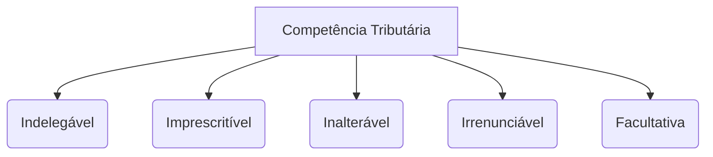

### Características da Competência Tributária
*   **Indelegável:** A atribuição para legislar e instituir o tributo não pode ser transferida a outro ente (a capacidade tributária ativa de arrecadar e fiscalizar, contudo, é delegável).
*   **Imprescritível:** O não exercício da competência tributária pelo ente político não decai e não prescreve; ela pode ser exercida a qualquer tempo.
*   **Inalterável:** Os limites e atribuições fixados pela Constituição Federal só podem ser modificados por meio de Emenda Constitucional (EC).
*   **Irrenunciável:** O ente político não pode abrir mão ou renunciar à competência tributária que lhe foi outorgada.
*   **Facultativa:** O ente político tem a faculdade de instituir ou não o tributo. Todavia, uma vez instituído em lei, a sua cobrança e arrecadação tornam-se atos vinculados e obrigatórios para a administração.

### Regras Especiais de Competência
*   **Territórios Federais:** Nos Territórios Federais não divididos em Municípios, compete à União instituir os tributos estaduais e municipais. Se o Território for dividido em Municípios, caberá à União instituir apenas os tributos estaduais daquela região.
*   **Competência Residual de Taxas dos Estados:** Os Estados possuem competência residual para a instituição e cobrança de taxas no âmbito de suas atribuições administrativas (Art. 25, §1º, CF).

---

### Capacidade Tributária Ativa (CTA)
Diferente da competência tributária, a Capacidade Tributária Ativa consiste nas funções executivas de:

$$\text{CTA} = \text{Cobrar} + \text{Arrecadar} + \text{Fiscalizar}$$

*   **Garantias:** A delegação da CTA compreende também as garantias e os privilégios processuais que a lei assegura ao ente tributante original.
*   **Delegação:** Pode ser delegada **exclusivamente** para pessoas jurídicas de direito público (Ex: conselhos profissionais como CRM e CREA; ou Municípios que optam por fiscalizar e cobrar o ITR pertencente à União).
*   **Regra de Repasse de Receita:** Conforme o artigo 6º, parágrafo único, do CTN, se a receita de um tributo for distribuída, no todo ou em parte, a outra pessoa jurídica de direito público, a competência legislativa para regulamentar e alterar o tributo permanece intocada com o ente político que o instituiu originalmente.

---

### Capacidade Contributiva
Prevista no artigo 145, §1º da CF, estabelece diretrizes para a justiça fiscal:

> "Sempre que possível, os **impostos** terão caráter pessoal e serão graduados segundo a capacidade econômica do contribuinte, facultado à administração tributária, especialmente para conferir efetividade a esses objetivos, identificar, respeitados os direitos individuais e nos termos da lei, o patrimônio, os rendimentos e as atividades econômicas dos contribuintes."

*   **Não Aplicabilidade:** O princípio da capacidade contributiva **não se aplica** às penalidades tributárias (multas).
*   **Aplicação às Taxas:** O STF firmou entendimento de que, embora o dispositivo constitucional cite expressamente os impostos, nada impede que o princípio da capacidade contributiva seja aplicado, na medida do possível, também às taxas (STF, RE 232.393).
*   **Acesso a Dados Bancários:** Conforme o artigo 6º da Lei Complementar 105, as autoridades fiscais da União, Estados, DF e Municípios podem examinar documentos, livros e registros de instituições financeiras, desde que haja processo administrativo instaurado ou procedimento fiscal em curso, e que tais exames sejam considerados indispensáveis pela autoridade. Este mecanismo foi declarado constitucional pelo STF.

---

### 💡 Flashcards de Fixação (Competência e Capacidade)

```fc-card
card-id: fc-competencia-1
Q: A competência tributária é delegável para pessoas jurídicas de direito privado que prestem serviços públicos essenciais. (C/E)
A: **Errado.** A competência tributária (função legislativa de instituir o tributo) é absolutamente indelegável. Apenas a Capacidade Tributária Ativa (função administrativa de arrecadar e fiscalizar) pode ser delegada, e exclusivamente para pessoas jurídicas de direito público.
```

```fc-card
card-id: fc-competencia-2
Q: O princípio da capacidade contributiva, embora previsto expressamente para os impostos, pode ser estendido à cobrança de taxas, segundo entendimento do STF. (C/E)
A: **Certo.** O STF (RE 232.393) entende que, na medida do possível, as taxas também podem ser graduadas de acordo com a capacidade econômica do contribuinte, embora bancas como a FCC tendam a restringir o princípio apenas aos impostos em suas provas literais.
```

---

@@@
## Limitações Constitucionais ao Poder de Tributar

As limitações constitucionais ao poder de tributar funcionam como verdadeiras garantias fundamentais do contribuinte contra os abusos do Fisco.

### Princípios
O artigo 150 da Constituição Federal traz um rol de vedações impostas aos entes federativos. Cabe destacar que este rol é **exemplificativo**, existindo outras garantias espalhadas pelo texto constitucional.

---

### Legalidade
Previsto no artigo 150, I, da CF, determina que é expressamente vedado à União, aos Estados, ao Distrito Federal e aos Municípios exigir (instituir) ou aumentar tributo sem que haja uma **lei** que o estabeleça previamente.

#### Exceções ao Princípio da Legalidade (Mitigações)
A própria Constituição Federal flexibiliza o princípio da legalidade, permitindo que o Poder Executivo altere as alíquotas de determinados tributos por meio de ato infralegal (como Decretos ou Portarias), respeitados os limites e condições fixados em lei:

*   **II** (Imposto de Importação) - Alíquotas alteradas por ato do Executivo (Ex: Resolução CAMEX).
*   **IE** (Imposto de Exportação) - Alíquotas alteradas por ato do Executivo (Ex: Resolução CAMEX).
*   **IPI** (Imposto sobre Produtos Industrializados) - Alíquotas alteradas por ato do Executivo.
*   **IOF** (Imposto sobre Operações Financeiras) - Alíquotas alteradas por ato do Executivo.
*   **IPTU** - A alteração da base de cálculo (planta genérica de valores) do IPTU pode ser realizada por meio de decreto do Poder Executivo, desde que se limite à atualização monetária do período. A majoração real da base de cálculo ou das alíquotas, contudo, continua exigindo lei em sentido estrito.

---

### 💡 Flashcards de Fixação (Princípios e Legalidade)

```fc-card
card-id: fc-legalidade-1
Q: O Poder Executivo pode majorar as alíquotas do Imposto sobre Produtos Industrializados (IPI) por meio de decreto, sem necessidade de lei em sentido estrito. (C/E)
A: **Certo.** O IPI é uma das exceções atenuadas ao princípio da legalidade estrita, permitindo que suas alíquotas sejam alteradas por ato do Poder Executivo, dentro dos limites estabelecidos na lei reguladora do imposto.
```

```fc-card
card-id: fc-legalidade-2
Q: O rol de limitações ao poder de tributar previsto no artigo 150 da Constituição Federal é taxativo, não se admitindo outras garantias ao contribuinte fora dele. (C/E)
A: **Errado.** O rol de garantias e limitações ao poder de tributar é meramente exemplificativo, existindo outras proteções ao contribuinte distribuídas ao longo da Constituição Federal e da legislação infraconstitucional.
```

@@@
## ATUALIZAÇÃO DO IPTU E REGRAS DE DECRETO

A atualização da base de cálculo de tributos e a fixação de suas alíquotas possuem regras rígidas no ordenamento jurídico brasileiro. No entanto, o poder regulamentar do Poder Executivo, exercido por meio de decretos, possui algumas prerrogativas específicas que merecem atenção detalhada.

### Atualização da Base de Cálculo do IPTU
A base de cálculo do Imposto sobre a Propriedade Predial e Territorial Urbana (IPTU) pode ser atualizada mediante **decreto** do Poder Executivo municipal, desde que essa atualização se limite estritamente à recomposição da perda inflacionária.

> ⚠️ **CUIDADO PARA NÃO CAIR EM PEGADINHA DE PROVA!**
> A mera atualização monetária do valor dos imóveis (correção da inflação) pode ser feita por **decreto**. Contudo, a modificação real da **Planta de Valores Genéricos (PVG)**, que altera o valor venal dos imóveis acima dos índices oficiais de inflação, exige obrigatoriamente a edição de **LEI**.

*   **Súmula 160 do Superior Tribunal de Justiça (STJ):** É defeso (proibido) ao Município atualizar o IPTU, mediante decreto, em percentual superior ao índice oficial de correção monetária.

---

### Outras Atribuições Permitidas ao Decreto e Atos do Executivo

Além da atualização monetária do IPTU, o ordenamento jurídico autoriza o uso de decretos ou atos administrativos específicos para as seguintes situações:

1.  **CIDE-Combustível:**
    *   O Presidente da República pode, por meio de **decreto**, **reduzir** ou **restabelecer** as alíquotas da CIDE-Combustível. Trata-se de uma exceção clássica ao princípio da legalidade estrita (função extrafiscal do tributo).
2.  **ICMS-Combustível:**
    *   As alíquotas do ICMS incidente sobre combustíveis são fixadas e alteradas mediante **convênio** no âmbito do Conselho Nacional de Política Fazendária (Confaz). Isso significa que a alteração ocorre de forma livre por meio desse instrumento de cooperação entre os estados e o Distrito Federal.
3.  **Prazo de Recolhimento de Tributos:**
    *   A alteração do prazo para o pagamento (recolhimento) de tributos **pode ser realizada mediante decreto**. O estabelecimento ou modificação de data de vencimento não se confunde com a instituição ou majoração de tributo, dispensando, portanto, a exigência de lei em sentido estrito.

---

### Regras Gerais de Instituição e Extinção de Tributos

*   **Regra Absoluta:** Não existe qualquer tipo de exceção para a **instituição** (criação) ou **extinção** de tributos. Ambas as situações exigem, de forma indeclinável, a edição de **LEI** (ordinária ou complementar, conforme o caso) ou de **Medida Provisória (MP)**.
*   **Iniciativa de Lei:** A iniciativa de lei para instituir tributos **NÃO é privativa** do Chefe do Poder Executivo. Parlamentares também possuem competência para propor projetos de lei de natureza tributária, salvo as exceções expressas na Constituição Federal (como os tributos dos Territórios Federais).
*   **Medida Provisória como Instrumento Idôneo:**
    *   **STF (AI 236.976):** A Medida Provisória, possuindo força de lei, é instrumento idôneo e perfeitamente válido para instituir e modificar tributos, bem como contribuições sociais.

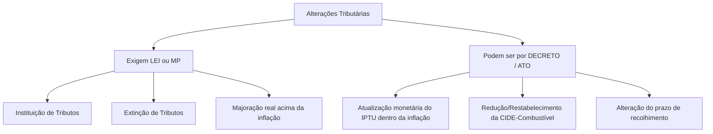

---

@@@
## ISONOMIA TRIBUTÁRIA

O princípio da isonomia tributária busca garantir que contribuintes em situações equivalentes recebam o mesmo tratamento jurídico, vedando privilégios injustificados ou discriminações arbitrárias.

> **Art. 150, II, da Constituição Federal:**
> É vedado à União, aos Estados, ao Distrito Federal e aos Municípios instituir tratamento desigual entre contribuintes que se encontrem em situação equivalente, proibida qualquer distinção em razão de ocupação profissional ou função por eles exercida, independentemente da denominação jurídica dos rendimentos, títulos ou direitos.

### Características e Aplicação
*   **Abrangência:** Aplica-se a **todos os tributos** e a todas as pessoas, sejam elas **físicas (PF)** ou **jurídicas (PJ)**, devendo ser observada de maneira distinta a depender da situação concreta de cada contribuinte.
*   **Progressividade em Impostos Reais:** Em regra, os impostos de caráter real (que incidem sobre coisas/bens) **não possuem alíquotas progressivas**. No entanto, a própria Constituição Federal estabeleceu exceções expressas a essa regra:

| Imposto | Critério de Progressividade / Diferenciação Autorizado |
| :--- | :--- |
| **IPTU** | Pode ser progressivo em razão do **tempo** (cumprimento da função social da propriedade), do **valor** do imóvel, da sua **localização** e do seu **uso**. |
| **IPVA** | Apresenta alíquotas diferenciadas em função do **tipo** e da **utilização** do veículo (o que engloba também a sua procedência, nacional ou importada). |
| **ITR** | É progressivo de forma a desestimular a manutenção de propriedades improdutivas, variando em função da **área** do imóvel e do seu grau de **utilização**. |
| **ITCMD** | A alíquota pode ser progressiva em função do valor do **quinhão**, legado ou herança que cada herdeiro individualmente receber. |

---

### Jurisprudência e Casos Práticos: O que Ofende e o que Não Ofende a Isonomia

#### ❌ Entendido como INCONSTITUCIONAL pelo STF
*   **ITBI Progressivo:** É inconstitucional a fixação de alíquota progressiva para o Imposto sobre Transmissão de Bens Imóveis (ITBI) com base exclusivamente no valor venal do imóvel.

####  Entendido como constitucional (NÃO OFENDE a Isonomia)
*   **Incentivos Fiscais Direcionados:** Concessão de benefícios ou incentivos fiscais para empresas que contratam funcionários idosos, pessoas com deficiência, entre outros grupos vulneráveis.
*   **Restrições de Importação de Usados:** A vedação da importação de veículos e pneus **usados** (enquanto a importação de novos é permitida) não viola a isonomia, pois visa à proteção ambiental e à segurança.
*   **Exclusão do Arrendamento Mercantil:** A exclusão das operações de arrendamento mercantil (*leasing*) do campo de aplicação do regime aduaneiro de admissão temporária.

---

### 📝 FLASHCARDS (Estilo CEBRASPE)

**Q1. Julgue o item a seguir:**
A instituição de alíquotas progressivas para o ITBI com base no valor venal do imóvel é considerada constitucional pelo Supremo Tribunal Federal, uma vez que atende ao princípio da capacidade contributiva.
<details>
<summary><b>Ver resposta</b></summary>
<b>ERRADO.</b> O STF entende que é inconstitucional a progressividade das alíquotas do ITBI com base no valor venal do imóvel, pois se trata de um imposto real que não possui autorização constitucional expressa para tal progressividade.
</details>

**Q2. Julgue o item a seguir:**
Não ofende o princípio da isonomia tributária a concessão de incentivo fiscal a empresas que contratem trabalhadores com deficiência ou idosos.
<details>
<summary><b>Ver resposta</b></summary>
<b>CERTO.</b> Tais medidas utilizam a tributação como instrumento de indução social (extrafiscalidade) para promover a integração de grupos vulneráveis, o que configura discriminação positiva legítima.
</details>

---

@@@
## RESERVA LEGAL

O princípio da reserva legal em matéria de benefícios fiscais atua como uma garantia de que o patrimônio público e a receita tributária não serão reduzidos sem o crivo do Poder Legislativo.

> **Art. 150, §6º, da Constituição Federal:**
> Qualquer subsídio ou isenção, redução de base de cálculo, concessão de crédito presumido, anistia ou remissão, relativos a impostos, taxas ou contribuições, só poderá ser concedido mediante **LEI ESPECÍFICA**, federal, estadual ou municipal, que regule exclusivamente as matérias acima enumeradas ou o correspondente tributo ou contribuição, sem prejuízo do disposto no art. 155, § 2.º, XII, g (Confaz).

### A Flexibilização do Requisito de "Exclusividade" pelo STF
Embora o texto constitucional mencione que a lei específica deve regular "exclusivamente" as matérias de desoneração ou o tributo correspondente, o Supremo Tribunal Federal (STF) atenuou o rigor dessa interpretação. 

Atualmente, o entendimento jurisprudencial exige apenas que haja **pertinência temática** entre o benefício fiscal concedido e a regulação geral que está sendo veiculada no corpo da lei.

---

@@@
## IRRETROATIVIDADE

O princípio da irretroatividade tributária garante a segurança jurídica, impedindo que o Estado surpreenda o contribuinte cobrando tributos sobre fatos ocorridos antes de a lei existir.

> **Art. 150, III, "a", da Constituição Federal:**
> É vedado à União, aos Estados, ao Distrito Federal e aos Municípios cobrar tributos em relação a fatos geradores ocorridos antes do início da vigência da lei que os houver instituído ou aumentado.

*   **Ausência de Exceções Constitucionais:** A Constituição Federal de 1988 **não previu nenhuma exceção** ao princípio da irretroatividade tributária no que tange à instituição ou majoração de tributos.

> 🚨 **MUITO CUIDADO COM PEGADINHAS!**
> O Código Tributário Nacional (CTN), em seu artigo 106, prevê duas hipóteses de aplicação retroativa da lei tributária (leis expressamente interpretativas e leis que cominam penalidades mais brandas ao contribuinte). 
> **Essas hipóteses NÃO constituem exceções à irretroatividade tributária constitucional**, pois nenhuma delas autoriza a **cobrança** ou o **aumento** de tributos de forma retroativa. Elas tratam apenas de infrações, penalidades ou esclarecimento de textos legais.

---

### Casos Especiais de Aplicação do Princípio

#### 1. Irretroatividade e a CSLL (Contribuição Social sobre o Lucro Líquido)
*   **Fato Gerador:** Ocorre em **31 de dezembro** de cada ano.
*   **Regra de Anterioridade:** A CSLL **não obedece** à anterioridade anual, mas **obedece** à anterioridade nonagesimal (noventena).
*   **Entendimento do STF:** Como o fato gerador da CSLL se consolida apenas em 31 de dezembro, o STF entende que a lei que estiver em vigor nessa data exata é aplicável imediatamente a todo o período. 
*   *Exemplo prático:* Se uma lei alterar a alíquota da CSLL e for publicada até o dia **2 de outubro** do mesmo ano (respeitando o prazo de 90 dias até 31 de dezembro), todos os lucros auferidos ao longo daquele ano inteiro serão tributados pela nova alíquota majorada.

#### 2. Irretroatividade e o Imposto de Renda (IR)
*   **Fato Gerador:** Consolida-se em **31 de dezembro** de cada ano.
*   **Regra de Anterioridade:** O IR **obedece** à anterioridade anual, mas **não obedece** à noventena.
*   **Revogação da Súmula 584 do STF:** A antiga Súmula 584 determinava que se aplicava ao IR a lei vigente no exercício financeiro em que deveria ser apresentada a declaração de ajuste. O STF **revogou** essa súmula por entender que ela violava frontalmente os princípios da irretroatividade e da anterioridade tributária.

---

@@@
## ANTERIORIDADE

O princípio da anterioridade anual (ou de exercício) impede a cobrança imediata de um tributo recém-criado ou majorado, exigindo a virada do ano civil para que a nova lei produza efeitos.

> **Art. 150, III, "b", da Constituição Federal:**
> É vedado à União, aos Estados, ao Distrito Federal e aos Municípios cobrar tributos no mesmo exercício financeiro em que haja sido publicada a lei que os instituiu ou aumentou.

### Hipóteses que NÃO se sujeitam à Anterioridade Anual

Não configuram instituição ou majoração de tributos e, portanto, podem produzir efeitos imediatos:

*   **Redução ou Extinção de Desconto:** A retirada de um desconto anteriormente concedido para o pagamento de um tributo não se submete à anterioridade.
*   **Revogação de Isenção:** Em regra, a revogação de uma isenção tributária não se submete à anterioridade, **salvo** no caso de revogação de isenção do Imposto de Renda (IR) quando esta possuir caráter extrafiscal.
*   **Atualização Monetária:** A mera recomposição do valor da moeda frente à inflação não constitui majoração real do tributo.
*   **Alteração do Prazo de Recolhimento:** A mudança da data de vencimento para pagamento do tributo (Súmula Vinculante 50 do STF).

> 💡 **Destaque sobre a Taxa SELIC (STF - RE 648.245):**
> O STF fixou o entendimento de que a taxa SELIC cumpre, de forma cumulativa, a função de **correção monetária** e de **juros de mora**. Por essa razão, ela não pode ser considerada um mero índice de correção monetária pura.

---

@@@
## NOVENTENA

Também conhecida como anterioridade nonagesimal, essa garantia impede que o contribuinte seja cobrado antes de decorridos 90 dias da publicação da lei que criou ou aumentou o tributo.

> **Art. 150, III, "c", da Constituição Federal:**
> É vedado à União, aos Estados, ao Distrito Federal e aos Municípios cobrar tributos antes de decorridos noventa dias da data em que haja sido publicada a lei que os instituiu ou aumentou, observado o disposto na alínea "b" (anterioridade anual).

*   **STF (RE 584.100):** O prazo nonagesimal deve ser aplicado estritamente nos casos de **criação** ou **majoração** de tributos. Ele **não se aplica** na hipótese de simples prorrogação de alíquota que já vinha sendo cobrada anteriormente.

---

@@@
## ANTERIORIDADE X NOVENTENA

A aplicação conjunta ou isolada dos princípios da anterioridade anual e da noventena varia conforme a natureza do tributo ou a operação realizada. A tabela abaixo resume as regras de incidência para cada caso:

| Tributo / Situação | Aplica-se Anterioridade Anual? | Aplica-se Noventena (90 dias)? |
| :--- | :---: | :---: |
| **II, IE, IOF, IEG e Empréstimo Compulsório** (Guerra ou Calamidade) | **NÃO** | **NÃO** |
| **IPI** | **NÃO** | **SIM** |
| **Contribuições de Seguridade Social** (PIS, COFINS, CSLL, INSS, CPP) | **NÃO** | **SIM** |
| **Redução e Restabelecimento de Alíquotas** (ICMS e CIDE-Combustíveis) | **NÃO** | **SIM** |
| **Imposto de Renda** (IRPF / IRPJ) | **SIM** | **NÃO** |
| **Alteração da Base de Cálculo do IPTU e do IPVA** | **SIM** | **NÃO** |

---

### 📝 FLASHCARDS (Estilo CEBRASPE)

**Q1. Julgue o item a seguir:**
A alteração do prazo de recolhimento de obrigação tributária não se sujeita ao princípio da anterioridade.
<details>
<summary><b>Ver resposta</b></summary>
<b>CERTO.</b> Conforme a Súmula Vinculante 50 do STF, a modificação da data de vencimento do tributo não configura instituição ou majoração, estando dispensada de observar a anterioridade anual ou nonagesimal.
</details>

**Q2. Julgue o item a seguir:**
O Imposto sobre a Propriedade de Veículos Automotores (IPVA), quando tem sua base de cálculo modificada, deve observar tanto a anterioridade anual quanto a anterioridade nonagesimal.
<details>
<summary><b>Ver resposta</b></summary>
<b>ERRADO.</b> A alteração da base de cálculo do IPVA (assim como a do IPTU) é uma exceção à noventena. Portanto, deve observar apenas a anterioridade anual, podendo ser cobrada no primeiro dia do exercício financeiro seguinte.
</details>

---

@@@
## MEDIDA PROVISÓRIA X ANTERIORIDADE E NOVENTENA

A edição de Medidas Provisórias (MP) que instituam ou majorem tributos possui regramento específico no texto constitucional para evitar abusos do Poder Executivo.

> **Art. 62, §2º, da Constituição Federal:**
> Medida provisória que implique instituição ou majoração de **impostos**, com exceção do II, IE, IPI, IOF e IEG, só produzirá efeitos no exercício financeiro seguinte **se houver sido convertida em lei até o último dia daquele em que foi editada**.

### Contagem dos Prazos de Anterioridade e Noventena para MPs

O marco inicial (termo *a quo*) para a contagem dos prazos de garantia do contribuinte varia conforme a espécie tributária:

1.  **Impostos Gerais** (exceto II, IE, IPI, IOF e IEG):
    *   **Anterioridade Anual:** A contagem e a produção de efeitos só ocorrem no exercício financeiro seguinte ao da **CONVERSÃO** da MP em lei.
    *   **Noventena:** A contagem dos 90 dias inicia-se na data de **PUBLICAÇÃO** da Medida Provisória (STF - RE 181.664).
2.  **Demais Tributos** (Taxas, Contribuições, etc.):
    *   Tanto a anterioridade anual quanto a noventena têm seus prazos contados a partir da data de **PUBLICAÇÃO** da própria Medida Provisória.

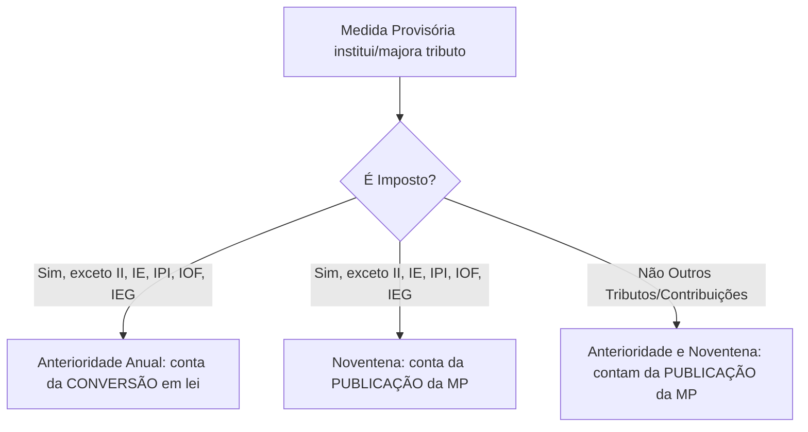

---

@@@
## PRINCÍPIO DO NÃO-CONFISCO

O princípio do não-confisco limita a sanha arrecadatória do Estado, impedindo que a carga tributária inviabilize a atividade econômica ou confisque a propriedade privada.

> **Art. 150, IV, da Constituição Federal:**
> É vedado à União, aos Estados, ao Distrito Federal e aos Municípios utilizar tributo com efeito de confisco.

### Parâmetros de Avaliação do Caráter Confiscatório
*   **Análise Global da Carga Tributária (STF - ADI-MC 2.010):** A verificação do efeito confiscatório deve considerar a **totalidade da carga tributária** imposta por um **mesmo ente tributante**. Devem ser incluídas nessa análise não apenas os tributos em si, mas também as **multas moratórias e punitivas**.
*   **Taxas:** O caráter confiscatório de uma taxa é aferido por meio da desproporção entre o **custo da atividade estatal** (serviço público ou poder de polícia) e o **valor cobrado** do contribuinte.
*   **Pena de Perdimento:** A perda de bens decretada em favor do Estado em razão de ilícitos (pena de perdimento) possui natureza de sanção penal/administrativa, não se confundindo com tributo confiscatório.
*   **Controle Abstrato de Constitucionalidade (STF - ADI 1.075):** É perfeitamente cabível que o STF examine, em sede de controle abstrato de constitucionalidade, se determinado tributo ou multa ofende o princípio da vedação ao confisco.

---

@@@
## LIBERDADE DE TRÁFEGO

A liberdade de tráfego assegura o direito de ir e vir de pessoas e bens em todo o território nacional, impedindo barreiras tributárias internas.

> **Art. 150, V, da Constituição Federal:**
> É vedado à União, aos Estados, ao Distrito Federal e aos Municípios estabelecer limitações ao tráfego de pessoas ou bens, por meio de tributos interestaduais ou intermunicipais, ressalvada a cobrança de pedágio pela utilização de vias conservadas pelo Poder Público.

### Natureza Jurídica do Pedágio
*   **Pedágio = Preço Público (Tarifa):** O pedágio não possui natureza tributária.
*   **Independência de Prestação:** A cobrança de pedágio é legítima independentemente de a via ser explorada diretamente pelo Estado ou por concessionária privada, bem como da existência ou não de vias alternativas gratuitas para o contribuinte.
*   **STF (ADI 800):** O pedágio cobrado pela efetiva utilização de rodovias não tem natureza tributária, mas sim de preço público, não se sujeitando aos princípios e limitações constitucionais tributárias.

### Apreensão de Mercadorias
*   **STF (ADI 395):** Não configura limitação ao tráfego de bens a apreensão e retenção de mercadorias que estejam desacompanhadas de documentação fiscal idônea, até que seja comprovada a legitimidade de sua posse e regularidade fiscal.

---

@@@
## UNIFORMIDADE GEOGRÁFICA

Este princípio impede que a União conceda privilégios tributários a determinadas regiões em detrimento de outras, garantindo a coesão federativa.

> **Art. 151, I, da Constituição Federal:**
> É vedado à União instituir tributo que não seja uniforme em todo o território nacional ou que implique distinção ou preferência em relação a Estado, ao Distrito Federal ou a Município, admitida a concessão de incentivos fiscais destinados a promover o equilíbrio do desenvolvimento socioeconômico entre as diferentes regiões do País.

*   **Exceção Autorizada:** A concessão de **incentivos fiscais regionais** (como a Zona Franca de Manaus ou incentivos para o Nordeste) é constitucional, pois visa reduzir as desigualdades regionais.

---

@@@
## UNIFORMIDADE DA TRIBUTAÇÃO DA RENDA

A União não pode utilizar o Imposto de Renda como instrumento de retaliação política ou econômica contra os demais entes federados.

> **Art. 151, II, da Constituição Federal:**
> É vedado à União tributar a renda das obrigações da dívida pública dos Estados, do Distrito Federal e dos Municípios, bem como a remuneração e os proventos dos respectivos agentes públicos, em níveis superiores aos que fixar para suas obrigações e para seus agentes.

> 🚨 **ATENÇÃO À PEGADINHA DE PROVA!**
> A União **PODE** tributar a renda dos agentes públicos estaduais e municipais, bem como os títulos das dívidas desses entes. O que ela **NÃO PODE** é tributá-los em patamares **superiores** aos aplicados aos seus próprios agentes e títulos federais.

---

@@@
## VEDAÇÃO ÀS ISENÇÕES HETERÔNOMAS / HETEROTÓPICAS

O princípio da autonomia dos entes federados impede que um ente conceda isenção sobre tributo de competência de outro.

> **Art. 151, III, da Constituição Federal:**
> É vedado à União instituir isenções de tributos da competência dos Estados, do Distrito Federal ou do Municípios.

### Exceções ao Princípio (Casos em que a União pode conceder isenção de tributo estadual/municipal)

1.  **Tratados Internacionais:** A União, ao assinar tratados internacionais (como acordos do GATT ou ALALC), atua representando a **República Federativa do Brasil** (personalidade jurídica de direito internacional público), e não como ente federado parcial. Nessa condição, pode conceder isenções de tributos estaduais e municipais.
2.  **ICMS-Exportação:** Isenção concedida por meio de Lei Complementar federal. Trata-se, na verdade, de uma imunidade prevista diretamente pela própria Constituição Federal.
3.  **ISS-Exportação:** A Lei Complementar federal pode excluir da incidência do ISS a exportação de serviços para o exterior.

*   **Súmula 69 do STF:** A Constituição Estadual não pode estabelecer limite para o aumento de tributos municipais.

---

@@@
## NÃO DIFERENCIAÇÃO TRIBUTÁRIA

Este princípio impede a criação de barreiras fiscais internas baseadas na origem geográfica dos produtos ou serviços.

> **Art. 152, da Constituição Federal:**
> É vedado aos Estados, ao Distrito Federal e aos Municípios estabelecer diferença tributária entre bens e serviços, de qualquer natureza, em razão de sua procedência ou destino.

> ⚠️ **CUIDADO!**
> Esta vedação de diferenciação **não se aplica à União**. A União pode estabelecer alíquotas diferenciadas com base na procedência do produto (como ocorre na importação de produtos estrangeiros através do Imposto de Importação).

---

@@@
## NÃO-CUMULATIVIDADE

A não-cumulatividade compensa o tributo devido em cada operação com o montante cobrado nas etapas anteriores, evitando o efeito "cascata".

*   **Entendimento do STF:** A não-cumulatividade **não é considerada cláusula pétrea** da Constituição Federal, pois não constitui uma garantia individual ou direito fundamental do contribuinte. Trata-se de uma limitação direcionada ao legislador ordinário, não vinculando o legislador constituinte derivado.

---

@@@
## IMUNIDADES, NÃO-INCIDÊNCIA E DESONERAÇÃO TRIBUTÁRIA

As formas de desoneração tributária dividem-se em diferentes institutos jurídicos a depender de sua origem e natureza:

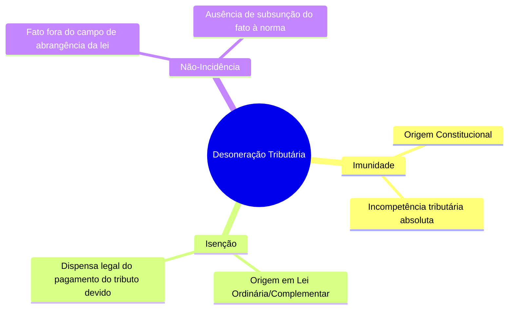

*   **Imunidade:** Limitação constitucional ao poder de tributar. A Constituição retira a competência dos entes para instituir tributos sobre determinados fatos, pessoas ou bens.
*   **Não-Incidência:** Situação que se encontra fora do campo de abrangência da lei instituidora do tributo. O fato ocorre no mundo real, mas não se subsume à hipótese de incidência da norma tributária.

@@@
## Isenções, Imunidades e Conceitos Fundamentais

No âmbito do Direito Tributário, a não cobrança de um tributo pode decorrer de diferentes institutos jurídicos. É fundamental compreender a distinção precisa entre a **Não Incidência**, a **Isenção**, a **Imunidade** e a **Alíquota Zero**.

### Quadro Comparativo dos Institutos de Desoneração

| Instituto | Definição Jurídica | Competência Tributária | Relação com a Obrigação Tributária (OT) e Crédito Tributário (CT) |
| :--- | :--- | :--- | :--- |
| **Não Incidência** | Ausência de previsão legal para a tributação. | O ente federativo possui a competência, mas opta por **não exercê-la** sobre determinado fato. | Não há ocorrência de Fato Gerador (FG), logo não nasce a OT. |
| **Isenção** | Dispensa **legal** do pagamento do tributo. | O ente possui competência, edita a lei tributária, mas uma lei posterior dispensa o pagamento. | Há a ocorrência do Fato Gerador e nasce a OT, mas a lei **impede o lançamento**, obstando a constituição do CT. |
| **Imunidade** | Limitação constitucional ao poder de tributar. | Altera o desenho da competência tributária, tornando o ente **incompetente** para tributar. | Trata-se de uma **cláusula pétrea**. Não há incidência por determinação da Constituição Federal. |
| **Alíquota Zero** | Redução da alíquota ao patamar nulo por razões de política econômica. | O ente possui competência e a exerce plenamente. | O Fato Gerador ocorre normalmente (há incidência), mas a OT decorrente, por uma **questão de cálculo**, resulta em valor nulo. |

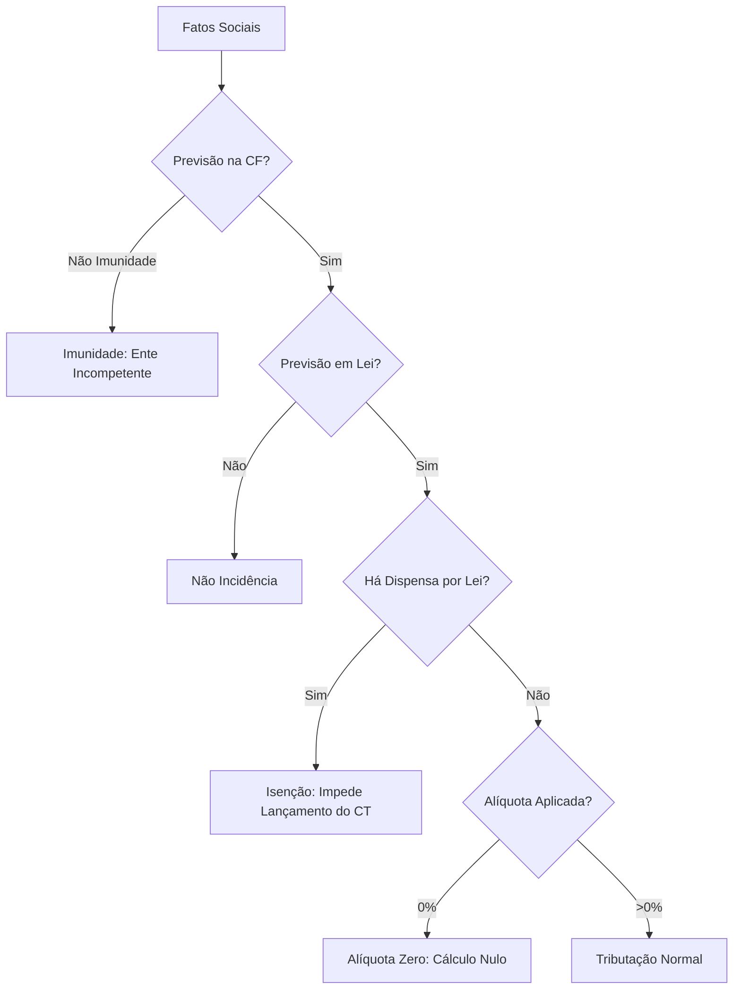

> ### ⚠️ Atenção Jurisprudencial (STJ - REsp 1.518.209)
> O Superior Tribunal de Justiça consolidou o entendimento de que o reconhecimento da imunidade tributária implica a **não incidência** do imposto e possui **efeitos retroativos (efeito *ex tunc*)**. Isso ocorre porque o ato administrativo que reconhece a imunidade tem caráter meramente **declaratório** (reconhece um direito preexistente na Constituição) e não constitutivo.

---

@@@
## Imunidade Recíproca

Prevista no **Artigo 150, VI, "a" da Constituição Federal**, a imunidade recíproca proíbe a União, os Estados, o Distrito Federal e os Municípios de instituírem **impostos** sobre o patrimônio, a renda ou os serviços uns dos outros.

### Regra de Ouro da Imunidade Recíproca
> A imunidade recíproca aplica-se **unicamente** às hipóteses em que o ente político figure na relação jurídica como **contribuinte de direito**.

### Extensão a Autarquias e Fundações Públicas
*   **Regra Geral (Art. 150, §2º, CF):** A imunidade estende-se às autarquias e fundações instituídas e mantidas pelo Poder Público, no que se refere ao patrimônio, à renda e aos serviços **vinculados às suas finalidades essenciais** ou delas decorrentes.
*   **Exceções e Limitações (Art. 150, §3º, CF):** O benefício **não se aplica** ao patrimônio, à renda e aos serviços:
    1. Relacionados com a **exploração de atividades econômicas** regidas pelas normas aplicáveis a empreendimentos privados.
    2. Em que haja contraprestação ou pagamento de **preços ou tarifas** pelo usuário.
    3. Não exonera o **promitente comprador** da obrigação de pagar imposto relativamente ao bem imóvel (regra aplicável também à Administração Direta da União, Estados, DF e Municípios).

#### Jurisprudência Correlata:
*   **Súmula 583 do STF:** O promitente comprador de imóvel residencial transcrito em nome de autarquia é contribuinte do IPTU.
*   **STF (RE 727.851/20):** **Não incide IPVA** sobre veículo automotor adquirido, mediante alienação fiduciária, por pessoa jurídica de direito público.

### Aplicação a Empresas Públicas e Sociedades de Economia Mista
As empresas públicas (EP) e sociedades de economia mista (SEM) podem gozar de imunidade tributária sob condições estritas estabelecidas pelo Supremo Tribunal Federal:

*   **Requisito de Atividade:** Devem ser prestadoras de **serviço público obrigatório e exclusivo** (de Estado). O patrimônio, rendas ou serviços devem estar estritamente vinculados a essas finalidades essenciais (**STF, RE 407.099**).
*   **Verificação Jurisdicional:** A concessão do benefício depende sempre de análise judicial do caso concreto, não bastando a mera constatação objetiva da propriedade estatal.
*   **Monopólio Estatal:** É **irrelevante** a existência ou não de monopólio estatal para a caracterização da imunidade, desde que o serviço seja exclusivo e não concorrencial.
    *   *Exemplos de entidades imunes reconhecidas pelo STF:* ECT (Empresa Brasileira de Correios e Telégrafos), CMB (Casa da Moeda do Brasil), Infraero, Codesp, Caerd, Serpro.
*   **Vedação ao Lucro:** A imunidade **não abrange** as entidades que desempenham atividade econômica com o objetivo de lucro (**STF, RE 253.472**).
*   **Arrendamento a Terceiros (STF, RE 594.015/2017):** A imunidade recíproca **não se estende** à empresa privada arrendatária de imóvel público quando esta for exploradora de atividade econômica com fins lucrativos. Nessa situação, é **constitucional** a cobrança de IPTU pelo Município (Caso Petrobras).

### O Caso Especial da OAB e suas Caixas de Assistência
A Ordem dos Advogados do Brasil (OAB) goza de imunidade recíproca por desempenhar atividade própria de Estado.
*   **STF (RE 405.267/2018):** A **Caixa de Assistência dos Advogados (CAA)** está protegida pela imunidade recíproca prevista no art. 150, VI, "a", da CF. O STF firmou o entendimento de que é impossível conceder tratamento tributário diferenciado a órgãos da OAB com base nas finalidades específicas que lhes são atribuídas por lei.

---

@@@
## Imunidade Religiosa

A Constituição Federal, no **Artigo 150, VI, "b"**, veda a instituição de **impostos** sobre **templos de qualquer culto**.

### Alcance e Requisitos
*   **Art. 150, §4º, CF:** A imunidade compreende **somente** o patrimônio, a renda e os serviços relacionados com as **finalidades essenciais** das entidades religiosas.
*   **Natureza do Benefício:** Trata-se de uma imunidade **incondicional** (não depende de requisitos fixados em lei complementar para sua fruição) e deve receber uma interpretação **ampla e finalística**.

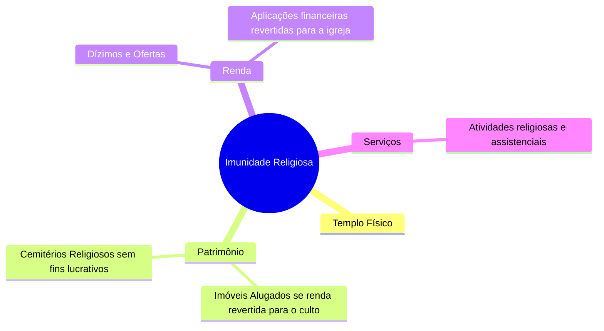

### Jurisprudência Temática (STF)

*   **Cemitérios (RE 578.562):** Os cemitérios **sem fins lucrativos** que se dediquem exclusivamente a serviços religiosos e funerários são **imunes ao IPTU**. O benefício não se estende a cemitérios particulares que visem ao lucro.
*   **Maçonaria (RE 562.351):** A imunidade é restrita aos templos de cultos religiosos. **Não se aplica à Maçonaria**, uma vez que suas lojas não professam uma religião propriamente dita.
*   **Súmula Vinculante 52:** Ainda que alugado a terceiros, permanece imune ao IPTU o imóvel pertencente a templos de qualquer culto, **desde que** o valor dos aluguéis seja integralmente aplicado nas atividades para as quais tais entidades foram constituídas.

---

@@@
## Imunidade Institucional

O **Artigo 150, VI, "c" da Constituição Federal** proíbe a instituição de **impostos** sobre o patrimônio, a renda ou os serviços de:
1. Partidos políticos, inclusive suas fundações;
2. Entidades sindicais dos **trabalhadores**;
3. Instituições de educação sem fins lucrativos;
4. Instituições de assistência social sem fins lucrativos.

### Limitação de Escopo (Art. 150, §4º, CF)
Assim como na imunidade religiosa, o benefício compreende **somente** o patrimônio, a renda e os serviços relacionados com as **finalidades essenciais** dessas entidades.

> ### 🚨 Pegadinha de Prova Comum
> As bancas examinadoras costumam estender essa imunidade aos "sindicatos patronais" ou "sindicatos de empregadores", ou utilizar o termo genérico "entidades sindicais". A Constituição Federal é expressa: a imunidade beneficia **apenas** as entidades sindicais dos **trabalhadores**.

### Requisitos para Instituições de Educação e Assistência Social (EAS)
Para usufruírem da imunidade, as instituições de educação e de assistência social devem atender aos requisitos previstos em **Lei Complementar**, atualmente dispostos no **Artigo 14 do Código Tributário Nacional (CTN)**:

1. **Ausência de Finalidade Lucrativa:** Não distribuírem qualquer parcela de seu patrimônio ou de suas rendas, a qualquer título;
2. **Aplicação Nacional:** Aplicarem integralmente, no território nacional, os seus recursos na manutenção de seus objetivos institucionais;
3. **Escrituração Contábil:** Manterem escrituração de suas receitas e despesas em livros revestidos de formalidades capazes de assegurar sua exatidão.

*   **Suspensão do Benefício (Art. 14, §1º, CTN):** Na falta de cumprimento de qualquer desses requisitos, a autoridade administrativa competente pode suspender a aplicação do benefício.

### Jurisprudência Aplicável às Instituições de Educação e Assistência Social

*   **Previdência Privada (Súmula 730 do STF):** A imunidade só alcança as entidades de previdência privada **fechada** se **não houver contribuição dos beneficiários** (ou seja, quando custeadas integralmente pelo patrocinador). Logo, é inaplicável a entidades públicas de previdência.
*   **Sistema S (RE 235.737 do STF):** Estão protegidas pela imunidade as escolas de ensino profissionalizante mantidas pelos Serviços Sociais Autônomos, como o **SENAC** e o **SENAI**.
*   **Atividades Correlatas (RE 116.188 do STF):** Sendo o **SESC** uma instituição de assistência social, goza de imunidade tributária mesmo quando realiza prestação de serviços de diversão pública (como exibições de cinema) mediante a cobrança de ingressos.
*   **Ensino de Idiomas (STF):** O ensino de línguas estrangeiras caracteriza-se como atividade educacional, permitindo a aplicação da imunidade tributária.

### Entidades Beneficentes de Assistência Social (EBAS)
O **Artigo 195, § 7º da Constituição Federal** estabelece que são isentas (termo técnico-constitucional que a doutrina e a jurisprudência classificam como **imunidade**) de contribuição para a seguridade social as entidades beneficentes de assistência social que atendam às exigências estabelecidas em lei.

*   **Requisitos por Lei Complementar (STF, RE 566.622/2017):** Os requisitos para o gozo da imunidade das EBAS e das EAS devem estar previstos necessariamente em **Lei Complementar** (especificamente o art. 14 do CTN).
*   **Natureza do CEBAS (STJ, Súmula 612/2018):** O Certificado de Entidade Beneficente de Assistência Social (CEBAS), no prazo de sua validade, possui **natureza declaratória** para fins tributários. Desse modo, seus efeitos retroagem à data em que a entidade demonstrou o cumprimento dos requisitos estabelecidos por lei complementar para a fruição da imunidade.
*   **Equiparação de Entidades Religiosas (STF, RE 630.790/22):** As entidades religiosas foram **equiparadas** às instituições de assistência social para fins de fruição da imunidade das contribuições de seguridade social (art. 195, § 7º, CF).

---

@@@
## Jurisprudências (Todos os Casos)

Consolidação de entendimentos do Supremo Tribunal Federal aplicáveis de forma geral às imunidades subjetivas (recíproca, religiosa e institucional):

*   **Estacionamentos (STF, RE 144.900):** A imunidade tributária **inclui** os rendimentos obtidos com a exploração de serviços de estacionamento por entidades imunes, desde que a receita seja revertida para suas finalidades essenciais.
*   **Locação de Imóveis (STF, Súmula Vinculante 52):** O imóvel pertencente a qualquer das entidades imunes, ainda que alugado a terceiros, permanece imune ao IPTU, desde que o valor dos aluguéis seja aplicado nas atividades para as quais tais entidades foram constituídas.
*   **Contribuinte de Direito vs. Contribuinte de Fato:**
    *   **Imunidade do Contribuinte de Direito (STF, RE 186.175):** Se o contribuinte de **direito** goza de imunidade pessoal, o benefício constitucional é aplicável mesmo que o encargo econômico seja transferido para outra pessoa (contribuinte de "fato").
        *   *Exemplo:* O SESC produz (incidência de IPI) máquinas para venda (incidência de ICMS). Independentemente de quem seja o comprador, haverá imunidade, pois o SESC é o contribuinte de direito.
    *   **Imunidade do Contribuinte de Fato (STF, RE 202.987):** Se apenas o contribuinte de **fato** goza de imunidade pessoal, o benefício **não é aplicável** se o tributo tiver como contribuinte de direito uma pessoa não imune.
        *   *Exemplo:* Um partido político (imune) deve pagar o ICMS embutido na conta de energia elétrica de seus imóveis, pois a contribuinte de direito do imposto é a concessionária de energia (não imune).
*   **Incidência de IOF (STF, RE 611.510/21):** A imunidade assegurada pelo art. 150, VI, "c", da CF/88 alcança o Imposto sobre Operações Financeiras (IOF), **inclusive** o incidente sobre aplicações financeiras realizadas pelas entidades protegidas.

---

@@@
## Imunidade Cultural

O **Artigo 150, VI, "d" da Constituição Federal** veda a instituição de **impostos** sobre **livros, jornais, periódicos e o papel destinado a sua impressão**.

### Natureza Objetiva da Imunidade
Trata-se de uma imunidade de caráter estritamente **objetivo (real)**, pois protege a coisa (o veículo de informação) e não a pessoa.
*   **Não extensão subjetiva:** O benefício **não se estende** às editoras, aos autores, às empresas jornalísticas ou às agências de publicidade.
*   **Não extensão de tributos:** A imunidade restringe-se a **impostos**. Não alcança as contribuições para a seguridade social (como PIS, COFINS e CSLL) nem incide sobre "serviços de composição gráfica" (sujeitos ao ISS).

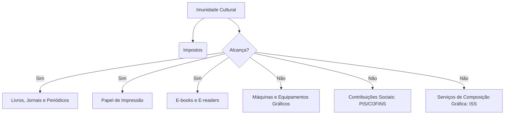

### Jurisprudência Temática (STF)

*   **Livros Eletrônicos (Súmula Vinculante 57):** A imunidade aplica-se à importação e à comercialização, no mercado interno, do **livro eletrônico (e-book)** e dos suportes exclusivamente utilizados para fixá-los, como os leitores de livros eletrônicos (**e-readers**), ainda que estes possuam funcionalidades acessórias (como dicionários ou conexão à internet).
*   **Insumos de Impressão (Súmula 657 do STF):** A imunidade abrange os **filmes e papéis fotográficos** necessários à publicação de jornais e periódicos.
*   **Outros Materiais e Tintas (STF, ARE 1.100.204):** O benefício estende-se a qualquer material assimilável ao papel utilizado no processo de impressão e à própria **tinta especial para jornal**. Contudo, **não é aplicável** aos equipamentos e máquinas do parque gráfico.
*   **Fascículos e Componentes Eletrônicos (STF, RE 595.676):** A imunidade **alcança componentes eletrônicos** destinados exclusivamente a integrar unidades didáticas que acompanham fascículos impressos.
*   **Qualidade e Conteúdo (STF, RE 221.239):** O legislador constituinte não fez ressalvas quanto ao valor artístico ou didático, à relevância das informações divulgadas ou à qualidade cultural da publicação para a concessão do benefício.
    *   *Estão abrangidos:* Álbuns de figurinhas, apostilas de estudo e jogos de estratégia com cartas (*collectible card games*).
*   **Propaganda e Encartes:**
    *   A veiculação de propagandas comerciais em **listas telefônicas** não elimina a imunidade do periódico.
    *   **Não estão abrangidos** os encartes com finalidade exclusivamente comercial (panfletos de ofertas), mesmo quando inseridos e distribuídos dentro de jornais.

### P E C DA M ÚSI CA
A Emenda Constitucional nº 75/2013 inseriu a alínea "e" ao inciso VI do art. 150 da Constituição Federal, criando uma nova vertente da imunidade cultural. Ela veda a instituição de impostos sobre fonogramas e videofonogramas musicais produzidos no Brasil contendo obras musicais ou literomusicais de autores brasileiros, bem como os suportes materiais ou arquivos digitais que os contenham, salvo na etapa de replicação industrial de mídias ópticas de leitura a laser.

---

## Flashcards Didáticos (Estilo CEBRASPE)

### Julgue os itens a seguir em Certo (C) ou Errado (E):

1. **( )** O ato administrativo que reconhece a imunidade tributária possui natureza declaratória, o que possibilita a retroação de seus efeitos à data em que a entidade preencheu os requisitos legais.
   * **Resposta: Certo.** Conforme entendimento do STF e do STJ (Súmula 612), o ato tem efeito declaratório e, portanto, opera efeitos retroativos (*ex tunc*).

2. **( )** É constitucional a cobrança de IPTU sobre imóvel público arrendado a empresa privada concessionária que explora atividade econômica com fins lucrativos.
   * **Resposta: Certo.** O STF (RE 594.015/2017) definiu que a imunidade recíproca não se estende a empresas privadas arrendatárias de imóveis públicos que explorem atividade econômica lucrativa.

3. **( )** As lojas maçônicas fazem jus à imunidade tributária conferida aos templos de qualquer culto, tendo em vista o caráter filosófico e espiritual de suas reuniões.
   * **Resposta: Errado.** O STF (RE 562.351) assentou que a imunidade religiosa é restrita aos templos de cultos religiosos, não se aplicando à maçonaria.

4. **( )** A imunidade das instituições de assistência social prevista no art. 150, VI, "c" da CF abrange o IOF incidente sobre suas aplicações financeiras.
   * **Resposta: Certo.** O STF (RE 611.510/21) pacificou que a imunidade das entidades de assistência social alcança o IOF, inclusive sobre aplicações financeiras.

5. **( )** A imunidade cultural do papel destinado à impressão de livros e periódicos estende-se às máquinas rotativas e demais equipamentos que compõem o parque gráfico das editoras.
   * **Resposta: Errado.** Conforme o ARE 1.100.204 do STF, a imunidade alcança o papel, materiais assimiláveis e a tinta especial, mas não se aplica aos equipamentos do parque gráfico.

### Imunidade Cultural dos Fonogramas e Videofonogramas (Art. 150, VI, "e", CF)

A Constituição Federal estabelece uma importante limitação ao poder de tributar conhecida popularmente como a **"PEC da Música"**. De acordo com esse dispositivo, é **vedado** à União, aos Estados, ao Distrito Federal e aos Municípios instituir **impostos** sobre:

*   **Fonogramas e videofonogramas musicais** produzidos no Brasil que contenham:
    *   Obras de autores brasileiros; OR
    *   Obras em geral (mesmo de autores estrangeiros), desde que interpretadas por artistas brasileiros.
*   **Suportes materiais** (como CDs e DVDs) ou **arquivos digitais** (como downloads e streamings) que contenham essas obras.

> ⚠️ **Exceção Importante (Pegadinha de Prova):** 
> Essa imunidade **não se aplica** na etapa de **replicação industrial de mídias ópticas de leitura a laser** (ou seja, a fabricação física de CDs/DVDs em si). Essa exceção visa preservar a competitividade das indústrias instaladas na Zona Franca de Manaus.

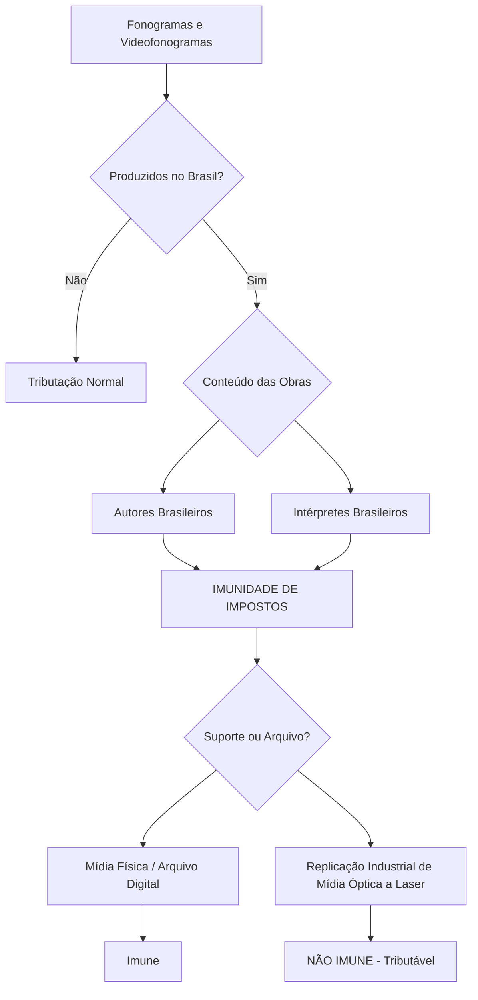

---

@@@
## Outros Casos de Imunidade

Além das imunidades tradicionais, a Constituição Federal e a legislação correlata preveem diversas hipóteses de desoneração tributária (imunidades, gratuidades e não incidências) aplicáveis a situações específicas. O quadro abaixo detalha essas hipóteses e os respectivos tributos afastados:

| Situação / Direito Protegido | Tributo Afastado | Natureza / Observação |
| :--- | :--- | :--- |
| **Direito de petição** e obtenção de **certidões** junto a órgãos públicos | **Taxas** | Garantia constitucional de gratuidade. |
| Celebração do **casamento civil** | **Taxas** | Isenção/gratuidade de custas cartorárias. |
| **Ação Popular** (salvo comprovada má-fé do autor) | **Custas Judiciais** (Taxas) | Incentivo ao controle social e à cidadania. |
| Registro civil de **nascimento** e certidão de **óbito** (para os reconhecidamente pobres) | **Taxas** | Gratuidade garantida por lei aos hipossuficientes. |
| Atos necessários ao exercício da **cidadania** (ex: *Habeas Corpus* e *Habeas Data*) | **Taxas** | Gratuidade universal (independe de comprovação de pobreza). |
| Produtos ou serviços destinados à **exportação** | **IPI + ICMS + ISS** | Desoneração das exportações para garantir competitividade externa. |
| **Pequenas glebas rurais**, desde que exploradas pelo proprietário que não possua outro imóvel | **ITR** | Função social da propriedade e estímulo à agricultura familiar. |
| **Ouro**, quando definido em lei como **ativo financeiro** ou instrumento cambial | **Todos os impostos, exceto IOF** | Incidência exclusiva do IOF na fonte (alíquota mínima de 1%). |
| Destinação de **petróleo** (inclusive lubrificantes, combustíveis líquidos/gasosos derivados) e **energia elétrica** destinados a **outros Estados** | **ICMS** | O imposto pertence ao Estado de destino (consumo), não ao de origem. |
| Serviços de **comunicação de recepção livre e gratuita** (rádio e TV aberta) | **ICMS** | Proteção à liberdade de informação e difusão cultural. |
| Destinação de **energia elétrica**, serviços de **telecomunicações**, **derivados de petróleo**, combustíveis e minerais do País | **Todos os impostos, exceto II, IE e ICMS** | Limitação constitucional à criação de impostos monofásicos/especiais. |
| Transmissão de bens ou direitos incorporados ao patrimônio de PJ para **integralização de capital**, ou decorrentes de **fusão, incorporação, cisão ou extinção** | **ITBI** | **Exceção:** Não há imunidade se a atividade preponderante do adquirente for a compra/venda desses bens, locação de imóveis ou arrendamento mercantil. |
| Transferência de imóveis desapropriados para fins de **Reforma Agrária** | **Todos os Impostos** | Desoneração total para viabilizar a distribuição de terras. |
| Proventos de **aposentadoria e pensão** concedidos pelo Regime Geral de Previdência Social (**RGPS**) | **Contribuição Previdenciária** | **Atenção:** No Regime Próprio (**RPPS**), há incidência sobre o que superar o teto! |
| Receitas decorrentes da **exportação** de bens e serviços | **CIDE** | Imunidade de contribuições de intervenção no domínio econômico. |

---

### 📝 Flashcards (Estilo CEBRASPE)

**Questão 1:** A imunidade do ITBI sobre a transmissão de bens imóveis para incorporação ao patrimônio de pessoa jurídica em realização de capital é absoluta, aplicando-se mesmo que a atividade preponderante da empresa adquirente seja a locação de imóveis.
*( ) Certo  ( ) Errado*

> **Gabarito: Errado.** 
> *Justificativa:* A própria Constituição traz uma exceção expressa: a imunidade **não** se aplica se a atividade preponderante do adquirente for a compra e venda desses bens ou direitos, a locação de bens imóveis ou o arrendamento mercantil.

**Questão 2:** O ouro, quando caracterizado como ativo financeiro ou instrumento cambial, sujeita-se exclusivamente à incidência do Imposto sobre Operações Financeiras (IOF), estando imune aos demais impostos.
*( ) Certo  ( ) Errado*

> **Gabarito: Certo.** 
> *Justificativa:* Trata-se de imunidade condicionada à natureza do ouro (ativo financeiro/cambial), restando apenas a competência da União para instituir o IOF sobre a operação.

---

@@@
## Repartição de Receitas Tributárias

A repartição de receitas consiste na transferência de recursos arrecadados por um ente federativo em favor de outro, visando equilibrar as finanças da Federação.

### Regras de Retenção e Condicionamento

Como regra geral, é **vedada a retenção ou qualquer restrição** à entrega dos recursos constitucionalmente devidos aos Estados, ao Distrito Federal e aos Municípios. No entanto, a Constituição Federal abre **duas exceções** que permitem à União e aos Estados condicionarem a entrega desses repasses:

1.  **Pagamento de Créditos:** Ao pagamento de seus créditos tributários e não tributários, inclusive de suas autarquias;
2.  **Mínimos Constitucionais da Saúde:** À comprovação da aplicação mínima de recursos em ações e serviços públicos de saúde.

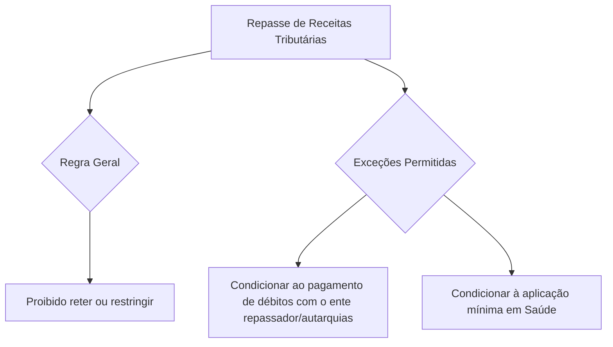

### Jurisprudência Relevante do STF e STJ

> ⚖️ **STF (RE 705.423) - Impacto dos Incentivos Fiscais:**
> É **ilegítima** a pretensão de municípios receberem valores que, em decorrência de incentivos fiscais (como isenções ou reduções de alíquotas concedidas pela União), não foram efetivamente recolhidos. Os entes federados de menor grau apenas têm direito ao percentual daquilo que foi **efetivamente arrecadado**, e não sobre uma potencial arrecadação teórica.

> ⚖️ **STJ (Súmula 447) - Legitimidade do IRRF de Servidores:**
> Os Estados e o Distrito Federal são partes **legítimas** para figurar no polo passivo de ações que visem à restituição de Imposto de Renda Retido na Fonte (IRRF) proposto por seus servidores públicos. 
> *Consequência Processual:* A ação de repetição de indébito deve ser proposta perante a **Justiça Estadual**, uma vez que o produto da arrecadação desse imposto pertence diretamente ao Estado/DF (conforme o art. 157, I, da CF).

---

@@@
## Legislação Tributária

De acordo com o **Art. 96 do Código Tributário Nacional (CTN)**, a expressão "legislação tributária" possui caráter amplo e compreende:

*   **Leis** (em sentido amplo, incluindo Emendas Constitucionais, Leis Complementares, Leis Ordinárias, Leis Delegadas e Medidas Provisórias);
*   **Tratados e Convenções Internacionais**;
*   **Decretos** regulamentares;
*   **Normas Complementares** que versem, no todo ou em parte, sobre tributos e relações jurídicas a eles pertinentes.

> ⚠️ **Atenção para a Prova:**
> A **doutrina** e a **jurisprudência** **NÃO** são consideradas fontes formais do Direito Tributário, embora influenciem diretamente a aplicação e a interpretação das normas.

### Atos Normativos
São atos dotados de **generalidade** e **abstração**, editados pela administração pública para detalhar a aplicação das leis.

---

### O Princípio da Reserva Legal (Art. 97, CTN)

O princípio da legalidade estrita determina que **somente a lei** (em sentido formal) pode estabelecer as seguintes matérias:

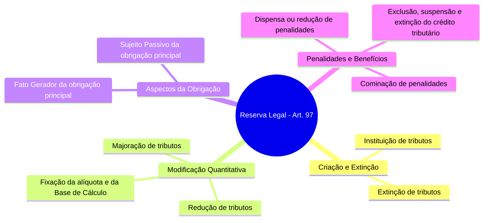

*   **§ 1º - Equiparação à Majoração:** Equipara-se à majoração do tributo a modificação de sua base de cálculo que importe em torná-lo **mais oneroso** para o contribuinte.
*   **§ 2º - Atualização Monetária:** **Não constitui majoração** de tributo a simples **atualização monetária** do valor de sua base de cálculo (correção monetária por índices oficiais).

> 💡 **Não Sujeitos à Reserva Legal (Exceções Práticas):**
> *   A definição do fato gerador de **obrigações acessórias** (pode ser feita por normas complementares).
> *   A fixação do **prazo para recolhimento** do tributo (pode ser estabelecida por decreto).

---

### Lei Complementar em Matéria Tributária

A Constituição Federal reserva matérias de extrema relevância para serem disciplinadas exclusivamente por **Lei Complementar (LC)**.

#### 1. Instituição de Tributos Específicos
*   **Empréstimos Compulsórios** (EC);
*   **Imposto sobre Grandes Fortunas** (IGF);
*   **Impostos Residuais** da União;
*   **Contribuições Sociais Residuais** da Seguridade Social.

#### 2. Normas Gerais e Conflitos
*   Dirimir **conflitos de competência** em matéria tributária entre a União, os Estados, o Distrito Federal e os Municípios;
*   Regular as **limitações constitucionais** ao poder de tributar;
*   Estabelecer **normas gerais** sobre:
    *   Definição de tributos e de suas espécies;
    *   Em relação aos impostos previstos na CF, a definição de seus **fatos geradores, bases de cálculo e contribuintes** (*Cuidado: a fixação de alíquotas ordinárias NÃO é matéria de lei complementar geral!*);
    *   Obrigação tributária, lançamento, crédito, prescrição e decadência;
    *   Adequado tratamento tributário ao ato cooperativo praticado pelas sociedades cooperativas;
    *   Tratamento diferenciado e favorecido para as Microempresas (ME) e Empresas de Pequeno Porte (EPP), incluindo regimes unificados (como o Simples Nacional - LC 123/06);
    *   Critérios especiais de tributação para prevenir desequilíbrios da concorrência.

#### 3. Critérios de Repartição de Receitas
*   Definição do **valor adicionado** para fins de repartição do ICMS pertencente aos Municípios;
*   Estabelecimento de normas sobre a entrega e repartição do **IPI** e do **IR**;
*   Acompanhamento, cálculo e liberação dos valores devidos aos entes beneficiários.

---

### Tratados e Convenções Internacionais (Art. 98, CTN)

O procedimento de integração de um tratado internacional ao ordenamento jurídico brasileiro segue o seguinte fluxo:

```mermaid
chronology
    title Fluxo de Integração de Tratados Internacionais
    Assinatura pelo Presidente da República : Representação do Estado soberano
    Aprovação pelo Congresso Nacional : Por meio de Decreto Legislativo (DL)
    Promulgação pelo Presidente da República : Por meio de Decreto Presidencial
    Publicação no Diário Oficial da União : Início da vigência interna
```

#### Regra de Conflito (Art. 98, CTN)
Os tratados e as convenções internacionais **modificam ou revogam a legislação tributária interna**, e serão observados pela legislação que lhes sobrevenha.

*   **Divergência Doutrinária Importante:**
    *   *Para o CTN:* As leis internas posteriores devem, obrigatoriamente, respeitar os tratados internacionais firmados anteriormente (superioridade do tratado).
    *   *Para a Doutrina e STF:* Aplica-se o critério da cronologia. Lei posterior pode revogar ou modificar tratado anterior, pois os tratados ingressam no ordenamento com força de **Lei Ordinária**.
*   **Isenções Heterônomas:** Os tratados internacionais celebrados pela União **podem conceder isenções** de tributos estaduais e municipais. Isso não viola a vedação às isenções heterônomas (art. 151, III, CF), pois a União atua como representação do Estado Soberano (República Federativa do Brasil) perante o direito internacional.

> ⚖️ **Súmula 575 do STF:**
> À mercadoria importada de país signatário do GATT/ALALC estende-se a isenção do ICMS concedida a similar nacional.

---

### Decretos (Art. 99, CTN)

O conteúdo e o alcance dos **decretos** restringem-se estritamente aos limites das leis em função das quais sejam expedidos (função regulamentar). Eles não podem criar direitos, obrigações, isenções ou penalidades não previstos na lei originária.

---

### Normas Complementares (Art. 100, CTN)

As normas complementares são atos administrativos de caráter secundário que visam detalhar a aplicação da legislação tributária.

> 🛡️ **Garantia de Boa-Fé (Art. 100, Parágrafo Único):**
> A observância de uma norma complementar pelo contribuinte **exclui a imposição de penalidades (multas)**, a cobrança de **juros de mora** e a **atualização monetária** da base de cálculo, caso a norma venha a ser posteriormente modificada ou declarada ilegal.

#### Espécies e Vigência das Normas Complementares (Art. 103, CTN)

| Espécie de Norma Complementar | Definição / Características | Momento de Entrada em Vigor |
| :--- | :--- | :--- |
| **Atos Normativos** | Portarias, instruções normativas, circulares expedidas pelas autoridades administrativas. Possuem caráter geral e abstrato. | Na data de sua **publicação**. |
| **Decisões Administrativas** | Decisões de órgãos singulares ou coletivos de jurisdição administrativa a que a lei atribua eficácia normativa (ex: decisões do CARF com efeito vinculante). | **30 dias após** a data de sua publicação. |
| **Práticas Reiteradas** | Práticas reiteradamente observadas pelas autoridades administrativas (costumes administrativos). | Imediatamente (na data de sua adoção/existência). |
| **Convênios** | Acordos celebrados entre a União, Estados, DF e Municípios (não necessitam de aprovação legislativa prévia). | Na **data neles prevista**. |

---

### 📝 Flashcards (Estilo CEBRASPE)

**Questão 1:** A atualização do valor monetário da base de cálculo de um imposto configura majoração tributária, exigindo a edição de lei em sentido estrito.
*( ) Certo  ( ) Errado*

> **Gabarito: Errado.** 
> *Justificativa:* Conforme o art. 97, § 2º do CTN, a simples atualização monetária da base de cálculo não constitui majoração do tributo, podendo ser realizada por ato do Poder Executivo (Decreto).

**Questão 2:** O contribuinte que pautar sua conduta com base em prática reiteradamente observada pela administração tributária estará protegido contra a cobrança de multas e juros de mora, caso o fisco altere seu entendimento posteriormente.
*( ) Certo  ( ) Errado*

> **Gabarito: Certo.** 
> *Justificativa:* As práticas reiteradas são normas complementares (art. 100, III, CTN). Sua observância de boa-fé exclui a aplicação de penalidades, juros e correção monetária (art. 100, parágrafo único).

---

@@@
## Vigência e Extraterritorialidade da Legislação Tributária

A vigência determina o período e o espaço em que a norma tributária é válida e apta a produzir efeitos jurídicos.

### Regra Geral (Art. 101, CTN)
A vigência da legislação tributária no espaço e no tempo rege-se pelas disposições gerais da **Lei de Introdução às Normas do Direito Brasileiro (LINDB)**, salvo as exceções expressas previstas no CTN.

> ⚖️ **STJ (REsp 855.175) - Leis Dependentes de Regulamentação:**
> No caso de leis que necessitam de regulamentação para sua aplicação prática, a sua eficácia plena opera-se apenas **após a entrada em vigor do respectivo decreto ou regulamento**. O regulamento retira a lei de seu estado estático, sendo lícito que ele estabeleça o termo inicial (*termo a quo*) de incidência do tributo.

---

### Vigência no Espaço (Territorialidade e Extraterritorialidade)

Como regra geral, a legislação tributária de um ente federativo (Estado, DF ou Município) vigora apenas dentro dos limites de seu próprio território (**princípio da territorialidade**).

No entanto, o **Art. 102 do CTN** prevê a possibilidade de **extraterritorialidade**, ou seja, a aplicação da lei de um ente fora de suas fronteiras territoriais, em três situações específicas:

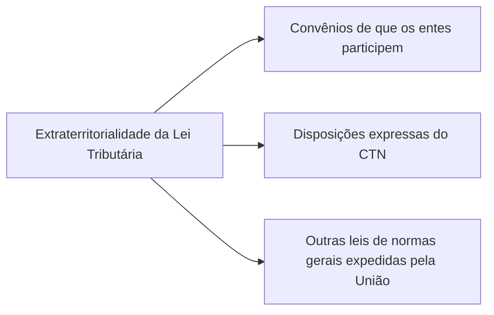

---

### Vigência no Tempo (Art. 104, CTN)

O artigo 104 do CTN traz uma regra especial de vigência para dispositivos de lei que **extinguem ou reduzem isenções** relativos a **impostos sobre o patrimônio** (ex: IPTU, IPVA, ITCMD, ITR) ou **sobre a renda** (IR).

*   **Regra de Entrada em Vigor:** Entram em vigor no **primeiro dia do exercício seguinte** àquele em que ocorreu a sua publicação.
*   **Exceções à Regra:**
    *   Se a própria lei dispuser de maneira **mais favorável** ao contribuinte (postergando ainda mais a vigência);
    *   Se enquadrar-se no disposto no **Art. 178 do CTN** (isenções concedidas por prazo certo ou sob determinadas condições onerosas não podem ser revogadas livremente a qualquer tempo).

> 📊 **Exemplo Prático:**
> Se uma lei que extingue uma isenção de Imposto de Renda Pessoa Física (IRPF) for publicada em **10/08/2017**, essa extinção (e consequente tributação) só passará a produzir efeitos a partir de **01/01/2018** (primeiro dia do exercício seguinte).

---

@@@
## Aplicação da Legislação Tributária

A aplicação da legislação tributária define como as normas se relacionam com os fatos geradores ocorridos no tempo.

### Princípio da Irretroatividade (Art. 105, CTN)
A legislação tributária aplica-se imediatamente aos **fatos geradores futuros** e aos **fatos geradores pendentes** (aqueles cuja ocorrência se prolonga no tempo e ainda não se completou). Trata-se da consagração do princípio da irretroatividade das leis: a lei nova não retroage para alcançar fatos geradores já consumados (passados).

---

### Exceções de Retroatividade (Art. 106, CTN)

A lei tributária poderá ser aplicada a ato ou fato **pretérito** (retroatividade) nas seguintes hipóteses taxativas:

#### I - Em Qualquer Caso (Art. 106, I)
Quando a lei for **expressamente interpretativa**, ou seja, quando vier apenas para esclarecer o sentido de uma lei anterior obscura, **excluindo-se**, contudo, a aplicação de qualquer **penalidade** ao contribuinte que tenha interpretado a norma antiga de forma diversa.

@@@
## Aplicação da Legislação Tributária e Retroatividade Benigna

A regra geral que rege o Direito Tributário é a **irretroatividade** da lei, o que significa que a lei tributária se aplica a fatos geradores ocorridos após a sua entrada em vigor. No entanto, o Código Tributário Nacional (CTN) estabelece exceções importantes a essa regra, permitindo a aplicação da lei a atos pretéritos, desde que se trate de **ato não definitivamente julgado**.

Essa possibilidade de aplicação retroativa de uma lei mais benéfica é conhecida como **retroatividade benigna** (Art. 106, II, do CTN).

### Hipóteses de Retroatividade Benigna

A lei aplica-se a ato ou fato pretérito, tratando-se de ato não definitivamente julgado, nas seguintes situações:

*   **Deixar de definir o ato como infração:** Quando a nova lei deixa de considerar determinada conduta como uma infração tributária.
*   **Cominar penalidade menos severa:** Quando a nova lei reduz a penalidade (multa) aplicável a uma infração já existente.
*   **Deixar de tratar o ato como contrário a qualquer exigência de ação ou omissão:** Quando a norma deixa de exigir um comportamento (fazer ou deixar de fazer algo), desde que o ato praticado **não tenha sido fraudulento** e **não tenha implicado falta de pagamento de tributo devido**.

> ⚠️ **Atenção de Prova:**
> A Constituição Federal de 1988 (CF/88) não prevê expressamente exceções à irretroatividade tributária. Essa previsão de retroatividade benigna é uma criação infraconstitucional trazida exclusivamente pelo **Código Tributário Nacional (CTN)**.

---

### 🧠 Flashcards (Certo ou Errado)

**Questão 1:** A lei tributária que comine penalidade menos severa a uma infração aplica-se a fatos pretéritos, mesmo que o ato já tenha sido definitivamente julgado na esfera administrativa.
*( ) Certo  ( ) Errado*

> **Gabarito: Errado.**
> **Justificativa:** A retroatividade benigna exige, obrigatoriamente, que o ato **não esteja definitivamente julgado**. Se houver decisão definitiva, a lei nova mais benéfica não poderá retroagir para alterar a penalidade.

**Questão 2:** A retroatividade de lei tributária mais benéfica que deixa de tipificar uma conduta como infração é uma garantia expressamente prevista no texto da Constituição Federal de 1988.
*( ) Certo  ( ) Errado*

> **Gabarito: Errado.**
> **Justificativa:** A CF/88 prevê apenas a regra da irretroatividade. As exceções de retroatividade benigna em matéria tributária estão previstas no **CTN** (Art. 106).

---

@@@
## Integração e Interpretação da Legislação Tributária

No estudo do Direito Tributário, é fundamental distinguir dois processos aplicados à legislação: a **Integração** (utilizada para suprir lacunas na lei) e a **Interpretação** (utilizada para extrair o real significado e alcance da norma existente).

### Integração da Legislação Tributária (Art. 108 do CTN)

Quando houver **ausência de disposição expressa** (lacuna na lei), a autoridade administrativa ou o julgador deve integrar a legislação utilizando, **sucessivamente e na ordem indicada**, os seguintes métodos:

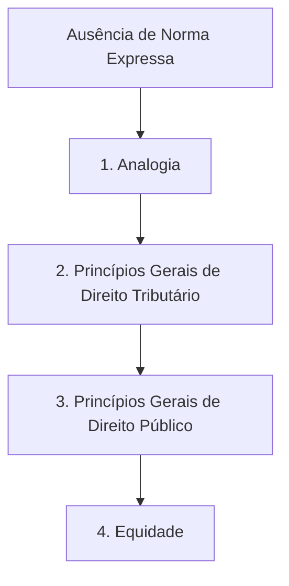

1.  **Analogia:** Aplicação de uma norma que regula caso semelhante.
    *   *Vedação:* É expressamente proibido o uso da analogia para **exigir tributo não previsto em lei** ou para **estender isenção**.
2.  **Princípios Gerais de Direito Tributário:** Utilização de diretrizes fundamentais do próprio ramo tributário (ex: princípio do não-confisco, princípio da não-surpresa).
3.  **Princípios Gerais de Direito Público:** Aplicação de princípios que regem a Administração Pública e o Estado (ex: contraditório, ampla defesa, impessoalidade).
4.  **Equidade:** Aplicação de critérios de justiça e igualdade ao caso concreto.
    *   *Vedação:* É proibido utilizar a equidade para **dispensar o pagamento de tributo devido**. No entanto, é perfeitamente possível utilizá-la para "amortecer" o rigor de uma norma ou penalidade, desde que não resulte em dispensa do tributo.

---

### Interpretação da Legislação Tributária

A interpretação jurídica pode ser classificada de acordo com o resultado alcançado pelo intérprete:

*   **Restritiva:** O aplicador do direito limita o alcance da norma, reduzindo a sua amplitude prática.
*   **Declaratória:** O intérprete conclui que o texto literal da lei reflete exatamente a real intenção do legislador.
*   **Extensiva:** O intérprete amplia os efeitos da norma para abranger situações não expressas literalmente, mas que guardam a mesma razão de ser. No Direito Tributário, a interpretação extensiva é **permitida**, exceto nos casos em que a lei exige interpretação literal.

---

### Interpretação Literal (Art. 111 do CTN)

O CTN determina que certas matérias devem ser interpretadas de forma estritamente **literal**. Nesses casos, é **vedada a analogia**, embora seja permitida a ponderação de elementos sistemáticos, finalísticos e históricos para compreender o texto.

Devem ser interpretadas **literalmente** as leis que disponham sobre:

*   **Suspensão do Crédito Tributário:** Para memorizar as hipóteses de suspensão, utiliza-se o mnemônico clássico **MorDeR e LimPar**:
    *   **Mor**atória
    *   **De**pósito do montante integral
    *   **R**eclamações e recursos (processo administrativo tributário)
    *   **Lim**inar em Mandado de Segurança (ou em outra ação judicial)
    *   **Par**celamento
*   **Exclusão do Crédito Tributário:** Hipóteses de **Isenção** e **Anistia**.
    *   *Entendimento do STJ (REsp 44.495):* A outorga de isenção revela um juízo de conveniência política do legislador, sendo, portanto, insuscetível de controle ou ampliação por parte do Poder Judiciário.
*   **Dispensa do cumprimento de obrigações acessórias.**

---

### Interpretação Benéfica (Art. 112 do CTN)

A lei que define **infrações** ou comina **penalidades** deve ser interpretada da maneira **mais favorável ao acusado** (princípio do *in dubio pro reo*), sempre que houver **dúvida** quanto aos seguintes aspectos:

*   Capitulação legal do fato (enquadramento da conduta);
*   Punibilidade;
*   Natureza ou circunstâncias materiais do fato;
*   Autoria;
*   Natureza da penalidade ou extensão de seus efeitos;
*   Imputabilidade;
*   Graduação da penalidade.

> ⚠️ **Pegadinha de Prova:**
> A interpretação benéfica aplica-se **exclusivamente** a infrações e penalidades. Ela é **inaplicável** em casos de dúvida sobre a incidência de **juros de mora** ou sobre a definição de **alíquotas** de tributos.

---

### 🧠 Flashcards (Certo ou Errado)

**Questão 1:** Na ausência de disposição expressa, a autoridade tributária pode utilizar a equidade para dispensar o contribuinte do pagamento de tributo, desde que comprovada sua hipossuficiência econômica.
*( ) Certo  ( ) Errado*

> **Gabarito: Errado.**
> **Justificativa:** O Art. 108, § 2º, do CTN veda expressamente o emprego da equidade para dispensar o pagamento de tributo devido.

**Questão 2:** A lei que outorga isenção tributária deve ser interpretada literalmente, sendo vedado ao Poder Judiciário estender o benefício a situações não previstas expressamente pelo legislador.
*( ) Certo  ( ) Errado*

> **Gabarito: Certo.**
> **Justificativa:** Conforme o Art. 111, II, do CTN, a exclusão do crédito tributário (onde se insere a isenção) exige interpretação literal. O STJ confirma que a concessão de isenção é ato de conveniência política, imune à ampliação judicial.

---

@@@
## Uso do Direito Privado

O Direito Tributário não existe em isolamento; ele frequentemente utiliza conceitos e institutos originários do Direito Privado (Direito Civil e Comercial) para estruturar suas normas. No entanto, existem limites claros para essa interação.

### Pesquisa de Conceitos vs. Efeitos Tributários (Art. 109 do CTN)

Os princípios gerais de direito privado são utilizados para a **pesquisa da definição, do conteúdo e do alcance** de seus institutos, conceitos e formas. 

Contudo, o Direito Tributário possui autonomia para definir os **efeitos tributários** decorrentes desses institutos.

> **Exemplo Prático:**
> O conceito de "doação" ou "compra e venda" é buscado no Direito Civil. No entanto, as consequências fiscais (quais tributos incidem, alíquotas, isenções) dessas operações são determinadas soberanamente pela legislação tributária.

### Limitação ao Legislador Tributário (Art. 110 do CTN)

A lei tributária **não pode alterar** a definição, o conteúdo e o alcance de institutos, conceitos e formas de direito privado que tenham sido utilizados, de maneira expressa ou implícita, pela **Constituição Federal**, pelas **Constituições Estaduais** ou pelas **Leis Orgânicas Municipais** para definir ou limitar competências tributárias.

> **Exemplo de Proteção Constitucional:**
> Se a Constituição Federal outorga aos Municípios a competência para instituir imposto sobre a "propriedade" (IPTU), a lei tributária municipal não pode redefinir o conceito civil de "propriedade" para fazer incidir o imposto sobre a mera detenção física ou posse precária que não configurem propriedade nos termos do direito privado.

---

@@@
## Obrigação Tributária

A relação jurídica tributária se materializa por meio da **obrigação tributária**, que se divide em duas espécies: obrigação principal e obrigação acessória.

### Obrigação Principal (Art. 113, § 1º)

*   **Fato Gerador:** Surge com a ocorrência do fato gerador previsto em lei.
*   **Objeto:** Tem natureza patrimonial. Seu objeto é o **pagamento de tributo** ou de **penalidade pecuniária** (multa).
*   **Extinção:** Extingue-se juntamente com o crédito tributário dela decorrente.
*   **Fonte/Origem:** Decorre estritamente da **LEI** (princípio da legalidade).

> **Fato Gerador da Obrigação Principal (Art. 114):** É a situação definida em lei como necessária e suficiente para dar início à obrigação de pagar.

---

### Obrigação Acessória (Art. 113, §§ 2º e 3º)

*   **Objeto:** Tem caráter instrumental. Consiste em **prestações positivas ou negativas** (fazer ou não fazer algo) que visam facilitar a arrecadação e a fiscalização dos tributos (ex: emitir nota fiscal, apresentar declaração de informações).
*   **Conversão em Principal:** Pelo simples fato de sua **inobservância** (descumprimento), a obrigação acessória **converte-se em obrigação principal** relativamente à **penalidade pecuniária** (a obrigação de fazer vira obrigação de pagar multa).
*   **Fonte/Origem:** Decorre da **legislação tributária** (termo mais amplo que abrange leis, decretos, portarias e instruções normativas).

> **Fato Gerador da Obrigação Acessória (Art. 115):** Qualquer situação que, nos termos da legislação aplicável, imponha a prática ou a abstenção de um ato que não seja o pagamento do tributo em si.

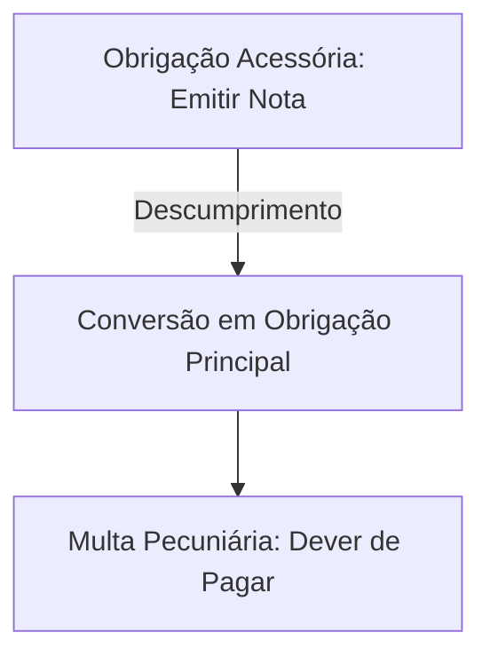

> **Entendimento do STF (RE 580.211):**
> A regulação das obrigações acessórias foi delegada à legislação em sentido lato. Portanto, deveres instrumentais podem ser disciplinados por meio de **decretos e normas complementares**, desde que estejam sempre vinculados e limitados ao que estabelece a lei.

---

### Quadro Comparativo: Obrigação Principal vs. Obrigação Acessória

| Característica | Obrigação Principal | Obrigação Acessória |
| :--- | :--- | :--- |
| **Objeto** | Pagamento (tributo ou multa) | Prestações de fazer ou não fazer |
| **Caráter** | Patrimonial / Pecuniário | Instrumental / Fiscalizatório |
| **Origem** | Estritamente a **Lei** | **Legislação** (sentido amplo) |
| **Inadimplemento** | Gera cobrança de juros e execução | Converte-se em obrigação principal (multa) |

---

### 🧠 Flashcards (Certo ou Errado)

**Questão 1:** O descumprimento de uma obrigação acessória extingue o dever instrumental e faz surgir uma obrigação principal correspondente à multa pecuniária devida.
*( ) Certo  ( ) Errado*

> **Gabarito: Certo.**
> **Justificativa:** Conforme o Art. 113, § 3º, do CTN, a inobservância da obrigação acessória a converte em obrigação principal relativamente à penalidade pecuniária.

**Questão 2:** Por força do princípio da legalidade estrita, as obrigações acessórias somente podem ser instituídas e disciplinadas por meio de lei em sentido estrito (ordinária ou complementar).
*( ) Certo  ( ) Errado*

> **Gabarito: Errado.**
> **Justificativa:** O STF (RE 580.211) fixou que as obrigações acessórias podem ser disciplinadas por atos infralegais (decretos, instruções normativas), desde que amparados e vinculados à lei.

---

@@@
## Fato Gerador

O fato gerador é o evento do mundo real que, ao coincidir exatamente com a hipótese descrita na lei, faz nascer a obrigação tributária.

### Abstração da Validade Jurídica (Art. 118 do CTN)

A definição legal do fato gerador deve ser interpretada de forma **objetiva**, abstraindo-se (desconsiderando-se):

1.  **A validade jurídica dos atos efetivamente praticados:** Não importa se o negócio jurídico é nulo, anulável ou se a atividade é ilícita. É a consagração do princípio do ***pecunia non olet*** (o dinheiro não tem cheiro).
2.  **Os efeitos dos fatos efetivamente ocorridos.**

> **Exemplo Prático:**
> O auferimento de renda decorrente do jogo do bicho ou do tráfico de drogas está sujeito à incidência do Imposto de Renda, pois a ilegalidade da atividade não afasta a ocorrência do fato gerador (obter acréscimo patrimonial).

---

### Momento da Ocorrência do Fato Gerador (Art. 116 do CTN)

Salvo disposição de lei em contrário, considera-se ocorrido o fato gerador e existentes os seus efeitos:

*   **Situação de FATO:** Desde o momento em que se verifiquem as **circunstâncias materiais** necessárias para que produza os efeitos que normalmente lhe são próprios.
*   **Situação JURÍDICA:** Desde o momento em que esteja **definitivamente constituída**, segundo as normas do direito aplicável.

---

### Atos ou Negócios Jurídicos Condicionais (Art. 117 do CTN)

Tratando-se de situações jurídicas, os atos ou negócios condicionais reputam-se perfeitos e acabados:

*   Sob **Condição Suspensiva:** Considera-se ocorrido o fato gerador apenas a partir do momento do seu **implemento** (Mnemônico: **S-IM** -> **S**uspensiva / **IM**plemento).
*   Sob **Condição Resolutória:** Considera-se ocorrido o fato gerador desde o momento da **prática do ato** ou celebração do negócio (Mnemônico: **RES-P** -> **RES**olutória / **P**rática).

---

### Planejamento Tributário: Elisão, Evasão e Elusão

O contribuinte pode buscar formas de reduzir sua carga tributária. No entanto, a legitimidade dessas condutas varia perante a lei:

| Conceito | Natureza | Momento | Descrição |
| :--- | :--- | :--- | :--- |
| **Elisão** | Lícita (Permitida) | **Antes** do Fato Gerador | Planejamento tributário legítimo. O contribuinte utiliza meios legais para evitar ou reduzir a ocorrência do fato gerador. |
| **Evasão** | Ilícita (Proibida) | **Após** o Fato Gerador | Prática fraudulenta para ocultar a ocorrência do fato gerador que já aconteceu, visando não pagar o tributo. |
| **Elusão** | Ilícita (Abuso de Forma) | **Simultâneo/Prévio** | Também chamada de elisão ineficaz. O contribuinte simula um negócio jurídico para dissimular o verdadeiro fato gerador. |

> **Norma Geral Anti-Elisão (Art. 116, Parágrafo Único):**
> A autoridade administrativa tem o poder de **desconsiderar** atos ou negócios jurídicos praticados com a finalidade de dissimular (ocultar) a ocorrência do fato gerador ou a natureza dos elementos da obrigação tributária, devendo observar os procedimentos regulados por lei ordinária.

---

### 🧠 Flashcards (Certo ou Errado)

**Questão 1:** Sob a ótica do princípio do *pecunia non olet*, a nulidade de um contrato de compra e venda de imóvel não impede a cobrança do imposto de transmissão correspondente, caso o negócio tenha produzido efeitos fáticos.
*( ) Certo  ( ) Errado*

> **Gabarito: Certo.**
> **Justificativa:** O Art. 118, I, do CTN determina que a definição do fato gerador é interpretada abstraindo-se da validade jurídica dos atos efetivamente praticados.

**Questão 2:** Um negócio jurídico celebrado sob condição resolutória considera-se perfeito e gerador de efeitos tributários apenas quando a referida condição se realizar.
*( ) Certo  ( ) Errado*

> **Gabarito: Errado.**
> **Justificativa:** Sob condição resolutória (Mnemônico **RES-P**), o ato reputa-se perfeito e acabado desde a sua **prática**, e não do implemento da condição (este último aplica-se à condição suspensiva - **S-IM**).

---

@@@
## Sujeitos da Relação Tributária

A relação jurídica tributária é composta por dois polos bem definidos: o sujeito ativo (credor) e o sujeito passivo (devedor).

### Sujeito Ativo (Art. 119 do CTN)

O **sujeito ativo** é a pessoa jurídica de **direito público** titular da competência para exigir o cumprimento da obrigação tributária.

*   **Desmembramento Territorial (Art. 120):** Se uma pessoa jurídica de direito público se constituir pelo desmembramento territorial de outra, ela se **sub-roga** nos direitos da entidade original. A legislação tributária da entidade antiga continuará sendo aplicada **até que entre em vigor** a legislação própria da nova entidade.

---

### Sujeito Passivo (Art. 121 do CTN)

O **sujeito passivo da obrigação principal** é a pessoa (física ou jurídica) obrigada ao pagamento do tributo ou da penalidade pecuniária. Ele divide-se em duas categorias:

1.  **Contribuinte:** Quando possui uma relação **pessoal e direta** com a situação que constitui o fato gerador.
    *   *Contribuinte de Direito:* É aquele que tem a obrigação legal de recolher o tributo aos cofres públicos.
    *   *Contribuinte de Fato:* É quem suporta o encargo financeiro (econômico) do tributo, muito comum nos tributos indiretos (como o ICMS embutido no preço final das mercadorias). O contribuinte de fato não faz parte da relação jurídica formal com o fisco.
2.  **Responsável:** Quando, mesmo sem ser o contribuinte, sua obrigação decorre de **expressa disposição de LEI** (e não de mera legislação). O responsável deve, obrigatoriamente, guardar alguma relação (vínculo) com o contribuinte ou com o fato gerador.

> **Sujeito Passivo da Obrigação Acessória (Art. 122):** É a pessoa obrigada às prestações que constituem o seu objeto (deveres de fazer ou não fazer).

---

### Inoponibilidade de Convenções Particulares (Art. 123 do CTN)

Salvo disposição de lei em contrário, os acordos e contratos privados (convenções particulares) relativos à responsabilidade pelo pagamento de tributos **não podem ser opostos à Fazenda Pública** para modificar a definição legal do sujeito passivo.

> **Exemplo Prático:**
> Em um contrato de locação, o locador (proprietário) e o locatário (inquilino) podem acordar que o inquilino pagará o IPTU. Contudo, perante a Prefeitura, o sujeito passivo continua sendo o proprietário. Se o imposto não for pago, o fisco cobrará do proprietário, cabendo a este acionar o inquilino regressivamente na justiça comum.

---

### 🧠 Flashcards (Certo ou Errado)

**Questão 1:** O contribuinte de fato é aquele que, por possuir relação pessoal e direta com o fato gerador, figura no polo passivo da relação jurídica tributária formal perante o fisco.
*( ) Certo  ( ) Errado*

> **Gabarito: Errado.**
> **Justificativa:** O contribuinte de fato apenas suporta o ônus econômico do tributo (ex: consumidor final). Quem figura na relação jurídica formal com o fisco é o contribuinte de direito.

**Questão 2:** Cláusula contratual que transfere a responsabilidade pelo pagamento do IPVA ao comprador de um veículo desonera imediatamente o antigo proprietário perante a Fazenda Pública Estadual.
*( ) Certo  ( ) Errado*

> **Gabarito: Errado.**
> **Justificativa:** Pelo Art. 123 do CTN, as convenções particulares não podem ser opostas à Fazenda Pública para alterar a definição legal do sujeito passivo.

---

@@@
## Capacidade Tributária Passiva

A capacidade tributária passiva diz respeito à aptidão de figurar no polo passivo da obrigação tributária e pagar tributos.

De acordo com o **Art. 126 do CTN**, a capacidade tributária passiva **independe**:

*   Da **capacidade civil** das pessoas naturais (físicas). Menores de idade, interditos ou incapazes possuem capacidade tributária passiva normal.
*   De achar-se a pessoa sujeita a medidas que importem **privação ou limitação** do exercício de atividades civis, comerciais ou profissionais (ex: falidos, réus presos ou profissionais com registro suspenso).
*   De estar a pessoa jurídica **regularmente constituída**, bastando que configure uma **unidade econômica ou profissional** (ex: sociedades de fato, "camelôs" ou filiais irregulares).

---

### 🧠 Flashcards (Certo ou Errado)

**Questão 1:** Um menor de 10 anos de idade que herde um bem imóvel não possui capacidade tributária passiva para figurar como sujeito passivo do IPTU, devendo o imposto ser lançado em nome de seus pais.
*( ) Certo  ( ) Errado*

> **Gabarito: Errado.**
> **Justificativa:** A capacidade tributária passiva independe da capacidade civil (Art. 126, I). O menor é o sujeito passivo (contribuinte), embora seja representado ou assistido por seus pais para a prática dos atos.

---

@@@
## Solidariedade

A solidariedade ocorre quando mais de um devedor está obrigado ao pagamento da totalidade da dívida tributária.

> ⚠️ **Nota Importante:**
> No Direito Tributário, **não existe solidariedade ativa** (vários credores para o mesmo fato gerador), pois isso configuraria bitributação ou conflito de competência. A solidariedade tributária é sempre **passiva** (coobrigação de devedores).

### Hipóteses de Solidariedade (Art. 124 do CTN)

São solidariamente obrigadas:

1.  **Interesse Comum:** As pessoas que tenham interesse comum na situação que constitua o fato gerador da obrigação principal.
2.  **Designação por Lei:** As pessoas expressamente designadas por **lei** (em sentido estrito).

> **Inexistência de Benefício de Ordem:**
> A solidariedade tributária **não comporta benefício de ordem**. Isso significa que o fisco não precisa cobrar primeiro do devedor principal para depois cobrar dos demais; ele pode exigir a dívida toda de qualquer um dos coobrigados, à sua escolha.

> **Súmula/Entendimento do STJ (REsp 834.044):**
> O simples fato de empresas pertencerem ao mesmo grupo econômico não gera, por si só, a responsabilidade solidária automática. A solidariedade não se presume; ela deve decorrer sempre de lei expressa ou da comprovação de interesse comum no fato gerador.

---

### Efeitos da Solidariedade (Art. 125 do CTN)

Os efeitos decorrentes da solidariedade passiva são:

*   **Pagamento:** O pagamento efetuado por um dos coobrigados **aproveita (desonera) os demais**.
*   **Isenção ou Remissão:**
    *   *Regra Geral (Objetiva):* A isenção ou remissão concedida de forma geral exonera todos os devedores.
    *   *Exceção (Subjetiva):* Se outorgada pessoalmente a apenas um dos devedores, subsiste a solidariedade quanto aos demais pelo **saldo remanescente** (deduzida a quota do exonerado).
*   **Prescrição:** A interrupção da prescrição, em favor ou contra um dos coobrigados, **favorece ou prejudica os demais**.

---

### 🧠 Flashcards (Certo ou Errado)

**Questão 1:** O coobrigado solidário que for acionado pelo fisco para pagar um débito tributário tem o direito de exigir que a cobrança seja direcionada primeiramente ao contribuinte principal.
*( ) Certo  ( ) Errado*

> **Gabarito: Errado.**
> **Justificativa:** A solidariedade tributária não comporta benefício de ordem (Art. 124, parágrafo único), permitindo ao fisco cobrar a totalidade da dívida de qualquer um dos devedores.

**Questão 2:** A interrupção do prazo prescricional operada contra um dos devedores solidários prejudica todos os demais coobrigados.
*( ) Certo  ( ) Errado*

> **Gabarito: Certo.**
> **Justificativa:** Conforme o Art. 125, III, do CTN, a interrupção da prescrição contra um devedor solidário estende seus efeitos aos demais.

---

@@@
## Domicílio Tributário

O domicílio tributário é o local eleito ou determinado por lei onde o contribuinte deve cumprir suas obrigações e onde o fisco realizará as notificações e fiscalizações.

### Regra Geral e Regras Subsidiárias (Art. 127 do CTN)

A regra de ouro é a **liberdade de eleição** pelo contribuinte. Na falta de eleição de domicílio pelo sujeito passivo, aplicam-se as seguintes regras subsidiárias:

| Tipo de Sujeito Passivo | Regra Subsidiária (Falta de Eleição) | Em caso de impossibilidade das anteriores |
| :--- | :--- | :--- |
| **Pessoa Física (Natural)** | 1. Sua residência habitual; ou <br>2. Sendo esta incerta/desconhecida, o centro habitual de suas atividades. | O lugar da **situação dos bens** ou da **ocorrência dos atos ou fatos** que deram origem à obrigação tributária. |
| **Pessoa Jurídica de Direito Privado** | A sua sede, ou cada estabelecimento individualizado em relação aos fatos geradores ali ocorridos. | O lugar da **situação dos bens** ou da **ocorrência dos atos ou fatos** que deram origem à obrigação tributária. |
| **Pessoa Jurídica de Direito Público** | Qualquer de suas repartições situadas no território da entidade tributante. | O lugar da **situação dos bens** ou da **ocorrência dos atos ou fatos** que deram origem à obrigação tributária. |

### Recusa do Domicílio Eleito (Art. 127, § 2º)

A autoridade administrativa **pode recusar** o domicílio tributário eleito pelo contribuinte se verificar que a escolha **impossibilita ou dificulta** as atividades de arrecadação ou fiscalização. 

*   *Requisito:* A recusa por parte do fisco deve ser obrigatoriamente **motivada**.

---

### 🧠 Flashcards (Certo ou Errado)

**Questão 1:** Se o contribuinte eleger um domicílio tributário que dificulte o trabalho de fiscalização, o fisco poderá recusá-lo de ofício, sem necessidade de apresentar motivação formal para o ato.
*( ) Certo  ( ) Errado*

> **Gabarito: Errado.**
> **Justificativa:** A recusa do domicílio eleito pela autoridade administrativa é perfeitamente possível, mas exige, obrigatoriamente, decisão motivada (Art. 127, § 2º).

**Questão 2:** No caso de uma pessoa jurídica de direito privado com múltiplas filiais, na falta de eleição de domicílio, considera-se domicílio tributário cada estabelecimento em relação aos fatos geradores que nele ocorrerem.
*( ) Certo  ( ) Errado*

> **Gabarito: Certo.**
> **Justificativa:** É a aplicação literal do Art. 127, II, do CTN para pessoas jurídicas de direito privado.

## DOMICÍLIO TRIBUTÁRIO E AUTONOMIA DOS ESTABELECIMENTOS

De acordo com o entendimento consolidado do Superior Tribunal de Justiça (STJ), por meio do julgamento conjunto do **REsp 23.371** e do **AREsp 192.652**, é perfeitamente possível que uma pessoa jurídica possua múltiplos domicílios tributários. 

Sob essa ótica, cada estabelecimento da empresa (seja a matriz ou cada uma de suas filiais) é considerado uma unidade autônoma para fins de obrigações tributárias. Essa autonomia operacional e jurídica gera efeitos práticos importantes:

*   **Independência de Certidões:** Cada filial ou matriz tem o direito de solicitar e obter de forma isolada a sua Certidão Negativa de Débitos (CND) ou a Certidão Positiva com Efeitos de Negativa (CPEN).
*   **Isolamento de Pendências:** A existência de irregularidades fiscais na matriz ou em determinada filial não pode ser utilizada pelo fisco como impeditivo para a emissão de certidões de regularidade em favor de outro estabelecimento do mesmo grupo que esteja com suas obrigações em dia.

> ⚠️ **Atenção (Garantia de Defesa):** O STJ também firmou o entendimento de que o envio de notificações fiscais para endereço diverso daquele formalmente registrado como domicílio tributário do sujeito passivo configura **cerceamento de defesa**, gerando a nulidade do ato de comunicação.

---

@@@
## RESPONSABILIDADE TRIBUTÁRIA

A responsabilidade tributária ocorre quando a obrigação de pagar o tributo é transferida para uma pessoa que não realizou diretamente o fato gerador, mas que possui alguma relação com a situação jurídica correspondente.

De acordo com o **Artigo 128 do Código Tributário Nacional (CTN)**, a atribuição dessa responsabilidade deve seguir critérios estritos:

1.  **Exigência de Lei:** A transferência do encargo deve ser feita por meio de lei, de forma expressa.
2.  **Vínculo com o Fato Gerador:** O terceiro escolhido pela lei para figurar como responsável deve possuir uma ligação clara com a situação que originou a obrigação tributária.
3.  **Efeitos sobre o Contribuinte:** A lei pode determinar:
    *   A **exclusão** completa da responsabilidade do contribuinte original.
    *   A atribuição da obrigação ao contribuinte em **caráter supletivo** (subsidiário), respondendo pelo cumprimento total ou parcial caso o responsável principal não o faça.

### Classificação da Responsabilidade Tributária

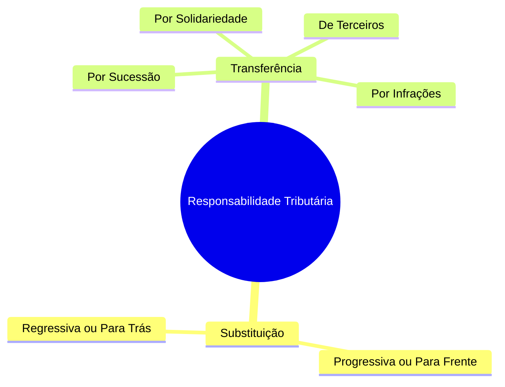

---

@@@
## RESPONSABILIDADE POR SUBSTITUIÇÃO

Na substituição tributária, a lei define, desde o momento da ocorrência do fato gerador (ou até mesmo antes dele), que uma terceira pessoa ocupará o polo passivo da obrigação, substituindo integralmente o contribuinte que realizou a operação.

> ⚖️ **Decisão STJ (REsp 1.028.716):** Se o substituto tributário deixar de calcular e recolher o ICMS em razão de uma decisão judicial (mandamental) favorável ao substituído, ele não será responsabilizado pelo pagamento do tributo, desde que fique comprovada a ausência de culpa ou dolo em sua conduta.

### Substituição Tributária Progressiva (ou "Para Frente")

Prevista no **Artigo 150, § 7º, da Constituição Federal**, permite que a lei atribua a um sujeito passivo a responsabilidade pelo pagamento de imposto ou contribuição cujo fato gerador ocorrerá em momento posterior.

*   **Mecanismo:** O tributo é calculado e recolhido de forma antecipada, com base em uma estimativa (fato gerador presumido).
*   **Garantia Constitucional:** Caso o fato gerador presumido não venha a se realizar na prática, é assegurada ao contribuinte a **imediata e preferencial restituição** dos valores pagos antecipadamente.

> 💡 **Jurisprudência Vinculante do STF (RE 593.849/2016):** É devida a restituição da diferença do ICMS pago a mais no regime de substituição tributária para a frente se a base de cálculo real (efetiva) da operação for inferior à base de cálculo presumida que foi utilizada para o recolhimento antecipado.

### Substituição Tributária Regressiva (ou "Para Trás")

Também conhecida como diferimento, ocorre quando o recolhimento do tributo é adiado para uma etapa posterior da cadeia econômica. O sujeito que adquire a mercadoria ou o serviço assume a responsabilidade de recolher o tributo devido pelas operações anteriores.

*   **Exemplo Prático:** Pequenos produtores rurais de gado vendem seus insumos para um grande frigorífico. Devido à falta de estrutura contábil e fiscal desses pequenos produtores dispersos, a legislação determina que o frigorífico adquirente seja o responsável por reter e recolher o tributo correspondente a essa primeira etapa da cadeia. Essa medida simplifica e viabiliza a fiscalização por parte do Estado.

---

@@@
## RESPONSABILIDADE POR TRANSFERÊNCIA

Diferentemente da substituição, na responsabilidade por transferência a obrigação tributária nasce na figura do contribuinte original, mas, em decorrência de um evento posterior previsto em lei, o dever de pagar é deslocado para um terceiro (o sucessor).

O **Artigo 129 do CTN** estabelece o alcance temporal dessa responsabilidade. Ela se aplica aos créditos tributários:

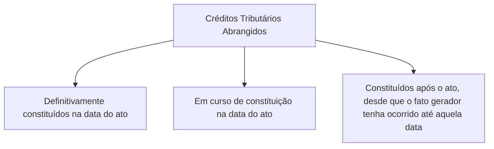

### Sucessão de Bens Imóveis (Artigo 130 do CTN)

Os créditos tributários decorrentes de impostos que tenham como fato gerador a propriedade, o domínio útil ou a posse de bens imóveis (como o IPTU e o ITR), bem como as taxas de serviços correlatas e as contribuições de melhoria (CM), sub-rogam-se na pessoa do adquirente.

*   **Regra Geral:** O adquirente do imóvel assume pessoalmente a responsabilidade por todos os débitos tributários pendentes vinculados ao bem, **ainda que o montante da dívida supere o valor de mercado do próprio imóvel**.
*   **Exceção 1 (Prova de Quitação):** A sub-rogação pessoal não ocorre se constar no título de transferência a prova de quitação dos tributos, representada pela apresentação da Certidão Negativa de Débitos (CND).
*   **Exceção 2 (Arrematação Judicial):** No caso de aquisição do imóvel em hasta pública (leilão judicial), ocorre a chamada **sub-rogação real**. Os débitos tributários anteriores à venda sub-rogam-se sobre o preço da arrematação, eximindo o arrematante de cobranças futuras.

> ⚖️ **Entendimentos do STJ sobre Hasta Pública:**
> *   **REsp 166.975 (Regra):** Se o valor obtido na arrematação judicial for insuficiente para liquidar a totalidade dos débitos tributários do imóvel, o arrematante **não** responde pelo saldo devedor remanescente.
> *   **REsp 1.114.111 (Exceção):** Caso o edital do leilão traga **menção expressa** de que o arrematante assumirá os débitos condominiais e tributários pendentes, a responsabilidade pelo pagamento integral desses valores é transferida para ele.

### Sucessão de Bens Móveis (Artigo 131, I, do CTN)

Na transmissão de bens móveis (como veículos automotores), o adquirente ou o remitente (aquele que resgata o bem) torna-se **pessoalmente responsável** pelos tributos devidos em relação aos bens adquiridos ou remidos (por exemplo, débitos pendentes de IPVA).

### Sucessão Empresarial (Artigos 132 e 133 do CTN)

A reorganização societária e a alienação de estabelecimentos comerciais possuem regras específicas para evitar a evasão fiscal e garantir o recebimento dos créditos tributários.

> ⚖️ **Súmula 554 do STJ:** Na sucessão empresarial, a responsabilidade da empresa sucessora abrange não apenas os tributos devidos pela sucedida, mas também as multas aplicadas, sejam elas de caráter moratório ou punitivo, referentes a fatos geradores ocorridos até a data da sucessão.

#### Fusão, Incorporação e Transformação (Artigo 132 do CTN)

A pessoa jurídica resultante da operação societária responde integralmente pelos tributos devidos pelas empresas fundidas, incorporadas ou transformadas.

No caso de **Cisão** (regida pela Lei nº 6.404/1976), a responsabilidade varia conforme a modalidade:

*   **Cisão Parcial:** A empresa cindida transfere apenas uma parcela de seu patrimônio para outra já existente ou constituída para esse fim, continuando a existir. A empresa que absorve a parcela responde unicamente pelas obrigações tributárias que lhe foram expressamente transferidas, inexistindo solidariedade automática pelas demais dívidas da cindida.
*   **Cisão Total:** A empresa cindida extingue-se, distribuindo todo o seu patrimônio para duas ou mais sociedades. Nesse cenário, há **responsabilidade solidária** entre todas as empresas que absorveram frações do patrimônio da sociedade extinta.

> ⚠️ **Extinção da Sociedade (Artigo 132, Parágrafo Único):** Quando uma sociedade de pessoas é extinta e a exploração da atividade econômica continua sob a responsabilidade de qualquer sócio remanescente, ou pelo espólio, sob a mesma ou outra razão social, estes assumem a responsabilidade tributária integral.

#### Aquisição de Estabelecimento ou Fundo de Comércio (Artigo 133 do CTN)

A pessoa física ou jurídica que adquirir de outra um fundo de comércio ou estabelecimento comercial, industrial ou profissional, e continuar a exploração da atividade, responderá pelos tributos relativos ao estabelecimento adquirido, conforme as seguintes regras:

| Situação do Alienante (Vendedor) | Tipo de Responsabilidade do Adquirente (Comprador) |
| :--- | :--- |
| **Cessa totalmente** a exploração da atividade econômica. | **Integral:** O adquirente responde sozinho pelos débitos tributários anteriores. |
| **Continua a exercer** atividade ou **inicia nova atividade** (no mesmo ou em outro ramo) dentro do prazo de **6 meses** a contar da alienação. | **Subsidiária:** O adquirente responde apenas se o patrimônio do alienante for insuficiente para quitar os débitos. |

##### Exclusão de Responsabilidade na Alienação Judicial

A responsabilidade do adquirente é **afastada** quando a venda do estabelecimento ou de filiais ocorrer por meio de processo judicial nas seguintes hipóteses:

1.  Processo de **Falência**.
2.  Alienação de filial ou unidade produtiva isolada em processo de **Recuperação Judicial**.

> 🚫 **Cláusula de Ineficácia (Prevenção a Fraudes):** O benefício da exclusão de responsabilidade na alienação judicial **não se aplica** se o adquirente for:
> *   Sociedade controlada pelo devedor falido ou em recuperação, ou que com ele mantenha relação de coligação.
> *   Sócio, parente em linha reta ou colateral até o 4º grau (consanguíneo ou afim) do devedor ou de seus sócios.
> *   Agente ou preposto do falido ou da empresa em recuperação judicial.

*Nota (Artigo 133, § 3º):* O produto financeiro obtido com a alienação judicial do estabelecimento ficará retido à disposição do juízo falimentar pelo prazo de 1 ano, contado da data da venda. Esse montante destina-se prioritariamente ao pagamento dos créditos extraconcursais ou daqueles que legalmente prefiram ao crédito tributário.

### Sucessão Causa Mortis (Artigo 131, II e III, do CTN)

Com o falecimento do contribuinte, a responsabilidade pelo pagamento dos tributos devidos até a data da abertura da sucessão é transferida:

*   Ao **espólio** (representado pelo inventariante), pelos tributos devidos pelo falecido até a data da abertura da sucessão.
*   Aos **herdeiros, legatários ou ao cônjuge meeiro**, após a partilha ou adjudicação, limitando-se a responsabilidade ao montante do quinhão, legado ou meação recebido.

> ⚖️ **Entendimento do STJ (REsp 295.222):** A responsabilidade dos sucessores por débitos do falecido estende-se também às **multas moratórias** devidas até a data do óbito, respeitado sempre o limite do patrimônio transferido.

---

@@@
## RESPONSABILIDADE DE TERCEIROS

A responsabilidade de terceiros decorre do descumprimento de deveres de gestão, administração ou fiscalização de bens alheios. Divide-se em duas situações distintas de atuação:

> ⚖️ **Decisão STF (ADI 4.845/20):** É formalmente inconstitucional qualquer lei estadual que discipline a responsabilidade de terceiros por infrações tributárias de modo divergente das regras gerais fixadas nacionalmente pelo CTN. Estados não podem, por exemplo, imputar responsabilidade automática a advogados, economistas ou correspondentes fiscais fora das hipóteses do código nacional.

### Atuação Regular (Artigo 134 do CTN)

Ocorre quando o terceiro atua dentro dos limites da lei e de seus poderes de gestão, mas, por impossibilidade financeira do contribuinte principal, é chamado a responder pelo débito.

*   **Requisitos:** Impossibilidade de exigência do tributo junto ao contribuinte (caráter subsidiário com benefício de ordem) e participação do terceiro no ato ou omissão que gerou o inadimplemento.
*   **Rol de Responsáveis:**
    *   Pais (pelos tributos devidos pelos filhos menores);
    *   Tutores e curadores (pelos tributos de seus tutelados ou curatelados);
    *   Administradores de bens de terceiros;
    *   Inventariante (pelos tributos devidos pelo espólio);
    *   Administrador judicial/síndico e o comissário (pelos tributos da massa falida ou do concordatário);
    *   Tabeliães, escrivães e demais serventuários da justiça (pelos tributos devidos sobre os atos praticados por eles ou perante eles);
    *   Sócios, exclusivamente no caso de liquidação de sociedade de pessoas (não aplicável às sociedades de capital).

> ⚠️ **Limitação da Responsabilidade:** Na atuação regular (Art. 134), os terceiros respondem apenas pelos **tributos** e pelas **multas moratórias** (atraso). Não respondem por multas de caráter punitivo (infrações).

### Atuação Irregular - Atos Ultra Vires (Artigo 135 do CTN)

Ocorre quando o terceiro age com **excesso de poderes** ou com **infração à lei, contrato social ou estatutos**. Nesse caso, a responsabilidade é **pessoal e exclusiva** do administrador ou representante.

*   **Pessoas Abrangidas:** Os representantes descritos no artigo 134, além de mandatários, prepostos, diretores, gerentes ou representantes de pessoas jurídicas de direito privado.
*   **Requisito de Gestão:** É indispensável que o indivíduo exerça funções de gerência ou representação legal da empresa na data do fato gerador. A mera condição de sócio cotista não atrai essa responsabilidade.

> ⚖️ **Súmulas do STJ sobre Redirecionamento:**
> *   **Súmula 430:** O simples inadimplemento da obrigação tributária pela sociedade empresária não gera, por si só, a responsabilidade solidária do sócio-gerente.
> *   **Súmula 435:** Presume-se dissolvida de forma irregular a empresa que deixa de funcionar no seu domicílio fiscal cadastrado sem comunicar a interrupção de suas atividades aos órgãos competentes. Essa omissão legitima o redirecionamento da execução fiscal para a pessoa física do sócio-gerente.

*   **Abrangência da Cobrança:** Na atuação irregular (Art. 135), o terceiro responde pelo **tributo**, pelas **multas moratórias** e também pelas **multas punitivas** aplicadas em razão da infração.

---

@@@
## RESPONSABILIDADE POR INFRAÇÕES

A responsabilidade por infrações tributárias apresenta natureza predominantemente objetiva, focando na materialidade do descumprimento da legislação.

### Regra Geral: Responsabilidade Objetiva (Artigo 136 do CTN)

Salvo disposição de lei em contrário, a responsabilidade por infrações da legislação tributária **independe da intenção (dolo ou culpa)** do agente, bem como da efetividade, da natureza ou da extensão dos efeitos decorrentes do ato praticado.

### Exceção: Responsabilidade Pessoal do Agente (Artigo 137 do CTN)

A responsabilidade é considerada **pessoal do agente** (excluindo a responsabilidade da pessoa jurídica ou de terceiros) nas seguintes infrações:

1.  Aquelas em que o **dolo específico** do agente seja elemento essencial para a própria caracterização da infração.
2.  Aquelas que decorram direta e exclusivamente de dolo específico das pessoas mencionadas no artigo 135 (representantes, mandatários, diretores).
3.  Infrações tipificadas como **crimes ou contravenções penais**, exceto quando praticadas no exercício regular de administração, mandato, função ou cargo, ou no cumprimento de ordem direta e expressa emitida por autoridade competente.

---

@@@
## DENÚNCIA ESPONTÂNEA

A denúncia espontânea é um benefício fiscal que estimula o contribuinte a regularizar sua situação perante o fisco antes de qualquer iniciativa de cobrança por parte do Estado.

De acordo com o **Artigo 138 do CTN**, a denúncia espontânea da infração **exclui a responsabilidade do agente**, afastando a aplicação de penalidades (multas moratórias e punitivas).

### Requisitos para Configuração

*   Apresentação da denúncia da infração antes do início de qualquer procedimento administrativo ou medida de fiscalização.
*   **Pagamento integral do tributo devido**, acrescido de **juros de mora** e atualização monetária, ou o depósito judicial/administrativo do valor arbitrado pela autoridade fiscal quando o montante depender de apuração prévia.

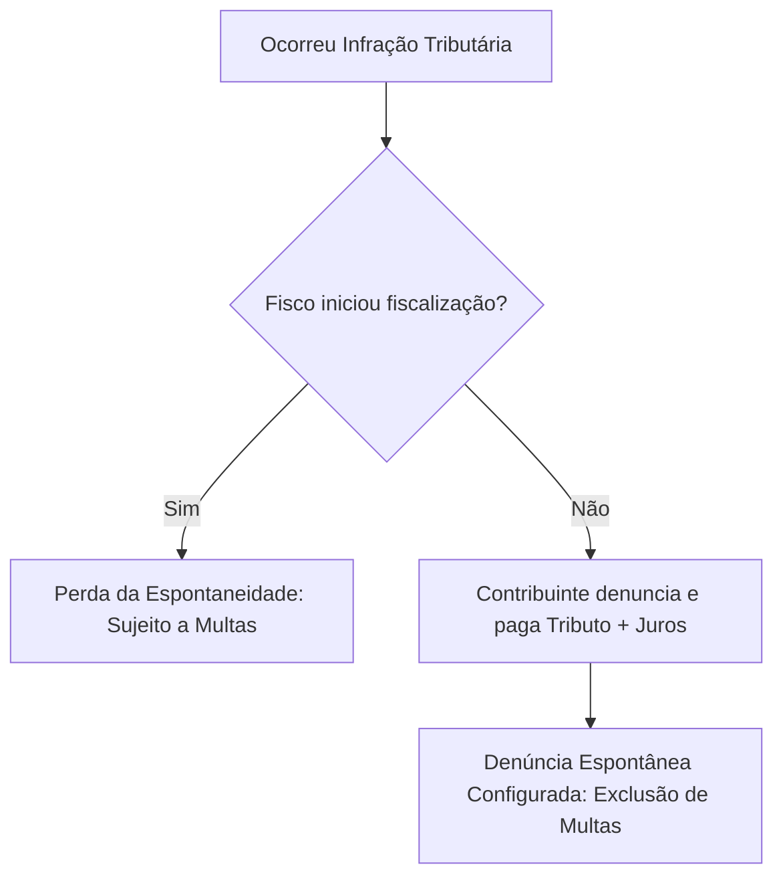

> ⚠️ **Perda da Espontaneidade:** Não é considerada espontânea a denúncia apresentada após o início de qualquer procedimento administrativo ou medida de fiscalização relacionados com a infração. O **Termo de Início de Fiscalização (TIF)** é o marco formal que encerra a oportunidade de o contribuinte usufruir desse benefício.

### Restrições ao Benefício (Jurisprudência do STJ)

*   **Obrigações Acessórias (REsp 322.505):** O benefício da denúncia espontânea **não se aplica** ao descumprimento de obrigações acessórias (como a entrega em atraso de declarações fiscais). A multa pelo atraso na entrega da obrigação acessória permanece devida.
*   **Tributos por Homologação (Súmula 360 do STJ):** O benefício da denúncia espontânea **não se aplica** aos tributos sujeitos a lançamento por homologação que tenham sido regularmente declarados pelo contribuinte, mas pagos em atraso. Nesse caso, a mora já está configurada pela própria declaração do sujeito passivo.

---

## RECURSOS DIDÁTICOS ADICIONAIS

### Quadros Comparativos

#### Responsabilidade de Terceiros: Artigo 134 vs. Artigo 135 do CTN

| Critério | Atuação Regular (Art. 134) | Atuação Irregular (Art. 135) |
| :--- | :--- | :--- |
| **Natureza da Conduta** | Regular, sem violação de deveres, mas com inadimplemento do contribuinte. | Irregular, com excesso de poder ou infração à lei/estatuto. |
| **Tipo de Responsabilidade** | Subsidiária (com benefício de ordem). | Pessoal e exclusiva do administrador. |
| **Exigência de Cargo** | Gestão ou representação legal. | Gestão ou representação legal (não basta ser sócio). |
| **Verbas Cobradas** | Tributo + Multas Moratórias. | Tributo + Multas Moratórias + Multas Punitivas. |

---

### Flashcards (Estilo CEBRASPE - Certo/Errado)

**Questão 1:**
A pessoa jurídica que possuir mais de um estabelecimento comercial tem direito a obter certidão de regularidade fiscal de forma autônoma para cada filial, ainda que a matriz possua pendências tributárias ativas perante o fisco.
*( ) Certo  ( ) Errado*

> **Gabarito: Certo.**
> *Justificativa:* O STJ (REsp 23.371) reconhece a autonomia de cada estabelecimento da pessoa jurídica, permitindo a obtenção individual de CND ou CPEN mesmo que outras unidades possuam débitos.

---

**Questão 2:**
Na aquisição de imóvel em hasta pública, caso o valor da arrematação seja insuficiente para cobrir os tributos incidentes sobre o bem, o arrematante responderá pessoalmente pelo saldo devedor remanescente, independentemente do teor do edital.
*( ) Certo  ( ) Errado*

> **Gabarito: Errado.**
> *Justificativa:* A regra geral (REsp 166.975) é que o arrematante não responde pelo saldo remanescente, pois os débitos se sub-rogam no preço. Ele só responderá se houver previsão expressa em sentido contrário no edital do leilão (REsp 1.114.111).

---

**Questão 3:**
A denúncia espontânea afasta a aplicação de penalidades decorrentes do atraso na entrega de obrigações acessórias, desde que o contribuinte regularize a obrigação antes de qualquer procedimento do fisco.
*( ) Certo  ( ) Errado*

> **Gabarito: Errado.**
> *Justificativa:* Conforme entendimento do STJ (REsp 322.505), a denúncia espontânea não se aplica às obrigações acessórias, incidindo normalmente a multa pelo atraso na entrega da declaração.

---

**Questão 4:**
A responsabilidade por infrações tributárias é, em regra, de natureza subjetiva, dependendo da comprovação de dolo ou culpa do agente para a aplicação das penalidades cabíveis.
*( ) Certo  ( ) Errado*

> **Gabarito: Errado.**
> *Justificativa:* De acordo com o Artigo 136 do CTN, a responsabilidade por infrações é objetiva, independendo da intenção do agente ou dos efeitos do ato, salvo disposição legal em contrário.

---

### Flashcards de Legislação (Letra da Lei)

**Pergunta:**
De acordo com o Artigo 128 do CTN, quais são as condições para que a lei atribua a responsabilidade tributária a uma terceira pessoa?

> **Resposta:**
> A atribuição deve ser feita de modo expresso por lei, a terceira pessoa deve ser vinculada ao fato gerador da obrigação, e a lei pode excluir a responsabilidade do contribuinte ou atribuí-la a este em caráter supletivo do cumprimento total ou parcial da obrigação.

---

**Pergunta:**
Conforme o Artigo 132, parágrafo único, do CTN, quem responde pelos tributos devidos no caso de extinção de sociedade de pessoas quando a atividade continua a ser explorada?

> **Resposta:**
> A responsabilidade recai sobre qualquer sócio remanescente, ou sobre o espólio, que continue a exploração da atividade sob a mesma ou outra razão social, ou sob firma individual.

> ### ⚖️ Entendimento Jurisprudencial Importante: Denúncia Espontânea e Parcelamento
> 
> * **STJ (REsp 1.347.370):** O instituto da **denúncia espontânea** (art. 138 do CTN) **NÃO** se aplica aos casos de **parcelamento de débito tributário**. O fundamento para essa vedação é que, no momento do pedido de parcelamento, a obrigação tributária já está confessada e o crédito constituído, o que descaracteriza a espontaneidade necessária para o benefício.
> 
> * **Afastamento de Multas (REsp 957.036):** Existe um entendimento consolidado no Superior Tribunal de Justiça (STJ) de que a denúncia espontânea realizada de forma correta e tempestiva **afasta tanto as multas punitivas quanto as multas moratórias**. Essa posição visa incentivar a regularização voluntária por parte do contribuinte antes de qualquer procedimento fiscalizatório.

---

@@@
## CRÉDITO TRIBUTÁRIO

O crédito tributário é a formalização da obrigação tributária, possuindo características e regras de constituição bem delineadas pelo Código Tributário Nacional (CTN).

* **Art. 139 (Relação de Acessoriabilidade):** O crédito tributário decorre diretamente da obrigação principal e possui a **mesma natureza jurídica** desta (ou seja, natureza estritamente tributária).
* **Art. 140 (Autonomia da Obrigação):** As circunstâncias que modificam o crédito tributário, sua extensão, seus efeitos, suas garantias ou privilégios, ou mesmo aquelas que excluem sua exigibilidade, **NÃO afetam a obrigação tributária (OT)** que lhe deu origem.

```mermaid
flowchart TD
    A[Fato Gerador] --> B[Obrigação Tributária - OT]
    B --> C{Lançamento Tributário}
    C --> D[Crédito Tributário - CT]
    
    style A fill:#f9f,stroke:#333,stroke-width:2px
    style D fill:#bbf,stroke:#333,stroke-width:2px
```

---

@@@
## LANÇAMENTO

O lançamento é o ato administrativo que confere liquidez e certeza à obrigação tributária, transformando-a em crédito tributário exigível.

* **Art. 142 (Competência Privativa):** A constituição do crédito tributário compete **privativamente** à autoridade administrativa por meio do procedimento do lançamento. 

> ### 💡 Mnemônico de Lançamento: V-D-C-I-P
> O lançamento é o procedimento administrativo tendente a:
> * **V**erificar a ocorrência do fato gerador da obrigação correspondente;
> * **D**eterminar a matéria tributável;
> * **C**alcular o montante do tributo devido;
> * **I**dentificar o sujeito passivo;
> * **P**ropor a aplicação da penalidade cabível (se houver infração).

* **Atividade Vinculada e Obrigatória (Art. 142, parágrafo único):** A atividade administrativa de lançamento é plenamente vinculada e obrigatória, sob pena de responsabilidade funcional do agente público que se omitir.
* **Características da Competência:** É entendida como **exclusiva**, sendo, portanto, **indelegável** e **inavocável**.
* **Natureza Jurídica Mista:** O lançamento possui natureza **declaratória** da obrigação tributária (pois esta nasce com o fato gerador ocorrido no passado) e **constitutiva** do crédito tributário (que só passa a existir formalmente após o lançamento).

> ### 💵 Regra de Conversão de Moeda Estrangeira (Art. 143)
> Salvo disposição de lei em contrário, quando a matéria tributável for expressa em moeda estrangeira, far-se-á a conversão para a moeda nacional ao câmbio do dia da **ocorrência do fato gerador**.

---

@@@
## ASPECTO TEMPORAL

A aplicação da legislação tributária no tempo varia conforme a natureza da norma (se material ou formal).

### Legislação Material / Substantiva (Art. 144)
O lançamento reporta-se à data da ocorrência do fato gerador e rege-se pela **lei então vigente**, mesmo que esta tenha sido posteriormente modificada ou revogada.
* **Atenção:** Essa regra de retroatividade/aplicação imediata refere-se estritamente ao **tributo**, e não à penalidade (que segue as regras benéficas do Art. 106, II).
* Essa mesma regra aplica-se para a **interpretação** da referida legislação.
* **Exceção (§ 2º):** Não se aplica aos impostos lançados por períodos certos de tempo, desde que a lei fixe expressamente a data em que o fato gerador se considera ocorrido.

### Legislação Formal / Procedimental / Adjetiva (Art. 144, § 1º)
Aplica-se imediatamente a legislação que, mesmo posterior à ocorrência do fato gerador, tenha:
1. Instituído **novos critérios de apuração** ou processos de fiscalização;
2. **Ampliado os poderes de investigação** das autoridades administrativas;
3. **Outorgado ao crédito maiores garantias ou privilégios**, exceto se o objetivo for atribuir responsabilidade tributária a terceiros (o que configuraria matéria de direito material).

---

@@@
## ALTERAÇÃO DO LANÇAMENTO

Uma vez regularmente notificado ao sujeito passivo, o lançamento torna-se estável e **só pode ser alterado** nas seguintes hipóteses taxativas:

| Hipótese de Alteração | Descrição e Particularidades |
| :--- | :--- |
| **I - Impugnação do Sujeito Passivo** | Defesa administrativa apresentada pelo contribuinte. **Cabe reformatio in pejus** (a administração pode revisar o lançamento e alterar o valor tanto para menor quanto para maior). |
| **II - Recurso de Ofício** | Recurso obrigatório interposto pela própria autoridade quando a decisão de primeira instância administrativa (ex: DRJ) for desfavorável ao fisco. |
| **III - Iniciativa de Ofício** | Revisão promovida pela própria administração nos casos previstos no Art. 149, decorrente do poder-dever de autotutela. |

> ### ⚠️ Nulidade por Falta de Prazo (STJ REsp 1.227.676)
> A notificação de lançamento que **não indica o prazo para impugnação** é considerada **irregular**, pois viola o devido processo legal, a ampla defesa e o contraditório, acarretando a nulidade do ato de lançamento.

### Critérios Jurídicos vs. Erros de Fato

* **Modificação de Critério Jurídico (Art. 146 - Erro de Direito):** A alteração de entendimento jurídico da autoridade administrativa sobre a aplicação da lei só pode surtir efeitos em relação a fatos geradores ocorridos **posteriormente** à sua introdução. Possui eficácia prospectiva (*ex nunc*).
* **Erro de Fato:** Ocorre quando um fato relevante não foi considerado ou foi considerado de forma equivocada (ex: base de cálculo errada, erro de cálculo matemático, classificação incorreta da mercadoria). São circunstâncias objetivas que não dependem de interpretação jurídica. **Sempre enseja a revisão do lançamento**, desde que respeitado o prazo decadencial.

---

@@@
## MODALIDADES DE LANÇAMENTO

O Código Tributário Nacional prevê três modalidades principais de lançamento, além do procedimento subsidiário de arbitramento.

```mermaid
mindmap
  root((Modalidades de Lançamento))
    Declaracao
      Misto
      Iniciativa do declarante
      Retificacao antes da notificacao
    Oficio
      Direto
      Iniciativa da autoridade
      Hipoteses do Art. 149
    Homologacao
      Autolancamento
      Antecipacao do pagamento
      Prazo decadencial de 5 anos
```

### 1. Lançamento por Declaração (Misto) - Art. 147
É efetuado com base na declaração prestada pelo sujeito passivo ou por terceiro, que presta informações sobre matéria de **fato** à autoridade administrativa.
* **Retificação (§ 1º):** A retificação da declaração por iniciativa do próprio declarante, que vise a reduzir ou excluir tributo, só é admissível mediante a **comprovação do erro** e deve ocorrer **antes de notificado** o lançamento.
* **Erros na Declaração (§ 2º):** Erros óbvios apuráveis pelo simples exame da declaração serão retificados **de ofício** pela autoridade.
* **Impugnação (STJ REsp 396.875):** O contribuinte tem o direito de impugnar administrativamente o lançamento, mesmo que este tenha sido realizado com base nas informações por ele próprio declaradas.

### 2. Lançamento de Ofício (Direto) - Art. 149
Realizado por iniciativa exclusiva da autoridade administrativa. Ocorre nas seguintes situações:
* Quando a lei assim expressamente determinar;
* Quando a declaração não for prestada no prazo ou na forma da legislação;
* Quando o sujeito passivo não atender ou recusar o pedido de esclarecimento formulado pela fiscalização;
* Havendo falsidade, erro ou omissão em declaração obrigatória;
* Constatada omissão ou inexatidão nos tributos sujeitos ao lançamento por homologação;
* Diante de ação ou omissão do sujeito passivo que enseje aplicação de penalidade (multa de ofício);
* Quando comprovado que o sujeito passivo ou terceiro agiu com dolo, fraude ou simulação;
* Para apreciação de fato não conhecido ou não provado no lançamento anterior;
* Se constatada fraude, falta funcional ou omissão da própria autoridade no lançamento anterior.

> **Prazo Limite (Art. 149, parágrafo único):** A revisão do lançamento de ofício só pode ser iniciada enquanto não estiver extinto o direito da Fazenda Pública (ou seja, antes de operada a **decadência**).

#### O Procedimento de Arbitramento (Art. 148)
Não se trata de uma modalidade autônoma, mas de uma técnica de lançamento de ofício. A autoridade lançadora, mediante **processo administrativo regular**, arbitrará o valor ou preço dos bens/serviços sempre que:
* As declarações ou esclarecimentos prestados sejam **omissos** ou **não mereçam fé**;
* Os documentos expedidos pelo sujeito passivo não sejam confiáveis.
* *Garantia:* Fica assegurada ao contribuinte, em caso de contestação, a **avaliação contraditória** (seja na esfera administrativa ou judicial).

> ### ❌ Súmula 431 do STJ
> É ilegal a cobrança de ICMS com base no valor da mercadoria submetido ao regime de **pauta fiscal** (tabelas de valores de referência previamente fixados de forma unilateral pelo fisco).

### 3. Lançamento por Homologação (Autolançamento) - Art. 150
Ocorre nos tributos em que a legislação atribui ao sujeito passivo o dever de **antecipar o pagamento** sem prévio exame da autoridade administrativa.
* **Extinção sob Condição Resolutória (§ 1º):** O pagamento antecipado extingue o crédito tributário sob a condição resolutória da posterior homologação pelo fisco.
* **Independência de Atos Praticados (§ 2º e § 3º):** Atos anteriores à homologação praticados pelo contribuinte ou terceiros não influem na obrigação em si, mas serão considerados na apuração de saldos devedores e na aplicação de penalidades.
* **Homologação Tácita (§ 4º):** Se a lei não fixar prazo para a homologação, este será de **5 anos a contar da ocorrência do fato gerador** (desde que tenha havido pagamento antecipado). Expirado esse prazo sem manifestação da Fazenda, considera-se o lançamento homologado e o crédito definitivamente extinto, **salvo** se comprovada a ocorrência de dolo, fraude ou simulação.

> ### 📝 Súmula 436 do STJ
> A entrega de declaração pelo contribuinte reconhecendo o débito fiscal (ex: DCTF, GFIP) **constitui formalmente o crédito tributário**, dispensando qualquer outra providência ou atividade de lançamento por parte do fisco.

---

@@@
## SUSPENSÃO, EXTINÇÃO E EXCLUSÃO DO CRÉDITO TRIBUTÁRIO

O crédito tributário regularmente constituído possui um ciclo de vida rígido regulamentado pelo art. 141 do CTN. Ele só pode ser modificado, extinto, ou ter sua exigibilidade suspensa ou excluída nos casos expressamente previstos em lei, sob pena de responsabilidade funcional da autoridade.

> ### ⚖️ Flexibilização pelo STF (ADI 2405)
> O Supremo Tribunal Federal decidiu que os entes federados (Estados, DF e Municípios) possuem competência para criar, por meio de suas próprias leis locais, **outras modalidades de extinção** do crédito tributário, tornando o rol de extinção do CTN **exemplificativo** para os entes, enquanto os rois de suspensão e exclusão permanecem **taxativos**.

### Quadro Comparativo das Situações do Crédito Tributário

| SUSPENSÃO (Art. 151) | EXTINÇÃO (Art. 156) | EXCLUSÃO (Art. 175) |
| :--- | :--- | :--- |
| Impede a cobrança (exigibilidade), mas não dispensa obrigações acessórias. | Põe fim à existência do crédito tributário de forma definitiva. | Impede a própria constituição do crédito tributário. |
| **Mnemônico: MODEREPAR**<br>• **Mo**ratória<br>• **De**pósito do montante integral<br>• **Re**clamações e recursos (PAF)<br>• **L**iminar em Mandado de Segurança<br>• **L**iminar em outras ações judiciais<br>• **Par**celamento | • Pagamento<br>• Pagamento antecipado e homologação<br>• Compensação<br>• Transação<br>• Remissão<br>• Prescrição e Decadência<br>• Conversão de depósito em renda<br>• Consignação em pagamento<br>• Decisão administrativa irreformável<br>• Decisão judicial transitada em julgado<br>• Dação em pagamento de bens imóveis (na forma da lei) | • Isenção<br>• Anistia |

---

@@@
## MORATÓRIA

A moratória consiste na dilação legal do prazo para o pagamento do tributo. Deve ser sempre concedida ou autorizada por **lei**.

```mermaid
flowchart TD
    A[Moratória] --> B[Geral]
    A --> C[Individual]
    
    B --> B1[Concedida por Lei]
    B --> B2[Dispensa despacho administrativo]
    
    C --> C1[Depende de despacho da autoridade]
    C --> C2[Verificação de requisitos individuais]
    C --> C3[Pode ser revogada se descumprida]
```

### Abrangência da Moratória (Art. 154)
Salvo disposição de lei em contrário, a moratória aplica-se unicamente:
* Aos créditos **definitivamente constituídos** na data da lei ou do despacho concessivo; ou
* Aos créditos cujo **lançamento já tenha sido iniciado** por notificação regular ao sujeito passivo até aquela data.
* **Vedação absoluta:** Não aproveita aos casos em que reste caracterizado o dolo, a fraude ou a simulação do sujeito passivo.

### Classificação quanto à Abrangência

1. **Moratória Geral (Art. 152, I):** Concedida diretamente por lei. Por ser de caráter geral, **dispensa despacho individual** da autoridade administrativa para sua aplicação.
   * *Moratória Autônoma:* Concedida pela pessoa jurídica de direito público que detém a competência tributária para instituir o tributo correspondente.
2. **Moratória Individual:** Depende de requerimento do interessado e de **despacho da autoridade administrativa** que verifique o preenchimento das condições legais.
   * *Revogabilidade:* Se o beneficiário descumprir as condições estabelecidas, a concessão individual pode ser **anulada**, cobrando-se o tributo com os acréscimos legais.

---

## 🧠 Caderno de Flashcards (Estilo CEBRASPE)

### Julgue os itens a seguir em Certo (C) ou Errado (E):

1. **( )** O Superior Tribunal de Justiça adota o entendimento de que a denúncia espontânea afasta a exigibilidade das multas de caráter punitivo, mantendo-se, contudo, a cobrança das multas de natureza moratória.
   > **Gabarito: ERRADO.** Conforme o REsp 957.036/STJ, a denúncia espontânea feita de forma correta afasta tanto as multas punitivas quanto as multas moratórias.

2. **( )** A modificação introduzida nos critérios jurídicos adotados pela autoridade administrativa no lançamento de determinado tributo só pode ser aplicada a fatos geradores ocorridos posteriormente à sua introdução.
   > **Gabarito: CERTO.** Trata-se da vedação à retroatividade do erro de direito (Art. 146 do CTN), protegendo a confiança e a segurança jurídica do contribuinte.

3. **( )** O parcelamento de débito tributário, por configurar dilação de prazo de pagamento, é compatível com o instituto da denúncia espontânea, restando afastadas as multas aplicáveis.
   > **Gabarito: ERRADO.** Segundo o REsp 1.347.370/STJ, a denúncia espontânea não se aplica aos casos de parcelamento de débito tributário, pois a obrigação já se encontra confessada e constituída.

4. **( )** A entrega de declaração de débito pelo contribuinte dispensa a administração tributária de qualquer outra providência tendente à constituição do crédito tributário.
   > **Gabarito: CERTO.** De acordo com a Súmula 436 do STJ, a entrega da declaração pelo contribuinte (autolançamento) é suficiente para constituir o crédito tributário.

5. **( )** O rol de causas de suspensão da exigibilidade do crédito tributário previsto no CTN é considerado exemplificativo, permitindo que Estados e Municípios criem novas hipóteses suspensivas por meio de lei ordinária local.
   > **Gabarito: ERRADO.** O rol de suspensão (Art. 151) e exclusão (Art. 175) é taxativo. Apenas o rol de extinção (Art. 156) foi considerado exemplificativo pelo STF na ADI 2405, permitindo inovações legislativas locais.

@@@
## Moratória

A **moratória** é uma das causas de suspensão da exigibilidade do crédito tributário. Ela consiste na prorrogação do prazo para o pagamento do tributo, concedida por lei de forma excepcional. 

A moratória pode ser classificada de duas formas principais quanto à sua abrangência e competência:

*   **Moratória Geral:** Aplica-se a um grupo indeterminado de sujeitos passivos.
*   **Moratória Individual:** Aplica-se a sujeitos passivos específicos que devem preencher requisitos determinados em lei.
*   **Moratória Autônoma:** Concedida pelo próprio ente federativo competente para instituir o tributo.
*   **Moratória Heterônoma:** Concedida pela União sobre tributos de competência dos Estados, do Distrito Federal e dos Municípios.

### Moratória Heterônoma

A **moratória heterônoma** ocorre quando a União concede dilação de prazo para tributos estaduais, distritais ou municipais. 

> ⚠️ **Cuidado de Prova:** Não confunda a **moratória heterônoma** com a **isenção heterônoma**. A isenção heterônoma (União concedendo isenção de tributos estaduais ou municipais) é expressamente **proibida** pela Constituição Federal de 1988 (Art. 151, III). Já a moratória heterônoma é **permitida**, desde que cumpra cumulativamente os seguintes requisitos:
> 1. Seja concedida simultaneamente para os tributos de competência federal;
> 2. Seja concedida simultaneamente para as obrigações de direito privado.

```mermaid
graph TD
    A[Moratória Heterônoma pela União] --> B[Deve englobar Tributos Federais]
    A --> C[Deve englobar Obrigações de Direito Privado]
    A --> D[Aplica-se aos Tributos de Estados, DF e Municípios]
```

---

### Moratória Individual e o Despacho Administrativo

A moratória em caráter individual está prevista no Art. 152, II, do Código Tributário Nacional (CTN).

*   **Concessão por Despacho:** A lei estabelece os requisitos gerais. O interessado apresenta o requerimento comprovando o preenchimento das condições, e a autoridade administrativa concede o benefício por meio de um **despacho**.
*   **Ausência de Direito Adquirido:** A concessão da moratória individual **não gera direito adquirido**.
*   **Exigência de Garantias:** A autoridade administrativa, se autorizada por lei, **pode exigir garantias** reais ou pessoais para conceder o parcelamento ou dilação do prazo.

---

### Anulação da Moratória (Art. 155 do CTN)

O Artigo 155 do CTN trata da revogação (que tecnicamente deve ser entendida como **anulação**) dos atos administrativos que concedem moratória individual, parcelamento, remissão, isenção e anistia.

Se for constatado que o beneficiário não preenchia ou deixou de preencher os requisitos legais, o benefício será anulado de ofício. As consequências variam conforme a existência ou não de dolo ou simulação:

| Cenário | Consequência sobre o Crédito | Efeito sobre a Prescrição |
| :--- | :--- | :--- |
| **Com Dolo ou Simulação** (do beneficiado ou de terceiro) | Cobrança do tributo corrigido + **Juros de Mora** + **Penalidades Cabíveis (Multas)** | O tempo decorrido entre a concessão e a revogação **NÃO** se computa para efeito de prescrição. |
| **Sem Dolo ou Simulação** | Cobrança do tributo corrigido + **Juros de Mora** (sem penalidades, se pago no prazo da revogação) | A revogação **SÓ** pode ocorrer antes de prescrito o direito de cobrar o crédito. |

---

### Requisitos da Lei Concessiva ou Autorizativa (Art. 153 do CTN)

A lei que concede ou autoriza a moratória deve especificar, obrigatoriamente:

1.  O **prazo de duração** do favor fiscal;
2.  As **condições** para a concessão em caráter individual;
3.  Sendo o caso:
    *   Os **tributos** aos quais o benefício se aplica;
    *   As **garantias** que devem ser fornecidas pelo beneficiário (na moratória individual);
    *   O **número de prestações** e seus respectivos vencimentos.

> 💡 **Diferença Importante:** A **moratória parcelada** não se confunde com o **parcelamento**. O parcelamento é um instituto rotineiro de política fiscal. A moratória parcelada é uma medida excepcional, voltada para situações de anormalidade ou calamidade.

#### Limitação Geográfica ou Setorial (Art. 152, Parágrafo Único)
A lei concessiva de moratória (seja ela geral ou individual) **pode circunscrever expressamente** a sua aplicabilidade a uma determinada **região** do território do ente tributante, ou a uma determinada **classe ou categoria** de sujeitos passivos.

---

### Flashcards de Fixação (Moratória)

```
Ficha 1 - Frente
A moratória heterônoma concedida pela União sobre tributos estaduais e municipais prescinde de qualquer vinculação com tributos federais ou obrigações privadas. (Certo/Errado)
```
```
Ficha 1 - Verso
ERRADO. A moratória heterônoma exige que a dilação de prazo seja concedida simultaneamente para os tributos de competência federal e para as obrigações de direito privado.
```

```
Ficha 2 - Frente (Letra da Lei)
De acordo com o Art. 155 do CTN, no caso de dolo ou simulação do beneficiado na moratória individual, o tempo decorrido entre a concessão e a revogação é computado para fins de prescrição. (Certo/Errado)
```
```
Ficha 2 - Verso
ERRADO. O parágrafo único do Art. 155 do CTN determina expressamente que, havendo dolo ou simulação, o tempo decorrido NÃO se computa para efeito de prescrição.
```

@@@
## Depósito do Montante Integral

O **depósito do montante integral** em dinheiro é uma causa de suspensão da exigibilidade do crédito tributário que visa garantir o juízo ou a administração enquanto se discute a legalidade da cobrança.

```mermaid
flowchart TD
    A[Depósito do Montante Integral] --> B[Via Judicial]
    A --> C[Via Administrativa]
    
    B --> B1[Garante suspensão da exigibilidade]
    B --> B2[Evita execução fiscal]
    
    C --> C1[Evita a fluência de juros de mora]
    C --> C2[PAF já suspende por si só]
```

### Entendimento do STJ (REsp 572.603)
A suspensão da exigibilidade do crédito tributário na via judicial impede que o Fisco pratique atos de cobrança (como inscrição em dívida ativa, ajuizamento de execução fiscal e penhora de bens). Contudo, **não impede a Fazenda Pública de realizar o lançamento** (constituição do crédito tributário) para evitar a decadência do direito de lançar.

### Distinção entre as Vias Judicial e Administrativa

*   **Via Judicial:** Utilizada quando o sujeito passivo deseja questionar o crédito em juízo e impedir que a Fazenda Pública ajuíze a Ação de Execução Fiscal.
    *   **Súmula Vinculante 28 (STF):** É inconstitucional exigir o depósito prévio como requisito de admissibilidade de ação judicial na qual se pretenda discutir a exigibilidade de crédito tributário. O depósito é uma faculdade do contribuinte para suspender a exigibilidade, nunca uma obrigação para acessar o Judiciário.
*   **Via Administrativa:** A mera instauração do Processo Administrativo Fiscal (PAF) já suspende a exigibilidade do crédito tributário por si só. Nesse caso, o depósito do montante integral serve especificamente para **evitar a fluência dos juros de mora** e da correção monetária durante o trâmite do processo.

### Requisitos do Depósito
*   **Montante Integral:** O depósito deve corresponder ao valor total arbitrado pela Fazenda Pública, incluindo o tributo, os juros de mora e as multas aplicadas até a data do depósito.
*   **Súmula 112 do STJ:** O depósito somente suspende a exigibilidade do crédito tributário se for **integral** e realizado **em dinheiro**. Bens, fianças bancárias ou apólices de seguro-garantia não equivalem ao depósito em dinheiro para fins de suspensão da exigibilidade do CTN.

---

### Desfechos do Processo e Destinação do Depósito

```mermaid
stateDiagram-v2
    [*] --> Depósito_Integral
    Depósito_Integral --> Decisão_Favorável_ao_Contribuinte
    Depósito_Integral --> Decisão_Desfavorável_ao_Contribuinte
    
    Decisão_Favorável_ao_Contribuinte --> Levantamento_pelo_Contribuinte : Resgate do dinheiro
    Levantamento_pelo_Contribuinte --> Extinção_do_Crédito
    
    Decisão_Desfavorável_ao_Contribuinte --> Conversão_em_Renda : Dinheiro vai para o Fisco
    Conversão_em_Renda --> Extinção_do_Crédito
```

*   **Decisão Favorável ao Sujeito Passivo:** O contribuinte tem o direito de realizar o **levantamento (resgate)** do valor depositado. O STJ (REsp 297.115) consolidou o entendimento de que o levantamento é de direito do contribuinte, mesmo que ele possua outros débitos tributários pendentes com o mesmo ente. O crédito tributário discutido é extinto.
*   **Decisão Desfavorável ao Sujeito Passivo:** Ocorre a **conversão do depósito em renda** em favor do ente público, o que extingue definitivamente o crédito tributário sob discussão.

---

### Flashcards de Fixação (Depósito)

```
Ficha 1 - Frente
A Fazenda Pública fica impedida de efetuar o lançamento tributário para prevenir a decadência caso a exigibilidade do crédito esteja suspensa por depósito judicial. (Certo/Errado)
```
```
Ficha 1 - Verso
ERRADO. Conforme o REsp 572.603 do STJ, a suspensão impede atos de cobrança, mas NÃO impossibilita a Fazenda de proceder à regular constituição do crédito tributário para prevenir a decadência.
```

```
Ficha 2 - Frente (Letra da Lei / Súmula)
O oferecimento de seguro-garantia ou fiança bancária preenche os requisitos da Súmula 112 do STJ para fins de suspensão da exigibilidade do crédito tributário. (Certo/Errado)
```
```
Ficha 2 - Verso
ERRADO. A Súmula 112 do STJ exige que o depósito seja INTEGRAL e em DINHEIRO. Outras garantias podem assegurar o juízo da execução, mas não suspendem a exigibilidade na forma do art. 151, II do CTN.
```

@@@
## Reclamações e Recursos

As **reclamações e os recursos** apresentados no âmbito do Processo Administrativo Fiscal (PAF) constituem causa de suspensão da exigibilidade do crédito tributário.

### Estrutura do Contencioso Administrativo (Exemplo Federal)

O fluxo recursal administrativo visa garantir a ampla defesa antes que o crédito se torne definitivamente exigível para cobrança judicial:

```mermaid
graph LR
    A[Lançamento do Crédito] --> B[Impugnação / Reclamação]
    B --> C[Julgadores Singulares - ex: DRJ]
    C --> D[Recurso Voluntário / de Ofício]
    D --> E[Tribunal Administrativo - ex: CARF]
```

### Regras e Jurisprudência Aplicáveis

*   **Súmula Vinculante 21 (STF):** É **inconstitucional** a exigência de depósito ou arrolamento prévios de dinheiro ou bens para admissibilidade de recurso administrativo. O direito de petição e o contraditório administrativo não podem ser condicionados ao pagamento prévio.
*   **Efeito do Recurso Intempestivo (STJ - REsp 1.401.122):** A apresentação de reclamação ou recurso administrativo, **mesmo que intempestivo (fora do prazo)**, suspende a exigibilidade do crédito tributário e, consequentemente, obsta o curso do prazo prescricional enquanto perdurar o contencioso administrativo.

### Desfechos do Processo Administrativo

1.  **Decisão Administrativa Favorável ao Contribuinte:** O crédito tributário é extinto.
2.  **Decisão Administrativa Desfavorável ao Contribuinte:** O crédito volta a ser exigível. O contribuinte poderá:
    *   Recorrer ao Poder Judiciário para discutir a dívida;
    *   Efetuar o pagamento do crédito tributário acrescido dos encargos moratórios devidos.

---

### Flashcards de Fixação (Recursos Administrativos)

```
Ficha 1 - Frente
A interposição de recurso administrativo fora do prazo legal (intempestivo) não tem o condão de suspender a exigibilidade do crédito tributário. (Certo/Errado)
```
```
Ficha 1 - Verso
ERRADO. Segundo o STJ (REsp 1.401.122), a reclamação ou recurso administrativo, mesmo intempestivo, SUSPENDE a exigibilidade do crédito tributário e o prazo prescricional durante o contencioso.
```

@@@
## Liminar em MS e em Outras Espécies de Ações Judiciais

A concessão de medida liminar em sede de Mandado de Segurança (MS) ou em outras ações de rito comum (como ações anulatórias ou declaratórias) suspende a exigibilidade do crédito tributário.

### Requisitos para a Concessão da Liminar
Para que o magistrado conceda a medida liminar, devem estar presentes, cumulativamente, dois requisitos do direito processual:
1.  **Fumus boni juris (Fumaça do bom direito):** Relevância jurídica dos argumentos apresentados pelo contribuinte.
2.  **Periculum in mora (Perigo da demora):** Risco de dano irreparável ou de difícil reparação caso a exigibilidade não seja suspensa imediatamente.

> ℹ️ **Nota Didática:** A exigibilidade do crédito permanece suspensa até o julgamento do mérito da ação, não existindo prazo legal máximo para a duração dessa suspensão. O Mandado de Segurança pode ser impetrado de forma **preventiva**, ou seja, antes mesmo da ocorrência do lançamento tributário.

### Desfechos Judiciais
*   **Decisão de Mérito Favorável:** O crédito tributário é extinto (com o trânsito em julgado).
*   **Decisão de Mérito Desfavorável:** A liminar perde seus efeitos e o crédito tributário volta a ser imediatamente exigível pelo Fisco.

### Entendimento do STJ (RMS 3.881)
A concessão de liminar em Mandado de Segurança suspende a exigibilidade do crédito tributário **independentemente da realização de depósito** do tributo controvertido (em consonância com a Súmula Vinculante 28 do STF). 

Se o magistrado condicionar a concessão da liminar à realização do depósito, tecnicamente ele estará indeferindo a liminar. Contudo, o efeito prático de suspensão será mantido, uma vez que o depósito integral, por si só, já suspende a exigibilidade do crédito por força do art. 151, II do CTN.

---

### Flashcards de Fixação (Liminares)

```
Ficha 1 - Frente
A concessão de medida liminar em Mandado de Segurança exige, obrigatoriamente, a realização do depósito do montante integral do tributo questionado. (Certo/Errado)
```
```
Ficha 1 - Verso
ERRADO. Conforme o STJ (RMS 3.881), a liminar em MS suspende a exigibilidade do crédito tributário independentemente de depósito.
```

@@@
## Parcelamento

O **parcelamento** é a divisão do débito tributário em prestações periódicas. Trata-se de uma medida que deve ser veiculada por **lei específica** de cada ente federativo.

```mermaid
graph TD
    A[Parcelamento Tributário] --> B[Casos Gerais - Lei A]
    A --> C[Recuperação Judicial - Lei B]
    
    B --> B1[Não exclui juros e multas salvo disposição em contrário]
    B --> B2[Aplica-se subsidiariamente as regras da moratória]
    
    C --> C1[Inexistência da Lei B implica aplicação da Lei A]
    C --> C2[Prazo não pode ser inferior ao da lei federal específica]
```

### Características Gerais do Parcelamento
*   **Caráter Individual:** O parcelamento é sempre concedido em caráter individual e depende de **requerimento expresso** do contribuinte interessado.
*   **Duplicidade de Leis:** Cada ente político deve possuir duas leis distintas para tratar do tema:
    1.  **Lei A:** Voltada para os casos gerais de parcelamento.
    2.  **Lei B:** Voltada especificamente para os devedores em regime de recuperação judicial.

### Jurisprudência Relevante do STJ

*   **Súmula 653 do STJ:** O pedido de parcelamento fiscal, **mesmo que venha a ser indeferido** pela administração, interrompe o prazo prescricional, pois configura ato inequívoco de reconhecimento (confissão extrajudicial) do débito pelo devedor.
*   **REsp 1.309.012:** O parcelamento tributário suspende a exigibilidade do crédito, mas **não desconstitui a garantia** já ofertada em juízo (em sede de execução fiscal, por exemplo).
*   **REsp 1.548.096:** A confissão espontânea da dívida e o seu respectivo pedido de parcelamento **não têm o poder de restabelecer a exigibilidade** de créditos tributários que já tenham sido extintos pela ocorrência da **decadência** ou da **prescrição**.

---

### Regras do CTN para o Parcelamento (Art. 155-A)

#### Casos Gerais (Lei A)
*   **Art. 155-A, § 1º:** Salvo disposição de lei em contrário, o parcelamento do crédito tributário **não exclui** a incidência de juros de mora e de multas.
*   **Art. 155-A, § 2º:** Aplicam-se ao parcelamento, de forma **subsidiária**, as disposições do CTN relativas à moratória.

#### Devedores em Recuperação Judicial (Lei B)
*   **Art. 155-A, § 3º:** Lei específica disporá sobre as condições de parcelamento dos créditos tributários do devedor em recuperação judicial.
*   **Art. 155-A, § 4º:** Se o ente federativo **não possuir a lei específica** para recuperação judicial (Lei B), serão aplicadas as regras gerais de parcelamento do próprio ente (Lei A). Contudo, nesse caso, o prazo de parcelamento **não poderá ser inferior** ao prazo concedido pela lei federal específica de recuperação judicial.

---

### Flashcards de Fixação (Parcelamento)

```
Ficha 1 - Frente
O pedido de parcelamento que venha a ser indeferido pela autoridade administrativa não produz efeitos sobre o prazo prescricional. (Certo/Errado)
```
```
Ficha 1 - Verso
ERRADO. Conforme a Súmula 653 do STJ, o pedido de parcelamento, mesmo indeferido, interrompe o prazo prescricional por caracterizar confissão extrajudicial do débito.
```

```
Ficha 2 - Frente (Letra da Lei)
Na ausência de lei específica do Estado para parcelamento de empresas em recuperação judicial, aplicam-se as regras gerais de parcelamento do ente, sem qualquer limitação de prazo mínimo. (Certo/Errado)
```
```
Ficha 2 - Verso
ERRADO. Aplica-se a lei geral do ente, mas o prazo de parcelamento NÃO pode ser inferior ao concedido pela lei federal específica (Art. 155-A, § 4º do CTN).
```

@@@
## Pagamento

O **pagamento** é a forma clássica e principal de extinção do crédito tributário (Art. 156, I, do CTN). Ele representa o adimplemento da obrigação tributária por parte do sujeito passivo.

### Regras Gerais do Pagamento

#### Imposição de Penalidades (Art. 157)
A imposição de uma penalidade tributária (como uma multa por descumprimento de obrigação acessória) **não ilide (não dispensa)** o pagamento integral do crédito tributário principal. O contribuinte deve pagar o tributo e a multa acumulados.

#### Inexistência de Presunção de Pagamento (Art. 158)
O pagamento de um determinado crédito tributário **não gera a presunção** de que outros créditos foram pagos:
*   **Pagamento Parcial (Inciso I):** O pagamento de uma prestação (ex: a 3ª parcela do IPTU) não gera a presunção de que as parcelas anteriores (1ª e 2ª) foram pagas.
*   **Pagamento Total de Outro Crédito (Inciso II):** O pagamento integral de um tributo ou multa não faz presumir o adimplemento de outros tributos devidos pelo mesmo sujeito passivo (ex: pagar o IPVA não presume o pagamento do IPTU).

---

### Aspectos Temporais, Espaciais e Formais do Pagamento

```mermaid
mindmap
  root((Pagamento))
    Prazo
      Definido na Legislação
      Se omissa: 30 dias da notificação
      Desconto por antecipação permitido
    Local
      Repartição do domicílio do devedor se lei for omissa
    Juros de Mora
      1% ao mês se lei não dispuser diferente
      Não flui na pendência de consulta tempestiva
    Formas
      Moeda corrente ou cheque
      Estampilha ou papel selado
      Vale postal
```

#### 1. Prazo (Art. 160)
*   O prazo para pagamento é estabelecido na Legislação Tributária (LET).
*   **Regra Geral de Omissão:** Se a legislação não fixar o prazo, o vencimento ocorrerá **30 dias** após a data da notificação do lançamento ao sujeito passivo.
*   **Descontos:** A legislação pode prever descontos para o pagamento antecipado.
*   **Jurisprudência do STF:** A alteração do prazo de vencimento de tributo não se submete ao princípio da legalidade estrita, tampouco ao princípio da anterioridade tributária.

#### 2. Local (Art. 159)
Quando a legislação tributária for omissa, o pagamento deve ser efetuado na repartição competente do **domicílio do sujeito passivo**.

#### 3. Juros de Mora (Art. 161)
O crédito não pago no vencimento será acrescido de juros de mora, calculados sobre o montante do tributo corrigido.
*   **Taxa de Juros:** Se a lei do ente federativo não dispuser de forma diversa, a taxa aplicável será de **1% ao mês** (Art. 161, § 1º).
*   **Consulta Tributária:** Não incidem juros de mora nem multa de mora durante a pendência de consulta formulada pelo devedor dentro do prazo legal de pagamento. **Atenção:** A atualização monetária (correção do valor da moeda) **continua fluindo** normalmente durante esse período.

#### 4. Formas de Pagamento (Art. 162)
O pagamento pode ser efetuado por meio de:
*   Moeda corrente nacional;
*   Cheque (a extinção do crédito fica condicionada ao regular resgate do cheque pelo banco sacado);
*   Estampilha, papel selado ou processo mecânico (conforme previsto em regulamento);
*   Vale postal.

---

### Imputação em Pagamento (Art. 163)

A **imputação em pagamento** ocorre quando o sujeito passivo possui, simultaneamente, dois ou mais débitos vencidos junto à mesma pessoa jurídica de direito público, relativos ao mesmo ou a diferentes tributos, multas ou juros, e o valor pago é insuficiente para quitar todos eles.

A autoridade administrativa determinará a imputação obedecendo, obrigatoriamente, à seguinte ordem de preferência:

> 🗣️ **Mnemônico Original:**
> **"CONTRIBUÍ por ser RESPONSÁVEL pelo CTI do PRAZO e do MONTANTE"**

#### Aplicação Didática do Mnemônico:

1.  **CONTRIBUÍ:** Débitos em que o sujeito passivo figure como **contribuinte** (obrigação própria), antes daqueles em que figure como responsável.
2.  **RESPONSÁVEL:** Débitos decorrentes de **responsabilidade tributária**.
3.  **CTI (Contribuição, Taxas, Impostos):** Dentro de cada grupo anterior, a preferência segue a ordem de natureza do tributo:
    *   Primeiro: **C**ontribuições de melhoria;
    *   Segundo: **T**axas;
    *   Terceiro: **I**mpostos.
4.  **PRAZO:** Ordem **crescente** de prazo de prescrição (dos débitos mais antigos/próximos de prescrever para os mais recentes).
5.  **MONTANTE:** Ordem **decrescente** de montante (do débito de maior valor para o de menor valor).

---

### Flashcards de Fixação (Pagamento)

```
Ficha 1 - Frente
Se a legislação tributária for omissa quanto ao prazo de vencimento do tributo, o pagamento deverá ser realizado em até 15 dias após a notificação do lançamento. (Certo/Errado)
```
```
Ficha 1 - Verso
ERRADO. O Art. 160 do CTN estabelece que, na omissão da lei, o vencimento do crédito ocorre 30 dias após a data da notificação do sujeito passivo.
```

```
Ficha 2 - Frente (Mnemônico / Imputação)
Na imputação em pagamento, os débitos decorrentes de responsabilidade tributária têm preferência de quitação sobre os débitos de obrigação própria (contribuinte). (Certo/Errado)
```
```
Ficha 2 - Verso
ERRADO. De acordo com a ordem de imputação (Art. 163 do CTN), as obrigações próprias (contribuinte) são pagas em primeiro lugar ("CONTRIBUÍ"), seguidas pelas obrigações de terceiros ("RESPONSÁVEL").
```

@@@
## Pagamento Indevido (Repetição do Indébito)

O **pagamento indevido** gera para o sujeito passivo o direito à **repetição do indébito**, que consiste na devolução total ou parcial dos valores pagos indevidamente a título de tributo.

### Regras do Artigo 165 do CTN

*   **Legitimidade Ativa:** O direito à restituição cabe ao **sujeito passivo** (seja ele na condição de contribuinte ou de responsável tributário).
*   **Desnecessidade de Protesto Prévio:** O direito à devolução existe **independentemente** de o contribuinte ter apresentado protesto ou ressalva no momento em que realizou o pagamento indevido.
*   **Modalidades de Pagamento:** A restituição é cabível independentemente da modalidade de pagamento utilizada (dinheiro, cheque, compensação, etc.).
*   **Exceção das Estampilhas:** Não há direito à restituição em caso de perda, destruição ou erro no pagamento efetuado por meio de **estampilha** (selos físicos), exceto se o erro for imputável exclusivamente à autoridade administrativa ou nas hipóteses expressamente previstas na legislação tributária.

---

### Flashcards de Fixação (Repetição do Indébito)

```
Ficha 1 - Frente
O sujeito passivo que realiza o pagamento de tributo indevido somente terá direito à repetição do indébito se comprovar ter realizado protesto formal no ato do pagamento. (Certo/Errado)
```
```
Ficha 1 - Verso
ERRADO. O Art. 165 do CTN estabelece expressamente que o sujeito passivo tem direito à restituição "independentemente de prévio protesto".
```

@@@
## HIPÓTESES E PRAZO DE RESTITUIÇÃO

A restituição do indébito tributário é o direito do sujeito passivo de reaver valores pagos indevidamente ao Fisco. O Código Tributário Nacional (CTN) disciplina as hipóteses de restituição no **artigo 165** e os prazos para pleiteá-la no **artigo 168**.

### Hipóteses de Restituição (Art. 165, CTN)

O direito à restituição total ou parcial do tributo surge nas seguintes situações:

*   **Inciso I: Cobrança ou pagamento espontâneo de tributo indevido ou maior que o devido**
    *   Ocorre quando o pagamento é realizado em desacordo com as normas aplicáveis ou quando desconsidera a real natureza ou as circunstâncias materiais do **Fato Gerador (FG)** efetivamente ocorrido.
*   **Inciso II: Erro formal ou material no pagamento**
    *   **Erro na identificação do sujeito passivo** (ex.: pagar tributo em nome de outrem por equívoco);
    *   **Erro na determinação da alíquota** aplicável;
    *   **Erro no cálculo do montante** do débito;
    *   **Erro na elaboração ou conferência** de qualquer documento relativo ao pagamento.
*   **Inciso III: Reforma, anulação, revogação ou rescisão de decisão condenatória**
    *   Aplica-se quando o pagamento foi realizado em virtude de uma decisão administrativa ou judicial condenatória que, posteriormente, foi reformada, anulada, revogada ou rescindida.

---

### Prazos para Pleitear a Restituição (Art. 168, CTN)

O prazo para o contribuinte exercer o direito de pleitear a restituição é de **5 (cinco) anos**, variando o termo inicial a depender da hipótese:

#### 1. Para as hipóteses dos incisos I e II (Art. 168, I):
*   **Prazo:** 5 anos.
*   **Termo inicial:** Da data da **extinção do crédito tributário**.

> ⚠️ **Atenção ao Lançamento por Homologação:**
> Conforme o art. 3º da Lei Complementar nº 118/2005, nos tributos sujeitos a lançamento por homologação, a extinção do crédito tributário ocorre no **momento do pagamento antecipado**. É a partir deste pagamento que se inicia a contagem do prazo de 5 anos para pleitear a repetição do indébito, independentemente de homologação expressa ou tácita pelo Fisco.

#### 2. Para a hipótese do inciso III (Art. 168, II):
*   **Prazo:** 5 anos.
*   **Termo inicial:** Da data em que se tornar **definitiva a decisão administrativa** ou passar em **julgado a decisão judicial** que reformar, anular, revogar ou rescindir a decisão condenatória.

```mermaid
flowchart TD
    A[Direito à Restituição - 5 Anos] --> B{Qual a Origem?}
    B -->|Pagamento Indevido/Maior ou Erro| C[Contados da Extinção do Crédito Tributário]
    B -->|Reforma/Anulação de Decisão Condenatória| D[Contados da Decisão Definitiva ADM ou Trânsito em Julgado JUD]
    C --> E[Lançamento por Homologação: Prazo inicia no Pagamento Antecipado]
```

> 💡 **Nota Didática:**
> A restituição **não é automática**. O contribuinte deve formalizar o pedido (solicitação). Não confunda essa solicitação com a necessidade de "prévio protesto", o qual é totalmente desnecessário para fins do art. 165 do CTN.

---

### Legitimidade Ativa no IPTU (Súmula 614/STJ)

> 🚨 **Pegadinha de Prova:**
> **Súmula 614/STJ:** O locatário **não possui** legitimidade ativa para discutir a relação jurídico-tributária de IPTU e de taxas referentes ao imóvel alugado, nem para repetir o indébito desses tributos. Embora o contrato de locação possa transferir o encargo financeiro ao inquilino, a relação tributária permanece vinculada ao proprietário (locador).

---

### 🧠 Flashcards de Revisão (Estilo CEBRASPE)

*   **Julgue o item a seguir:**
    Nos tributos sujeitos a lançamento por homologação, o prazo prescricional de cinco anos para pleitear a restituição do pagamento indevido flui a partir da homologação expressa ou tácita da atividade do contribuinte pelo Fisco.
    *   **Resposta: ERRADO.**
    *   *Explicação:* Conforme o art. 3º da LC 118/2005, o prazo de 5 anos inicia-se na data do **pagamento antecipado**, e não da homologação.

*   **Julgue o item a seguir:**
    O locatário de imóvel urbano, por suportar o ônus financeiro do IPTU por força de contrato de locação, detém legitimidade ativa para propor ação de repetição de indébito tributário.
    *   **Resposta: ERRADO.**
    *   *Explicação:* Nos termos da Súmula 614 do STJ, o locatário é parte ilegítima para discutir a relação jurídico-tributária do IPTU ou pleitear sua restituição.

---

@@@
## RESTITUIÇÃO DE TRIBUTO INDIRETO

Os tributos indiretos são aqueles que, por sua natureza jurídica e econômica, comportam a transferência do encargo financeiro para um terceiro (o consumidor final). Exemplos clássicos incluem o ICMS, o ISS e o IPI.

### A Regra do Artigo 166 do CTN

A restituição de tributos indiretos exige requisitos rigorosos para evitar o enriquecimento sem causa do contribuinte de direito:

*   **Art. 166, CTN:** A restituição somente será efetuada a quem provar:
    1.  Haver **assumido o referido encargo financeiro** (não o tendo transferido a outrem); **OU**
    2.  No caso de ter transferido o encargo a terceiro, estar por este **expressamente autorizado** a recebê-la.

### Distinção Fundamental: Contribuinte de Direito vs. Contribuinte de Fato

| Conceito | Definição | Exemplo Prático |
| :--- | :--- | :--- |
| **Contribuinte de Direito** | Aquele que possui a obrigação legal de recolher o tributo perante o Fisco. | A distribuidora de energia ou o comerciante. |
| **Contribuinte de Fato** | Aquele que efetivamente suporta o ônus financeiro do tributo em seu patrimônio. | O consumidor final do serviço ou produto. |

### Jurisprudência Aplicável

*   **Súmula 546/STF:** Cabe a restituição do tributo pago indevidamente, quando reconhecido por decisão, que o contribuinte de jure (de direito) não recuperou do contribuinte de facto (de fato) o quantum respectivo.
*   **REsp 1.299.303/STJ (Recurso Repetitivo):** O **contribuinte de fato** tem legitimidade ativa para propor ação de repetição de indébito relativa ao ICMS cobrado sobre serviços públicos concedidos.
    *   *Exemplo:* O consumidor de energia elétrica (contribuinte de fato) pode pleitear judicialmente a restituição do ICMS pago a maior sobre a "demanda contratada e não utilizada" de energia.

---

@@@
## DENEGAÇÃO DO PEDIDO DE RESTITUIÇÃO NO ÂMBITO ADMINISTRATIVO

Quando o contribuinte formula um pedido administrativo de restituição e este é negado pela Fazenda Pública, abre-se a via judicial por meio da **Ação Anulatória da Decisão Administrativa**.

### Prazos e Regras de Prescrição (Art. 169, CTN)

*   **Prazo Geral:** Prescreve em **2 (dois) anos** a ação anulatória da decisão administrativa que denegar a restituição.
*   **Interrupção do Prazo (§ único):** O prazo de prescrição é interrompido com o início da ação judicial.
*   **Recomeço pela Metade:** Após a interrupção, o prazo recomeça a correr **pela metade (1 ano)**, a contar da data da intimação validamente feita ao representante judicial da Fazenda Pública.

> ⚠️ **Regra de Proteção ao Contribuinte:**
> Se a interrupção e o reinício pela metade ocorrerem de forma que o prazo restante fique menor do que o que restava antes da interrupção, aplica-se a interpretação mais favorável ao contribuinte para evitar prejuízos processuais.

```mermaid
gantt
    title Fluxo do Prazo da Ação Anulatória (Art. 169)
    dateFormat  X
    axisFormat %s
    section Prazos
    Decisão de Denegação ADM      :active, p1, 0, 20
    Ajuizamento da Ação (Interrupção) :crit, p2, 20, 21
    Prazo Recomeça pela Metade (1 ano) :active, p3, 21, 31
```

### Exemplo Prático:
1. O contribuinte ingressa com pedido administrativo de restituição dentro do prazo de 5 anos.
2. A Administração Pública indefere (denega) o pedido.
3. O contribuinte tem **2 anos** (a contar da ciência da denegação) para ajuizar a ação anulatória.
4. Proposta a ação e citado validamente o representante da Fazenda, o prazo é interrompido e recomeça a correr pela metade (**1 ano**).

---

@@@
## VALOR A SER RESTITUÍDO

O contribuinte que obtém o reconhecimento do seu direito ao indébito tributário não fica adstrito a uma única forma de recebimento.

*   **Súmula 461/STJ:** O contribuinte pode **optar** por receber o indébito tributário certificado por sentença declaratória transitada em julgado por meio de:
    1.  **Precatório** (ou Requisição de Pequeno Valor - RPV); ou
    2.  **Compensação** tributária.

---

@@@
## RESTITUIÇÃO DE JUROS E MULTAS DE MORA PAGOS INDEVIDAMENTE

A restituição do tributo principal gera efeitos reflexos sobre os acréscimos legais pagos de forma acessória.

### A Regra da Proporcionalidade (Art. 167, CTN)

*   A restituição total ou parcial do tributo importa na restituição, **na mesma proporção**, dos:
    *   **Juros de mora** pagos indevidamente;
    *   **Penalidades pecuniárias moratórias** (multas de mora).
*   ❌ **Exceção:** Não são restituídas as penalidades referentes a infrações de caráter puramente punitivo (multas punitivas isoladas), quando a infração de fato existiu de forma autônoma à obrigação principal.

### Juros sobre a Restituição (Art. 167, § único)

*   A restituição vence **juros não capitalizáveis (juros simples)**.
*   **Termo inicial dos juros:** A partir do **trânsito em julgado** da decisão que determinou a restituição.

### Atualização Monetária vs. Juros Moratórios

A incidência de encargos sobre o indébito segue marcos temporais distintos, consolidados pela jurisprudência:

1.  **Correção Monetária (Súmula 162/STJ):** Incide a partir do **pagamento indevido**.
2.  **Juros de Mora (Súmula 188/STJ):** São devidos a partir do **trânsito em julgado** da sentença.
3.  **Período de Graça Constitucional (Súmula Vinculante 17/STF):** Não incidem juros de mora sobre os precatórios pagos dentro do prazo constitucional previsto no art. 100, § 1º, da Constituição Federal.
4.  **Taxa Aplicável em Tributos Estaduais (Súmula 523/STJ):** A taxa de juros de mora na repetição de indébito de tributos estaduais deve ser igual à utilizada pelo Estado para cobrar seus próprios tributos em atraso. É legítima a adoção da **taxa Selic**, desde que prevista na legislação local, sendo vedada sua cumulação com qualquer outro índice de correção monetária.

```
[Pagamento Indevido] ──(Incide Correção Monetária - Súmula 162)──> [Trânsito em Julgado] ──(Incidem Juros de Mora - Súmula 188)──> [Expedição do Precatório]
```

---

@@@
## REMISSÃO (PERDOA TUDO)

A **remissão** é uma das formas de extinção do crédito tributário (art. 156, IV, CTN) e consiste no perdão da dívida tributária (tributo e/ou multa) concedido por lei.

### Requisitos e Condições (Art. 172, CTN)

A lei do ente tributante pode autorizar a autoridade administrativa a conceder, mediante **despacho fundamentado**, remissão total ou parcial do crédito tributário, considerando:

*   **a)** A **situação econômica** do sujeito passivo;
*   **b)** O **erro ou ignorância escusáveis** do sujeito passivo quanto a matéria de fato;
*   **c)** A **diminuta importância** do crédito tributário (baixo valor que não justifica o custo da cobrança);
*   **d)** Condições de **equidade**, relativas às características pessoais ou materiais de cada caso;
*   **e)** Condições peculiares a determinada **região** do território do ente tributante.

### Limitação Constitucional Importante

*   **Art. 195, § 11, CF:** É **vedada** a concessão de remissão ou anistia das contribuições sociais de que tratam os incisos I, "a" (contribuição patronal), e II (contribuição do trabalhador) do art. 195, para montantes superiores ao limite fixado em **Lei Complementar**.

> ⚠️ **Natureza do Despacho (Art. 172, § único):**
> O despacho que concede a remissão **não gera direito adquirido**. Caso se comprove que o beneficiário não preenchia os requisitos ou agiu com dolo/fraude, o despacho será anulado, cobrando-se o crédito com acréscimos legais (aplicando-se, no que couber, a regra do art. 155 do CTN).

---

@@@
## TRANSAÇÃO

A transação é um acordo bilateral destinado a extinguir o crédito tributário por meio de concessões recíprocas.

### Características da Transação (Art. 171, CTN)

*   **Exigência de Lei:** Depende de lei autorizativa do ente federativo, a qual indicará a autoridade competente para celebrar o acordo.
*   **Objetivo:** Importar na **terminação de litígio** e consequente extinção do crédito tributário.
*   **Concessões Mútuas:** Ambas as partes abrem mão de parcela de suas pretensões.

> 🚨 **Pegadinha de Prova:**
> O CTN prevê a transação apenas para a **terminação de litígio** (litígio já existente, seja administrativo ou judicial) e **não prevê** a transação para a *prevenção* de litígio (diferente do que ocorre no Direito Civil).

*   *Exemplo Prático:* Lei estadual que autoriza a redução de 50% das multas aplicadas sob a condição de o contribuinte desistir de ações judiciais em curso e efetuar o pagamento do saldo remanescente em até 30 dias.

---

@@@
## COMPENSAÇÃO

A compensação extingue o crédito tributário quando o contribuinte e o Fisco são, reciprocamente, credor e devedor um do outro.

### Requisitos Legais (Art. 170, CTN)

A compensação depende de **lei específica** de cada ente federativo, que estabelecerá as condições e garantias. Os créditos do contribuinte contra a Fazenda devem ser:

1.  **Líquidos e certos**;
2.  **Vencidos ou vincendos**.

> 💡 **Nota de Detalhamento:**
> Os créditos do sujeito passivo não precisam ser de natureza tributária, mas devem ser obrigatoriamente contra o **mesmo ente federativo** ativo da obrigação tributária.

### Regras Especiais da Compensação

#### 1. Vedação à Compensação de Crédito Sub Judice (Art. 170-A, CTN)
É expressamente **vedada** a compensação mediante o aproveitamento de tributo que seja objeto de contestação judicial pelo sujeito passivo **antes do trânsito em julgado** da respectiva decisão judicial.

#### 2. Tratamento dos Créditos Vincendos (Art. 170, § único)
A lei definirá os critérios para apuração do montante do crédito vincendo do contribuinte. A redução máxima aplicada para trazê-lo a valor presente não poderá ser superior ao equivalente a **juros de 1% ao mês** pelo tempo que restar entre a data da compensação e a do vencimento original.

---

@@@
## OUTRAS SÚMULAS DO STJ

Abaixo estão consolidados entendimentos sumulados e precedentes qualificados do Superior Tribunal de Justiça sobre compensação e repetição de indébito:

*   **Súmula 213/STJ:** O Mandado de Segurança é a ação adequada para obter a **declaração** do direito à compensação tributária.
*   **Súmula 460/STJ:** É **incabível** o uso de Mandado de Segurança para **convalidar** (homologar/validar os valores de) compensação tributária já realizada diretamente pelo contribuinte.
*   **Súmula 464/STJ:** A regra de imputação em pagamento prevista no art. 354 do Código Civil (onde o pagamento quita primeiro os juros e depois o principal) **não se aplica** às hipóteses de compensação tributária.
*   **Súmula 625/STJ:** O protocolo de pedido administrativo de compensação ou de restituição **não interrompe** o prazo prescricional para o ajuizamento da ação de repetição de indébito tributário (art. 168 do CTN), nem o prazo para a execução de título judicial contra a Fazenda Pública.
*   **REsp 1.164.452/SP (Recurso Repetitivo):** A lei que rege o direito e as condições da compensação tributária é aquela **vigente na data do encontro de contas** (momento em que os débitos e créditos recíprocos são efetivamente confrontados), e não a lei vigente na data do ajuizamento da ação ou do pagamento indevido.

---

### 🧠 Flashcards de Revisão (Estilo CEBRASPE)

*   **Julgue o item a seguir:**
    É permitido ao contribuinte realizar a compensação de tributo que esteja sendo questionado judicialmente antes do trânsito em julgado da decisão, desde que preste garantia idônea em juízo.
    *   **Resposta: ERRADO.**
    *   *Explicação:* O art. 170-A do CTN veda categoricamente a compensação de tributo objeto de contestação judicial antes do trânsito em julgado, sem exceções para prestação de garantia.

*   **Julgue o item a seguir:**
    O Mandado de Segurança presta-se para declarar o direito à compensação tributária, mas não para convalidar os valores compensados pelo próprio contribuinte.
    *   **Resposta: CERTO.**
    *   *Explicação:* Alinhamento perfeito com as Súmulas 213 e 460 do STJ. A convalidação dos valores exige fiscalização e homologação da autoridade administrativa.

---

@@@
## DECADÊNCIA E PRESCRIÇÃO

A decadência e a prescrição são institutos que extinguem o crédito tributário (art. 156, V, CTN) pelo decurso do tempo associado à inércia do Fisco.

### Contagem dos Prazos no CTN (Art. 210)

*   Os prazos previstos no CTN são **contínuos**.
*   **Exclui-se** o dia do início (dies a quo) e **inclui-se** o dia do vencimento (dies ad quem).
*   **Regra do Expediente (§ único):** Os prazos processuais e materiais só se iniciam ou vencem em dia de **expediente normal** na repartição fiscal onde corra o processo ou deva ser praticado o ato.

---

@@@
## DECADÊNCIA

A decadência é a perda do direito de a Fazenda Pública **constituir** o crédito tributário pelo lançamento.

> 🚨 **Efeito Extintivo Definitivo:**
> Uma vez operada a decadência, o próprio direito ao crédito é extinto. Portanto, **não há possibilidade** de o crédito ser restabelecido ou exigido novamente, sendo inválidos atos como confissão de dívida, parcelamento ou autolançamento de crédito já decaído.

### Prazo Decadencial (Art. 173, CTN)

O direito de constituir o crédito tributário extingue-se após **5 (cinco) anos**. A contagem do prazo segue duas regras principais:

#### 1. Regra Geral (Art. 173, I, CTN)
Aplica-se aos lançamentos de ofício, por declaração e nos casos de dolo, fraude ou simulação no lançamento por homologação.
*   **Termo inicial:** O **primeiro dia do exercício seguinte** àquele em que o lançamento poderia ter sido efetuado.

#### 2. Regra da Antecipação por Medida Preparatória (Art. 173, parágrafo único)
Ocorre quando a Fazenda Pública notifica o contribuinte sobre o início de qualquer medida preparatória indispensável ao lançamento.
*   **Termo inicial:** A data da **notificação** de início da fiscalização (ex.: entrega do Termo de Início de Fiscalização - TIF).

```mermaid
flowchart TD
    A[Prazo Decadencial: 5 Anos] --> B{Houve Medida Preparatória Notificada?}
    B -->|Sim| C[Inicia na data da Notificação da Medida - Art. 173, parágrafo único]
    B -->|Não| D[Inicia no 1º dia do exercício seguinte àquele em que o lançamento poderia ocorrer - Art. 173, I]
```

@@@
## Anulação por Vício Formal e Lançamento por Homologação

A anulação de um lançamento tributário pode ocorrer por diferentes razões. Quando ela se dá por um **vício formal** (defeito na forma de elaboração do ato administrativo, e não no seu conteúdo material), o prazo decadencial para que o Fisco realize um novo lançamento é **interrompido**.

*   **Termo Inicial:** O prazo de 5 anos para efetuar o novo lançamento começa a fluir a partir da data em que se tornar **definitiva** a decisão (judicial ou administrativa) que houver anulado o lançamento anterior.

### Dinâmica do Lançamento por Homologação

No lançamento por homologação, a iniciativa de apurar e pagar o tributo cabe ao próprio contribuinte, antes de qualquer procedimento da Administração Tributária. A contagem do prazo decadencial varia conforme a atitude do sujeito passivo:

```mermaid
graph TD
    A[Lançamento por Homologação] --> B{O Contribuinte pagou?}
    B -- SIM --> C[Contagem: Data do Fato Gerador]
    C --> C1[Mesmo se o pagamento for a menor, o Fisco deve cobrar a diferença nesse prazo]
    B -- NÃO --> D{O Contribuinte declarou?}
    D -- SIM --> E[Súmula 436 do STJ: A declaração constitui o Crédito Tributário]
    E --> E1[Dispensada qualquer outra providência do Fisco]
    E1 --> E2[Prazo Prescricional: REsp 1.120.295 do STJ]
    D -- NÃO --> F[Aplica-se a regra do Lançamento de Ofício]
    F --> F1[Prazo decadencial inicia no primeiro dia do exercício seguinte]
```

> **Súmula 436 do STJ:** A entrega de declaração de compensação ou de informações fiscais (DCTF, GFIP, etc.) reconhecendo o débito fiscal **constitui o crédito tributário**, sendo dispensada qualquer outra providência por parte do Fisco.

> **REsp 1.120.295 do STJ (Recurso Repetitivo):** Nos tributos sujeitos a lançamento por homologação que foram declarados mas não pagos, a contagem do prazo **prescricional** para a cobrança judicial inicia-se na data do **vencimento** da obrigação ou na data da **entrega da declaração**, o que ocorrer **por último**.

---

### 🗂️ FLASHCARDS: DECADÊNCIA E HOMOLOGAÇÃO

```
Ficha 1 - Frente:
A anulação do lançamento tributário por vício material interrompe o prazo decadencial, permitindo ao Fisco realizar novo lançamento em 5 anos a partir da decisão definitiva. (Certo/Errado)
---
Ficha 1 - Verso:
ERRADO. Apenas a anulação por vício FORMAL (relativo à forma de elaboração do ato) tem o condão de interromper a decadência, conforme o art. 173, II, do CTN.
```

```
Ficha 2 - Frente:
De acordo com a jurisprudência do STJ, a entrega de declaração de débito pelo contribuinte dispensa o Fisco de realizar qualquer procedimento de lançamento para constituir o crédito tributário. (Certo/Errado)
---
Ficha 2 - Verso:
CERTO. Súmula 436 do STJ: "A entrega de declaração reconhecendo débito fiscal constitui o crédito tributário, dispensada qualquer outra providência por parte do fisco."
```

---

@@@
## Prescrição

A **prescrição** extingue o direito de a Fazenda Pública cobrar judicialmente o crédito tributário já constituído.

*   **Prazo:** **5 anos**, contados a partir da **constituição definitiva** do crédito tributário (Art. 174, CTN).

### Causas de Interrupção da Prescrição

A interrupção faz com que a contagem do prazo prescricional seja zerada e reiniciada. O parágrafo único do Art. 174 do CTN traz as seguintes hipóteses:

1.  **Despacho do juiz** que ordenar a citação na Execução Fiscal.
2.  **Protesto judicial** promovido pela Administração Pública.
3.  Qualquer **ato judicial** que constitua o devedor em mora.
4.  Qualquer **ato inequívoco**, ainda que extrajudicial, que importe em **reconhecimento do débito** pelo devedor.

> **REsp 1.369.365 do STJ:** O mero **pedido de parcelamento** de débito tributário interrompe a prescrição, pois configura ato inequívoco de reconhecimento da dívida pelo devedor. Não há necessidade de que o parcelamento seja efetivamente homologado para que ocorra a interrupção.

### Transição da Decadência para a Prescrição

```mermaid
flowchart LR
    A[Fato Gerador] -->|Decadência| B[Notificação do Auto de Infração]
    B -->|Cessa a Decadência| C[Processo Administrativo / Impugnação]
    C -->|Julgamento Definitivo| D[Esgotamento do Prazo p/ Pagamento Voluntário]
    D -->|Início da Prescrição| E[Prazo de 5 anos para Cobrança Judicial]
```

> **Súmula 622 do STJ:** A notificação do auto de infração faz cessar a contagem da decadência para a constituição do crédito tributário; exaurida a instância administrativa com o decurso do prazo para a impugnação ou com a notificação de seu julgamento definitivo e esgotado o prazo concedido pela Administração para o pagamento voluntário, inicia-se o prazo prescricional para a cobrança judicial.

---

@@@
## Consignação em Pagamento

A ação de consignação em pagamento é um instrumento judicial colocado à disposição do sujeito passivo (contribuinte ou responsável) para adimplir a obrigação tributária quando houver obstáculo criado pelo Fisco ou disputa sobre a competência tributária.

### Hipóteses de Cabimento (Art. 164, CTN)

*   **Bitributação / Conflito de Competência:** Exigência, por mais de uma pessoa jurídica de direito público, de tributo idêntico sobre um mesmo fato gerador.
*   **Recusa ou Subordinação Abusiva:** Recusa de recebimento do tributo por parte do Fisco, ou subordinação do recebimento ao pagamento de outro tributo/penalidade, ou ao cumprimento de obrigação acessória.
*   **Exigências Administrativas Sem Lastro:** Subordinação do recebimento ao cumprimento de exigências administrativas que não possuam fundamento legal.

### Dinâmica do Depósito e Julgamento

O consignante deve depositar em juízo a importância que **entende devida**, e não o montante exigido pela autoridade fiscal.

| Resultado do Julgamento | Consequência Jurídica | Destino dos Valores |
| :--- | :--- | :--- |
| **Julgada Procedente** | O pagamento é considerado efetuado e extingue-se o crédito tributário. | A importância consignada é convertida em renda para o Fisco. |
| **Julgada Improcedente** | A consignação é rejeitada (no todo ou em parte). | O Fisco cobra o crédito restante acrescido de juros e penalidades cabíveis. |

---

@@@
## Outras Hipóteses de Extinção do Crédito Tributário

Além do pagamento e da prescrição, o Artigo 156 do CTN prevê outras formas de extinção do crédito tributário:

*   **Decisão Administrativa Irreformável (Art. 156, IX):** Decisão final proferida na esfera administrativa que não possa mais ser objeto de ação anulatória por parte do Fisco.
*   **Conversão do Depósito em Renda:** Ocorre quando o depósito judicial (seja em consignação em pagamento julgada procedente ou em depósito para suspensão da exigibilidade) é transferido definitivamente para os cofres públicos.
*   **Pagamento Antecipado e Homologação do Lançamento:** Extinção sob condição resolutória da homologação posterior pelo Fisco (Art. 150, §§ 1º e 4º).
*   **Decisão Judicial Transitada em Julgado:** Decisão do Poder Judiciário da qual não caiba mais nenhum recurso.
*   **Dação em Pagamento de Bens Imóveis:** Extinção do débito mediante a entrega de um bem imóvel ao Fisco, desde que haja **lei específica autorizativa** editada pelo respectivo ente federado.

---

@@@
## Exclusão do Crédito Tributário

A exclusão impede que o crédito tributário seja cobrado, embora a obrigação tributária correspondente continue existindo.

> **Art. 175, Parágrafo Único, CTN:** A exclusão do crédito tributário **não dispensa** o sujeito passivo do cumprimento das obrigações acessórias dependentes da obrigação principal cujo crédito foi excluído, ou dela consequentes.

### Diferença Fundamental: Isenção vs. Anistia

```mermaid
graph TD
    A[Exclusão do Crédito Tributário] --> B[Isenção]
    A --> C[Anistia]
    B --> B1[Exclui o crédito relativo ao TRIBUTO]
    C --> C1[Exclui o crédito relativo à MULTA / INFRAÇÃO]
```

---

@@@
## Isenção

A isenção consiste na dispensa legal do pagamento do tributo devido.

*   **Reserva de Lei:** A isenção decorre **sempre de lei específica** do ente competente, que deve detalhar as condições, requisitos, tributos abrangidos e prazo de vigência (se houver), mesmo quando prevista em contrato (Art. 176, CTN).
*   **Isenção Regional:** Pode ser limitada a determinada região do território do ente tributante, motivada por peculiaridades econômicas ou sociais locais.
*   **Tributos Posteriores:** Salvo disposição expressa em contrário, a isenção **não se estende** a tributos criados após a sua concessão (Art. 177, CTN).

### Revogação e Alteração da Isenção (Art. 178, CTN)

A regra geral determina que a isenção pode ser revogada ou modificada por lei a qualquer tempo. Contudo, há regras específicas conforme a modalidade:

#### 1. Isenção Incondicionada (Sem prazo e sem encargos)
Pode ser revogada a qualquer momento. Sobre a aplicação do princípio da anterioridade na revogação, o STF possui duas linhas de entendimento:
*   **RE 204.062:** A revogação torna o tributo imediatamente exigível. Não há necessidade de observar a anterioridade, pois o tributo já existia no ordenamento.
*   **RE 564.225:** Se a revogação do benefício fiscal acarretar um aumento indireto do tributo (como no ICMS), deve-se observar os princípios da anterioridade geral e nonagesimal.

#### 2. Isenção Condicionada (Prazo certo e sob condições onerosas)
**Não pode ser revogada livremente** antes do prazo estipulado.

> **Súmula 544 do STF (referida como 554 no original):** Isenções tributárias concedidas, sob condição onerosa, **não podem** ser livremente suprimidas.
> *Nota:* A lei que concedeu o benefício pode ser revogada para impedir novos beneficiários, mas quem já preencheu os requisitos e obteve a isenção mantém o direito até o fim do prazo.

### Isenção Individual (Art. 179, CTN)

É aquela concedida caso a caso, dependendo de requerimento do interessado e de **despacho da autoridade administrativa**.

*   **Tributo por Período Certo:** Se o tributo for lançado por períodos (ex: IPVA, IPTU), o despacho concessivo deve ser **renovado antes da expiração de cada período**.
*   **Cessação Automática:** Os efeitos da isenção cessam de forma automática a partir do primeiro dia do período para o qual o interessado deixar de comprovar o preenchimento dos requisitos.

> **Vedação às Isenções Heterônomas (Art. 151, III, CF):** É expressamente proibido à União instituir isenções de tributos que sejam de competência dos Estados, do Distrito Federal ou dos Municípios.

---

@@@
## Anistia

A anistia é o perdão das infrações cometidas. Ela atinge exclusivamente as **multas** (penalidades pecuniárias), não alcançando o tributo devido nem os juros de mora.

### Limitações e Proibições (Art. 180, CTN)

| Tipo de Vedação | Hipóteses de Proibição |
| :--- | :--- |
| **Vedações Absolutas** | • Infrações cometidas **após** a vigência da lei que concede a anistia (aplica-se apenas a fatos passados).<br>• Atos qualificados em lei como crimes ou contravenções penais.<br>• Atos praticados com dolo, fraude ou simulação (mesmo que não tipificados como crime). |
| **Vedações Relativas** *(salvo disposição em contrário na lei)* | • Infrações resultantes de **conluio** entre duas ou mais pessoas físicas ou jurídicas. |

> **Art. 195, § 11, CF:** É vedada a concessão de anistia ou remissão para as contribuições sociais previdenciárias (cota patronal e do trabalhador) cujos débitos sejam superiores ao limite fixado em Lei Complementar.

### Formas de Concessão (Art. 181 e 182, CTN)

*   **Caráter Geral:** Concedida diretamente por **lei**. Gera direito adquirido ao beneficiário que cumpre os requisitos legais.
*   **Caráter Individual:** Efetivada por **despacho da autoridade administrativa** após análise de cada caso. **Não gera direito adquirido**, podendo ser revogada se constatado o descumprimento das condições (Art. 155, CTN).
    *   *Critérios de limitação:* A anistia individual pode ser restrita a determinadas infrações, a tributos específicos, a limites de valor, a regiões geográficas ou condicionada ao pagamento do tributo no prazo fixado.

---

### 🗂️ FLASHCARDS: EXCLUSÃO DO CRÉDITO (ISENÇÃO E ANISTIA)

```
Ficha 3 - Frente:
A isenção concedida sob condição onerosa e com prazo certo pode ser revogada a qualquer tempo por lei superveniente, em homenagem ao princípio da supremacia do interesse público. (Certo/Errado)
---
Ficha 3 - Verso:
ERRADO. Conforme a Súmula 544 do STF e o art. 178 do CTN, as isenções concedidas sob condição onerosa e com prazo certo geram direito adquirido e não podem ser livremente revogadas.
```

```
Ficha 4 - Frente:
A anistia tributária abrange tanto o valor do tributo não pago quanto as penalidades pecuniárias decorrentes da infração cometida pelo contribuinte. (Certo/Errado)
---
Ficha 4 - Verso:
ERRADO. A anistia exclui apenas o crédito tributário relativo às MULTAS (infrações). Ela não perdoa o tributo devido nem os juros de mora.
```

---

@@@
## Garantias e Privilégios do Crédito Tributário

As garantias asseguram ao Fisco o recebimento dos valores devidos, conferindo preferência ao crédito tributário em relação a outros créditos.

*   **Rol Não Exaustivo (Art. 183, CTN):** A enumeração de garantias prevista no CTN não exclui outras que venham a ser criadas por leis específicas.
*   **Preservação da Natureza (Art. 183, Parágrafo Único):** A natureza da garantia atribuída ao crédito tributário não altera a natureza jurídica deste, tampouco a da obrigação tributária a que corresponda.

---

@@@
## Respondem pelo Crédito Tributário

O patrimônio do devedor é a garantia comum dos credores. No âmbito tributário, essa responsabilidade é ampla e prioritária.

> **Art. 184, CTN:** Sem prejuízo de privilégios especiais previstos em lei, responde pelo pagamento do crédito tributário a **totalidade dos bens e das rendas**, de qualquer origem ou natureza, do sujeito passivo, de seu espólio ou de sua massa falida.

*   **Abrangência:** Estende-se inclusive aos bens gravados com **ônus real** (como hipoteca ou penhor) ou cláusulas de **inalienabilidade** ou **impenhorabilidade**, independentemente da data de sua constituição.
*   **Única Exceção:** Os bens e rendas que a lei federal declarar como **absolutamente impenhoráveis** (conforme o rol do Art. 833 do Código de Processo Civil - CPC, como o bem de família legal).

---

@@@
## Presunção de Fraude à Execução Fiscal

A lei estabelece uma presunção de fraude quando o devedor tributário tenta esvaziar seu patrimônio para evitar a cobrança da dívida.

*   **Regra Geral (Art. 185, CTN):** Presume-se fraudulenta a alienação ou oneração de bens ou rendas (ou o seu começo) por sujeito passivo em débito com a Fazenda Pública.
*   **Marco Temporal:** Ocorre a partir da **regular inscrição do crédito tributário em Dívida Ativa (DA)**. Não há necessidade de que a execução fiscal já tenha sido ajuizada.
*   **Exceção (Parágrafo Único):** A presunção de fraude **não se aplica** se o devedor houver reservado bens ou rendas suficientes para o pagamento integral do débito inscrito.

> **Súmula 375 do STJ:** O reconhecimento da fraude à execução depende do registro da penhora do bem alienado ou da prova de má-fé do terceiro adquirente.
> *Nota de aplicação:* No âmbito tributário, prevalece a regra especial do Art. 185 do CTN (Tema Repetitivo 290/STJ), bastando a inscrição em Dívida Ativa para caracterizar a presunção absoluta de fraude, ressalvada a reserva de bens suficientes.

---

@@@
## Penhora Online

O Artigo 185-A do CTN prevê a indisponibilidade de ativos financeiros por meio eletrônico (conhecida na prática como penhora online) como medida excepcional de garantia.

### Requisitos Cumulativos para a Decretação

```mermaid
flowchart TD
    A[Devedor devidamente citado pessoalmente ou por edital] --> B[Não paga o débito no prazo legal de 5 dias]
    B --> C[Não apresenta bens à penhora no prazo legal de 5 dias]
    C --> D[Não são localizados bens penhoráveis pelo Fisco]
    D --> E[O Juiz determina de ofício a indisponibilidade de bens e direitos]
```

*   **Atuação do Magistrado:** O juiz determinará a indisponibilidade **de ofício**, comunicando a decisão eletronicamente aos órgãos de registro de bens (como cartórios de imóveis) e às autoridades supervisoras do sistema bancário e financeiro (Bacenjud/SisbaJud).

---

### 🗂️ FLASHCARDS: GARANTIAS E FRAUDE À EXECUÇÃO

```
Ficha 5 - Frente:
A presunção de fraude à execução fiscal exige que a ação de execução judicial já tenha sido proposta e o devedor citado. (Certo/Errado)
---
Ficha 5 - Verso:
ERRADO. A presunção de fraude à execução fiscal (Art. 185 do CTN) configura-se a partir da simples INSCRIÇÃO do crédito tributário em Dívida Ativa (DA), dispensando o ajuizamento prévio da execução.
```

```
Ficha 6 - Frente:
Os bens gravados com cláusula de impenhorabilidade voluntária respondem pelo pagamento do crédito tributário. (Certo/Errado)
---
Ficha 6 - Verso:
CERTO. Conforme o art. 184 do CTN, apenas os bens declarados ABSOLUTAMENTE impenhoráveis por LEI (como o Art. 833 do CPC) são excluídos da responsabilidade patrimonial tributária. Cláusulas voluntárias de impenhorabilidade não afastam a cobrança do Fisco.
```

### Decretação de Indisponibilidade de Bens e Garantias

A indisponibilidade de bens é uma medida drástica de garantia do crédito tributário. A sua decretação deve, obrigatoriamente, limitar-se ao **valor total exigível** (§1º do art. 185-A do CTN). Além disso, o Superior Tribunal de Justiça (STJ) consolidou um importante entendimento sobre os requisitos para essa medida:

> ⚠️ **Súmula 560 do STJ:** A decretação da indisponibilidade pressupõe o **exaurimento** das diligências na busca por bens penhoráveis. Esse exaurimento fica caracterizado quando:
> 1. For infrutífero o pedido de constrição sobre ativos financeiros (via sistema judicial); **e**
> 2. Forem infrutíferas as expedições de ofícios aos registros públicos do **domicílio** do executado, ao Denatran ou Detran.

Outro ponto relevante diz respeito à relação entre matriz e filiais no que tange à responsabilidade patrimonial:

> 📌 **STJ (REsp 1.490.814):** O patrimônio da empresa matriz responde pelos débitos da filial e vice-versa. Sendo assim, é plenamente **possível** a penhora de bens de uma por outra por meio do sistema BacenJud (atualmente SisbaJud).

---

### 🧠 Flashcards de Fixação (Estilo CEBRASPE)

*   **Julgue o item a seguir:**
    Para a decretação da indisponibilidade de bens do devedor tributário, basta a comprovação da inscrição do débito em dívida ativa, dispensando-se a demonstração de busca prévia por outros bens penhoráveis.
    *( ) Certo  ( ) Errado*
    **Resposta: Errado.** Conforme a Súmula 560 do STJ, exige-se o exaurimento das diligências de busca por bens penhoráveis, incluindo a tentativa frustrada de bloqueio de ativos financeiros e consulta aos registros de imóveis e veículos.

*   **Julgue o item a seguir:**
    De acordo com a jurisprudência do STJ, os patrimônios da matriz e de suas filiais são considerados compartimentados para fins de execução fiscal, de modo que os bens da matriz não podem ser penhorados para adimplir débitos tributários da filial.
    *( ) Certo  ( ) Errado*
    **Resposta: Errado.** O STJ entende que o patrimônio da matriz responde pelos débitos da filial e vice-versa, sendo possível a penhora recíproca via BacenJud.

---

@@@
## Prova da Quitação de Tributos

A legislação tributária exige a comprovação de que o sujeito passivo está em dia com suas obrigações fiscais para a prática de determinados atos jurídicos e administrativos. A prova de **quitação de todos os tributos** é estritamente **obrigatória** nas seguintes hipóteses:

*   **Extinção das obrigações do falido:** Necessária para o encerramento definitivo do processo falimentar (Art. 191 do CTN).
*   **Concessão de recuperação judicial:** Exige-se a apresentação de prova de regularidade fiscal, **salvo** se o crédito tributário estiver com a exigibilidade suspensa, ou mediante a apresentação de Certidão Negativa de Débitos (CND) ou Certidão Positiva com Efeito de Negativa (CPEN) (Art. 191-A do CTN).
*   **Sentença de julgamento de partilha ou adjudicação:** Aplica-se aos bens e rendas que integram o espólio do falecido (Art. 192 do CTN).
*   **Participação em licitação e celebração de contratos com a Administração Pública (ADMP):** Refere-se aos tributos devidos à Fazenda Pública interessada, especificamente relativos à atividade em cujo exercício o particular contrata ou concorre, **salvo** quando houver autorização expressa em lei.

> 💡 **Diferença de Exigência Legal:**
> O CTN permite que a lei local do ente federativo preveja a dispensa da prova de quitação de seus próprios tributos. Por outro lado, a Lei de Licitações é mais rigorosa, exigindo a comprovação de quitação de **todos** os tributos federais, estaduais e municipais para a contratação com o poder público.

---

@@@
## Preferências do Crédito Tributário

### Regra Geral (Art. 186, Caput do CTN)

Em regra, o crédito tributário prefere a qualquer outro tipo de crédito, independentemente de sua natureza ou tempo de constituição. A única exceção a essa primazia são os créditos decorrentes da **legislação do trabalho** ou de **acidente de trabalho**.

```mermaid
graph TD
    A[Ordem Geral de Preferência] --> B[1º Lugar: Créditos Trabalhistas ou de Acidente de Trabalho]
    B --> C[2º Lugar: Créditos Tributários]
    C --> D[3º Lugar: Demais Créditos]
```

*   **Crédito Trabalhista:** Não possui limite de valor na regra geral.
*   **Acidente de Trabalho:** Não possui limite de valor na regra geral.

---

### Liquidação Judicial ou Voluntária (Art. 190 do CTN)

A liquidação é o procedimento em que o ativo da pessoa jurídica é convertido em dinheiro para pagar os credores e partilhar o restante entre os sócios. Nesse cenário, a ordem de preferência é:

1.  **Créditos tributários vencidos ou vincendos**, que sejam exigíveis no decorrer do processo de liquidação.
2.  **Quaisquer outros créditos** (não tributários).

---

### Inventário e Arrolamento (Art. 189 do CTN)

No processo de partilha dos bens do falecido, a preferência obedece à seguinte ordem:

1.  **Créditos tributários vencidos ou vincendos**, devidos pelo *de cujus* (falecido) ou pelo seu espólio, que se tornem exigíveis no curso do inventário ou arrolamento.
2.  **Quaisquer créditos habilitados** no inventário/arrolamento ou outros encargos do monte (dívidas deixadas pelo falecido).

---

### Falência e Recuperação Judicial (Art. 186, Parágrafo Único do CTN)

No âmbito falimentar, a ordem de preferência é altamente específica e detalhada pela Lei nº 11.101/2005, pelo CTN e pela jurisprudência do STJ. 

```mermaid
graph TD
    A[Ordem de Preferência na Falência] --> B["1º Restituição de Câmbio (Súmula 307 STJ)"]
    B --> C["2º Créditos Extraconcursais (Fatos geradores na falência)"]
    C --> D["3º Trabalhistas (Até 150 SM) e Acidentários (Sem limite)"]
    D --> E["4º Créditos com Garantia Real (Até o limite do bem)"]
    E --> F["5º Créditos Tributários Concursais (Exceto multas)"]
    F --> G["... 8º Créditos Quirografários"]
    G --> H["9º Multas (Tributárias, contratuais e penas pecuniárias)"]
    H --> I["10º Créditos Subordinados"]
```

> ℹ️ **Créditos Extraconcursais (Art. 188 do CTN):** São aqueles cujos fatos geradores ocorreram **no curso** (após a decretação) do processo de falência. Eles são pagos com precedência sobre os créditos concursais.

---

### Concurso de Credores e Habilitação (Art. 187 do CTN)

A cobrança judicial do crédito tributário não se sujeita a concurso de credores nem à necessidade de habilitação em falência, recuperação judicial, concordata, inventário ou arrolamento.

#### O Concurso de Preferência entre Entes Públicos

O parágrafo único do artigo 187 do CTN estabelecia uma ordem de preferência para o recebimento de créditos tributários quando concorressem diferentes pessoas jurídicas de direito público:

1.  **União** e suas autarquias.
2.  **Estados, Distrito Federal e Territórios** e suas autarquias, conjuntamente e *pro rata*.
3.  **Municípios** e suas autarquias, conjuntamente e *pro rata*.

> ⚠️ **Atenção para a regra da União:** No âmbito federal, não há rateio (*pro rata*). A União recebe integralmente primeiro, e somente depois recebem as suas autarquias.

#### 🔴 Decisão Importante do STF (ADPF 357)
O Supremo Tribunal Federal declarou que o parágrafo único do art. 187 do CTN **não foi recepcionado** pela Constituição Federal de 1988 (inconstitucionalidade material). Segundo o STF, **não há direito de preferência entre os entes federativos**, pois a Constituição Federal proíbe a criação de distinções ou preferências entre os entes da federação.

---

### 🧠 Flashcards de Fixação (Estilo CEBRASPE)

*   **Julgue o item a seguir:**
    Na falência, os créditos tributários preferem aos créditos com garantia real, independentemente do valor do bem gravado.
    *( ) Certo  ( ) Errado*
    **Resposta: Errado.** Os créditos com garantia real (até o limite do valor do bem gravado) preferem aos créditos tributários concursais na ordem de pagamento da falência.

*   **Julgue o item a seguir:**
    De acordo com o entendimento do STF na ADPF 357, é inconstitucional a previsão de preferência do crédito tributário da União sobre o dos Estados, e destes sobre o dos Municípios.
    *( ) Certo  ( ) Errado*
    **Resposta: Certo.** O STF entendeu que a CF/88 não recepcionou essa hierarquia, pois todos os entes federativos possuem igualdade federativa.

---

@@@
## Administração Tributária

### Fiscalização Tributária

A atividade de fiscalização é regulada por normas específicas que delimitam a atuação da autoridade administrativa e os deveres dos sujeitos passivos.

| Aspecto | Regra Legal (CTN) | Detalhamento e Jurisprudência |
| :--- | :--- | :--- |
| **Legislação** *(Art. 194)* | A legislação tributária regulará, em caráter geral ou específico (conforme a natureza do tributo), a competência e os poderes das autoridades fiscalizadoras. | Aplica-se a todas as esferas federativas. |
| **Sujeição** *(Art. 194, parágrafo único)* | Estão sujeitas à fiscalização as pessoas físicas ou jurídicas, sejam contribuintes ou não. | Abrange inclusive as pessoas que gozam de imunidade tributária ou de isenção pessoal. |
| **Escopo** *(Art. 195)* | Não têm aplicação quaisquer disposições legais que excluam ou limitem o direito da fiscalização de examinar mercadorias, livros, arquivos e documentos. | **Súmula 323 do STF:** É inadmissível a apreensão de mercadorias como meio coercitivo para pagamento de tributos.<br>**ADI 395 do STF:** É legítima a retenção de mercadorias desacompanhadas de documentação fiscal idônea até que se comprove a regularidade da posse. |
| **Livros** *(Art. 195, parágrafo único)* | Os livros obrigatórios e os comprovantes de lançamentos devem ser conservados até que ocorra a **prescrição** dos créditos tributários decorrentes. | **Súmula 439 do STF:** Quaisquer livros comerciais estão sujeitos à fiscalização, mas o exame limita-se aos pontos que são objeto da investigação. |

---

### Termo de Início de Fiscalização (TIF) - Art. 196 do CTN

O início do procedimento fiscal deve ser formalizado por escrito pela autoridade administrativa.

*   **Forma de Lavratura:** Deve ser lavrado, sempre que possível, em um dos livros fiscais exibidos pelo sujeito passivo. Se for lavrado em separado, a autoridade deve entregar uma cópia autenticada ao fiscalizado.
*   **Conteúdo Obrigatório:** Deve fixar o **prazo máximo** para a conclusão dos trabalhos e registrar a data, hora e minuto do início da fiscalização.
*   **Efeitos Jurídicos Imediatos:**
    1.  **Afasta a Denúncia Espontânea:** O contribuinte não pode mais se autorregularizar com exclusão de multa após o início do procedimento fiscal.
    2.  **Antecipa a contagem do prazo decadencial** em determinadas situações.

---

### Prestação de Informações (Art. 197 do CTN)

Mediante intimação escrita, diversas pessoas são obrigadas a prestar à autoridade administrativa todas as informações de que disponham sobre bens, negócios ou atividades de terceiros:

*   Tabeliães, escrivães e demais serventuários da justiça;
*   Empresas administradoras de bens;
*   Corretores, leiloeiros e despachantes oficiais;
*   Inventariantes;
*   Síndicos, comissários e liquidatários (administradores judiciais);
*   Bancos e demais instituições financeiras;
*   Quaisquer outras pessoas que a lei expressamente designar (o rol do CTN é **exemplificativo**).

> 🚫 **Exceção - Sigilo Profissional:** Não há obrigação de prestar informações quando a pessoa estiver legalmente vinculada ao dever de guardar sigilo sobre os dados em razão de cargo, ofício, função, ministério, atividade ou profissão (ex: advogados, psicólogos, padres).

> 🏦 **Sigilo Bancário (LC 105/01):** O STF decidiu que o fornecimento de informações bancárias à administração tributária não configura quebra de sigilo, mas sim **transferência de sigilo** da instituição financeira para o Fisco. Requisitos obrigatórios:
> 1. Existência de processo administrativo instaurado ou procedimento fiscal em curso;
> 2. Que o exame dos dados seja considerado **indispensável** pela autoridade administrativa.

---

### Proteção ao Sigilo Fiscal (Art. 198 do CTN)

É expressamente proibida a divulgação, por parte da Fazenda Pública ou de seus servidores, de informações obtidas em razão do ofício sobre a situação econômica ou financeira do sujeito passivo ou de terceiros, bem como sobre a natureza e o estado de seus negócios. A violação desse dever configura crime.

#### Exceções ao Sigilo Fiscal

As situações excepcionais dividem-se em duas categorias:

1.  **Transferência de Sigilo (A informação continua sigilosa, mas é compartilhada pessoalmente mediante recibo):**
    *   Requisição de autoridade judiciária (Juízes e Tribunais) e Comissões Parlamentares de Inquérito (CPIs).
    *   Solicitações de autoridade administrativa no interesse da Administração Pública, desde que comprovada a instauração regular de processo administrativo para investigar infração.

2.  **Informações Não Sigilosas (Podem ser divulgadas publicamente):**
    *   Para memorizar as hipóteses de divulgação permitida, utiliza-se o mnemônico **RE-MO-PAR-IN-IN**:

| Sílaba | Conceito | Detalhe Importante |
| :--- | :--- | :--- |
| **RE** | **Re**presentações fiscais para fins penais | **Súmula Vinculante 24 do STF:** Não se tipifica crime material contra a ordem tributária antes do lançamento definitivo do tributo. |
| **MO** | **Mo**ratória | Parcelamento especial ou dilação de prazo concedida por lei. |
| **PAR** | **Par**celamento | Adesão a programas de parcelamento de débitos. |
| **IN** | **In**scrições na Dívida Ativa | Consulta pública de devedores inscritos (ex: e-CAC da PGFN). |
| **IN** | **In**centivo, renúncia, benefício ou imunidade | Concedidos especificamente a pessoas jurídicas (PJ). |

---

### Colaboração entre Entes e Força Policial

*   **Colaboração Interna (Art. 199):** Os entes federativos prestar-se-ão assistência mútua para a fiscalização dos tributos e poderão permutar informações entre si, desde que haja previsão em **lei ou convênio**.
*   **Colaboração Internacional:** A permuta de informações com Estados estrangeiros somente pode ser realizada pela **União** (por meio da Secretaria da Receita Federal do Brasil), na forma prevista em tratado, acordo ou convenção internacional.
*   **Requisição de Força Policial (Art. 200):** As autoridades administrativas poderão requisitar o auxílio da força pública (polícia) quando forem vítimas de embaraço ou desacato no exercício de suas funções, ou quando necessário para a efetivação de medidas previstas na legislação tributária, **ainda que** a conduta do fiscalizado não configure crime ou contravenção penal.

---

### 🧠 Flashcards de Fixação (Estilo CEBRASPE)

*   **Julgue o item a seguir:**
    A requisição de informações bancárias diretamente pelo Fisco às instituições financeiras, sem prévia autorização judicial, é considerada inconstitucional pelo STF por violar o sigilo bancário.
    *( ) Certo  ( ) Errado*
    **Resposta: Errado.** O STF declarou a constitucionalidade do art. 6º da LC 105/01, entendendo que ocorre apenas a transferência de sigilo, desde que haja processo administrativo instaurado e a medida seja indispensável.

*   **Julgue o item a seguir:**
    As informações relativas a parcelamentos, moratórias e inscrições em dívida ativa estão protegidas pelo sigilo fiscal, sendo vedada a sua divulgação pela Fazenda Pública.
    *( ) Certo  ( ) Errado*
    **Resposta: Errado.** Essas informações constam expressamente no rol de exceções do art. 198, §3º do CTN (Mnemônico RE-MO-PAR-IN-IN), não sendo consideradas sigilosas.

---

@@@
## Dívida Ativa

### Inscrição em Dívida Ativa

A inscrição em Dívida Ativa ocorre após o esgotamento do prazo para pagamento amigável do tributo regularmente lançado, ou após a decisão administrativa final desfavorável ao contribuinte.

```mermaid
flowchart TD
    A[Lançamento Definitivo do Tributo] --> B{Pagamento no Prazo?}
    B -- Sim --> C[Extinção do Crédito Tributário]
    B -- Não --> D[Inscrição em Dívida Ativa]
    D --> E[Emissão da Certidão de Dívida Ativa - CDA]
    E --> F[Ajuizamento da Execução Fiscal]
```

*   **Natureza Jurídica:** A inscrição é um ato administrativo de controle de legalidade do lançamento.
*   **Órgão Competente:** É realizada pelo órgão de representação judicial da respectiva Fazenda Pública (no âmbito federal, a Procuradoria-Geral da Fazenda Nacional - PGFN).
*   **Ausência de Notificação:** O sujeito passivo **não** tem o direito de ser notificado do ato de inscrição em dívida ativa.
*   **Efeito de Fraude à Execução (Art. 185 do CTN):** A inscrição marca o momento a partir do qual qualquer alienação ou oneração de bens pelo devedor presume-se em fraude à execução (salvo se reservados bens suficientes para o pagamento do débito).
*   **Prescrição:** Segundo o STJ, a inscrição em dívida ativa **não suspende nem interrompe** o prazo prescricional para a cobrança judicial do crédito tributário.
*   **Limites de Valor (Portaria MF nº 75/2012):**
    *   **Valor mínimo para inscrição:** R$ 1.000,00.
    *   **Valor mínimo para ajuizamento de Execução Fiscal:** R$ 20,000,00.

---

### Certidão de Dívida Ativa (CDA)

A CDA é o título executivo extrajudicial que aparelha a Ação de Execução Fiscal. Ela deve conter obrigatoriamente os seguintes elementos estruturais:

```
+-------------------------------------------------------------------------+
|                      CERTIDÃO DE DÍVIDA ATIVA (CDA)                     |
+-------------------------------------------------------------------------+
|  1. Data de Inscrição: [Data em que o débito foi formalizado]           |
|  2. Devedor e Corresponsáveis: [Nome e qualificação dos sujeitos]       |
|  3. Número do Processo Administrativo: [Origem do lançamento]           |
|  4. Domicílio ou Residência: [Endereço cadastrado do devedor]           |
|  5. Quantia Devida: [Valor principal do débito]                         |
|  6. Livro e Folha de Inscrição: [Registro cartorário/eletrônico]        |
|  7. Cálculo dos Juros de Mora: [Forma de atualização monetária]         |
|  8. Dispositivo Legal: [Fundamentação jurídica da cobrança]             |
+-------------------------------------------------------------------------+
```

> ⚖️ **Presunção de Liquidez e Certeza (Art. 204 do CTN):** A dívida regularmente inscrita goza da presunção de certeza e liquidez, servindo como prova pré-constituída para a cobrança judicial. Essa presunção é relativa (*juris tantum*) e pode ser afastada por prova inequívoca a cargo do sujeito passivo ou de terceiro a quem aproveite.

---

### 🧠 Flashcards de Fixação (Estilo CEBRASPE)

*   **Julgue o item a seguir:**
    A inscrição do crédito tributário em dívida ativa constitui ato administrativo que goza de presunção absoluta de certeza e liquidez, impedindo o contribuinte de produzir prova em contrário no âmbito judicial.
    *( ) Certo  ( ) Errado*
    **Resposta: Errado.** A presunção de certeza e liquidez da CDA é relativa (*juris tantum*), podendo ser elidida por prova inequívoca apresentada pelo devedor.

*   **Julgue o item a seguir:**
    O contribuinte possui o direito subjetivo de ser previamente notificado do ato de inscrição de seu débito em dívida ativa, sob pena de nulidade da Certidão de Dívida Ativa (CDA).
    *( ) Certo  ( ) Errado*
    **Resposta: Errado.** Não há exigência de notificação do contribuinte acerca do ato de inscrição em dívida ativa, uma vez que ele já foi devidamente notificado no momento do lançamento ou do processo administrativo prévio.

@@@
## DÍVIDA ATIVA E EXECUÇÃO FISCAL

A Certidão de Dívida Ativa (CDA) é o título executivo extrajudicial que aparelha a Execução Fiscal. A inscrição em dívida ativa gera a presunção de certeza e liquidez do crédito tributário.

### Presunção de Certeza e Liquidez e Requisitos de Validade
*   **Presunção Relativa (*Juris Tantum*):** A presunção de certeza e liquidez da dívida ativa regularmente inscrita é **relativa** (art. 204, parágrafo único, do CTN). Ela pode ser afastada (ilidida) por prova inequívoca a cargo do sujeito passivo ou de terceiro interessado.
*   **Indicação de Domicílio:** A indicação do domicílio ou da residência do devedor na inscrição **não é obrigatória**, mas deve ser feita sempre que possível.
*   **Nulidade por Omissão ou Erro:** A omissão de requisitos obrigatórios ou o erro neles contido são causas de **nulidade da inscrição** e do processo de cobrança judicial dela decorrente (art. 203 do CTN).

> ⚠️ **Atenção (STJ - REsp 198.231):** É perfeitamente possível ao juiz reconhecer a nulidade da Certidão de Dívida Ativa (CDA) **de ofício** (sem provocação das partes).

### Saneamento de Nulidades e Substituição da CDA
A nulidade da CDA pode ser sanada? **Sim**. A legislação e a jurisprudência autorizam a correção de vícios sob condições específicas:

```mermaid
flowchart TD
    A[Identificação de Erro na CDA] --> B{O erro é material ou formal?}
    B -- Sim --> C{Houve sentença nos embargos?}
    C -- Não --> D[Fazenda Pública pode substituir a CDA]
    C -- Sim --> E[VEDADA a substituição da CDA]
    B -- Não (Altera Sujeito Passivo) --> E
    D --> F[Devolução do prazo de defesa ao Sujeito Passivo]
    F --> G[Defesa restrita à parte modificada]
```

*   **Súmula 392 do STJ:** A Fazenda Pública pode **substituir** a CDA até a prolação da sentença dos embargos, desde que se trate de correção de **erro material ou formal**. É expressamente **vedada** a modificação do sujeito passivo da execução fiscal.
*   **Devolução de Prazo:** Uma vez substituída a certidão, será devolvido ao sujeito passivo, acusado ou interessado, o prazo para defesa (embargos), que **somente poderá versar sobre a parte modificada**.

### Protesto da CDA
*   **Constitucionalidade:** A CDA pode ser protestada pelo ente federativo.
*   **Base Legal:** A Lei nº 12.767/12 (art. 1º, §1º) inclui expressamente as Certidões de Dívida Ativa da União, dos Estados, do Distrito Federal, dos Municípios e de suas respectivas autarquias e fundações públicas entre os títulos sujeitos a protesto.
*   **Entendimento do STF (ADI 5.135):** O Supremo Tribunal Federal chancelou a constitucionalidade do protesto de CDA, entendendo que se trata de um meio legítimo e extrajudicial de cobrança que não viola o devido processo legal.

### Fluência de Juros e Liquidez
*   **Art. 201, parágrafo único, do CTN:** A fluência de juros de mora **não exclui a liquidez** do crédito tributário.
*   **Lógica Jurídica:** A liquidez refere-se à certeza quanto ao valor principal devido. O fato de incidirem juros que se alteram com o passar do tempo não retira a liquidez, pois o montante final pode ser alcançado por mero cálculo aritmético.

### Regras Específicas da Execução Fiscal (Jurisprudência do STJ)
*   **Desnecessidade de Demonstrativo de Cálculo (Súmula 559 do STJ):** Em ações de execução fiscal, **não é necessária** a instrução da petição inicial com o demonstrativo de cálculo do débito, uma vez que a própria CDA já discrimina os valores e os critérios de atualização.
*   **Reunião de Execuções (Súmula 515 do STJ):** A reunião de execuções fiscais contra o mesmo devedor constitui uma **faculdade do juiz**, e não uma obrigação processual rígida.
*   **Demora na Citação e Prescrição (Súmula 106 do STJ):** Proposta a ação no prazo fixado para o seu exercício, a demora na citação por motivos inerentes ao mecanismo da Justiça **não justifica** o acolhimento da arguição de prescrição ou decadência.

---

### 🧠 FLASHCARDS: DÍVIDA ATIVA E EXECUÇÃO FISCAL

```
❓ PERGUNTA (Estilo CEBRASPE)
A Fazenda Pública pode substituir a Certidão de Dívida Ativa (CDA) para alterar o polo passivo da execução fiscal, desde que o faça antes da prolação da sentença nos embargos à execução. (C/E)
```
```
💡 RESPOSTA
ERRADO. Nos termos da Súmula 392 do STJ, a substituição da CDA até a prolação da sentença de embargos é permitida apenas para correção de erro material ou formal, sendo expressamente VEDADA a modificação do sujeito passivo da execução.
```

---

```
❓ PERGUNTA (Estilo CEBRASPE)
A fluência de juros de mora retira a liquidez do crédito tributário inscrito em dívida ativa, haja vista a constante mutação do valor global devido. (C/E)
```
```
💡 RESPOSTA
ERRADO. De acordo com o art. 201, parágrafo único, do CTN, a fluência de juros de mora NÃO exclui a liquidez do crédito tributário.
```

---

@@@
## CERTIDÕES

As certidões tributárias atestam a situação fiscal do contribuinte perante o Fisco, podendo ser negativas, positivas ou positivas com efeitos de negativa.

### Recusa de Expedição
*   **Súmula 446 do STJ:** Declarado e não pago o débito tributário pelo contribuinte, é **legítima a recusa** de expedição de Certidão Negativa de Débitos (CND) ou de Certidão Positiva com Efeitos de Negativa (CPEN).

### Certidões Negativas de Débitos (CND)
*   **Art. 205 do CTN:** A lei pode exigir que a prova da quitação de determinado tributo, quando exigível, seja feita por certidão negativa.
*   **Prazo de Expedição:** A certidão deve ser fornecida dentro do prazo de **10 dias** a contar da data de entrada do requerimento na repartição fiscal.
*   **Requisitos do Requerimento:** O pedido formulado pelo interessado deve conter:
    1.  Identificação de sua pessoa;
    2.  Domicílio fiscal;
    3.  Ramo de negócio ou atividade;
    4.  Período a que se refere o pedido.

### Responsabilidade por Expedição Irregular
*   **Art. 208 do CTN:** A CND expedida com **dolo, culpa ou fraude** que contenha erro contra a Fazenda Pública:
    1.  Responsabiliza **pessoalmente** o funcionário que a expedir pelo pagamento do crédito tributário e dos juros de mora devidos;
    2.  **Não exclui** a responsabilidade criminal e funcional (administrativa) que couber ao servidor.

> ⚠️ **Atenção (STJ - REsp 944.744):** A mera alegação de descumprimento de obrigação acessória, consistente na entrega de Guia de Recolhimento do FGTS e Informações à Previdência Social (GFIP), **não legitima, por si só, a recusa** do fornecimento de CND.

### Certidão Positiva com Efeitos de Negativa (CPEN)
*   **Art. 206 do CTN:** Tem exatamente os **mesmos efeitos** da CND a certidão que constatar a existência de créditos que se enquadrem em uma das seguintes situações:

```mermaid
mindmap
  root((CPEN - Art. 206))
    Creditos NAO vencidos
    Creditos em curso de cobranca executiva com PENHORA efetivada
    Creditos com exigibilidade SUSPENSA
```

1.  **Créditos não vencidos:** Em tese, por estarem no prazo de vencimento, deveriam gerar CND, mas a lei os coloca sob o manto da CPEN;
2.  **Créditos em curso de cobrança executiva com penhora efetivada:** Processo judicial em andamento onde o juízo já se encontra garantido por bens penhorados;
3.  **Créditos com exigibilidade suspensa:** Hipóteses previstas no art. 151 do CTN (moratória, depósito do montante integral, reclamações e recursos administrativos, concessão de medida liminar/tutela, parcelamento).

> 💡 **Garantia Antecipada (STJ - REsp 1.123.669):** O contribuinte pode, após o vencimento da sua obrigação tributária e antes do ajuizamento da execução fiscal, garantir o juízo de forma antecipada (por meio de caução real ou fidejussória) para o fim específico de obter a CPEN.

### Inexigibilidade de Certidões
*   **Art. 207 do CTN:** Independentemente de haver lei autorizativa, a prova de quitação de tributos será **dispensada** (ou suprida) quando se tratar de prática de ato indispensável para **evitar a caducidade (perda) de direito**.
*   **Responsabilidade Solidária:** Nessa situação excepcional, todos os participantes do ato respondem solidariamente pelo tributo devido, juros de mora e penalidades cabíveis.
*   **Exceção:** A responsabilidade solidária **não alcança** as penalidades relativas a infrações cuja responsabilidade seja pessoal do infrator (caráter punitivo pessoal).

> ⚠️ **Sanção Política (STF - AI 798.210):** É inconstitucional norma local que condicione a concessão de regime especial de tributação à apresentação de CND. Tal exigência configura meio indireto de cobrança de tributo (sanção política) e ofende diretamente o princípio constitucional da livre atividade econômica.

---

### 🧠 FLASHCARDS: CERTIDÕES TRIBUTÁRIAS

```
❓ PERGUNTA (Estilo CEBRASPE)
A certidão negativa expedida com dolo ou fraude, que contenha erro contra a Fazenda Pública, acarreta a responsabilidade pessoal e exclusiva do funcionário que a expedir pelo crédito tributário, excluindo-se a responsabilidade criminal. (C/E)
```
```
💡 RESPOSTA
ERRADO. Conforme o art. 208 do CTN, a expedição com dolo, culpa ou fraude gera responsabilidade pessoal do funcionário pelo crédito tributário e juros de mora, mas NÃO exclui a responsabilidade criminal e funcional cabível.
```

---

```
❓ PERGUNTA (Estilo CEBRASPE)
A certidão de que conste a existência de créditos tributários com exigibilidade suspensa possui os mesmos efeitos da Certidão Negativa de Débitos (CND). (C/E)
```
```
💡 RESPOSTA
CERTO. Trata-se da Certidão Positiva com Efeitos de Negativa (CPEN), prevista no art. 206 do CTN, que produz os mesmos efeitos jurídicos da CND.
```

---

@@@
## IMPOSTOS DE COMPETÊNCIA DA UNIÃO

A União possui competência para instituir impostos de caráter predominantemente extrafiscal, utilizados como instrumentos de regulação econômica.

---

### II – IMPOSTO DE IMPORTAÇÃO (ART. 19 A 22 DO CTN)

O Imposto de Importação (II) incide sobre a entrada de mercadorias estrangeiras no território nacional.

#### Fato Gerador e Momento de Ocorrência
*   **Fato Gerador:** ENTRADA de produto estrangeiro ou desnacionalizado no território nacional.
*   **Conceito de Entrada:** Significa a efetiva incorporação do bem à economia nacional (despacho para consumo). Por essa razão, na entrada temporária de bens (admissão temporária sem consumo) **não ocorre** o fato gerador do II.
*   **Aperfeiçoamento do Fato Gerador (STJ - REsp 362.910):** Embora o fato gerador se inicie com a entrada física da mercadoria no território nacional, ele apenas se considera perfeito e consumado com o **registro da Declaração de Importação (DI)** na repartição aduaneira, no caso de regime comum de importação.

#### Base de Cálculo e Alíquotas
A base de cálculo do Imposto de Importação varia conforme a natureza da alíquota adotada pela lei:

| Tipo de Alíquota | Base de Cálculo (BC) |
| :--- | :--- |
| **Alíquota Específica** | A unidade de medida adotada pela lei tributária (ex: peso, volume, quantidade). |
| **Alíquota Ad-Valorem** | O preço normal que o produto, ou seu similar, alcançaria em condições de livre concorrência (valor aduaneiro). |
| **Leilão** | O preço da arrematação dos bens apreendidos ou abandonados. |

*   **Alteração de Alíquotas:** O Poder Executivo (por meio da CAMEX - Câmara de Comércio Exterior) pode, nas condições e nos limites estabelecidos em lei, alterar as alíquotas do II para ajustá-las aos objetivos da política cambial e do comércio exterior (exceção ao princípio da legalidade estrita).
*   **Atenção à Seletividade:** A graduação de alíquotas segundo o grau de essencialidade do produto (seletividade) é obrigatória no IPI e facultativa no ICMS, **não se aplicando** ao Imposto de Importação (II) nem ao Imposto de Exportação (IE).

#### Contribuintes
São contribuintes do Imposto de Importação:
1.  O importador ou quem a lei a ele equiparar;
2.  O arrematante de produtos apreendidos ou abandonados.

> ⚠️ **Importação Ilícita e Pena de Perdimento (STJ - REsp 984.607):** No caso de importação ilícita, uma vez reconhecida a ilicitude e aplicada a pena de perdimento da mercadoria em favor da União, **não poderá ser cobrado o Imposto de Importação**. Isso ocorre porque "importar mercadorias" (com o sentido de incorporação econômica) é elemento essencial do tipo tributário, o qual é obstado pela apreensão e perdimento do bem.

---

### IE – IMPOSTO DE EXPORTAÇÃO (ART. 23 A 28 DO CTN)

O Imposto de Exportação (IE) incide sobre a saída de produtos nacionais ou nacionalizados do território brasileiro.

#### Fato Gerador e Momento de Ocorrência
*   **Fato Gerador:** SAÍDA de produto nacional ou nacionalizado do território nacional.
*   **Ânimo Definitivo:** A saída deve ter caráter definitivo. Quando o produto sai do país temporariamente (ex: para exposições ou consertos), **não há incidência** do IE.
*   **Momento de Ocorrência:** Para efeito de cálculo do imposto, o fato gerador considera-se ocorrido na data de emissão do **Registro de Exportação (RE)**, ainda que a saída física do território nacional ocorra em momento posterior.

#### Base de Cálculo e Alíquotas
*   **Alíquota Específica:** A base de cálculo é a unidade de medida adotada pela lei tributária.
*   **Alíquota Ad-Valorem:** A base de cálculo é o preço normal que o produto, ou seu similar, alcançaria em condições de livre concorrência no mercado internacional.
*   **Alíquotas Elevadas:** As alíquotas do IE podem variar de **30% a 150%**. Essa variação expressiva não configura efeito confiscatório, dada a sua finalidade puramente extrafiscal de regulação de mercado.
*   **Alteração de Alíquotas:** O Poder Executivo (CAMEX) pode, respeitados os parâmetros legais, alterar as alíquotas do IE para atender aos objetivos da política cambial e do comércio exterior.

#### Contribuintes e Destinação
*   **Contribuinte:** O exportador ou quem a lei a ele equiparar.
*   **Destinação dos Recursos:** A receita líquida arrecadada com o Imposto de Exportação destina-se à **formação de reservas monetárias**, na forma prevista em lei.

---

### IOF – IMPOSTO SOBRE OPERAÇÕES DE CRÉDITO, CÂMBIO E SEGURO OU RELATIVAS A TÍTULOS E VALORES MOBILIÁRIOS

O IOF é um imposto de caráter marcadamente extrafiscal, subdividido em quatro fatos geradores distintos, conforme a operação realizada:

| Critério | Operações de Crédito | Operações de Câmbio | Operações de Seguro | Títulos e Valores Mobiliários (TVM) |
| :--- | :--- | :--- | :--- | :--- |
| **Fato Gerador** | Entrega total ou parcial do montante do crédito, ou sua colocação à disposição do beneficiário. | Entrega de moeda nacional ou estrangeira, ou sua colocação à disposição do interessado. | Emissão da apólice (ou documento equivalente) ou o recebimento do prêmio do seguro. | Emissão, transmissão, pagamento ou resgate de títulos ou valores mobiliários. |
| **Base de Cálculo** | O montante do principal da operação acrescido dos juros. | O total em moeda nacional (R$) recebido, entregue ou posto à disposição. | O montante do prêmio do seguro. | **Emissão:** Valor nominal + ágio;<br>**Pagamento/Resgate:** O preço;<br>**Transmissão:** Valor nominal ou cotação em Bolsa. |
| **Alíquotas** | Alteráveis pelo Poder Executivo para fins de política monetária. | Alteráveis pelo Poder Executivo para fins de política monetária. | Alteráveis pelo Poder Executivo para fins de política monetária. | Alteráveis pelo Poder Executivo para fins de política monetária. |
| **Contribuinte** | Qualquer das partes da operação, conforme definido em lei. | Qualquer das partes da operação, conforme definido em lei. | Qualquer das partes da operação, conforme definido em lei. | Qualquer das partes da operação, conforme definido em lei. |
| **Destinação** | Receita líquida destina-se à formação de reservas monetárias. | Receita líquida destina-se à formação de reservas monetárias. | Receita líquida destina-se à formação de reservas monetárias. | Receita líquida destina-se à formação de reservas monetárias. |

#### IOF-Ouro (Art. 153, §5º, da CF)
Quando o ouro for definido em lei como **ativo financeiro** ou **instrumento cambial**, ele se sujeitará **exclusivamente** à incidência do IOF.
*   **Momento do Fato Gerador:** O imposto é devido na operação de **origem** (primeira aquisição).
*   **Alíquota Mínima:** Fixada em **1,00%**.
*   **Repartição Constitucional da Arrecadação:**
    *   **30%** destinados ao Estado, Distrito Federal ou Território, conforme a origem;
    *   **70%** destinados ao Município de origem.

```mermaid
pie title Repartição do IOF-Ouro (Ativo Financeiro)
    "Município de Origem" : 70
    "Estado / DF / Território" : 30
```

#### Jurisprudência Relevante sobre o IOF
*   **STF (Súmula 664):** É **inconstitucional** a incidência do IOF sobre saques efetuados em caderneta de poupança.
*   **STF (ADI 1.763-MC):** As operações de crédito podem ser estendidas às operações de *factoring* (fomento mercantil). Portanto, **incide IOF** sobre as operações de *factoring*.
*   **STF (Súmula Vinculante 32):** O ICMS não incide sobre a alienação de salvados de sinistro pelas seguradoras — sobre tais operações **incide IOF**.
*   **STJ (REsp 522.294):** **Incide IOF** sobre o resultado de contrato de mútuo (empréstimo de coisa fungível e consumível), inclusive quando realizado entre pessoas jurídicas não financeiras.
*   **STJ (Súmula 185):** Nos depósitos judiciais, **não incide** o IOF.

---

### IPI - IMPOSTO SOBRE PRODUTOS INDUSTRIALIZADOS

@@@
## IMPOSTO SOBRE PRODUTOS INDUSTRIALIZADOS – IPI

O Imposto sobre Produtos Industrializados (IPI) é um tributo federal de caráter predominantemente extrafiscal, utilizado pelo Estado para regular mercados e induzir comportamentos econômicos. A sua estrutura constitucional é pautada por quatro diretrizes fundamentais:

### I. Seletividade Obrigatória
O IPI **será seletivo** em função da essencialidade do produto. Isso significa que as alíquotas devem ser fixadas de maneira inversamente proporcional à importância do bem para a subsistência e o cotidiano da população.
*   **Produtos Essenciais (ex: alimentos, medicamentos):** Alíquotas reduzidas ou zero.
*   **Produtos Supérfluos (ex: cigarros, bebidas alcoólicas):** Alíquotas elevadas.
*   **Objetivo:** Graduar a carga tributária de forma indireta, respeitando a **capacidade contributiva** do consumidor final.

> ⚠️ **CUIDADO - PEGADINHA DE PROVA:** 
> Enquanto para o **IPI** a seletividade é **obrigatória** (a Constituição Federal determina que *será* seletivo), para o **ICMS** a seletividade é **facultativa** (a Constituição Federal determina que *poderá* ser seletivo).

---

### II. Não-Cumulatividade
O imposto **será não-cumulativo**, compensando-se o valor devido em cada operação com o montante que foi efetivamente cobrado nas etapas anteriores da cadeia produtiva.
*   **Transferência de Saldo:** Se em determinado período de apuração houver saldo credor em favor do contribuinte, este valor é transferido para os períodos subsequentes.
*   **Regra Geral de Entrada e Saída:**
    *   **Entrada Não Tributada ou Alíquota Zero:** Se nada foi cobrado na entrada do insumo, o adquirente **não tem direito a crédito**.
    *   **Saída Isenta ou Não Tributada:** Se a saída do produto final for desonerada, ocorre a **anulação dos créditos** relativos às operações anteriores (aplicando-se, por analogia, a lógica do ICMS prevista no Art. 155, §3º, II, "b", da CF).

#### Jurisprudência Temática do STF e STJ sobre Créditos de IPI

*   **Insumos Isentos, Alíquota Zero ou Não Tributados (STF - Súmula Vinculante 58/20):** 
    > *"Inexiste direito a crédito presumido de IPI relativamente à entrada de insumos isentos, sujeitos à alíquota zero ou não tributáveis, o que não contraria o princípio da não cumulatividade."*
*   **Correção Monetária de Créditos (STJ - Súmula 411):** 
    > É devida a correção monetária sobre os créditos de IPI acumulados quando o seu aproveitamento for obstaculizado por resistência ilegítima do Fisco.
*   **Bens do Ativo Permanente (STJ - Súmula 495):** 
    > A aquisição de bens destinados ao ativo permanente da empresa **não gera** direito ao creditamento de IPI.
*   **Insumos da Zona Franca de Manaus (STF - RE 592.891/2019):** 
    > Há **direito ao creditamento** de IPI na entrada de insumos, matérias-primas e materiais de embalagem adquiridos sob o regime de isenção junto à Zona Franca de Manaus (ZFM). Trata-se de uma exceção constitucional voltada ao desenvolvimento regional.
*   **Brindes e Produtos Acabados (STJ - REsp 1.682.920/2019):** 
    > A aquisição de brindes (produtos perfeitos e acabados em processo industrial próprio) para serem incluídos em outros produtos industrializados **não gera** direito ao creditamento de IPI.

```mermaid
graph TD
    A[Entrada de Insumos] --> B{Qual o Regime?}
    B -->|Isento / Alíquota Zero / NT| C[Regra Geral: SEM Crédito de IPI]
    B -->|Zona Franca de Manaus| D[EXCEÇÃO STF: HÁ Direito ao Crédito]
    B -->|Tributado normalmente| E[HÁ Direito ao Crédito]
    B -->|Ativo Permanente| F[STJ Súmula 495: SEM Crédito]
```

---

### III. Imunidade na Exportação
O IPI **não incidirá** sobre produtos industrializados que sejam destinados ao mercado externo. O objetivo constitucional é desonerar as exportações brasileiras para torná-las competitivas internacionalmente ("não exportar tributos").

---

### IV. Redução de Impacto sobre Bens de Capital
O imposto **terá reduzido seu impacto** sobre a aquisição de bens de capital (máquinas, equipamentos e ferramentas industriais) pelo contribuinte, na forma estabelecida pela legislação ordinária, visando incentivar o investimento produtivo e a modernização industrial.

---

### Quadro Geral do IPI: Fato Gerador, Base de Cálculo e Contribuintes

| Aspecto | Importação | Industrialização | Hasta Pública |
| :--- | :--- | :--- | :--- |
| **Fato Gerador** | **Desembaraço aduaneiro** de produto de procedência estrangeira. | **Saída** do produto do estabelecimento industrial, importador ou equiparado. | **Arrematação** de produto apreendido ou abandonado que é levado a leilão. |
| **Base de Cálculo** | Preço normal do produto + Imposto de Importação (II) + taxas exigidas para entrada no País + encargos cambiais pagos pelo importador. | • Valor da operação de saída.<br>• Na falta deste, o preço corrente da mercadoria (ou similar) no mercado atacadista da praça do remetente. | Preço de arrematação do bem. |
| **Contribuinte** | O importador ou quem a lei a ele equiparar. | • O industrial ou equiparado.<br>• O importador ou equiparado.<br>• O comerciante de produtos sujeitos ao imposto que os forneça aos anteriores. | O arrematante do produto. |

> ⚠️ **Destaque Jurisprudencial (STF - RE 723.651 / 2016):**
> **Incide IPI na importação de veículos automotores por pessoa natural**, mesmo que ela não desempenhe atividade empresarial e realize a importação para uso próprio. A modulação de efeitos desse julgamento foi rejeitada, o que significa que a decisão atinge inclusive fatos geradores passados.

---

### Flashcards de Revisão (Estilo CEBRASPE)

**Questão 1 (C/E):** A seletividade do IPI é uma faculdade conferida ao legislador federal, que poderá adotá-la ou não a depender de critérios de conveniência política.
<details>
<summary><b>Ver resposta</b></summary>
<b>ERRADO.</b> A seletividade do IPI é obrigatória ("será seletivo"), diferentemente do ICMS, para o qual a seletividade é facultativa ("poderá ser seletivo").
</details>

**Questão 2 (C/E):** Conforme entendimento sumulado do STF, o contribuinte possui direito ao creditamento presumido de IPI na entrada de insumos isentos ou sujeitos à alíquota zero, como decorrência direta do princípio da não-cumulatividade.
<details>
<summary><b>Ver resposta</b></summary>
<b>ERRADO.</b> A Súmula Vinculante 58 do STF determina que <i>inexiste</i> direito a crédito presumido de IPI na entrada de insumos isentos, sujeitos à alíquota zero ou não tributáveis.
</details>

**Questão 3 (C/E):** É legítima a incidência de IPI sobre a importação de veículo automotor por pessoa física para uso próprio, ainda que esta não exerça atividade comercial ou empresarial.
<details>
<summary><b>Ver resposta</b></summary>
<b>CERTO.</b> Conforme tese fixada pelo STF no RE 723.651, o IPI incide na importação por pessoa natural para uso próprio.
</details>

---

@@@
## ITR – IMPOSTO SOBRE A PROPRIEDADE TERRITORIAL RURAL

O Imposto sobre a Propriedade Territorial Rural (ITR) é um tributo federal com forte viés extrafiscal, utilizado para desestimular latifúndios improdutivos e ordenar o espaço agrário.

### Fato Gerador
O fato gerador do ITR é a **propriedade**, o **domínio útil** ou a **posse** de imóvel por natureza (compreendendo estritamente a **terra nua**), conforme definição da lei civil, localizado **fora da zona urbana** do Município.

#### Distinções e Entendimentos Jurisprudenciais Relevantes:

*   **Imóveis Invadidos (STJ - REsp 1.144.982):** 
    > Se o imóvel rural estiver comprovadamente **invadido** (por movimentos sociais ou terceiros), o proprietário fica tolhido do exercício das faculdades inerentes ao domínio (usar, gozar e dispor). Portanto, **não subsiste a obrigação de pagar o ITR** durante o período da invasão, pois a propriedade deixa de ser plena.
*   **Critério da Destinação vs. Critério da Localização (STJ - REsp 1.112.646):** 
    > **Não incide IPTU, mas sim ITR**, sobre imóvel localizado dentro do perímetro urbano municipal, desde que fique comprovado que o bem é utilizado para exploração extrativa, vegetal, agrícola, pecuária ou agroindustrial. O critério da destinação econômica prevalece sobre o critério geográfico nesse caso específico.

---

### Base de Cálculo
A base de cálculo do ITR é o **Valor da Terra Nua (VTN)**, também denominado valor fundiário. 
*   **Exclusões Obrigatórias:** Não integram a base de cálculo as benfeitorias (construções, instalações), as culturas, as pastagens cultivadas, as florestas plantadas, bem como as áreas de preservação permanente (APP), de reserva legal e as áreas alagadas para fins de reservatório de energia elétrica.

---

### Alíquotas e Progressividade
*   **Progressividade Extrafiscal (Art. 153, § 4º, I, CF):** O ITR será progressivo e terá suas alíquotas fixadas de forma a desestimular a manutenção de propriedades improdutivas. 
*   **Lógica de Cálculo:** A alíquota varia conforme a área total do imóvel e o seu Grau de Utilização (GU). Quanto **maior a produtividade** da terra, **menor será a alíquota** aplicada.

```mermaid
graph LR
    A[Produtividade do Imóvel Rural] -->|Alta Produtividade| B[Alíquota do ITR Reduzida]
    A -->|Baixa Produtividade / Improdutivo| C[Alíquota do ITR Elevada]
```

---

### Sujeito Passivo
*   **Contribuintes:** 
    1. O proprietário do imóvel;
    2. O titular do seu domínio útil;
    3. O possuidor a qualquer título (desde que com *animus domini*).
*   **Responsável Tributário:** O sucessor a qualquer título (comprador, herdeiro, etc.), que responde pelos débitos tributários do imóvel existentes até a data da transferência.

---

### Imunidade Constitucional (Art. 153, § 4º, II, CF)
O ITR **não incidirá** sobre as **pequenas glebas rurais**, desde que atendidos cumulativamente dois requisitos:
1. Seja definida em lei a dimensão da gleba;
2. Seja explorada pelo proprietário que **não possua outro imóvel** (rural ou urbano).

#### Limites Legais das Pequenas Glebas Rurais:
*   **Até 100 hectares:** Se localizada na Amazônia Ocidental ou no Pantanal (mato-grossense e sul-mato-grossense);
*   **Até 50 hectares:** Se localizada no Polígono das Secas ou na Amazônia Oriental;
*   **Até 30 hectares:** Se localizada em qualquer outro município do território nacional.

> ℹ️ **Nota Prática:** O imposto incide normalmente sobre imóveis declarados de interesse social para fins de reforma agrária enquanto não houver a imissão definitiva na posse pelo ente público. No momento da transferência da propriedade para a reforma agrária, há imunidade do ITBI.

---

### Fiscalização, Cobrança e Lançamento
*   **Opção de Convênio Municipal (Art. 153, § 4º, III, CF):** O ITR poderá ser fiscalizado e cobrado pelos Municípios que assim optarem, na forma da lei federal, desde que isso não implique redução do imposto ou qualquer outra modalidade de renúncia fiscal.
    *   **Município Optante:** Fica com **100%** do produto da arrecadação do imposto.
    *   **Município Não Optante:** Fica com **50%** do produto da arrecadação (cabendo os outros 50% à União).
*   **Modalidade de Lançamento (Lei 9.393/96, Art. 10):** O lançamento do ITR ocorre por **homologação** (o próprio contribuinte declara as informações, calcula e antecipa o pagamento, sujeito à posterior verificação do Fisco).

---

### Flashcards de Revisão (Estilo CEBRASPE)

**Questão 1 (C/E):** Se um imóvel estiver situado em área urbana do município, mas for comprovadamente destinado à exploração pecuária, sobre ele incidirá o IPTU, tendo em vista a primazia do critério da localização geográfica.
<details>
<summary><b>Ver resposta</b></summary>
<b>ERRADO.</b> Conforme jurisprudência pacificada do STJ (REsp 1.112.646), incide o ITR e não o IPTU sobre imóvel que, mesmo localizado em área urbana, seja comprovadamente utilizado em exploração agrícola, pecuária, extrativa ou agroindustrial (critério da destinação).
</details>

**Questão 2 (C/E):** O proprietário de um único imóvel rural de 40 hectares localizado no estado de São Paulo, que o explore diretamente com sua família, está imune ao pagamento do ITR.
<details>
<summary><b>Ver resposta</b></summary>
<b>ERRADO.</b> Para a região Sudeste (enquadrada em "qualquer outro município"), o limite para a imunidade da pequena gleba rural é de até 30 hectares. Como o imóvel possui 40 hectares, supera o limite legal e não goza da imunidade.
</details>

**Questão 3 (C/E):** Caso um Município assine convênio com a União para fiscalizar e cobrar o ITR, ele fará jus à totalidade da arrecadação do imposto incidente sobre os imóveis situados em seu território.
<details>
<summary><b>Ver resposta</b></summary>
<b>CERTO.</b> A opção pelo convênio de fiscalização e cobrança transfere 100% da arrecadação do ITR ao Município optante, desde que não haja redução do tributo ou renúncia fiscal.
</details>

---

@@@
## IR – IMPOSTO SOBRE A RENDA E PROVENTOS DE QUALQUER NATUREZA

O Imposto de Renda (IR) é um tributo federal de caráter marcadamente fiscal, cuja função principal é a captação de recursos financeiros para os cofres públicos, atuando também como instrumento de redistribuição de renda.

### Princípios Norteadores (Art. 153, §2º, I, CF)
A Constituição Federal determina que o Imposto de Renda será informado, na forma da lei, pelos seguintes critérios:
1.  **Generalidade:** Significa que **todas as pessoas** (físicas ou jurídicas) que realizem o fato gerador devem estar sujeitas à incidência do tributo, sem privilégios ou discriminações subjetivas.
2.  **Universalidade:** Determina que **todas as rendas e proventos**, independentemente de sua origem jurídica, natureza ou denominação, devem ser computados para fins de incidência do imposto.
3.  **Progressividade:** Exige a aplicação de alíquotas gradativamente maiores para bases de cálculo mais elevadas, fazendo com que quem ganha mais pague proporcionalmente mais.

> ⚠️ **Destaque Jurisprudencial (STF - RE 388.312):**
> **Não cabe ao Poder Judiciário** autorizar a correção monetária da tabela progressiva do Imposto de Renda sob o argumento de defasagem inflacionária, diante da ausência de previsão legal específica. A atualização da tabela do IR é matéria de reserva legal, dependendo de iniciativa do Poder Legislativo ou de Medida Provisória (MP).

---

### Fato Gerador
O fato gerador do IR é a **aquisição da disponibilidade econômica ou jurídica** de:
*   **Renda:** Entendida como o produto decorrente do capital, do trabalho ou da combinação de ambos.
*   **Proventos de Qualquer Natureza:** Compreendidos como todos os acréscimos patrimoniais que não se enquadrem no conceito estrito de renda (ex: prêmios de loteria, pensões, indenizações tributáveis).

#### Características do Fato Gerador:
*   **Disponibilidade Econômica:** Refere-se ao recebimento efetivo dos valores (dinheiro em caixa).
*   **Disponibilidade Jurídica:** Refere-se à aquisição do direito de receber os valores (títulos de crédito, depósitos judiciais, direitos de crédito estruturados).
*   **Princípio do *Pecunia Non Olet*:** A incidência do imposto independe da validade jurídica do ato que produziu a renda, da denominação da receita, da localização, da nacionalidade da fonte pagadora ou da forma de percepção dos rendimentos.
*   **Rendimentos do Exterior:** Na hipótese de receitas auferidas fora do país, cabe à lei ordinária estabelecer as condições e o momento em que ocorrerá a sua disponibilidade para fins de tributação no Brasil.

---

### Base de Cálculo
A base de cálculo do IR é o montante real, arbitrado ou presumido da renda ou dos proventos tributáveis.

#### Regras de Apuração e Jurisprudência:
*   **Não Dedução da CSLL (STF - RE 582.525):** A Contribuição Social sobre o Lucro Líquido (CSLL) não é dedutível da base de cálculo do Imposto de Renda de Pessoa Jurídica (IRPJ) na apuração do lucro real.
*   **Lucro Inflacionário (STJ - REsp 1.452.725):** O IR e a CSLL não podem incidir sobre o mero lucro inflacionário, devendo incidir estritamente sobre o **lucro real** obtido pela pessoa jurídica.

---

### Sujeito Passivo
*   **Contribuinte:** É o titular da disponibilidade econômica ou jurídica da renda ou dos proventos. A lei pode atribuir essa condição ao possuidor, a qualquer título, dos bens produtores da renda.
    *   **IRPF:** Pessoas físicas domiciliadas ou residentes no Brasil que detenham a disponibilidade de renda ou proventos.
*   **Responsável Tributário:** A lei pode atribuir à **fonte pagadora** dos rendimentos a obrigação de reter e recolher o imposto devido (Imposto de Renda Retido na Fonte - IRRF).

---

### Flashcards de Revisão (Estilo CEBRASPE)

**Questão 1 (C/E):** O princípio da universalidade do imposto de renda determina que todas as pessoas físicas residentes no país devem pagar o tributo, sendo vedada a concessão de qualquer faixa de isenção baseada no valor dos rendimentos.
<details>
<summary><b>Ver resposta</b></summary>
<b>ERRADO.</b> O princípio da universalidade refere-se à tributação de <i>todas as rendas e proventos</i> auferidos. A concessão de faixas de isenção para rendas mais baixas decorre do princípio da progressividade e da capacidade contributiva, sendo perfeitamente constitucional.
</details>

**Questão 2 (C/E):** O Poder Judiciário pode determinar a atualização dos valores da tabela do imposto de renda com base nos índices oficiais de inflação acumulada, de modo a preservar o mínimo existencial do contribuinte.
<details>
<summary><b>Ver resposta</b></summary>
<b>ERRADO.</b> Conforme o STF (RE 388.312), o Judiciário não pode atualizar a tabela do IR sem lei expressa que o autorize, sob pena de violação ao princípio da separação dos poderes e da legalidade tributária.
</details>

---

@@@
## DEMAIS IMPOSTOS DA UNIÃO

A União detém a competência para instituir outros impostos específicos de natureza extraordinária, social ou residual.

### IEG – Imposto Extraordinário de Guerra (Art. 154, II, CF)
*   **Pressuposto de Criação:** Instituído na iminência ou no caso de **guerra externa** (atenção: a guerra em si é o pressuposto autorizador, não o fato gerador).
*   **Forma de Instituição:** Pode ser criado por **Lei Ordinária** ou por **Medida Provisória (MP)**.
*   **Competência Abrangente:** Pode compreender impostos que estejam ou não na competência tributária da União.
*   **Supressão Gradual:** Deve ser extinto de forma gradativa no prazo máximo de **5 anos**, contados da data de cessação das causas que motivaram a sua criação.
*   **Cumulatividade:** O IEG **pode ser cumulativo**.
*   **Identidade de Fato Gerador:** Pode ter fato gerador ou base de cálculo idênticos aos de outros impostos já existentes. A Constituição autoriza expressamente, neste caso, as figuras da **bitributação** (dois entes tributando o mesmo fato) e do **bis in idem** (o mesmo ente cobrando dois tributos sobre o mesmo fato).

---

### IGF – Imposto sobre Grandes Fortunas (Art. 153, VII, CF)
*   **Competência:** Exclusiva da União.
*   **Requisito de Instituição:** Exige, obrigatoriamente, a edição de **Lei Complementar (LC)** para a sua criação e definição de seus elementos estruturais (ainda não instituído no Brasil).

---

### Impostos Residuais (Art. 154, I, CF)
A União pode instituir, por meio de sua competência residual, novos impostos não previstos expressamente no texto constitucional.

#### Requisitos Cumulativos para a Criação de Imposto Residual:
1.  **Lei Complementar:** Devem ser instituídos obrigatoriamente por LC.
2.  **Não-Cumulatividade:** Não podem ter caráter cumulativo.
3.  **Fato Gerador e Base de Cálculo Inéditos:** Não podem possuir fato gerador ou base de cálculo idênticos aos dos impostos já discriminados na Constituição Federal.

> ⚠️ **Entendimento do STF:** Todos os elementos estruturais do imposto residual (base de cálculo, fato gerador, contribuintes e alíquotas) devem estar expressamente definidos na Lei Complementar instituidora.

---

### Flashcards de Revisão (Estilo CEBRASPE)

**Questão 1 (C/E):** O Imposto Extraordinário de Guerra (IEG) deve ser instituído obrigatoriamente por meio de Lei Complementar, dada a sua natureza de tributo de gravidade excepcional.
<details>
<summary><b>Ver resposta</b></summary>
<b>ERRADO.</b> O IEG pode ser instituído por Lei Ordinária ou por Medida Provisória (MP). A exigência de Lei Complementar aplica-se aos impostos residuais e ao IGF.
</details>

**Questão 2 (C/E):** A União pode criar, mediante lei complementar, imposto residual que adote como base de cálculo o valor da transmissão de bens imóveis, desde que o tributo seja não-cumulativo.
<details>
<summary><b>Ver resposta</b></summary>
<b>ERRADO.</b> O imposto residual não pode ter fato gerador ou base de cálculo idênticos aos de impostos já previstos na CF. Como a transmissão de bens imóveis já é base de cálculo do ITBI (imposto municipal), a União não pode utilizá-la para o imposto residual.
</details>

---

@@@
## IMPOSTOS DE COMPETÊNCIA DOS ESTADOS: IPVA

O Imposto sobre a Propriedade de Veículos Automotores (IPVA) é um tributo estadual e distrital que incide sobre o patrimônio representado por veículos.

### Fato Gerador
O fato gerador é a **propriedade de veículos automotores**. Trata-se de um imposto de natureza **real**, que incide diretamente sobre o bem, independentemente das condições pessoais do proprietário.

#### Definição de Veículo Automotor e Limites de Incidência:
*   **Conceito Legal (CTB):** Todo veículo a motor de propulsão que circule por seus próprios meios, incluindo veículos conectados a linhas elétricas que não circulem sobre trilhos (como os ônibus elétricos/trólebus).
*   **Restrição Terrestre (STF - RE 134.509):** O STF fixou o entendimento de que o IPVA incide **apenas sobre veículos automotores terrestres**. Portanto, **não incide IPVA sobre embarcações (barcos, iates) e aeronaves (aviões, helicópteros)**.
*   **Veículos em Concessionárias:** Veículos novos que permanecem no pátio de concessionárias para venda são considerados **mercadorias em estoque**. Sobre eles **não incide o IPVA**, mas sim as regras de ICMS na sua comercialização.

```mermaid
graph TD
    A[Propriedade de Veículo] --> B{Tipo de Veículo?}
    B -->|Terrestre| C[Incide IPVA]
    B -->|Aéreo / Aquático| D[NÃO Incide IPVA - STF]
    B -->|Estoque de Concessionária| E[NÃO Incide IPVA - Mercadoria]
```

---

### Base de Cálculo
A base de cálculo do IPVA é o **valor venal** do veículo automotor.
*   **Aferição do Valor:** Realizada por meio de tabelas oficiais de valores venais divulgadas anualmente pelas Secretarias de Fazenda dos Estados e do DF (tabelas de referência de mercado, similares à Tabela FIPE).
*   **Regra de Anterioridade e Noventena:**
    *   **Fixação da Base de Cálculo:** À mera fixação ou atualização da base de cálculo do IPVA **não se aplica a noventena** (anterioridade de 90 dias), aplicando-se apenas a **anterioridade do exercício** (o imposto com a nova base de cálculo pode ser cobrado em 1º de janeiro do ano seguinte, mesmo que a tabela tenha sido publicada em dezembro).
    *   **Majoração de Alíquotas:** Se houver aumento da alíquota do imposto, aplicam-se **ambas as anterioridades** (anual e noventena).

---

### Alíquotas
As alíquotas do IPVA são fixadas por lei estadual e podem ser diferenciadas em função do tipo e da utilização do veículo (ex: alíquotas menores para veículos de carga ou transporte coletivo e maiores para veículos de passeio particulares).
*   **Alíquota Mínima:** A Constituição Federal prevê que as alíquotas mínimas do IPVA poderão ser fixadas por **Resolução do Senado Federal** (mecanismo para evitar a guerra fiscal entre os estados, porém tal resolução ainda não foi editada).

---

### Flashcards de Revisão (Estilo CEBRASPE)

**Questão 1 (C/E):** É constitucional a cobrança de IPVA pelos Estados sobre a propriedade de aeronaves de luxo e lanchas esportivas registradas em seus territórios.
<details>
<summary><b>Ver resposta</b></summary>
<b>ERRADO.</b> Conforme entendimento consolidado do STF (RE 134.509), o IPVA incide exclusivamente sobre veículos automotores terrestres, ficando excluídas as embarcações e aeronaves.
</details>

**Questão 2 (C/E):** A publicação da tabela de valores venais do IPVA em 15 de dezembro de um ano permite a cobrança do imposto com base nos novos valores já em 1º de janeiro do ano subsequente.
<details>
<summary><b>Ver resposta</b></summary>
<b>CERTO.</b> A fixação da base de cálculo do IPVA constitui exceção expressa à anterioridade nonagesimal (noventena), exigindo-se apenas a observância da anterioridade do exercício.
</details>

@@@
## IPVA – IMPOSTO SOBRE A PROPRIEDADE DE VEÍCULOS AUTOMOTORES

O Imposto sobre a Propriedade de Veículos Automotores (IPVA) é um tributo de competência estadual e distrital. Embora não exista uma lei complementar federal de caráter geral para regulamentar o IPVA nacionalmente, os Estados e o Distrito Federal adotam regras bastante homogêneas em suas legislações locais.

### Alíquotas e Critérios de Diferenciação

O IPVA possui regras específicas quanto à variação de suas alíquotas, permitindo certas diferenciações, mas vedando outras com base em princípios constitucionais.

*   **Diferenciação Permitida (Tipo e Utilização):** As alíquotas do IPVA podem ser distintas a depender do **tipo** do veículo e da sua **utilização** prática.
    *   *Exemplos práticos:* Veículos de passeio (uso pessoal), táxis, veículos utilitários, caminhões, ou variação conforme o combustível utilizado (gasolina, álcool, flex, elétrico).
*   **Proibição de Diferenciação por Procedência (Art. 152 da CF):** É expressamente proibido estabelecer alíquotas diferenciadas em razão da **origem ou procedência** do veículo.
    *   *Exemplo:* Não é permitido cobrar uma alíquota maior para um veículo importado e uma menor para um veículo nacional de mesma categoria.
*   **Entendimento do STF sobre Progressividade (RE 414.259-AgR):** A diferenciação de alíquotas com base no tipo e no uso do veículo **não se confunde com progressividade** tributária. O Supremo Tribunal Federal entende que não há caráter progressivo quando a variação de alíquotas adota critérios objetivos que não consideram a capacidade contributiva do sujeito passivo.

---

### Fato Gerador, Base de Cálculo e Alíquotas do IPVA

A tabela abaixo consolida as regras aplicadas de forma geral pelas unidades federativas para a determinação do aspecto temporal do fato gerador, da base de cálculo e da proporcionalidade do imposto:

| Situação do Veículo | Aspecto Temporal do Fato Gerador | Base de Cálculo | Aplicação da Alíquota |
| :--- | :--- | :--- | :--- |
| **Veículo USADO** | Dia **1º de janeiro** de cada ano civil. | Tabela de valores venais elaborada pelo Estado (ex: Tabela FIPE). | Valor **integral** (anual). |
| **Veículo NOVO** (Adquirido em revendedora/concessionária) | Data da **aquisição** (constante na Nota Fiscal). | Valor constante na **Nota Fiscal** de aquisição. | **Proporcional** aos meses restantes do ano civil (incluindo o mês de aquisição). |
| **Veículo NOVO Importado** (Diretamente pelo consumidor final) | Data do **desembaraço aduaneiro**. | Custo de aquisição acrescido de tributos incidentes, frete, seguro e demais despesas aduaneiras. | **Proporcional** aos meses restantes do ano civil. |
| **Veículo NOVO Incorporado** (Ao ativo imobilizado da empresa fabricante/concessionária) | Data da **incorporação** ao ativo imobilizado. | Valor constante no documento fiscal de emissão própria ou de aquisição. | **Proporcional** aos meses restantes do ano civil. |

#### Fórmula de Cálculo para Veículos Novos (Proporcionalidade)

Para calcular o IPVA proporcional de um veículo novo ou importado, utiliza-se a seguinte relação matemática:

$$\text{IPVA Devido} = \text{Alíquota} \times \text{Base de Cálculo} \times \frac{\text{Nº de meses restantes no ano}}{12}$$

> **Exemplo Prático:** Se um veículo importado diretamente pelo consumidor final for desembaraçado no mês de **setembro**, o imposto será calculado proporcionalmente a 4 meses (setembro, outubro, novembro e dezembro):
> $$\text{IPVA} = \text{Alíquota} \times \text{Base de Cálculo} \times \frac{4}{12}$$

---

### Sujeito Passivo do IPVA

O polo passivo da obrigação tributária do IPVA divide-se entre contribuintes e responsáveis:

*   **Contribuinte:** É o **proprietário** do veículo automotor (seja Pessoa Física ou Pessoa Jurídica), considerado aquele que figura formalmente nos registros do órgão de trânsito competente.
*   **Responsável:** A responsabilidade tributária depende de previsão expressa na legislação de cada Estado.
    *   *Exemplo:* O adquirente do veículo responde pelos débitos de IPVA anteriores à data da aquisição.

#### Jurisprudência Relevante do STJ sobre Sujeito Passivo:

> **Arrendamento Mercantil (Leasing):**
> No contrato de arrendamento mercantil, a instituição financeira arrendante responde de forma **solidária** pelo adimplemento do IPVA, uma vez que detém a propriedade e a posse indireta do bem (*STJ - REsp 897.205*).

> **Responsabilidade do Alienante (Venda não comunicada):**
> A atribuição de responsabilidade solidária ao antigo proprietário (alienante) que não comunicou a venda do veículo ao órgão de trânsito **depende obrigatoriamente de lei estadual ou distrital específica**. Não se pode aplicar essa responsabilidade sem previsão na legislação local do ente tributante (*STJ - REsp 1.881.788/22*).

---

### Aspectos Gerais e Operacionais do IPVA

*   **Modalidade de Lançamento:** Ocorre **de ofício** pela administração tributária.
    *   *Jurisprudência (STJ - REsp 1.320.825):* O envio da guia ou notificação para pagamento do IPVA ao contribuinte aperfeiçoa a constituição definitiva do crédito tributário. O prazo prescricional para a cobrança judicial (execução fiscal) inicia-se no dia seguinte ao do vencimento previsto na notificação.
*   **Função do Imposto:** Possui natureza predominantemente **fiscal** (arrecadatória), visando obter recursos para os cofres públicos, sem destinação vinculada específica.
*   **Repartição Constitucional das Receitas:** O produto da arrecadação do IPVA é dividido igualmente:
    *   **50%** pertencem ao Estado ou Distrito Federal correspondente.
    *   **50%** pertencem ao Município onde o veículo estiver **licenciado**.
*   **Concessão de Isenção:** Deve ser veiculada por meio de **lei estadual específica** (em observância ao art. 150, §6º da CF). **Não há necessidade** de celebração de convênio no âmbito do CONFAZ para a concessão de isenções de IPVA.
*   **Sub-rogação de Créditos na Aquisição:**
    *   *Regra Geral (Art. 130 do CTN):* Os débitos tributários anteriores do veículo sub-rogam-se na pessoa do adquirente.
    *   *Exceção (Art. 130, parágrafo único, do CTN):* Caso o veículo seja adquirido em **leilão público** (hasta pública), os débitos tributários anteriores sub-rogam-se sobre o preço pago na arrematação, recebendo o adquirente o bem livre de ônus tributários.
*   **Ausência de Lei Complementar Federal:** Como o Código Tributário Nacional (CTN) não dispõe sobre o IPVA e ainda não foi editada a Lei Complementar federal exigida pela Constituição para fixar normas gerais sobre o imposto, os Estados e o Distrito Federal exercem a **competência legislativa plena** para instituir e regulamentar o tributo em seus territórios (*STF - RE 466.480*).

---

### Recursos Didáticos: Flashcards (IPVA)

```mermaid
mindmap
  root((IPVA))
    Fato Gerador
      Usado: 1o de janeiro
      Novo: Data da Nota Fiscal
      Importado: Desembaraço aduaneiro
    Base de Calculo
      Valor venal do veiculo
    Aliquotas
      Diferenciadas por tipo e uso
      Vedada diferenciacao por origem
    Sujeito Passivo
      Contribuinte: Proprietario
      Solidario: Arrendante no leasing
    Lancamento
      De oficio
```

> **Flashcard 1: Julgamento de Itens (Estilo CEBRASPE)**
> **Questão:** A legislação de determinado Estado que estabeleça alíquotas de IPVA superiores para veículos importados em comparação com veículos nacionais de idêntica categoria é plenamente constitucional, visto que o imposto admite diferenciação de alíquotas.
> **Gabarito:** **ERRADO**
> **Justificativa:** Embora o IPVA possa ter alíquotas diferenciadas em função do tipo e da utilização do veículo, o art. 152 da Constituição Federal proíbe expressamente qualquer diferenciação tributária em razão da procedência ou do destino dos bens.

> **Flashcard 2: Julgamento de Itens (Estilo CEBRASPE)**
> **Questão:** Na hipótese de alienação de veículo automotor sem a devida comunicação ao órgão de trânsito, a responsabilidade solidária do alienante pelo pagamento do IPVA depende de previsão expressa em lei do respectivo Estado ou do Distrito Federal.
> **Gabarito:** **CERTO**
> **Justificativa:** Conforme tese fixada pelo STJ (REsp 1.881.788/22), a solidariedade do ex-proprietário não é automática e exige previsão em lei estadual/distrital específica.

---
---

@@@
## ITCMD – IMPOSTO TRANSMISSÃO DE BENS DOAÇÃO E CAUSA MORTIS

O ITCMD é um imposto de competência dos Estados e do Distrito Federal que incide sobre a transmissão gratuita de quaisquer bens ou direitos, ocorrendo tanto por sucessão causa mortis quanto por doação em vida.

### Fato Gerador do ITCMD

De acordo com o parágrafo único do art. 35 do CTN, nas transmissões causa mortis e nas doações, ocorrem **tantos fatos geradores distintos quantos forem os herdeiros, legatários ou donatários** participantes da partilha ou do ato de liberalidade.

---

### Sucessão Causa Mortis

*   **Momento de Ocorrência do Fato Gerador:** O fato gerador considera-se ocorrido no exato momento da **abertura da sucessão**, que coincide legalmente com o **óbito** do autor da herança (princípio da *saisine*).
*   **Morte Presumida:** É legítima a incidência do ITCMD no processo de inventário decorrente de morte presumida (*STF - Súmula 331*).
*   **Exclusão da Sucessão (Indignidade e Deserdação):** O herdeiro excluído por indignidade ou deserdação é considerado como se morto fosse para fins sucessórios. Os seus descendentes herdam em seu lugar por representação, gerando a tributação correspondente a essa transmissão.

#### Impacto dos Regimes de Bens no Casamento e a Meação

A meação (a metade dos bens comuns que pertence ao cônjuge sobrevivente por direito próprio) **não se confunde com herança**. Portanto, sobre a meação **não incide ITCMD**. O imposto incidirá apenas sobre a parcela que constitui a herança (quinhão dos herdeiros).

A tabela abaixo detalha a aplicação do ITCMD conforme o regime de bens adotado no casamento:

| Regime de Bens | Tratamento dos Bens e Incidência do ITCMD |
| :--- | :--- |
| **Separação Total** | *   Todos os bens (adquiridos antes ou depois do casamento) pertencem individualmente a cada cônjuge.<br>*   Com o óbito, os bens são partilhados entre os herdeiros, ocorrendo a concorrência do cônjuge sobrevivente como herdeiro.<br>*   **Incide ITCMD** sobre a totalidade da herança partilhada. |
| **Comunhão Universal** | *   Todos os bens (anteriores e posteriores ao casamento) comunicam-se.<br>*   **50% dos bens** constituem a **meação** do cônjuge sobrevivente $\rightarrow$ **NÃO incide ITCMD**.<br>*   **50% dos bens** restantes constituem a herança partilhada entre os herdeiros $\rightarrow$ **Incide ITCMD** (o cônjuge sobrevivente não concorre como herdeiro nesta porção). |
| **Comunhão Parcial** | *   **Bens Particulares** (adquiridos antes do casamento): São partilhados entre os herdeiros com a concorrência do cônjuge sobrevivente $\rightarrow$ **Incide ITCMD**.<br>*   **Bens Comuns** (adquiridos durante o casamento): **50%** correspondem à **meação** do cônjuge $\rightarrow$ **NÃO incide ITCMD**; os outros **50%** são partilhados entre os herdeiros $\rightarrow$ **Incide ITCMD**. |

> **Regra Especial de Sucessão por Direito Próprio (Por Cabeça):**
> Se o cônjuge sobrevivente não participar da herança (a depender do regime) e todos os filhos do falecido renunciarem à herança, os netos (filhos dos renunciantes) serão chamados à sucessão por direito próprio e por cabeça, e não por representação.

---

### Doação Gratuita

*   **Definição:** Considera-se doação qualquer ato ou fato de natureza **não onerosa** (gratuita) que importe na transferência de bens ou direitos entre pessoas vivas (inter vivos), sejam elas pessoas físicas ou jurídicas.
*   **Momento de Ocorrência do Fato Gerador:**
    *   **Bens Móveis:** Ocorre no momento da **tradição** (entrega efetiva do bem).
    *   **Bens Imóveis:** Ocorre no momento da **transmissão da propriedade** mediante o registro no Cartório de Registro de Imóveis competente.

#### Situações Equiparadas à Doação para Fins de ITCMD

1.  **Antecipação de Herança:** Consiste na doação realizada em vida de ascendentes para descendentes ou entre cônjuges. O fato gerador do imposto, contudo, só é formalmente considerado para fins de partilha e ajuste na abertura da sucessão.
2.  **Renúncia Translativa (Em favor de pessoa determinada):** Ocorre quando o herdeiro renuncia ao seu quinhão direcionando-o expressamente para um beneficiário específico. Caracteriza-se pela ocorrência de **dois fatos geradores**:
    *   *1º Fato Gerador:* Transmissão *causa mortis* do falecido para o herdeiro renunciante.
    *   *2º Fato Gerador:* Doação *inter vivos* do herdeiro renunciante para o beneficiário indicado.
3.  **Cessão Não Onerosa de Direitos Hereditários:** Transferência gratuita de direitos de herança ou legado a pessoa determinada ou determinável por meio de negócio jurídico.
4.  **Excesso de Meação ou de Quinhão (Sem Compensação Financeira):** Ocorre quando, na partilha de bens (seja por divórcio ou inventário), um dos cônjuges ou herdeiros recebe uma parcela de valor superior àquela que legalmente lhe cabia, sem que haja contraprestação pecuniária (pagamento) ao prejudicado.

> **Exemplo 1 (Partilha de Herança):** Dois irmãos devem partilhar igualmente dois imóveis deixados como herança: um avaliado em R$ 100.000,00 e outro em R$ 150.000,00. O quinhão ideal de cada um seria de R$ 125.000,00. Se um irmão fica com o imóvel de R$ 100.000,00 e o outro com o de R$ 150.000,00, sem que haja qualquer compensação financeira entre eles, entende-se que o irmão que recebeu menos doou o "excesso" de R$ 25.000,00 ao outro. Sobre este valor de R$ 25.000,00 incidirá **ITCMD por excesso de quinhão**.
> *Nota:* Se o excesso decorrer diretamente de disposição em testamento, a natureza jurídica será de transmissão *causa mortis*.

> **Exemplo 2 (Divórcio):** Um casal sob o regime de comunhão universal possui dois imóveis avaliados em R$ 200.000,00 e R$ 300.000,00. No divórcio, cada um fica com um imóvel integralmente, sem compensação financeira. Como a meação ideal de cada um era de R$ 250.000,00, a parte que ficou com o imóvel de maior valor recebeu um excesso de R$ 50.000,00. Incidirá **ITCMD por excesso de meação** sobre os R$ 50.000,00.
> *Atenção:* Se em qualquer um dos exemplos tivesse ocorrido compensação financeira (retorno em dinheiro para igualar as cotas), a operação passaria a ter caráter oneroso, incidindo o imposto municipal **ITBI** sobre o valor da compensação, e não o ITCMD.

---

### Base de Cálculo do ITCMD

A base de cálculo do ITCMD é o **valor venal** dos bens ou direitos transmitidos, correspondente ao valor de mercado do bem no momento da avaliação.

*   **Monte-Mor:** Refere-se à totalidade do patrimônio líquido deixado pelo falecido. O valor total do monte-mor não pode ser utilizado como base de cálculo para taxas judiciárias, visto que a base de cálculo de taxas não pode coincidir com a de impostos.
*   **Súmula 113 do STF:** O ITCMD é calculado com base no valor dos bens apurado na data da **avaliação** realizada no processo.
*   **Súmula 590 do STF:** O ITCMD *causa mortis* incide sobre o saldo credor (valores a receber) decorrente de promessa de compra e venda de imóvel, verificado no momento da abertura da sucessão do promitente vendedor.
*   **Exclusão do VGBL (STJ - REsp 1.961.488/21):** O plano de previdência privada do tipo **VGBL (Vida Gerador de Benefício Livre)** possui natureza jurídica de contrato de seguro de vida e, por essa razão, os valores a serem recebidos pelos beneficiários em razão da morte do titular **não integram a base de cálculo do ITCMD**.

---

### Alíquotas do ITCMD

*   **Súmula 112 do STF:** A alíquota aplicável ao ITCMD é aquela **vigente ao tempo da abertura da sucessão**, ainda que o inventário ou o recolhimento ocorram posteriormente.
*   **Alíquota Máxima:** É fixada pelo Senado Federal por meio de Resolução. Atualmente, a Resolução do Senado Federal nº 09/1992 estabelece o teto de **8,0%** para a alíquota do ITCMD.
*   **Progressividade das Alíquotas:** As alíquotas do ITCMD **podem ser progressivas** em função do valor do quinhão hereditário ou da doação recebida por cada beneficiário (Art. 2º da RSF 09/1992).
*   **Vedação de Progressividade por Grau de Parentesco (STF - RE 602.256):** É inconstitucional a fixação de alíquotas progressivas ou diferenciadas com base no grau de parentesco, proximidade afetiva ou dependência econômica com o falecido ou doador. Tais critérios não guardam relação com o princípio da capacidade contributiva do beneficiário.

---

### Sujeito Passivo do ITCMD

O contribuinte do imposto será definido pela legislação de cada Estado ou do Distrito Federal (conforme autoriza o art. 42 do CTN):

*   **Na Transmissão Causa Mortis:** Os contribuintes são os **herdeiros** ou os **legatários** (aqueles que recebem os bens).
*   **Nas Doações:** A lei estadual pode eleger como contribuinte tanto o **donatário** (quem recebe) quanto o **doador** (quem doa). A regra geral adotada pela maioria das legislações estaduais aponta o **donatário** como contribuinte principal.

---

### Sujeito Ativo do ITCMD (Competência Espacial)

A competência para instituir e cobrar o ITCMD varia conforme a natureza do bem transmitido:

| Natureza do Bem Transmitido | Competência para Cobrança do ITCMD |
| :--- | :--- |
| **Bens Imóveis** (e respectivos direitos) | Compete ao Estado ou Distrito Federal onde estiver **situado o imóvel**. |
| **Bens Móveis, Títulos e Créditos** (por Sucessão *Causa Mortis*) | Compete ao Estado ou Distrito Federal onde se processar o **inventário ou arrolamento**. |
| **Bens Móveis, Títulos e Créditos** (por *Doação*) | Compete ao Estado ou Distrito Federal onde estiver **domiciliado o doador**. |

#### Elementos Estrangeiros e a Necessidade de Lei Complementar

Nos casos em que:
*   O doador tiver domicílio ou residência no exterior;
*   O falecido (*de cujus*) possuía bens, era residente ou domiciliado, ou teve seu inventário processado no exterior.

A competência para a instituição do ITCMD depende de regulamentação por **Lei Complementar Federal** (Art. 155, § 1º, III da CF).

> **Tese do STF (RE 851.108/21 - Repercussão Geral):**
> É **vedado** aos Estados e ao Distrito Federal instituir ou cobrar o ITCMD nas hipóteses que envolvam doadores ou falecidos residentes, domiciliados ou com bens no exterior **sem a prévia edição da lei complementar federal** exigida pela Constituição.

---

### Casos de Não Incidência do ITCMD

O ITCMD não incidirá nas seguintes situações:

1.  **Imunidades Constitucionais:** Transmissões destinadas a entes públicos, templos de qualquer culto, partidos políticos, entidades sindicais dos trabalhadores, e instituições de educação e de assistência social sem fins lucrativos (atendidos os requisitos legais).
2.  **Aquisições Originárias de Propriedade:** Não há incidência de ITCMD na aquisição de propriedade por **usucapião** ou por **desapropriação**, uma vez que não há transmissão jurídica de um sujeito para outro.
3.  **Renúncia Pura ou Abdicativa:** Ocorre quando o herdeiro renuncia ao seu quinhão de forma genérica, sem indicar beneficiário, fazendo com que sua cota retorne ao monte-mor para ser dividida entre os demais herdeiros legítimos. Não há transmissão por parte do renunciante, configurando apenas um único fato gerador (*causa mortis* geral).
4.  **Honorários de Advogado do Inventariante (Súmula 115 do STF):** Não incide ITCMD sobre os honorários advocatícios contratados pelo inventariante e homologados pelo juiz para atuar no inventário, pois constituem encargo do espólio e não transmissão de herança.
5.  **Doações de Caráter Socioambiental e Educacional (Art. 155, §1º, V da CF):** Não incide o imposto sobre doações destinadas, no âmbito do Poder Executivo da União, a projetos socioambientais, projetos destinados a mitigar os efeitos das mudanças climáticas, ou a instituições federais de ensino.
6.  **Extinção de Usufruto com Retorno ao Nu-Proprietário Instituidor:**
    *   *Exemplo:* Se "X" institui usufruto de um imóvel em favor de "Y", ocorre o fato gerador do ITCMD sobre essa instituição. "X" passa a ser o nu-proprietário. Com a morte de "Y" ou término do prazo, o usufruto é extinto e consolida-se novamente na pessoa de "X". Nessa extinção e retorno ao instituidor original, **não há nova incidência de ITCMD**.

---

### Outros Aspectos Importantes do ITCMD

*   **Ausência de Repartição de Receitas:** O ITCMD é o **único imposto estadual** cuja receita de arrecadação pertence integralmente ao ente arrecadador, não se sujeitando a qualquer repartição constitucional obrigatória com os Municípios.
*   **Modalidade de Lançamento:** Realiza-se, em regra, na modalidade de **lançamento por declaração**, em que o contribuinte ou responsável presta as informações sobre os bens e a administração tributária efetua a avaliação e lança o tributo devido.

---

### Recursos Didáticos: Flashcards (ITCMD)

```mermaid
mindmap
  root((ITCMD))
    Fato Gerador
      Causa Mortis: Abertura da sucessao
      Doacao: Tradicao ou Registro
    Base de Calculo
      Valor venal do bem
      Exclui VGBL
    Aliquotas
      Maximo de 8% RSF 09/92
      Progressiva por quinhao
      Vedada por parentesco
    Sujeito Ativo
      Imoveis: Local do bem
      Moveis Causa Mortis: Local do inventario
      Moveis Doacao: Domicilio do doador
    Nao Incidencia
      Renuncia pura
      Usucapiao
      Honorarios homologados
```

> **Flashcard 3: Julgamento de Itens (Estilo CEBRASPE)**
> **Questão:** O ITCMD incidirá sobre os valores recebidos pelos beneficiários indicados em plano de previdência privada sob a modalidade VGBL (Vida Gerador de Benefício Livre) em decorrência do falecimento do titular do plano.
> **Gabarito:** **ERRADO**
> **Justificativa:** O STJ pacificou o entendimento (REsp 1.961.488/21) de que o VGBL possui natureza de seguro de vida, não integrando a base de cálculo do ITCMD.

> **Flashcard 4: Julgamento de Itens (Estilo CEBRASPE)**
> **Questão:** Diante da ausência de lei complementar federal para regular a cobrança de ITCMD sobre bens situados no exterior, os Estados membros podem exercer competência legislativa plena para instituir a cobrança do imposto quando o inventário for processado fora do país.
> **Gabarito:** **ERRADO**
> **Justificativa:** O STF, no julgamento do RE 851.108/21, fixou a tese de que é vedado aos Estados e ao DF instituir o ITCMD nas hipóteses do art. 155, § 1º, III, da CF (envolvendo elementos no exterior) sem a edição prévia de lei complementar federal.

@@@
## ICMS – IMPOSTO SOBRE A CIRCULAÇÃO DE MERCADORIAS E SERVIÇOS ESSENCIALIDADE (ART. 18-A, LEI COMPLEMENTAR 194/22)

O princípio da essencialidade orienta a tributação do ICMS de modo que itens indispensáveis à sobrevivência e dignidade humana recebam uma carga tributária menor. Com a edição da **Lei Complementar 194/22 (Art. 18-A)**, determinados bens e serviços foram expressamente definidos como **essenciais e indispensáveis**, impossibilitando que os Estados e o Distrito Federal os classifiquem como supérfluos para fins de majoração de alíquotas.

### Bens e Serviços Considerados Essenciais

```mermaid
mindmap
  root((Bens e Serviços
  Essenciais))
    Combustíveis e Gás Natural
    Energia Elétrica
    Comunicações
    Transporte Coletivo
```

### Regras de Tributação para Itens Essenciais

A caracterização de essencialidade impõe limites rígidos ao poder de tributar dos entes federativos:

*   **Proibição (Vedação):** É expressamente proibida a fixação de alíquotas de ICMS sobre esses bens e serviços em patamar superior ao das operações gerais (alíquota padrão do Estado).
*   **Faculdade de Redução:** É permitido aos Estados aplicar alíquotas reduzidas como mecanismo de benefício direto aos consumidores finais.
    *   *Limitação:* É vedado estabelecer alíquota reduzida em percentual superior àquele que estava vigente no momento da publicação do Art. 18-A da LC 194/22.

---

### 💡 Flashcards de Fixação

```
❓ PERGUNTA (C/E): De acordo com a Lei Complementar 194/22, os Estados podem fixar alíquota de ICMS para energia elétrica e comunicações em patamar superior ao das operações gerais, desde que devidamente justificado pelo interesse público.
```
```
⚠️ RESPOSTA: ERRADA. O Art. 18-A veda expressamente a fixação de alíquota em patamar superior ao das operações em geral para os bens e serviços considerados essenciais, como energia elétrica e comunicações.
```

---

@@@
## MERCADORIA E CIRCULAÇÃO DE MERCADORIA

A caracterização do fato gerador do ICMS exige a ocorrência de circulação jurídica de mercadorias. A jurisprudência dos Tribunais Superiores (STF e STJ) consolidou importantes entendimentos sobre hipóteses em que **não ocorre** a incidência do imposto:

### Quadro Resumo: Hipóteses de Não Incidência do ICMS

| Situação Analisada | Órgão / Súmula / Recurso | Detalhamento Didático |
| :--- | :--- | :--- |
| **Comodato** | STF (Súmula 573) | A saída física de máquinas, utensílios e implementos sob regime de comodato (empréstimo gratuito) não transfere a propriedade, logo, **não constitui** fato gerador. |
| **Água Potável por Concessionárias** | STF (RE 607.056) | O fornecimento de água tratada e canalizada por empresas concessionárias de serviço público **não é tributável** pelo ICMS. |
| **Venda de Ativo Fixo** | STJ (REsp 1.086.878) | A alienação de bens que integram o ativo imobilizado (ativo fixo) da empresa **não configura** fato gerador do ICMS. |
| **Deslocamento entre Estabelecimentos do Mesmo Titular** | STJ (Súmula 166) | O mero deslocamento físico de mercadorias entre estabelecimentos de um mesmo contribuinte **não gera ICMS** por ausência de transferência de propriedade. *(Nota de prova: aplicar este entendimento estrito se a questão exigir expressamente a Súmula 166).* |
| **Consignação de Veículos** | STJ (REsp 1.321.681) | A entrega de veículo em consignação para venda por agência de automóveis **não representa** circulação jurídica (não há transferência imediata de propriedade ou posse), inexistindo fato gerador. |
| **Transporte para Exportação** | STJ (Súmula 649) | **Não incide** ICMS sobre o serviço de transporte interestadual de mercadorias quando estas forem destinadas ao mercado externo. |

---

### 💡 Flashcards de Fixação

```
❓ PERGUNTA (C/E): Conforme entendimento sumulado do Superior Tribunal de Justiça, incide ICMS sobre o serviço de transporte interestadual de mercadorias que tenham como destino final o exterior.
```
```
⚠️ RESPOSTA: ERRADA. A Súmula 649 do STJ determina expressamente que NÃO incide ICMS sobre o serviço de transporte interestadual de mercadorias destinadas ao exterior.
```

---

@@@
## SERVIÇOS

O ICMS não incide sobre qualquer serviço, mas apenas sobre aqueles expressamente delimitados pela Constituição Federal de 1988: serviços de transporte interestadual e intermunicipal e serviços de comunicação.

### SERVIÇOS DE TRANSPORTE

A incidência do ICMS alcança as prestações de serviços de transporte **interestadual** (entre Estados) e **intermunicipal** (entre Municípios), realizadas por **qualquer via**, abrangendo o transporte de:
*   Pessoas;
*   Bens e mercadorias (frete);
*   Valores.

> ⚠️ **Nota de Atenção:** A expressão "qualquer via" inclui meios físicos de transporte por dutos, tais como **gasodutos, oleodutos e aquedutos**.

#### Entendimento do STF sobre o Transporte Aéreo

O Supremo Tribunal Federal definiu a constitucionalidade da incidência do ICMS sobre o transporte aéreo conforme a natureza da carga e o trajeto:

```mermaid
graph TD
    A[Transporte Aéreo] --> B[Cargas / Frete]
    A --> C[Passageiros]
    
    B --> B1[Interestadual / Intermunicipal]
    B --> B2[Internacional]
    
    C --> C1[Interestadual / Intermunicipal]
    C --> C2[Internacional]
    
    B1 --> D[CONSTITUCIONAL - Incide ICMS]
    B2 --> E[INCONSTITUCIONAL - Não Incide]
    C1 --> F[INCONSTITUCIONAL - Não Incide]
    C2 --> G[INCONSTITUCIONAL - Não Incide]

    style D fill:#d4edda,stroke:#28a745,stroke-width:2px
    style E fill:#f8d7da,stroke:#dc3545,stroke-width:2px
    style F fill:#f8d7da,stroke:#dc3545,stroke-width:2px
    style G fill:#f8d7da,stroke:#dc3545,stroke-width:2px
```

---

### SERVIÇOS DE COMUNICAÇÃO

O ICMS incide sobre as prestações **onerosas** de serviços de comunicação, realizadas por qualquer meio. Isso engloba as atividades de:
*   Geração e emissão;
*   Recepção e transmissão;
*   Retransmissão, repetição e ampliação de comunicação de qualquer natureza.

#### Jurisprudência Consolidada sobre Serviços de Comunicação

| Situação / Serviço | Posicionamento Judicial | Detalhamento do Entendimento |
| :--- | :--- | :--- |
| **Provedores de Acesso à Internet** | **Não Incide** (STJ Súmula 334) | O provedor de acesso viabiliza a conexão, sendo considerado serviço de valor adicionado, e não serviço de comunicação propriamente dito. |
| **Habilitação de Telefonia Celular** | **Não Incide** (STJ Súmula 350) | A atividade de habilitação é um serviço preparatório para a comunicação, não sofrendo incidência do imposto. |
| **Capacidade de Satélite** | **Não Incide** (STJ REsp 1.473.550/21) | A mera disponibilização de capacidade de satélite não configura prestação de serviço de comunicação. |
| **Publicidade e Propaganda na Internet** | **Não Incide** (STJ AREsp 1.598.445/22) | A inserção e veiculação de publicidade em sites não estão sujeitas ao ICMS-Comunicação. |
| **Assinatura Básica Mensal** | **Incide** (STF RE 912.888/2016) | A cobrança da tarifa de assinatura básica mensal de telefonia, com ou sem franquia de minutos, integra a base de cálculo do ICMS. |
| **Inadimplência do Usuário** | **Mantém a Incidência** (STF RE 1.003.758/21) | O não pagamento da fatura pelo usuário não afasta a ocorrência do fato gerador nem a exigibilidade do ICMS sobre o serviço prestado. |

---

### 💡 Flashcards de Fixação

```
❓ PERGUNTA (C/E): O ICMS incide sobre a prestação de serviços de transporte aéreo internacional de passageiros, bem como sobre o serviço de habilitação de telefonia celular.
```
```
⚠️ RESPOSTA: ERRADA. Ambos os casos são de não incidência. O STF declarou inconstitucional o ICMS sobre transporte aéreo de passageiros (tanto interestadual quanto internacional) e a Súmula 350 do STJ afasta o ICMS sobre a habilitação de telefonia celular.
```

---

@@@
## FORNECIMENTO DE MERCADORIAS COM PRESTAÇÃO DE SERVIÇOS

Quando ocorre uma operação mista (envolvendo simultaneamente a entrega de uma mercadoria e a prestação de um serviço), a repartição de competências tributárias entre o Estado (ICMS) e o Município (ISS) segue regras constitucionais rígidas (Art. 155, IX, "b" da CF/88):

```mermaid
flowchart TD
    Start([Análise da Operação Mista]) --> Decisao{O serviço está previsto na lista da LC 116/03?}
    
    Decisao -- Não --> OpA[Incide APENAS ICMS sobre o valor total]
    Decisao -- Sim --> DecisaoRessalva{Existe ressalva expressa na LC 116 para incidência de ICMS?}
    
    DecisaoRessalva -- Não --> OpB[Incide APENAS ISS sobre o valor total]
    DecisaoRessalva -- Sim --> OpC[Incide ISS sobre o serviço e ICMS sobre as mercadorias]
```

### Detalhamento das Regras de Incidência

1.  **Serviço NÃO previsto na Lista da LC 116/03:**
    *   *Tributação:* Incide **ICMS sobre o valor total** da operação (mercadoria + serviço).
2.  **Serviço PREVISTO na Lista da LC 116/03, SEM ressalva para ICMS:**
    *   *Tributação:* Incide **apenas ISS sobre o valor total**.
    *   *Exemplos:* Medicamentos aplicados em serviços hospitalares; produtos de limpeza utilizados na prestação de serviços de conservação.
3.  **Serviço PREVISTO na Lista da LC 116/03, COM ressalva para ICMS:**
    *   *Tributação:* Ocorre a **tributação de forma repartida** (ISS sobre o serviço e ICMS sobre as mercadorias fornecidas).
    *   *Ressalvas comuns (Itens 7.02, 7.05, 7.06, 9.01, 13.05, 14.01, 14.03, 14.06, 14.09, 17.11 da LC 116):*
        *   *Oficinas mecânicas:* ISS sobre a mão de obra de conserto + ICMS sobre as peças aplicadas.
        *   *Hotéis:* ISS sobre a hospedagem com alimentação inclusa na diária; porém, se a alimentação for cobrada à parte ("por fora"), incide ICMS sobre a alimentação e ISS sobre a diária.
        *   *Salão de beleza e costura:* ISS sobre o serviço com fornecimento de produtos integrados.
        *   *Bares, restaurantes e buffets:* Incide **ICMS sobre o total** (fornecimento de alimentação e bebidas).

---

### 💡 Flashcards de Fixação

```
❓ PERGUNTA (C/E): No fornecimento de alimentação e bebidas por um restaurante (serviço de buffet), deve incidir ISS sobre a atividade de preparo e ICMS sobre as mercadorias entregues ao cliente.
```
```
⚠️ RESPOSTA: ERRADA. O fornecimento de alimentação e bebidas em bares, restaurantes e buffets é tributado integralmente pelo ICMS (sobre o valor total da operação), não havendo incidência de ISS.
```

---

@@@
## ALÍQUOTAS

O ICMS possui um regime complexo de alíquotas que varia conforme a essencialidade do bem, a localização da operação (interna ou interestadual) e a condição do destinatário.

> ⚖️ **Seletividade (Art. 155, §2º, III, CF):** O ICMS **poderá** ser seletivo em função da essencialidade das mercadorias e dos serviços.

### OPERAÇÕES INTERNAS (Art. 155, §2º, V e VI)

Nas operações realizadas dentro do próprio Estado ou do Distrito Federal, as alíquotas são definidas com base nas seguintes regras de competência:

```mermaid
grid-layout
```
*   **Alíquota Mínima (Facultada ao Senado Federal):**
    *   Estabelecida por Resolução do Senado.
    *   *Iniciativa:* 1/3 dos Senadores.
    *   *Aprovação:* Maioria Absoluta.
*   **Alíquota Interna Padrão (Autonomia Estadual):**
    *   Definida por lei de cada Estado ou do Distrito Federal.
    *   É esta alíquota interna que também se aplica nas operações de importação.
*   **Alíquota Máxima (Facultada ao Senado Federal):**
    *   Estabelecida por Resolução do Senado para solucionar conflitos de interesse entre os Estados.
    *   *Iniciativa:* Maioria Absoluta dos Senadores.
    *   *Aprovação:* 2/3 dos Senadores.

> ⚠️ **Regra de Equivalência:** As alíquotas internas **não podem ser inferiores** às alíquotas interestaduais, exceto se houver deliberação conjunta dos Estados e DF por meio de convênio celebrado nos termos da Lei Complementar 24/75.

---

### OPERAÇÕES INTERESTADUAIS E EXPORTAÇÃO (Art. 155, § 2º, VII e VIII)

A aplicação das alíquotas nas operações entre diferentes Estados depende da qualidade do destinatário:

1.  **Remetente Contribuinte ➔ Destinatário Contribuinte (não consumidor final):** Aplica-se a alíquota interestadual.
2.  **Remetente Contribuinte ➔ Destinatário Contribuinte (consumidor final):** Aplica-se a alíquota interestadual, cabendo ao Estado de destino o recolhimento do Diferencial de Alíquota (DIFAL).
3.  **Remetente Contribuinte ➔ Destinatário NÃO contribuinte (consumidor final):** Aplica-se a alíquota interestadual, com o recolhimento do DIFAL para o Estado de destino.

#### Definição das Alíquotas Interestaduais pelo Senado Federal

Diferente das alíquotas internas, o estabelecimento das alíquotas interestaduais e de exportação é **obrigatório** para o Senado Federal:
*   *Instrumento:* Resolução do Senado Federal.
*   *Iniciativa:* Presidente da República ou 1/3 dos Senadores.
*   *Aprovação:* Maioria Absoluta.
*   *(Nota constitucional):* Embora a Constituição mencione a fixação de alíquota de exportação, estas operações tornaram-se imunes, esvaziando a aplicação prática deste trecho.

---

### ALÍQUOTAS INTERESTADUAIS VIGENTES

| Origem / Destino / Tipo de Operação | Alíquota Aplicável |
| :--- | :--- |
| **Regra Geral** | **12%** |
| **Região Sul e Sudeste** (exceto Espírito Santo) ➔ **Regiões Norte, Nordeste, Centro-Oeste e Espírito Santo** | **7%** |
| **Transporte Aéreo Interestadual** | **4%** |
| **Operações Interestaduais com Produtos Importados** | **4%** |

#### Aplicação da Alíquota de 4% para Importados

A alíquota interestadual de 4% sobre importados funciona sob a seguinte sistemática:
1.  **Na importação (entrada):** Aplica-se a alíquota interna do Estado importador.
2.  **Na saída interestadual subsequente:** Aplica-se a alíquota interestadual de 4%.
    *   *Exemplo:* Empresa de MG importa mercadoria pelo Porto de Santos (SP). Na entrada em MG, incide a alíquota interna de MG. Se a empresa de MG revender essa mercadoria para o DF, a alíquota interestadual aplicável será de 4%.
    *   *Industrialização:* Se o produto importado sofrer processo de industrialização antes da revenda interestadual, a alíquota de 4% só será mantida se o **conteúdo de importação** resultante for superior a 40%.

---

### 💡 Flashcards de Fixação

```
❓ PERGUNTA (C/E): A fixação de alíquotas máximas para as operações internas de ICMS é de competência obrigatória do Senado Federal, exigindo iniciativa de um terço dos senadores e aprovação por maioria absoluta.
```
```
⚠️ RESPOSTA: ERRADA. A fixação de alíquotas máximas internas é FACULTATIVA ao Senado Federal. Além disso, exige iniciativa da Maioria Absoluta e aprovação por 2/3 dos Senadores. A iniciativa de 1/3 e aprovação por maioria absoluta refere-se às alíquotas mínimas.
```

---

@@@
## IMPORTAÇÕES E ICMS

O ICMS possui incidência ampla sobre o comércio exterior, alcançando a entrada de bens do exterior e serviços prestados fora do país (Art. 155, §2º, IX da CF/88):

*   **Fato Gerador:** Entrada de bem ou mercadoria importada do exterior, ou a prestação de serviço iniciada ou realizada no exterior.
*   **Abrangência Subjetiva:** Incide sobre pessoas físicas ou jurídicas, **ainda que não sejam contribuintes habituais** do imposto e independentemente da finalidade da importação (consumo, ativo fixo ou revenda).
*   **Sujeito Ativo (Destinatário do Imposto):** O imposto pertence ao **Estado onde estiver situado o domicílio ou o estabelecimento do destinatário jurídico** do bem ou serviço.
    *   *Jurisprudência (STF RE 299.079):* É irrelevante o local físico onde ocorreu o desembaraço aduaneiro (porto ou aeroporto de entrada); o tributo cabe sempre ao Estado do destinatário final.
*   **Alíquota Aplicável:** Aplica-se a alíquota interna do Estado de destino.
*   **Momento do Recolhimento (STF Súmula Vinculante 48):** É legítima a exigência e cobrança do ICMS por ocasião do **desembaraço aduaneiro**.

---

### 💡 Flashcards de Fixação

```
❓ PERGUNTA (C/E): O ICMS sobre a importação de mercadoria por pessoa física que não realiza atividade comercial de forma habitual deve ser recolhido ao Estado onde se localiza o porto de desembarque e desembaraço aduaneiro.
```
```
⚠️ RESPOSTA: ERRADA. O ICMS-Importação é devido ao Estado onde estiver situado o domicílio ou estabelecimento do destinatário final da mercadoria (conforme RE 299.079 do STF), e não ao Estado onde ocorre o desembaraço aduaneiro.
```

---

@@@
## NÃO CUMULATIVIDADE

O princípio da não cumulatividade visa evitar o efeito cascata da tributação ao longo da cadeia econômica.

### REGRA GERAL (Art. 155, §2º, I, CF)

O ICMS será não cumulativo, compensando-se o que for devido em cada operação ou prestação com o montante **cobrado** nas etapas anteriores pelo mesmo ou por outro Estado ou Distrito Federal.

> ⚠️ **Pegadinha de Prova:** A Constituição Federal utiliza expressamente o termo montante **"cobrado"** nas operações anteriores, e não montante "pago". As bancas costumam trocar essas palavras para induzir o candidato ao erro.

---

### NÃO CUMULATIVIDADE VS ISENÇÃO OU NÃO-INCIDÊNCIA

Salvo determinação em contrário da legislação (por meio de convênios autorizados nos termos da LC 24/75), a isenção ou a não incidência de ICMS gera os seguintes efeitos:

```mermaid
graph LR
    A[Isenção ou Não Incidência] --> B[Na ENTRADA]
    A --> C[Na SAÍDA]
    
    B --> B1[NÃO gera crédito para compensação com as operações seguintes]
    C --> C1[Gera a ANULAÇÃO dos créditos relativos às operações anteriores]
```

#### Exceção Constitucional: Exportações

Quando a saída for destinada ao exterior (exportação), ocorre a imunidade tributária. Contudo, de forma excepcional e protetiva, a Constituição **assegura a manutenção e o aproveitamento** do montante de ICMS cobrado nas operações anteriores (não há anulação de créditos).

---

### Jurisprudências Relevantes sobre Crédito de ICMS

*   **Comerciante de Boa-Fé e Notas Inidôneas (STJ Súmula 509):** É permitido ao comerciante de boa-fé aproveitar os créditos de ICMS decorrentes de nota fiscal que venha a ser declarada inidônea posteriormente, desde que fique cabalmente demonstrada a veracidade e a efetiva ocorrência da operação de compra e venda.
*   **Bens de Consumo e Ativo Fixo (STF AI 487.396):** Não viola o princípio da não cumulatividade a restrição imposta por legislação estadual que impeça a compensação imediata de créditos de ICMS decorrentes da aquisição de bens destinados ao uso/consumo ou ao ativo imobilizado do estabelecimento.
*   **Correção Monetária de Créditos Acumulados (STF RE 470.932):** Não incide correção monetária sobre créditos excedentes de ICMS acumulados pelo contribuinte, exceto se houver expressa e literal previsão na legislação do respectivo Estado.

---

### 💡 Flashcards de Fixação

```
❓ PERGUNTA (C/E): A isenção ou não incidência de ICMS na operação de saída de mercadoria acarreta, como regra geral, a manutenção dos créditos obtidos nas operações de entrada anteriores.
```
```
⚠️ RESPOSTA: ERRADA. A regra geral é que a isenção ou não incidência na saída acarreta a ANULAÇÃO dos créditos das operações anteriores, salvo disposição em contrário da legislação (convênios).
```

---

@@@
## ICMS E IPI

A relação de convivência entre o ICMS (imposto estadual) e o IPI (imposto federal) nas operações mistas é regulada pelo Art. 155, §2º, XI da CF/88.

### Regra de Exclusão do IPI da Base de Cálculo do ICMS

O valor do IPI **não integrará** a base de cálculo do ICMS se a operação preencher, cumulativamente, os seguintes requisitos:

```mermaid
flowchart LR
    Req1[1. Operação entre contribuintes de ambos os impostos] --> And1{AND}
    Req2[2. Produto destinado à industrialização ou comercialização] --> And1
    Req3[3. Operação que configure fato gerador de ambos os tributos] --> And1
    And1 --> Result[IPI é EXCLUÍDO da base de cálculo do ICMS]
```

Se qualquer um desses requisitos não for atendido (por exemplo, venda a consumidor final), o valor do IPI deverá ser incluído na base de cálculo do ICMS.

---

### 💡 Flashcards de Fixação

```
❓ PERGUNTA (C/E): Quando uma indústria vende um produto tributado pelo IPI para um estabelecimento comercial que irá revendê-lo, o valor do IPI deve ser incluído na base de cálculo do ICMS.
```
```
⚠️ RESPOSTA: ERRADA. Como a operação ocorre entre contribuintes, o produto é destinado à comercialização e configura fato gerador de ambos os impostos, o IPI deve ser excluído da base de cálculo do ICMS, conforme o Art. 155, §2º, XI da CF/88.
```

---

@@@
## IMUNIDADES E NÃO INCIDÊNCIAS

A Constituição Federal estabelece limitações ao poder de tributar que impedem a incidência do ICMS sobre determinados bens de relevância cultural e educacional.

### Livros, Jornais, Periódicos e o Papel Destinado à sua Impressão (Art. 150, VI, "d", CF)

Esta imunidade cultural afasta a incidência de impostos sobre as operações que envolvam esses materiais de difusão de conhecimento.

#### Extensão ao Livro Eletrônico (STF RE 330.817/2017)

O STF pacificou o entendimento de que a imunidade se aplica:
*   Ao **livro eletrônico (e-book)** e mídias digitais equivalentes.
*   Aos **suportes físicos de leitura que sejam de uso exclusivo** para essa finalidade (ex: leitores de livros digitais como o *Kindle*).
*   *Exclusão:* Aparelhos multifuncionais (como *tablets* ou *smartphones*) **não possuem imunidade**, pois realizam diversas outras funções além da leitura de textos.

#### Restrições na Legislação Estadual (Não Considerados Livros)

As legislações estaduais tipicamente excluem do conceito de livro imune os seguintes itens:

```mermaid
mindmap
  root((Não possuem Imunidade))
    Cadernos em branco ou para desenho
    Cadernos pautados escolares
    Livros fiscais e de escrituração
    Agendas de compromisso
```

---

### 💡 Flashcards de Fixação

```
❓ PERGUNTA (C/E): A imunidade tributária que veda a incidência de ICMS sobre livros, jornais e periódicos estende-se aos tablets de uso geral, uma vez que estes aparelhos eletrônicos são frequentemente utilizados para a leitura de e-books.
```
```
⚠️ RESPOSTA: ERRADA. Conforme o STF (RE 330.817), a imunidade alcança os e-books e leitores digitais dedicados (como o Kindle), mas não se estende a aparelhos de uso geral e multifuncionais, como os tablets.
```

@@@
## Ouro Ativo Financeiro (Art. 155, §2º, X, c)

O ouro pode receber diferentes tratamentos tributários a depender de sua destinação jurídica. Quando o ouro é definido em lei como **ativo financeiro** ou **instrumento cambial**, as operações que o envolvem não sofrem a incidência do ICMS. 

> ⚠️ **Regra de Competência:** Sobre as operações com ouro (enquanto ativo financeiro ou instrumento cambial) incide o **IOF** (Imposto sobre Operações Financeiras), de competência da União, e não o ICMS.

### Mercadorias e Serviços Sujeitos ao ISS
Conforme o disposto no **Art. 155, IX, b** da Constituição Federal, cabe observar a linha de demarcação entre o ICMS e o ISS nas operações mistas (que envolvem o fornecimento de mercadorias juntamente com a prestação de serviços):
*   Se o serviço estiver expressamente previsto na lista de serviços da Lei Complementar do ISS (LC 116/03), incidirá o **ISS** sobre a totalidade da operação (salvo exceções expressas na própria lei onde o ICMS incide sobre as mercadorias fornecidas).
*   Se o serviço não constar na referida lista, incidirá o **ICMS** sobre o valor total da operação.

### Comunicação Gratuita (Art. 155, §2º, X, d)
A Constituição Federal assegura a não incidência do ICMS sobre as prestações de serviços de comunicação de:
1.  **Radiodifusão sonora** (rádio);
2.  **Sons e imagens** (televisão).

*   **Requisito essencial:** A recepção por parte do usuário deve ser **livre e gratuita**. Serviços de TV por assinatura ou rádio por assinatura, por serem onerosos, sofrem a incidência normal do ICMS.

### Exportação (Art. 155, §2º, X, a)
Com o objetivo de desonerar as exportações brasileiras e tornar os produtos nacionais competitivos no mercado internacional, o ICMS **não incidirá**:
*   Sobre operações que destinem **mercadorias** para o exterior;
*   Sobre **serviços** prestados a destinatários situados no exterior.

> 💡 **Garantia Constitucional de Crédito:** É assegurada a **manutenção e o aproveitamento** do montante do ICMS cobrado nas operações e prestações anteriores (crédito físico/financeiro). Essa desoneração e manutenção de créditos aplicam-se inclusive a **produtos primários** e **produtos industrializados semi-elaborados**.

#### Equiparação à Exportação (Art. 3º, parágrafo único, LC 87/96)
A Lei Kandir equipara à exportação (estendendo o benefício da não incidência) a saída de mercadoria com o **fim específico de exportação**, quando destinada a:
*   Empresa comercial exportadora, inclusive *tradings*, ou estabelecimento da própria empresa exportadora;
*   Armazém alfandegado ou entreposto aduaneiro.

```mermaid
graph TD
    A[Saída de Mercadoria] --> B{Destino?}
    B -->|Exterior Direto| C[Não Incidência de ICMS]
    B -->|Fim específico de exportação| D[Equiparada à Exportação]
    D --> E[Comercial Exportadora / Trading]
    D --> F[Estabelecimento da própria empresa]
    D --> G[Armazém Alfandegado / Entreposto Aduaneiro]
    E & F & G --> C
```

### Outras Hipóteses de Não Incidência (Art. 3º da Lei Kandir - LC 87/96)

*   **Inciso VI - Transferência de propriedade de estabelecimento:** Não incide ICMS na transmissão de propriedade de estabelecimento industrial, comercial ou de qualquer outra espécie (venda do fundo de comércio ou *trespasse*). *Este ponto é recorrentemente cobrado em provas de concursos (especialmente pela banca FCC).*
*   **Inciso VII - Alienação fiduciária em garantia:** O imposto não incide sobre a operação de garantia fiduciária, inclusive na transmissão do bem efetuada pelo credor em decorrência do inadimplemento do devedor.
*   **Inciso IX - Salvados de sinistro:** Não há incidência de ICMS na transferência de bens móveis salvados de sinistro **para** as companhias seguradoras ou **por** elas alienados.
    *   *Fundamento:* **Súmula Vinculante 32 do STF**. Essas operações caracterizam-se como atividade securitária, sujeita ao campo de incidência do IOF.
*   **Inciso X - Encargos de transmissão e distribuição de energia:** Não incide ICMS sobre os serviços de transmissão e distribuição, bem como sobre os encargos setoriais vinculados às operações com energia elétrica (como as tarifas de TUST e TUSD).

---

### 🧠 Flashcards - Revisão Rápida (Estilo CEBRASPE)

**Questão 1:** A saída de mercadoria de um estabelecimento comercial com destino a um armazém alfandegado, com o fim específico de exportação, é hipótese de incidência do ICMS, diferindo-se o pagamento do imposto para o momento do embarque efetivo ao exterior. (C/E)
*   **Resposta:** **Errado**. A saída com fim específico de exportação destinada a armazém alfandegado é *equiparada à exportação* pela Lei Kandir (Art. 3º, parágrafo único), configurando hipótese de **não incidência** (imunidade), com direito à manutenção dos créditos anteriores.

**Questão 2:** Conforme entendimento sumulado do STF, incide ICMS sobre a venda de bens salvados de sinistro realizada pelas empresas seguradoras. (C/E)
*   **Resposta:** **Errado**. A Súmula Vinculante 32 do STF determina que *não incide* ICMS sobre essas operações, tratando-se de campo de incidência do IOF.

---

@@@
## ICMS-MONOFÁSICO

O regime monofásico do ICMS (ou tributação monofásica) consiste na concentração da cobrança do imposto em uma única etapa da cadeia de circulação, geralmente na produção ou na importação.

### Regra Geral de Não Incidência Interestadual (Art. 155, §2º, X, b)
A Constituição Federal estabelece que o ICMS **não incidirá** sobre as operações interestaduais (saídas de um Estado para outro) que destinem a outros Estados:
1.  **Petróleo**, incluindo lubrificantes e combustíveis líquidos e gasosos dele derivados;
2.  **Energia elétrica**.

### A Exceção Constitucional: O ICMS Monofásico
A não incidência interestadual acima mencionada visa garantir que o imposto seja arrecadado integralmente no **Estado de consumo** (destino) quando esses produtos forem destinados a um **consumidor final**. 

*   **Definição por Lei Complementar:** Cabe à lei complementar definir quais combustíveis e lubrificantes serão submetidos ao regime monofásico.
*   **Inclusão da Energia Elétrica:** A Lei Kandir (LC 87/96) incluiu a energia elétrica na sistemática prática do ICMS-Monofásico.

#### Características das Alíquotas no ICMS Monofásico
As alíquotas do ICMS monofásico são determinadas mediante deliberação dos Estados e do Distrito Federal (no âmbito do CONFAZ) e devem observar as seguintes regras:

*   **Uniformes:** Devem ser idênticas em todo o território nacional;
*   **Diferenciadas:** Podem variar de acordo com o produto;
*   **Unidade de Medida ou Valor:** Podem ser específicas (*ad rem* - ex: R$ por litro) ou percentuais (*ad valorem* - % sobre o valor);
*   **Flexibilidade de Alteração:** Podem ser reduzidas ou restabelecidas **sem a necessidade de observar os princípios da anterioridade** (anual e nonagesimal).

---

@@@
## Arrendamento Mercantil

O tratamento do arrendamento mercantil (*leasing*) no âmbito do ICMS é disciplinado pelo **Art. 3º, VIII, da LC 87/96**.

> 📌 **Regra de Ouro:** O ICMS **não incide** sobre as operações de arrendamento mercantil. Contudo, se houver a **venda efetiva** do bem arrendado ao arrendatário (exercício da opção de compra), o ICMS incidirá sobre o **Valor Residual Garantido (VRG)**.

### Modalidades de Arrendamento Mercantil

| Modalidade | Características Principais | Incidência de ICMS |
| :--- | :--- | :--- |
| **Leasing Operacional** | Funciona de maneira equivalente a um contrato de aluguel. O foco é a utilização temporária do bem. | Não incide (salvo se exercida a opção de compra ao final). |
| **Leasing Financeiro** | Funciona de maneira equivalente a um financiamento para aquisição. Há intenção clara de compra ao final. | Não incide durante o contrato. Incide sobre o VRG caso confirmada a compra. |
| **Leaseback** | Operação de capital de giro: a empresa vende seu próprio bem a uma instituição financeira e o arrenda de volta. | Não incide na operação de arrendamento em si. |

### Arrendamento Mercantil Internacional (STF, RE 540.829)
O Supremo Tribunal Federal fixou tese jurídica importante sobre a importação de bens sob a modalidade de *leasing*:

> ⚖️ **Tese do STF:** **Não incide** o ICMS na operação de arrendamento mercantil internacional, **salvo** na hipótese de antecipação da opção de compra, momento em que resta configurada a transferência definitiva da titularidade do bem para o território nacional.

---

@@@
## LEI COMPLEMENTAR X ICMS (ART. 155, §2, XII)

A Constituição Federal reserva à **Lei Complementar** o papel de estabelecer as normas gerais do ICMS. O Artigo 155, §2º, XII, elenca as seguintes atribuições para a LC:

1.  **Definição de Contribuintes:** Identificar os sujeitos passivos da obrigação tributária principal.
2.  **Fixação da Base de Cálculo (BC):** Determinar a BC do imposto, garantindo que o próprio ICMS integre sua base (cálculo "por dentro"), inclusive nas operações de importação.
3.  **Substituição Tributária (ST):** Dispor sobre o regime de responsabilidade por substituição tributária.
4.  **Regime de Compensação:** Disciplinar como ocorrerá a compensação do imposto (princípio da não cumulatividade).
5.  **Local das Operações:** Fixar o local da operação ou da prestação para fins de determinação do Estado credor do imposto.
6.  **Exclusão em Exportações:** Regular a exclusão da incidência do imposto nas exportações para o exterior.
7.  **Manutenção de Créditos:** Prever os casos de manutenção de crédito fiscal relativos a remessas interestaduais e exportações.
8.  **Combustíveis Monofásicos:** Definir quais combustíveis e lubrificantes estarão sujeitos ao regime monofásico.
9.  **Regulação de Benefícios Fiscais:** Regular a forma como as deliberações dos Estados e DF concederão ou revogarão isenções, incentivos e benefícios fiscais (realizado por meio do CONFAZ, nos termos da LC 24/1975).

---

@@@
## IMPOSTOS DE COMPETÊNCIA DOS MUNICÍPIOS

A Constituição Federal atribui aos Municípios e ao Distrito Federal a competência para instituir impostos sobre o patrimônio e a transmissão de bens, destacando-se o **ITBI** e o **IPTU**.

---

@@@
## ITBI – IMPOSTO SOBRE A TRANSMISSÃO DE BENS IMÓVEIS

O ITBI é um imposto municipal que incide sobre a transmissão onerosa de bens imóveis entre vivos.

### Fato Gerador
O fato gerador do ITBI é composto por três hipóteses principais, desde que ocorridas **inter vivos** e por **ato oneroso**:
1.  A transmissão de bens imóveis por natureza (ex: solo) ou por acessão física (ex: prédios, construções);
2.  A transmissão de direitos reais sobre imóveis, **exceto os direitos reais de garantia** (como hipoteca, penhor e anticrese);
3.  A cessão de direitos relativos à aquisição de bens imóveis (ex: cessão de direitos decorrente de promessa de compra e venda).

> 📅 **Momento da Ocorrência:** A transmissão da propriedade imobiliária e, consequentemente, o fato gerador do ITBI, somente se efetiva com o **registro do título translativo no Cartório de Registro de Imóveis (RGI)**. A mera lavratura de escritura pública ou contrato particular não gera a obrigação de pagar o ITBI.

### Base de Cálculo
A base de cálculo do ITBI é o **valor venal** dos bens ou direitos transmitidos sob condições normais de mercado.

*   **Divergência com o IPTU (STJ, REsp 848.490):** O valor venal considerado para fins de ITBI não coincide, necessariamente, com o valor venal cadastrado para fins de IPTU. O ITBI deve refletir o valor real de mercado da transação.
*   **Arrematação Judicial (STJ, REsp 2.525):** Nos casos de aquisição por arrematação em leilão judicial, a base de cálculo do ITBI é o **valor efetivo da arrematação** (valor pago pelo arrematante) e não o valor da avaliação judicial prévia do imóvel.

### Alíquotas
As alíquotas são fixadas por lei ordinária de cada Município.
*   **Limite Máximo:** Não há limite máximo fixado pelo Senado Federal para o ITBI (diferente do ITCMD), devendo apenas respeitar o princípio do não confisco.
*   **Vedação à Progressividade (Súmula 656 do STF):** É **inconstitucional** a lei municipal que estabeleça alíquotas progressivas para o ITBI com base exclusivamente no valor venal do imóvel. 
    *   *Nota de prova:* Não confunda com o IPTU e o ITCMD, que admitem progressividade de alíquotas.

### Sujeitos da Relação Jurídica
*   **Sujeito Ativo:** O Município onde o **imóvel está localizado** (critério da territorialidade). É irrelevante o local onde o contrato foi assinado ou onde a escritura pública foi lavrada.
*   **Sujeito Passivo:** A lei municipal possui liberdade para definir como contribuinte **qualquer uma das partes** envolvidas na operação (o comprador/adquirente, o vendedor/transmitente ou ambos solidariamente).

### Hipóteses de Não Incidência (Imunidades e Regras Especiais)

1.  **Bens Desapropriados:** Não incide ITBI sobre a transferência decorrente de desapropriação.
    *   *Exceção (Súmula 111 do STF):* É legítima a incidência do ITBI sobre a **retrocessão** (restituição do imóvel ao antigo proprietário caso o poder público não dê a destinação pública prevista na desapropriação).
2.  **Usucapião:** Por se tratar de forma de **aquisição originária** da propriedade (não há transmissão de um proprietário para outro), está fora do campo de incidência do ITBI.
3.  **Promessa de Compra e Venda (STJ, AREsp 659.008):** Não incide ITBI sobre o compromisso ou promessa de compra e venda, por se tratar de contrato preliminar. O imposto só incidirá no contrato definitivo registrado no RGI.
4.  **Integralização de Capital Social:** Não incide ITBI sobre a transmissão de bens ou direitos incorporados ao patrimônio de pessoa jurídica para fins de realização de capital (integralização).
    *   *Desincorporação:* Se o imóvel retornar ao patrimônio da pessoa física, haverá imunidade apenas se a devolução for feita aos **mesmos alienantes** originais e a atividade da empresa não for preponderantemente imobiliária.
5.  **Reorganização Societária:** Não incide ITBI sobre a transmissão de bens ou direitos decorrentes de fusão, incorporação, cisão ou extinção de pessoa jurídica.

#### A Exceção da Atividade Preponderante

A imunidade na integralização de capital e na reorganização societária **não se aplica** se a atividade preponderante do adquirente for:
*   Compra e venda de propriedades imobiliárias;
*   Locação de bens imóveis;
*   Arrendamento mercantil (*leasing*).

```mermaid
flowchart TD
    A[Transmissão de Imóvel para PJ] --> B{Motivo?}
    B -->|Integralização de Capital / Fusão / Cisão| C{Atividade Preponderante Imobiliária?}
    C -->|Sim: >50% da receita operacional| D[Incide ITBI]
    C -->|Não| E[Imunidade de ITBI]
```

> 📈 **Definição de Atividade Preponderante (Art. 37, §§ 1º e 2º, CTN):** Caracteriza-se quando mais de **50% da receita operacional** da pessoa jurídica adquirente, nos **2 anos anteriores** e nos **2 anos subsequentes** à aquisição, decorrer de transações imobiliárias. 
> Se a empresa iniciar suas atividades há menos de 2 anos, a verificação ocorrerá nos **3 anos seguintes** à aquisição. Caso constatada a preponderância, o ITBI será cobrado retroativamente com base no valor do bem na data da aquisição.

*   **Súmula 75 do STF:** Se a vendedora do imóvel for uma autarquia (que goza de imunidade recíproca), essa imunidade **não aproveita ao comprador**, que deverá recolher o ITBI caso a lei municipal o aponte como sujeito passivo.
*   **STJ (EREsp 1.493.162/20):** Declarada a nulidade do negócio jurídico de compra e venda do imóvel, o contribuinte tem direito à restituição do ITBI pago.
*   **Lançamento:** O ITBI é constituído, como regra geral, por **lançamento por declaração** (misto), dependendo de informações prestadas pelo contribuinte ao fisco municipal.

---

### 🧠 Flashcards - Revisão Rápida (Estilo CEBRASPE)

**Questão 1:** O ITBI, imposto de competência municipal, pode ter suas alíquotas fixadas de forma progressiva em razão do valor venal do imóvel transmitido. (C/E)
*   **Resposta:** **Errado**. Conforme a Súmula 656 do STF, é inconstitucional a lei que estabelece alíquotas progressivas para o ITBI com base no valor venal do imóvel.

**Questão 2:** A transmissão de imóvel para integralização de capital social de pessoa jurídica que atua exclusivamente no ramo de comércio de roupas é imune ao ITBI. (C/E)
*   **Resposta:** **Certo**. A imunidade é a regra. Ela só seria afastada se a atividade preponderante da empresa adquirente fosse a venda, locação ou arrendamento de imóveis.

---

@@@
## IPTU – IMPOSTO SOBRE A PROPRIEDADE PREDIAL E TERRITORIAL URBANA

O IPTU é o imposto municipal incidente sobre a propriedade imobiliária urbana.

### Fato Gerador
O fato gerador do IPTU é a propriedade, o domínio útil ou a posse de bem imóvel por natureza ou por acessão física, localizado na **zona urbana** do Município.

#### Critérios de Caracterização da Zona Urbana (Art. 32, §1º, CTN)
Para que uma área seja considerada urbana para fins de IPTU, a lei municipal deve observar a existência de, no mínimo, **2 dos seguintes melhoramentos** construídos ou mantidos pelo Poder Público:

1.  Meio-fio ou calçada, com canalização de águas pluviais;
2.  Abastecimento de água;
3.  Sistema de esgotos sanitários;
4.  Rede de iluminação pública, com ou sem posteamento para distribuição domiciliar;
5.  Escola primária ou posto de saúde a uma distância máxima de **3 quilômetros** do imóvel considerado.

#### Áreas de Expansão Urbana (Art. 32, §2º, CTN)
A lei municipal pode considerar urbanas as áreas urbanizáveis ou de expansão urbana constantes de loteamentos aprovados pelos órgãos competentes, destinados à habitação, à indústria ou ao comércio, **mesmo que localizadas fora das zonas definidas pelos melhoramentos mínimos**.

> ⚖️ **Súmula 626 do STJ:** "A incidência do IPTU sobre imóvel situado em área considerada pela lei local como urbanizável ou de expansão urbana **não está condicionada** à existência dos melhoramentos elencados no art. 32, § 1º, do CTN."

#### Área Rural (Critério da Destinação)
Por exclusão, as áreas que não se enquadram como urbanas ou de expansão urbana são consideradas rurais, sujeitas ao ITR (Imposto Territorial Rural).

*   **Preponderância da Destinação (STJ, REsp 1.112.646):** Não incide IPTU, mas sim o **ITR**, sobre o imóvel localizado em área urbana desde que comprovadamente utilizado em exploração extrativa vegetal, agrícola, pecuária ou agroindustrial. O critério da destinação econômica sobrepõe-se ao critério puramente geográfico.

### Base de Cálculo
A base de cálculo do IPTU é o **valor venal** do imóvel. Na apuração deste valor, desconsidera-se o valor dos bens móveis mantidos em caráter permanente ou temporário no imóvel.

*   **Exceção à Noventena (Art. 150, §1º, CF):** A lei que majora a base de cálculo do IPTU (por meio da atualização da Planta Genérica de Valores - PGV) deve observar o princípio da anterioridade anual, mas é **exceção à anterioridade nonagesimal** (noventena).
*   **Área de Preservação Permanente (STJ, REsp 1.482.184):** A existência de área de preservação permanente (APP) no imóvel não impede, por si só, a cobrança do IPTU sobre a totalidade da área do terreno.
*   **Súmula 160 do STJ:** É defeso (proibido) ao Município atualizar o IPTU, mediante decreto, em percentual superior ao índice oficial de correção monetária.

```mermaid
flowchart TD
    A[Alteração do IPTU] --> B{Tipo de Alteração?}
    B -->|Majoração real da Base de Cálculo| C[Exige LEI Planta de Valores]
    C --> D[Respeita Anterioridade Anual / Isento de Noventena]
    B -->|Mera Atualização Monetária| E[Pode ser por DECRETO até o limite da inflação]
    E --> F[Não se sujeita às restrições de anterioridade]
```

### Lançamento e Notificação
O IPTU é tributo sujeito ao **lançamento de ofício**, realizado diretamente pela administração tributária municipal.

> ✉️ **Súmula 397 do STJ:** "O contribuinte do IPTU é notificado do lançamento pelo **envio do carnê** ao seu endereço." O simples envio postal do carnê de pagamento é suficiente para caracterizar a regular notificação do lançamento tributário, transferindo ao contribuinte o ônus da prova de que não o recebeu.

> **Atenção sobre Atualização Monetária:**
> A atualização do valor monetário da base de cálculo do IPTU por meio de índice oficial de correção monetária (CM) **não** configura majoração de tributo. Por essa razão, essa atualização **não precisa observar** os princípios da anterioridade (anual e noventena).

---

@@@
## IPTU – Imposto sobre a Propriedade Predial e Territorial Urbana

O Imposto sobre a Propriedade Predial e Territorial Urbana (IPTU) é um tributo municipal de caráter predominantemente fiscal, mas que também apresenta forte viés extrafiscal.

### Alíquotas e Progressividade

O IPTU pode ter suas alíquotas fixadas de forma progressiva ou diferenciada, conforme autoriza a Constituição Federal (Art. 156, §1º):

```mermaid
mindmap
  root((Alíquotas do IPTU))
    Progressividade Fiscal
      Em razão do valor do imóvel
      EC 29 de 2000
    Seletividade
      Alíquotas diferentes
      Conforme LOCALIZAÇÃO
      Conforme USO do imóvel
    Progressividade Extrafiscal
      No TEMPO
      Art. 182, § 4º da CF
      Solo urbano não edificado ou subutilizado
```

#### 1. Progressividade no Tempo (Extrafiscal)
Prevista no Art. 182, § 4º da CF, é uma faculdade do Poder Público municipal para assegurar o cumprimento da função social da propriedade urbana. Exige a existência de lei específica para área incluída no **Plano Diretor**, nos termos do Estatuto da Cidade (Lei Federal nº 10.257/2001). 

Caso o proprietário do solo urbano não edificado, subutilizado ou não utilizado não promova seu adequado aproveitamento, o Município poderá aplicar, sucessivamente, as seguintes sanções:

1. **Parcelamento ou edificação compulsórios**: Notificação para que o proprietário dê destinação ao solo.
2. **IPTU progressivo no tempo**: Majoração da alíquota pelo prazo de até **5 anos consecutivos**. 
   * O percentual da alíquota pode, no máximo, **dobrar** a cada ano.
   * A alíquota máxima permitida é de **15%**.
3. **Desapropriação**: Se após os 5 anos o proprietário não cumprir a obrigação, o Município poderá desapropriar o imóvel com pagamento em títulos da dívida pública.

#### 2. Progressividade em Razão do Valor (Fiscal)
Introduzida pela Emenda Constitucional nº 29/2000, permite que as alíquotas aumentem à medida que o valor venal do imóvel seja maior (aplicação do princípio da capacidade contributiva).

#### 3. Alíquotas Diferenciadas (Seletividade)
O IPTU poderá ter alíquotas distintas com base em dois critérios:
* **Localização** do imóvel.
* **Uso/Destinação** do imóvel (residencial, comercial, industrial, etc.).

> **Entendimento do STF (AI 470.555):**
> É plenamente constitucional a fixação de alíquotas diversas de IPTU em razão da destinação (uso) dada ao imóvel.

---

### Jurisprudência Relevante do STF

* **Súmula 539 do STF (Constitucionalidade de Benefício):** É constitucional a lei municipal que concede redução do IPTU sobre o imóvel ocupado como residência do proprietário, desde que este não possua outro imóvel.
* **Súmula 589 do STF (Inconstitucionalidade de Progressividade por Quantidade):** É inconstitucional a fixação de adicional progressivo de IPTU que leve em consideração o número de imóveis pertencentes ao mesmo contribuinte.

---

### Sujeito Passivo (Contribuintes e Responsáveis)

O sujeito passivo do IPTU é o **proprietário** do imóvel, o **titular do seu domínio útil** ou o seu **possuidor a qualquer título**.

```mermaid
graph TD
    A[Sujeito Passivo do IPTU] --> B(Proprietário)
    A --> C(Titular do Domínio Útil)
    A --> D(Possuidor a Qualquer Título)
    D --> E{Possui animus domini?}
    E -- Sim --> F[Contribuinte: Promitente comprador, posse ad usucapionem]
    E -- Não --> G[Não é Contribuinte: Locatário, comodatário]
```

#### Regras de Posse e Legitimidade (STJ e STF):
* **Posse com *Animus Domini*:** A posse apta a gerar a obrigação tributária do IPTU é apenas aquela qualificada pela intenção de ser dono (*animus domini*). Trata-se da posse que está em vias de se transformar em propriedade (ex: promessa de compra e venda ou posse *ad usucapionem*).
* **Afastamento da Posse Precária:** A incidência do IPTU é afastada quando a posse é exercida de forma precária. Portanto, **locatários** e **comodatários** não são sujeitos passivos do IPTU.
* **Súmula 583 do STF:** O promitente comprador de imóvel residencial transcrito em nome de Autarquia é considerado contribuinte do IPTU (a imunidade da autarquia não se estende a ele).
* **Súmula 399 do STJ:** Cabe à legislação municipal estabelecer e escolher o sujeito passivo do IPTU entre o proprietário, o titular do domínio útil ou o possuidor a qualquer título.
* **Súmula 614 do STJ (2018):** O locatário não possui legitimidade ativa para discutir a relação jurídico-tributária do IPTU e das taxas vinculadas ao imóvel alugado, tampouco para pleitear a repetição de indébito desses tributos.

---

### Imunidade de Templos Locados

A imunidade religiosa em relação ao IPTU, que já era pacificada pela jurisprudência (Súmula 724 do STF e Súmula Vinculante 52), foi expressamente positivada no texto constitucional pela **Emenda Constitucional nº 116 de 2022**:

> **Art. 156, § 1º-A, CF:** O IPTU **não incide** sobre templos de qualquer culto, ainda que as entidades abrangidas pela imunidade religiosa (Art. 150, VI, "b") sejam **apenas locatárias** do bem imóvel.

---

### Lançamento do IPTU

O IPTU é um tributo sujeito ao lançamento **de ofício** (efetuado diretamente pela Administração Pública).

* **Súmula 397 do STJ:** O contribuinte do IPTU é considerado regularmente notificado do lançamento tributário com o simples **envio do carnê** de pagamento ao seu endereço.
* **STJ (REsp 1.320.825):** Também se considera ocorrida a notificação do lançamento por meio da **divulgação oficial do calendário de pagamento** do imposto pelo Município.

---

### 🧠 Flashcards: IPTU (Estilo CEBRASPE)

* **Julgue o item a seguir:**
  A fixação de alíquotas progressivas de IPTU com base exclusiva no número de imóveis de propriedade do contribuinte é considerada constitucional pelo Supremo Tribunal Federal.
  <details><summary><b>Ver Resposta</b></summary><b>ERRADO.</b> Conforme a Súmula 589 do STF, é inconstitucional a fixação de adicional progressivo do IPTU em função do número de imóveis do contribuinte.</details>

* **Julgue o item a seguir:**
  O locatário de um imóvel comercial possui legitimidade ativa para ingressar com ação judicial visando repetir o indébito tributário referente a valores de IPTU pagos indevidamente.
  <details><summary><b>Ver Resposta</b></summary><b>ERRADO.</b> De acordo com a Súmula 614 do STJ, o locatário não possui legitimidade ativa para discutir a relação jurídica do IPTU nem para requerer a repetição de indébito.</details>

* **Julgue o item a seguir:**
  A imunidade de IPTU para templos de qualquer culto aplica-se mesmo na hipótese de a entidade religiosa figurar apenas como locatária do imóvel onde realiza suas atividades.
  <details><summary><b>Ver Resposta</b></summary><b>CERTO.</b> Esta regra está expressamente prevista no Art. 156, § 1º-A da CF, incluído pela EC nº 116/2022.</details>

---

@@@
## ISSQN – Imposto sobre Serviços de Qualquer Natureza

O Imposto sobre Serviços de Qualquer Natureza (ISS ou ISSQN) é de competência dos Municípios e do Distrito Federal.

### O Papel da Lei Complementar no ISS

A Constituição Federal reserva à Lei Complementar (atualmente a LC nº 116/2003) a atribuição de regular aspectos fundamentais do ISS:

1. **Fixação de Alíquotas:** Definir a alíquota **máxima (5%)** e a alíquota **mínima (2%)**.
2. **Exportação de Serviços:** Excluir da incidência do imposto as exportações de serviços para o exterior (trata-se de **não incidência legal**, e não de imunidade constitucional).
3. **Benefícios Fiscais:** Regular a forma e as condições sob as quais isenções, incentivos e benefícios fiscais serão concedidos e revogados pelos Municípios.

---

### Fato Gerador

O fato gerador do ISS é a **prestação de serviços de qualquer natureza** constantes da lista anexa à Lei Complementar nº 116/2003, mesmo que tais serviços não representem a atividade preponderante do prestador.

#### Conceituação de Serviço:
* **Conceito Jurídico (Adotado):** Consiste em uma **obrigação de fazer** pactuada entre um prestador e um tomador. Exige a ausência de subordinação hierárquica (caso contrário, configuraria relação de emprego) e a alteridade (devem ser pessoas distintas, pois ninguém presta serviço a si mesmo).
* **Conceito Econômico (Superado):** Tudo aquilo que não se enquadrava como compra e venda de mercadorias. Esse conceito não é mais aplicado para fins de incidência tributária.

> **Características da Lista de Serviços:**
> A lista de serviços anexa à LC 116/2003 é **taxativa** (numerus clausus). Contudo, o STJ (REsp 121.428) firmou entendimento de que é admitida a **interpretação extensiva** de cada item (ex: uso de termos como "congêneres", "qualquer espécie"). **Atenção:** Não se confunde interpretação extensiva com analogia, que é vedada.

#### Regras Especiais de Incidência:
* **Importação de Serviços:** **Incide** ISS sobre serviços provenientes do exterior ou cuja prestação tenha se iniciado lá fora.
* **Exportação de Serviços:** **Não incide** ISS, desde que o resultado do serviço seja efetivamente verificado no exterior.
* **Independência Formal:** A incidência do ISS ocorre independentemente:
  * Da denominação dada ao serviço;
  * Do efetivo recebimento do preço;
  * Da existência de estabelecimento fixo;
  * Da denominação do local de prestação (sede, filial, agência, sucursal, etc.).

---

### Local da Ocorrência do Fato Gerador

A definição do local onde o serviço é considerado prestado e onde o imposto é devido segue a seguinte estrutura:

```mermaid
flowchart TD
    Start[Onde o ISS é devido?] --> RegraGeral[Regra Geral]
    Start --> Excecoes[Exceções]
    
    RegraGeral --> LocalEst[Local do Estabelecimento Prestador]
    RegraGeral --> LocalDom[Na falta de estabelecimento: Local do Domicílio do Prestador]
    
    Excecoes --> Art3[Art. 3º, incisos I a XXV da LC 116/2003]
    Excecoes --> Exemplo[Ex: Local da execução da obra, local da demolição, etc.]
```

* **Estabelecimento Prestador:** É o local, permanente ou temporário, onde o contribuinte desenvolve a atividade de prestação de serviços, configurando uma unidade econômica ou profissional.

---

### Base de Cálculo

A base de cálculo do ISS é o **preço do serviço**.

#### Regras Especiais de Base de Cálculo:

* **Construção Civil:** Não integram a base de cálculo do ISS:
  1. O valor dos materiais fornecidos pelo próprio prestador dos serviços.
  2. O valor das subempreitadas que já tenham sido tributadas pelo imposto.
  
  > **Súmula 167 do STJ:** O fornecimento de concreto, por empreitada, para construção civil, preparado no trajeto até a obra, constitui prestação de serviço, sujeitando-se unicamente à incidência do ISS.

* **Serviços Multiterritoriais (Subitem 3.04):** Refere-se a serviços de locação, sublocação, arrendamento, direito de passagem ou permissão de uso (compartilhado ou não) de ferrovias, rodovias, postes, cabos, dutos e condutos. Quando prestados no território de mais de um Município, a base de cálculo será **proporcional** à extensão da ferrovia, rodovia, dutos, cabos, ou ao número de postes localizados em cada Município.

---

### Sujeito Passivo

* **Contribuinte:** É o **prestador** do serviço.
* **Responsáveis Tributários:** Os Municípios e o Distrito Federal podem, mediante lei, atribuir a responsabilidade pelo pagamento do imposto a uma terceira pessoa vinculada ao fato gerador (o **tomador do serviço**), excluindo a responsabilidade do prestador ou atribuindo-a em caráter supletivo.

#### Responsáveis Obrigatórios (por força da LC 116/2003):
1. O **tomador ou intermediário** de serviço proveniente do exterior ou cuja prestação tenha se iniciado no exterior (importador do serviço, seja pessoa física ou jurídica).
2. A **pessoa jurídica** (mesmo que goze de imunidade ou isenção) que seja tomadora ou intermediária dos serviços expressamente listados nos seguintes subitens da LC 116/2003:
   * *3.05, 7.02, 7.04, 7.05, 7.09, 7.10, 7.12, 7.14, 7.15, 7.16, 7.17, 7.19, 11.02, 17.05 e 17.10.*

---

### Limites de Alíquotas e Benefícios Fiscais

As alíquotas do ISS devem respeitar os limites constitucionais e legais:

| Alíquota Mínima | Alíquota Máxima |
| :---: | :---: |
| **2%** | **5%** |

#### Vedação a Benefícios Fiscais e Guerra Fiscal:
Como regra geral, o ISS **não pode** ser objeto de concessão de isenções, incentivos ou benefícios tributários/financeiros (inclusive redução de base de cálculo ou concessão de crédito presumido/outorgado) que resultem, direta ou indiretamente, em uma carga tributária **menor que 2%**.

* **Exceções à Alíquota Mínima de 2%:** É permitida a redução de alíquota ou concessão de benefícios para os seguintes serviços:
  1. Construção civil, hidráulica ou elétrica;
  2. Reforma de edifícios, pontes, ferrovias e estradas;
  3. Transporte coletivo municipal de passageiros (rodoviário, metroviário, ferroviário e aquaviário).

* **Sanção para Descumprimento:** É nula qualquer lei ou ato administrativo do Município ou do Distrito Federal que não respeite a alíquota mínima de 2% para serviços prestados a tomadores localizados em Município diverso do prestador. Essa nulidade assegura ao prestador o direito à **restituição** do valor do ISS pago sob a vigência da lei declarada nula.

---

### Hipóteses de Não Incidência do ISS

O ISS **não incide** sobre as seguintes operações:

* **Serviços sujeitos ao ICMS:** Serviços de comunicação e de transporte interestadual e intermunicipal.
  > **Critério para Transporte:** Para diferenciar o transporte municipal (ISS) do intermunicipal/interestadual (ICMS), analisa-se exclusivamente o ponto inicial e o ponto final do trajeto. Se o início e o fim ocorrerem dentro do mesmo Município, incide ISS, independentemente do trajeto físico percorrido.
* **Relações de Trabalho:** Serviços prestados em relação de emprego, por trabalhadores avulsos, diretores, conselheiros, sócios-gerentes e gerentes-delegados.
* **Intermediação Financeira e Mercado de Capitais:**
  * O valor intermediado no mercado de títulos e valores mobiliários (corretagem);
  * O valor dos depósitos bancários (tarifas de transferência como TED, DOC, etc.);
  * O valor do principal, juros e encargos moratórios de operações de crédito realizadas por instituições financeiras (sujeitas ao IOF).
* **Seguro Saúde:** Operação sujeita ao IOF.

> **Diferenciação Importante:**
> * **Seguro Saúde:** Não incide ISS (incide IOF).
> * **Plano de Saúde (STF RE 651.703) e Assistência Médica (STJ Súmula 274):** **Incide ISS**. No caso da assistência médica, a base de cálculo do imposto engloba os valores cobrados por refeições, medicamentos e diárias hospitalares prestados.

---

### Operações Especiais sob Análise Jurisprudencial

#### 1. Locação de Bens Móveis
* **Súmula Vinculante 31 do STF:** É **inconstitucional** a incidência do ISS sobre operações de locação de bens móveis pura. 
* **Fundamento:** A locação pura configura uma obrigação de dar ou entregar, desprovida de uma obrigação de fazer (que é o núcleo do fato gerador do ISS).
* **Contratos Mistos:** Se o contrato englobar a locação de bem móvel juntamente com a prestação de serviços (ex: locação de guindaste com operador), o ISS incidirá apenas sobre a parcela correspondente à prestação do serviço.

#### 2. Arrendamento Mercantil (Leasing)
* **Incidência:** O arrendamento mercantil (*Leasing Financeiro*, *Leaseback*, etc.) possui natureza jurídica de serviço financeiro (STF, RE 592.905), o que atrai a incidência do ISS.
* **Súmula 138 do STJ:** O ISS incide na operação de arrendamento mercantil de coisas móveis.

---

### 🧠 Flashcards: ISSQN (Estilo CEBRASPE)

* **Julgue o item a seguir:**
  A lista de serviços sujeitos ao ISSQN, anexa à Lei Complementar nº 116/2003, possui caráter meramente exemplificativo, o que autoriza os Municípios a tributarem novos serviços por meio de analogia.
  <details><summary><b>Ver Resposta</b></summary><b>ERRADO.</b> A lista de serviços é taxativa (numerus clausus). Admite-se a interpretação extensiva de seus itens, mas é vedado o uso de analogia para criar novas hipóteses de incidência.</details>

* **Julgue o item a seguir:**
  A operação de locação pura de veículos automotores, sem fornecimento de motorista, não sofre a incidência do ISSQN.
  <details><summary><b>Ver Resposta</b></summary><b>CERTO.</b> Conforme a Súmula Vinculante 31 do STF, é inconstitucional a incidência do ISS sobre a locação de bens móveis, pois esta representa uma obrigação de dar, e não de fazer.</details>

* **Julgue o item a seguir:**
  O ISSQN incide sobre as operações de arrendamento mercantil (leasing) de coisas móveis, conforme entendimento sumulado do Superior Tribunal de Justiça.
  <details><summary><b>Ver Resposta</b></summary><b>CERTO.</b> A Súmula 138 do STJ prevê expressamente a incidência do ISS sobre o arrendamento mercantil de coisas móveis, por se tratar de serviço de natureza financeira.</details>

### Aspectos Gerais do ISS: Leasing Operacional e Serviços Notariais

#### Leasing Operacional
No **leasing operacional**, a operação configura-se, em sua essência jurídica, como uma mera locação de bens móveis. Por essa razão, **NÃO incide o Imposto Sobre Serviços (ISS)** sobre essa atividade, em consonância com o entendimento consolidado pelo Supremo Tribunal Federal (STF).

#### Serviços Notariais e Registrais (Cartórios)
De acordo com o artigo 1º, § 3º, da Lei Complementar nº 116/2003, o ISS incide sobre os serviços prestados mediante a utilização de bens e serviços públicos explorados economicamente sob regime de autorização, permissão ou concessão, mediante o pagamento de tarifa, preço ou pedágio pelo usuário final. 

> ⚠️ **Jurisprudência Importante:** O STF, no julgamento da **ADI 3089**, pacificou o entendimento de que a atividade notarial, cartorial e de registros possui caráter lucrativo e, portanto, **é constitucional a incidência do ISS** sobre os emolumentos cobrados por esses serviços.

---

@@@
## CONFLITO DE COMPETÊNCIA: ISS X ICMS

A linha divisória entre a incidência do ISS (competência municipal) e do ICMS (competência estadual) é objeto de intensos debates jurídicos. Abaixo, apresenta-se a consolidação prática das regras de competência definidas pelos Tribunais Superiores:

| Situação Prática | Tributo Incidente | Fundamento Jurídico |
| :--- | :---: | :--- |
| **Medicamentos preparados sob encomenda** por farmácias de manipulação. | **ISS** | STF, RE 605.552/20 |
| **Medicamentos de prateleira** ofertados diretamente aos consumidores em geral. | **ICMS** | STF, RE 605.552/20 |
| **Licenciamento ou cessão de direito de uso de softwares** (padronizados/prateleira ou sob encomenda, via download ou nuvem/SaaS). | **ISS** | STF, ADIs 5659 e 1945 |
| **Composição gráfica personalizada** e sob encomenda (mesmo que envolva fornecimento de material). | **ISS** | STJ, Súmula 156 |
| **Composição gráfica na cadeia produtiva** (ex: produção de embalagens para posterior acondicionamento de produtos). | **ICMS** | STF, ADI 4389 |

```mermaid
graph TD
    A[Conflito ISS x ICMS] --> B[Medicamentos]
    B --> B1[Sob Encomenda / Manipulados] -->|Incide| ISS[ISS]
    B --> B2[Prateleira / Padronizados] -->|Incide| ICMS[ICMS]
    
    A --> C[Softwares]
    C --> C1[Qualquer meio: Download ou Nuvem] -->|Incide| ISS
    
    A --> D[Serviços Gráficos]
    D --> D1[Personalizados sob encomenda] -->|Incide| ISS
    D --> D2[Inseridos em cadeia produtiva] -->|Incide| ICMS
```

---

@@@
## CONTRIBUIÇÕES

As contribuições especiais (ou parafiscais) constituem uma categoria tributária com destinação constitucionalmente vinculada.

```mermaid
mindmap
  root((Contribuições Especiais))
    Seguridade Social
      Previdenciárias
        CPP - Empregadores
        INSS - Empregados
        SAT / RAT
        RPPS - Servidores
      Não Previdenciárias
        CSLL
        PIS/PASEP
        COFINS
        Prognósticos
    Sociais Gerais
      Salário-Educação
      Sistema S
    CIDE
      Cide-Combustíveis
      Cide-Royalties
      AFRFM
    Corporativas
      Conselhos Profissionais
      Contribuição Sindical
    COSIP
```

### Regras Gerais das Contribuições Sociais e CIDEs

*   **Incidência na Importação:** Incidirão normalmente sobre a importação de produtos estrangeiros ou de serviços prestados por residentes no exterior.
*   **Equiparação Legal:** A pessoa física destinatária das importações poderá ser equiparada à pessoa jurídica para fins de tributação, nos termos da lei.
*   **Alíquotas:** Poderão ser do tipo *ad-valorem* (percentual sobre o valor) ou *específicas* (valor fixo sobre a unidade de medida).
*   **Monofasia:** A lei poderá definir hipóteses em que a cobrança ocorrerá uma única vez ao longo da cadeia produtiva.
*   **Imunidade na Exportação:** Não incidirão sobre as receitas decorrentes de operações de exportação.

> 🚨 **Pegadinha de Prova:** 
> *   **CSLL:** A imunidade sobre receitas de exportação **não alcança a CSLL**, pois o lucro (base da CSLL) não se confunde com a receita (STF, RE 474.132).
> *   **Variações Cambiais:** As variações cambiais ativas decorrentes de exportação são consideradas receitas de exportação e, portanto, estão **imunes ao PIS e à COFINS** (STF, RE 627.815).

---

### Regime Próprio de Previdência Social (RPPS) - EC 103/2019

O custeio do RPPS dos servidores públicos submete-se às seguintes diretrizes constitucionais:

*   **Instrumento de Instituição:** Exige-se **lei** do respectivo ente federativo.
*   **Contribuintes:** Servidores ativos, aposentados e pensionistas.
*   **Alíquotas Progressivas:** É autorizada a adoção de alíquotas progressivas de acordo com o valor da base de contribuição.
*   **Piso de Alíquota:** As alíquotas dos Estados, DF e Municípios não podem ser inferiores às aplicadas pela União, **exceto** se o ente demonstrar a inexistência de déficit atuarial a ser equacionado.

#### Medidas de Equacionamento do Déficit Atuarial do RPPS

Havendo déficit atuarial comprovado, o ente público poderá adotar, sucessivamente, as seguintes medidas:

```mermaid
flowchart TD
    A[Constatação de Déficit Atuarial no RPPS] --> B[1ª Medida: Ampliação da Base de Cálculo]
    B --> B1[Incidência sobre aposentadorias e pensões no valor que superar o salário-mínimo]
    B1 --> C{Déficit Persiste?}
    C -->|Sim| D[2ª Medida: Contribuição Extraordinária]
    D --> D1[Instituição de contribuição temporária para ativos, inativos e pensionistas no âmbito da União]
```

> ⚠️ **Atenção:** O STF decidiu (RE 573.540) que o conceito de "regime previdenciário" não engloba a prestação de serviços médicos, hospitalares, odontológicos, farmacêuticos ou de assistência social.

---

@@@
## CONTRIBUIÇÕES SOCIAIS PARA A SEGURIDADE SOCIAL

Nos termos do artigo 195 da Constituição Federal, a seguridade social (saúde, previdência e assistência social) é financiada por toda a sociedade de forma direta e indireta.

### Bases de Incidência e Alíquotas

#### 1. Empregador, Empresa ou Equiparado
*   **Bases de Cálculo:** 
    *   Folha de salários e demais rendimentos do trabalho (INSS Patronal).
    *   Receita ou faturamento (COFINS e PIS).
    *   Lucro líquido (CSLL).
*   **Diferenciação de Alíquotas:** As alíquotas e as bases de cálculo podem ser diferenciadas em razão do **porte da empresa**, da **utilização de mão de obra**, do **mercado de atuação** ou da **atividade econômica** (EC 103/19).

#### 2. Trabalhador e demais Segurados da Previdência
*   **Incidência:** Sobre os rendimentos do trabalho.
*   **Isenção:** Não incide contribuição sobre aposentadorias e pensões concedidas pelo Regime Geral de Previdência Social (RGPS).
*   **Alíquotas:** Podem ser **progressivas** de acordo com o salário de contribuição.

#### 3. Importador ou Equiparado
*   **Incidência:** PIS-Importação e COFINS-Importação sobre a entrada de bens ou serviços do exterior.

#### 4. Concursos de Prognósticos
*   **Incidência:** Receitas líquidas obtidas com a realização de sorteios e loterias.

---

### Contribuições Sociais Residuais

A União possui competência exclusiva para instituir novas fontes de custeio destinadas à seguridade social (contribuições residuais), desde que observados os seguintes requisitos cumulativos:

1.  Instituição mediante **Lei Complementar**.
2.  Caráter **não-cumulativo**.
3.  Fato gerador e base de cálculo **diferentes** dos já previstos na Constituição para as contribuições existentes.

> 💡 **Destaque Jurisprudencial (STF, RE 228.321):** As contribuições sociais residuais **podem** ter base de cálculo e fato gerador idênticos aos de **impostos** já existentes; a vedação constitucional restringe-se à identidade com outras *contribuições* já instituídas.

---

### Súmulas e Regras Especiais

*   **Súmula STF 688:** É legítima a incidência da contribuição previdenciária sobre o 13º salário (gratificação natalina).
*   **Súmula STJ 458:** A contribuição previdenciária incide sobre a comissão paga ao corretor de seguros.
*   **Restrições ao INSS Patronal e do Segurado:** São vedados a moratória e o parcelamento por prazo superior a 60 meses. A concessão de remissão e anistia dessas contribuições depende de Lei Complementar.

---

@@@
## IMUNIDADE

As entidades beneficentes de assistência social gozam de limitação constitucional ao poder de tributar no tocante às contribuições para a seguridade social.

> 📜 **Art. 195, § 7º, CF:** São isentas *(leia-se: imunes)* de contribuição para a seguridade social as entidades beneficentes de assistência social que atendam às exigências estabelecidas em lei.

> ⚠️ **Requisito de Lei Complementar (STF, RE 566.622):** O STF fixou a tese de que os requisitos de limitação ao gozo da imunidade (como os previstos no art. 14 do CTN) devem estar previstos em **Lei Complementar**. Aspectos meramente procedimentais podem ser disciplinados por lei ordinária.

---

@@@
## NOVENTENA

As contribuições sociais submetem-se a uma regra de anterioridade mitigada (ou nonagesimal).

> 📜 **Art. 195, § 6º, CF:** As contribuições sociais de que trata este artigo só poderão ser exigidas após decorridos **noventa dias** da data da publicação da lei que as houver instituído ou modificado, não se lhes aplicando a anterioridade do exercício (anterioridade anual).

---

@@@
## CIDE-COMBUSTÍVEIS

A Contribuição de Intervenção no Domínio Econômico incidente sobre combustíveis (CIDE-Combustíveis) possui regramento específico no texto constitucional.

*   **Fato Gerador:** Importação ou comercialização de petróleo e seus derivados, gás natural e seus derivados, e álcool combustível.
*   **Base de Cálculo:** Unidade de medida adotada para os produtos (alíquota específica).
*   **Contribuintes:** Produtor, formulador e importador (seja pessoa física ou jurídica).

### Flexibilidade de Alíquotas e Exceção à Legalidade

As alíquotas da CIDE-Combustíveis podem ser:
*   **Diferenciadas** por produto ou por uso.
*   **Reduzidas e restabelecidas** por ato do Poder Executivo (Decreto), não se aplicando a anterioridade nonagesimal nem a anual para o restabelecimento.

### Destinação dos Recursos Arrecadados

A receita decorrente da arrecadação da CIDE-Combustíveis é vinculada por mandamento constitucional às seguintes finalidades:

1.  Pagamento de subsídios a preços ou transporte de álcool combustível, gás natural e derivados de petróleo.
2.  Financiamento de projetos ambientais relacionados com a indústria do petróleo e do gás (**atenção:** projetos da indústria do álcool não estão incluídos).
3.  Financiamento de programas de infraestrutura de transportes.

> 🌟 **Exceção de Repartição:** A CIDE-Combustíveis é o **único tributo que não é imposto** cuja receita de arrecadação é obrigatoriamente repartida com os Estados, Distrito Federal e Municípios.

---

@@@
## COSIP – CONTRIBUIÇÃO PARA O CUSTEIO DO SERVIÇO DE ILUMINAÇÃO PÚBLICA

Prevista no artigo 149-A da Constituição Federal, a COSIP confere aos Municípios e ao Distrito Federal a competência para custear o serviço de iluminação pública.

*   **Princípios Observados:** Legalidade, irretroatividade, anterioridade anual e noventena.
*   **Forma de Cobrança:** É autorizada a sua cobrança diretamente na fatura de consumo de energia elétrica do contribuinte.

> ⚠️ **Súmula Vinculante 41 (STF):** O serviço de iluminação pública **NÃO** pode ser remunerado mediante taxa, uma vez que se trata de serviço de caráter geral e indivisível (*uti universi*).

> ⚖️ **Entendimento do STF (RE 573.675):**
> *   A progressividade das alíquotas da COSIP com base no consumo de energia elétrica é **constitucional** e não viola o princípio da capacidade contributiva.
> *   A COSIP possui natureza tributária *sui generis*, não se confundindo com imposto nem com taxa.

---

## 🧠 FLASHCARDS DIDÁTICOS (ESTILO CEBRASPE C/E)

### Julgue os itens a seguir como CERTO (C) ou ERRADO (E):

**1.** A atividade notarial e de registros públicos, por se tratar de delegação de serviço público, é imune à incidência do Imposto Sobre Serviços de Qualquer Natureza (ISS).
> **Gabarito: ERRADO.** 
> *Justificativa:* O STF decidiu na ADI 3089 que a atividade de notários e registradores tem caráter lucrativo e é constitucional a incidência do ISS sobre os emolumentos.

**2.** O fornecimento de softwares padronizados ("de prateleira") adquiridos por meio de download ou acesso em nuvem sujeita-se exclusivamente à incidência do ICMS.
> **Gabarito: ERRADO.** 
> *Justificativa:* Conforme decidido pelo STF nas ADIs 5659 e 1945, o fornecimento de softwares, sejam padronizados ou por encomenda, via download ou nuvem, sujeita-se apenas ao ISS.

**3.** A imunidade tributária que afasta a incidência de contribuições sociais sobre as receitas decorrentes de exportação não alcança a Contribuição Social sobre o Lucro Líquido (CSLL).
> **Gabarito: CERTO.** 
> *Justificativa:* O STF (RE 474.132) fixou que a imunidade de exportação alcança apenas as receitas, havendo distinção ontológica entre os conceitos de receita e lucro (base da CSLL).

**4.** No âmbito do RPPS, caso seja constatado déficit atuarial, a contribuição previdenciária dos aposentados e pensionistas poderá incidir sobre o valor dos proventos que supere o salário-mínimo nacional.
> **Gabarito: CERTO.** 
> *Justificativa:* Esta é a primeira medida de equacionamento autorizada pela Emenda Constitucional nº 103/2019 para mitigar o déficit atuarial do regime próprio.

**5.** A instituição de novas contribuições sociais residuais para a seguridade social exige a edição de lei complementar, devendo tais tributos ser não-cumulativos e possuir fato gerador e base de cálculo distintos dos impostos já existentes.
> **Gabarito: ERRADO.** 
> *Justificativa:* A vedação constitucional exige fato gerador e base de cálculo distintos de outras *contribuições* já existentes, mas o STF (RE 228.321) admite que coincidam com fatos geradores ou bases de cálculo de *impostos*.

**6.** É inconstitucional a cobrança da Contribuição para o Custeio do Serviço de Iluminação Pública (COSIP) de forma progressiva com base no consumo de energia elétrica do contribuinte.
> **Gabarito: ERRADO.** 
> *Justificativa:* O STF (RE 573.675) declarou constitucional a progressividade da alíquota da COSIP decorrente do rateio dos custos entre os consumidores, não havendo afronta à capacidade contributiva.