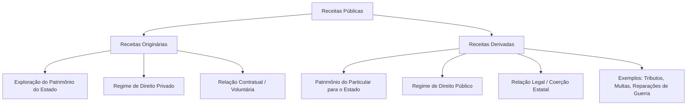
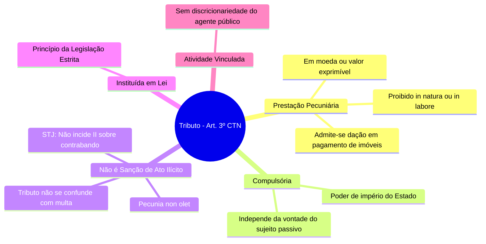

## Conceitos Fundamentais

### Tipos de Receitas Públicas

As receitas que ingressam nos cofres públicos são classificadas de acordo com a sua origem e o regime jurídico aplicável. Elas dividem-se essencialmente em duas categorias:

#### 1. Receita Originária
*   **Origem:** Decorre da exploração direta do próprio patrimônio do Estado (bens, empresas públicas, prestação de serviços comerciais).
*   **Regime Jurídico:** Predominantemente de **Direito Privado**.
*   **Instrumento:** Viabilizada por meio de **contrato** (vontade consensual entre as partes).

#### 2. Receita Derivada
*   **Origem:** Provém do patrimônio do **particular**, que é transferido para o Estado.
*   **Regime Jurídico:** Sob a égide do **Direito Público**.
*   **Instrumento:** Viabilizada por meio de **lei**, exercendo-se o poder de império e a coerção estatal.
*   **Exemplos:** Tributos, multas e reparações de guerra.

---

### Finalidades do Tributo

A instituição e a cobrança de tributos podem perseguir objetivos puramente financeiros ou de intervenção social e econômica:

*   **Fiscal (Arrecadação):** O objetivo principal é obter recursos financeiros para o custeio das atividades e serviços do Estado.
*   **Extrafiscal (Intervenção):** O foco principal é intervir no domínio social ou econômico. Manifesta-se por meio de normas de tributação (como a elevação de alíquotas para desestimular certas condutas) ou de não tributação (concessão de benefícios e incentivos fiscais).

---

### Bitributação vs Bis in Idem

É fundamental distinguir esses dois fenômenos de múltipla tributação sobre uma mesma base econômica:

| Critério | Bitributação | Bis in Idem |
| :--- | :--- | :--- |
| **Sujeitos Ativos** | **Dois ou mais** entes federados distintos. | **Apenas um** ente federado. |
| **Fato Gerador** | Cobrança sobre o mesmo fato gerador e mesmo contribuinte. | Cobrança múltipla sobre o mesmo fato jurídico. |
| **Exemplo Prático** | Dois Municípios cobrando ISS sobre o mesmo serviço prestado. | A União cobrando IRPJ e CSLL sobre o lucro da mesma empresa. |
| **Regra Geral** | **Vedada** pela Constituição Federal. | **Permitida** pela Constituição Federal. |
| **Exceção** | Permitida no caso de Imposto Extraordinário de Guerra (IEG). | Não possui vedação geral expressa se respeitada a competência. |

---

### Definição de Tributo

De acordo com o **Artigo 3º do Código Tributário Nacional (CTN)**:

> *"Tributo é toda prestação pecuniária compulsória, em moeda ou cujo valor nela se possa exprimir, que não constitua sanção de ato ilícito, instituída em lei e cobrada mediante atividade administrativa plenamente vinculada."*

#### Análise Detalhada dos Elementos do Conceito

##### 1. Prestação Pecuniária em Moeda ou Cujo Valor Nela se Possa Exprimir
*   Este é um **requisito de existência** do tributo.
*   **Proibições:** O tributo **jamais** poderá ser pago *in natura* (bens como soja, gado, etc.) ou *in labore* (prestação de serviços ou trabalho), pois isso violaria os princípios constitucionais, inclusive o da licitação.
*   **Exceção Legal:** É admitida a **dação em pagamento de bens imóveis** para a extinção do crédito tributário, desde que haja previsão expressa em lei específica (conforme o Artigo 156, XI, do CTN).

##### 2. Não Constitua Sanção de Ato Ilícito
*   **Princípio do *Pecunia Non Olet* (o dinheiro não tem cheiro):** O fato gerador do tributo deve ser uma situação lícita. Contudo, os efeitos econômicos e os frutos financeiros decorrentes de atividades criminosas ou ilícitas são passíveis de tributação. O Estado tributa a riqueza obtida, independentemente da sua origem.
*   **Diferenciação:** A multa tributária é uma sanção por ato ilícito (descumprimento da lei), enquanto o tributo não possui caráter punitivo. O confisco só é legítimo quando aplicado como pena, sendo vedado ao tributo ter efeito confiscatório.

> ⚠️ **Atenção - Jurisprudência do STJ (REsp 984.607):**
> Na importação de mercadorias ilícitas (como drogas ou contrabando), **não é possível** cobrar o Imposto de Importação (II). Isso ocorre porque a "importação de mercadoria [lícita]" é elemento essencial e intrínseco à hipótese de incidência desse tributo.

> ⚠️ **Atenção - Jurisprudência do STF (RE 647.885/2020):**
> É inconstitucional a suspensão do exercício profissional realizada por conselhos de fiscalização (como OAB, CRM, CREA) em razão do inadimplemento de anuidades. Essa prática configura **sanção política** indireta em matéria tributária, o que é vedado.

##### 3. Instituída em Lei
*   O tributo decorre do princípio da legalidade estrita. Ninguém é obrigado a pagar tributo que não tenha sido previamente instituído por meio de lei.

##### 4. Cobrada Mediante Atividade Administrativa Plenamente Vinculada
*   A cobrança e a exigência do tributo pelo agente público não envolvem juízo de conveniência ou oportunidade (discricionariedade). A autoridade administrativa é obrigada por lei a efetuar a cobrança assim que configurado o fato gerador.

---

### Natureza Jurídica do Tributo

Conforme determina o **Artigo 4º do CTN**, a natureza jurídica específica de cada tributo é definida exclusivamente pelo seu **Fato Gerador**.

Para fins de definição da natureza jurídica, são formalmente **irrelevantes**:
1.  A denominação atribuída ao tributo e demais características formais adotadas pela lei instituidora.
2.  A destinação legal dada ao produto da arrecadação do tributo.

---

### Flashcards de Fixação (Estilo CEBRASPE)

**Julgue os itens a seguir em Certo (C) ou Errado (E):**

1.  **Questão:** As receitas originárias são aquelas obtidas pelo Estado mediante o constrangimento do patrimônio dos particulares, sob o manto do direito público e com base em imposição legal.
    *   **Resposta:** **Errado**
    *   **Explicação:** A descrição refere-se às receitas **derivadas**. As receitas originárias decorrem da exploração do próprio patrimônio do Estado, sob regime de direito privado e base contratual.

2.  **Questão:** É vedada a instituição de tributo cuja prestação seja realizada *in natura* ou *in labore*, contudo, o CTN autoriza que a lei preveja a dação em pagamento de bens imóveis como forma de extinção do crédito tributário.
    *   **Resposta:** **Certo**
    *   **Explicação:** O tributo deve ser pago em moeda ou valor exprimível (vedado *in natura* ou *in labore*). A dação em pagamento de bens imóveis é uma exceção expressamente prevista no Art. 156, XI, do CTN.

3.  **Questão:** O princípio do *pecunia non olet* autoriza a cobrança do Imposto de Importação sobre produtos contrabandeados, visto que a ilicitude da atividade não obsta a tributação dos seus resultados econômicos.
    *   **Resposta:** **Errado**
    *   **Explicação:** Embora o princípio do *pecunia non olet* seja a regra geral, o STJ (REsp 984.607) definiu que não incide Imposto de Importação sobre mercadoria ilícita, pois a licitude da mercadoria importada é elemento essencial do tipo tributário do II.

4.  **Questão:** Ocorre o fenômeno do *bis in idem* quando dois entes federativos distintos cobram tributos sobre o mesmo fato gerador e do mesmo contribuinte, o que é vedado pela Constituição Federal, salvo no caso de Imposto Extraordinário de Guerra.
    *   **Resposta:** **Errado**
    *   **Explicação:** O fenômeno descrito é a **bitributação**. O *bis in idem* ocorre quando o **mesmo** ente federativo realiza a cobrança múltipla sobre a mesma base econômica (como a União cobrando IRPJ e CSLL).

5.  **Questão:** A destinação do produto da arrecadação de uma exação e a denominação dada a ela pela lei instituidora são elementos irrelevantes para a definição da natureza jurídica específica do tributo.
    *   **Resposta:** **Certo**
    *   **Explicação:** Conforme o Art. 4º do CTN, a natureza jurídica específica do tributo é determinada unicamente pelo seu fato gerador, sendo irrelevantes a denominação e a destinação legal dos recursos.

> ⚠️ **Atenção Importante:** Com a promulgação da Constituição Federal de 1988 (CF/88), os **Empréstimos Compulsórios** e as **Contribuições Especiais** passaram a ter como principal característica definidora a **destinação de sua arrecadação**. Esse entendimento invalidou o artigo do Código Tributário Nacional (CTN) que vinculava a natureza jurídica do tributo exclusivamente ao seu fato gerador. Como exemplos práticos dessa mudança, destacam-se a **CSLL** (que possui o mesmo fato gerador do IRPJ) e a **COFINS**, ambas com receitas obrigatoriamente destinadas ao financiamento da seguridade social.

---

